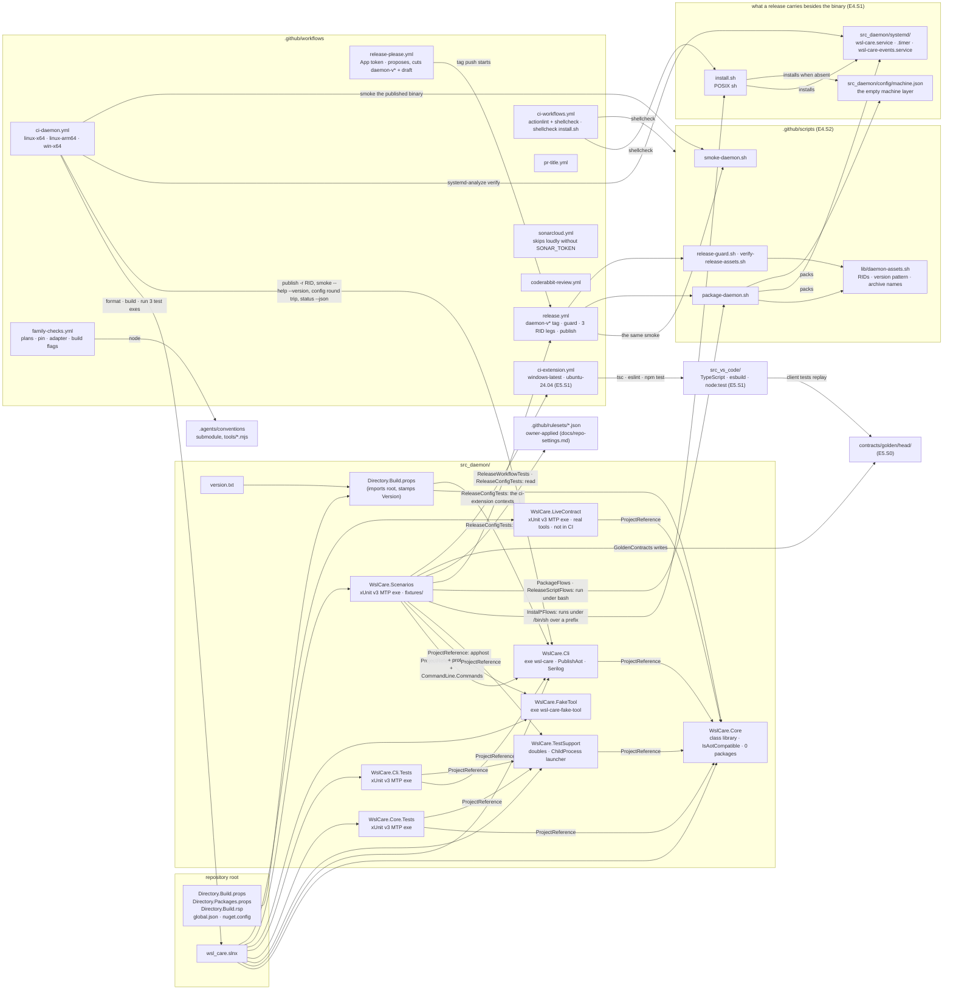

# Architecture — wsl_care: fixture privacy, the projects and CI

> Part of [architecture.md](architecture.md), which stays the entry point (system overview, module map, cross-cutting
> concerns). These sections were moved here unchanged on 2026-10-10 to keep `architecture.md` under the 256 KiB the
> conventions resolver (`.agents/conventions/tools/rules.mjs`) accepts for a required source; `.agents/PROJECT.md`
> requires each of the split files.

## Fixture privacy (E5 code round, 2026-10-04)

The repository is public, and the captured fixtures and the goldens built from them carried the owner's Linux and
Windows user names, home and profile paths, project and repository names, installed extension ids and versions, and a
Claude scratchpad path. Since the code round:

- **ONE identity list** — `WslCare.TestSupport/FixtureIdentity`: eight named rules (`tempFolder`, `linuxHome`,
  `windowsProfile`, `passwdAccount`, `accountToken`, `projectDirectory`, `extensionId`, `email`), each a SHAPE; the
  mappings (projects → `project-a`…, extension ids → `vendor.extension-a`…) are LEARNT from the corpus at run time, in
  ordinal order, so the file holds no original value and every file is rewritten the same way (a cwd in `links.txt` and
  an argv in `cmdline` still name the same project). Numbers, ids, sizes, times and structure are kept.
- **Applied twice, by the same code** — to the captured fixtures by `FixtureAnonymisationTests` (it fails while any text
  fixture would still change; `WSL_CARE_ANONYMISE_FIXTURES=1` rewrites), and as part 4 of the golden writer's list.
- **Detected apart** — `FixturePrivacyTests` (Scenarios, every OS) walks every `fixtures` / `golden` / `goldens` directory
  of the repository (build output, `node_modules`, the editor downloads and the shared-rules submodule excluded) and fails
  on a `/home/<name>` or a Windows profile path whose name is not `user`, an e-mail address (a systemd template instance
  is not one) and the user name of the machine RUNNING it (read from the environment and the home folder, like
  check-vsix, never stored); a finding names file, line and rule, never the value. Each rule has a planted instance, and a
  known file proves the walk still reaches the trees.
- **Widened to the whole repository** — `FixturePrivacyTests.No_tracked_text_file…` applies the same rules to EVERY tracked
  text file (`git ls-files`; a walk skipping build output, dependencies and the editor downloads when there is no `.git`),
  admitting besides `user` only the commented list of invented test accounts (`FixturePrivacy.SyntheticNames`: `me`,
  `ann`, `sam`, `alice`, …) and, for e-mail, `noreply@anthropic.com` and the RFC 2606 / 6761 example domains. The
  machine-name rule leaves out a service account (`FixturePrivacy.ServiceAccounts`: `runner` and `runneradmin` — the
  GitHub-hosted runners' accounts —, `root`, `vscode`,
  `codespace`, `user`; check-vsix's `SERVICE_ACCOUNTS` is the same list, and
  `FixturePrivacyTests.The_service_accounts_and_the_name_floor_are_the_vsix_checks_own` reads it out of `vsixCheck.ts` and
  holds the two EQUAL), a synthetic name and a name shorter than 3 characters (check-vsix's floor), and matches the rest
  as a whole word: `runner` is an ordinary word here, and CI run 37202261532 reported 541 findings per Linux leg. The research notes,
  the cleanup scripts and two test sources were anonymised by it (2026-10-04).
- **Not undone by this**: the data before the code round remains in git history (main and the pull-request branches);
  removing it needs a history rewrite and a force-push — the owner's decision.

## Projects and CI

