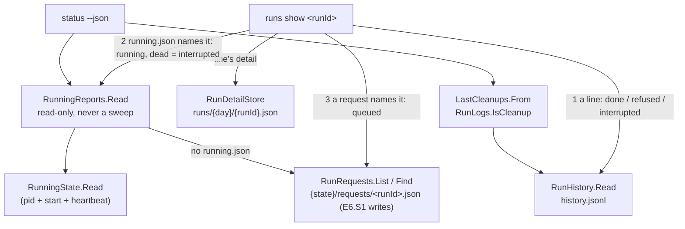
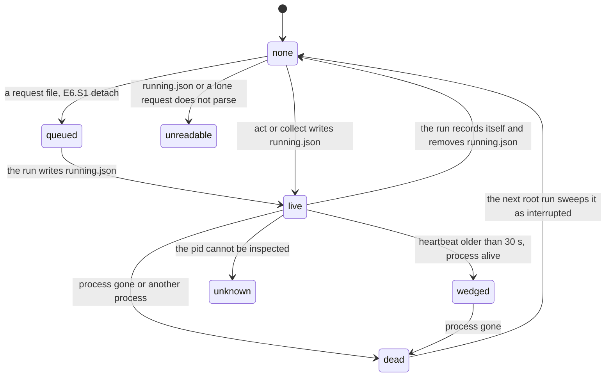
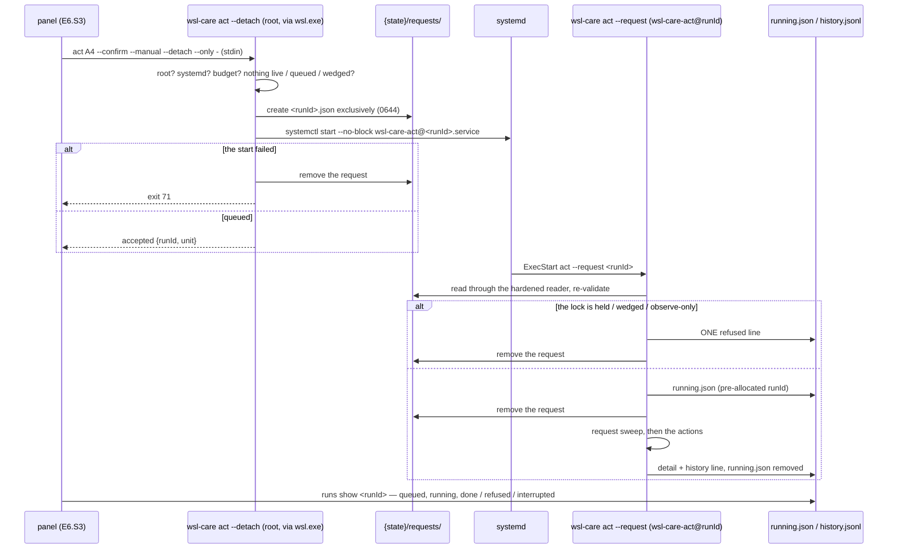
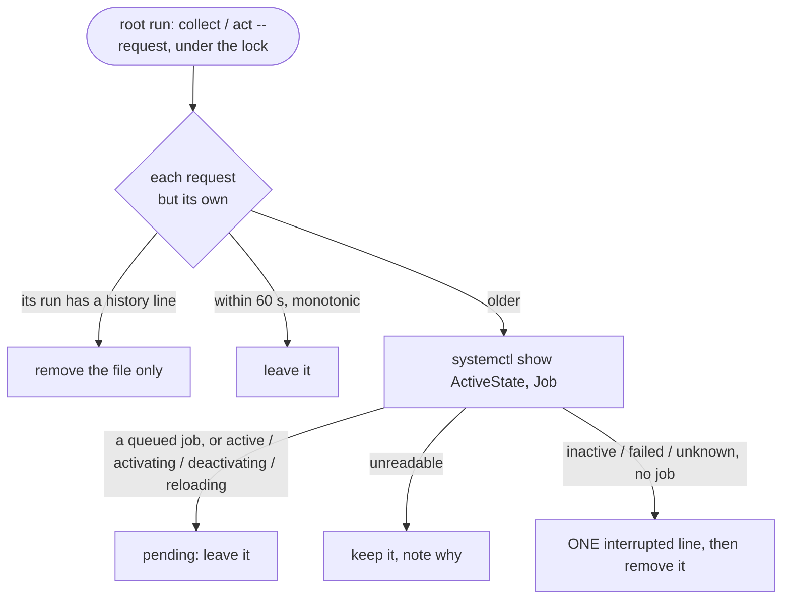

# Architecture — wsl_care: the daemon's E6 (the read contract, the detached runs)

> Part of [architecture.md](architecture.md), which stays the entry point (system overview, module map, cross-cutting
> concerns). These sections were moved here unchanged on 2026-10-06 to keep `architecture.md` under the 256 KiB the
> conventions resolver (`.agents/conventions/tools/rules.mjs`) accepts for a required source; `.agents/PROJECT.md`
> requires each of the split files.

## The daemon read contract (E6.S0)

What the cleanup buttons and the Logs page of E6.S2–E6.S4 will read, built on the daemon side first (plan §15j, the E6
plan round). Every addition is ADDITIVE — `schemaVersion` stays 1 on every answer (asserted by the tests), a client ignores
keys it does not know, treats an absent newer field as "update the daemon", and reads an unknown enum value as unknown.
Nothing here writes: every new read is unprivileged and takes no lock.

- **`status --json`** gains four members, set by `StatusCommand` after the probe:
  - `actions` — the ids THIS binary's registry holds for its own side, in `ActionId.ExecutionOrder` (the distro's binary:
    every built action, A13 not yet; the Windows binary: none — its actions are E12's).
  - `capabilities` — `Status/Capabilities.All`: `act.shownList`, `runs.show`, `running.block`, `logs.instantRange`. The
    AUTHORITY a client acts on (§15j M5), never the version; E6.S1 added `act.detach`, `act.onlyStdin`, `act.stop`.
  - `running` — `Status/RunningReports.Read`: `RunningState.Read` (the same judge the engine uses; it writes nothing) over
    `running.json`, else `Actions/Engine/RunRequests.List` over `{state}/requests/<runId>.json` (the request files E6.S1's
    `--detach` will write — the reader exists now, the folder is empty until then). It NEVER calls `RunningSweep`: a dead
    run is reported and its file left exactly as it was; the next root run sweeps it (plan §15b #3, §15j M3).
  - `lastCleanup` — `Status/LastCleanups.From` over the history `status` already read: the newest run in which an action
    acted AND removed or freed something — `RunLogs.IsCleanup`, the ONE definition `logs` counts by too — with its trigger,
    objects and freed bytes (a failed action's real deletions count, as in `logs`); `available: false` with the reason
    before the first or when the history cannot be read.
- **`act … --json`** answers name `productVersion` (`Program.VersionText`). **A4's preview outcome** carries `shown`: every
  name its preview selected — the keys its run matches (`VolumeRemoval.Shown`, through the new `IBoundToShownList`, A4
  alone), at most `ShownList.MaxNames` (10 000, the same cap `--volume` / `--only` keep) — because `items` stops at 20 and a
  button that sent the items back would pass 20 of 387 names (§15j B1). Run details never carry it.
- **`runs show <runId> [--json]`** — `History/RunShow.Read`, its own `schemaVersion` 1. The history decides first (a line
  is terminal: `done` for completed / failed / observe-only, `refused` for the outcome `refused` — added to `RunOutcome`
  now, written by E6.S1's `act --request` — and `interrupted`), with the line as `runs` answers it and the detail
  (`act` → every action's preview and run: removed, not removed, commands with their exits, notes; a full run → its timer
  pass). Then `running.json` naming the run (`running`; a DEAD holder is `interrupted`, never running — it will never
  finish — and is not swept). Then a request naming it (`queued`). Nothing: `unknown`. Exit 0 whatever the state; 4 only
  when the history exists and cannot be read. `runs log` is CUT (§15j M3): `runs show` answers the commands and exits.
- **The instant range** — `logs` / `runs --from <RFC3339> --to <RFC3339>` (`LogPeriod.ParseInstants`), beside the UTC-day
  periods and never with `--period`, both ends required: each instant with its offset spelt out (a bare date or a time
  without an offset is refused — never bound to the reading machine's zone, the UTC rule), half-open, at most 366 days. The
  answer's `period` keeps `label` (`instants`), `from` / `to` (the UTC days the instants touch) and adds `fromInstant` /
  `toInstant` in UTC. This is how a client asks for a LOCAL day, which crosses UTC midnight (§15j M7).
- **`RunLine.metrics`** — the `metrics` the history line recorded (a full run's `MemAvailable`, page cache, swap, `/`,
  Docker reclaimable, container starts), absent on a line that recorded none (an `act`, a swept run, lines before E2.S3).
- **SIGHUP** joins SIGINT / SIGTERM / SIGQUIT in `ShutdownSignals` as a cancellation; `ShutdownSignals.Cause` (the first
  signal, set once) reaches the engine through `CliHost.InterruptCause` → `EngineContext.InterruptCause`, so a confirm cut
  off when its terminal or `wsl.exe` went away records `interrupted by SIGHUP (…)` with its detail, kills its child and
  exits 130 — before E6.S0 it died by the signal's default action (exit 129) with no detail and no history line (§15j B2;
  defence in depth — the panel's confirm runs detached from E6.S1).
- **`--manual` and `--timer` are exclusive** in `act` (§15j m2; E3 let the timer win).
- **`contracts/actions.json` and `contracts/exit-codes.json`** — the action ids (with `A5Testcontainers` / `A6Unused`), the
  execution order, and every exit code by name, generated by `WslCare.Scenarios/ContractFilesTests` from `ActionId.All`,
  `ActionId.ExecutionOrder` and `Enum.GetValues<ExitCode>()` — enumerated, never retyped — and held equal by it
  (`WSL_CARE_WRITE_GOLDENS=1` rewrites). The extension reads them in E6.S2.

**The goldens it adds** (`contracts/golden/head/`, written by `GoldenContracts` on the Linux legs, staged by
`ReadContractScenes`): `status-running-{live,wedged,dead,unreadable,queued,earlier-boot}.json` — `status --json` over an otherwise
EMPTY sandbox with the running state staged against the REAL process table (live / wedged on the test process's own pid
and start; dead on a pid no process has; unreadable = `{}`; queued = a request file); the main `status.json` is the `none`
state over the captured tree — `act-a4-preview.json` (`act A4 --preview --json` over 387 SYNTHETIC anonymous volumes,
`SyntheticDocker`: 387 × 154 MB, `shown` holding all 387 names), `runs-show-{done,interrupted,unknown}.json` (a confirmed
A10 through the fake `journalctl`, the dead run it swept, a stranger) and `runs-local-day.json` / `logs-local-day.json`
(the local day 2026-10-02 at +03:00 over a seeded history: the first instant in, the end instant out, one run on each side
of UTC midnight). Normalisation rules added, each matched: `running.pid` (4242), `running.heartbeatAt`,
`running.heartbeatAgeSeconds` (0 live, 600 wedged), `run.startedAt`, `run.endedAt`, and in sentences `pidInText`,
`heartbeatAgeInText`, `detailDayInText`. Every instant a scene does not judge against the clock is FIXED
(`ReadContractScenes.Staged`), so the list stays short.

### What the E6.S0 review round changed (2026-10-04, plan §15j)

- **Run identity survives a clock step.** `running.json` gains three additive fields its writers (the engine, `collect`)
  fill through `RunningState.Identified` / `WithHeartbeat`: `startTicks` (`/proc/[pid]/stat` field 22, ticks after boot),
  `bootId` (`/proc/sys/kernel/random/boot_id`) and `heartbeatMonotonicMs` (`Environment.TickCount64`, system-wide).
  `IProcessTable` gains `Boot()` and `ProcessLookup.Alive.StartTicks` (`SystemProcessTable` reads the REAL `/proc`).
  `RunningState.Judge`: same boot id + exact ticks = the run; another boot = dead; the heartbeat age is monotonic within one
  boot. Only where a side cannot tell (an older file, the Windows binary) does it fall back to `Process.StartTime` ± 2 s and
  the wall clock — on Linux .NET derives `StartTime` from a boot time computed off the wall clock, so a step moved it.
- **The request reader trusts nothing it did not check.** `IFileSystem.ReadStateFile` → `RegularFiles.ReadOwned`: no link
  (`O_NOFOLLOW`), never blocking (`O_NONBLOCK`), regular, owned by `PhysicalFileSystem.TrustedStateOwner` (uid 0; a
  sandbox's own euid) with no group / other write — type, uid and mode from ONE `statx` of the open descriptor — at most
  `RunRequests.MaxRequestBytes` (1 MiB); then the content: schema 1, kind `act` / `collect`, known ids, 64-hex shown names,
  ≤ 10 000; at most `RunRequests.MaxRequestsRead` (64) files per read. A file gone as it is read is skipped.
- **The running block.** `pid` and `heartbeatAgeSeconds` only for `live` / `wedged`; `unknown` keeps the run id; a dead
  holder whose run has a history line is `none` with the reason "recorded itself as <outcome>; only its running.json is
  left"; `status` reads `running.json` again when the requests show nothing (`RunningReports.Read` takes the history it
  already read). `runs show` reads request → `running.json` → history and answers the most advanced
  (`RunningReports.OfHolder` for the holder); an `unknown` holder is `running`.
- **An interrupted run says what it was doing.** `DockerRemovals.RemoveAsync` returns a partial `RemovalResult`
  (`Interrupted`) on cancellation; A4 / A5 return an `Interrupted` `ActionRun` with what Docker confirmed; the engine
  records the action in flight as `interrupted` (with its removals, or without when it threw) and every requested action
  that never ran as `interrupted / not run`; `logs` counts an interrupted action's real deletions.
- **One run, one id** (`RunId.TryParse` refuses a leading zero), and A4's preview outcome carries `shownTruncated: true`
  past 10 000 names (coai E6 plan round #11).

## Detached runs, the request, the stop (E6.S1)

A confirm the panel starts must survive the window that asked for it (a VS Code reload kills `wsl.exe`, and the AOT
binary dies with it — facts note), so the panel never runs the work in its own process tree: it asks root to HAND the run
to systemd (plan §15j B2, M2, M4, M9; the coai E6 plan round §15k). Nothing here falls back to a synchronous run.

- **`act <A#>… --confirm --detach [--only -]` / `collect --detach`** (`Cli/Commands/DetachedRuns.Detach` /
  `CollectDetach`, root first): refuses without systemd — `/run/systemd/system` (sd_booted) absent, exit 69; with the
  request folder at its budget (`RunRequests.MaxQueued` = 32 files, exit 73 — checked BEFORE the running state, so a full
  folder answers its own code); while a run is live or queued (75), wedged or uninspectable (76), unreadable (79). Then it
  writes `{state}/requests/<runId>.json` through `IFileSystem.CreateFileExclusively` — a temporary sibling, 0644, then
  `link(2)` to the final name (a non-replacing move on Windows), which fails when the name exists, so a reader sees a
  whole request or none and nothing replaces one; the folder 0755 SET after `mkdir` (the umask would mask it) — and runs
  `systemctl start --no-block wsl-care-act@<runId>.service` (`Systemd/UnitCommands.Start`). A start that does not exit 0
  removes the request again and exits 71 (§15k #1). The answer is `HandOffReport` (`schemaVersion` 1): `accepted`,
  `kind`, `runId`, `unit`, `productVersion` — golden `act-detach-accepted.json`. The run id is the detaching process's
  (`RunId.New(now, pid)`); the run that executes it is another process and keeps that id.
- **`--only -`** (`Cli/StdinList`): A4's shown list from stdin, read on a worker under the same 1 MiB cap as an
  `--only` file (one byte more is a refusal) and a 10 s ceiling for the end of input (`CliHost.StdinCeiling`); a line is
  refused by its NUMBER, never echoed; all of it before any state is touched. The relay through `wsl.exe` was measured
  (facts note row 20: 650 000 bytes with the EOF).
- **The template unit** `src_daemon/systemd/wsl-care-act@.service` (installed beside the others, never enabled):
  `ExecStart=/opt/wsl-care/bin/wsl-care act --request %i` — the instance name IS the run id, the only variable, validated
  by the CLI's parse. `TimeoutStartSec=infinity` (a confirm is never time-killed as a whole — every command it starts has
  its own ceiling with a tree kill, §15k #0), `TimeoutStopSec=90` (both units, §15k #18), `SuccessExitStatus=3 75 76 78
  79 80 82 130` (the RECORDED answers — an action failed, a refusal recorded `refused`, a missing request, an unusable request
  recorded `refused`, a stop recorded `interrupted` — are not unit failures, §15k #8; derived by `UnitSuccessExitTests`), and in `[Unit]` — the only section systemd.unit(5) reads it from — `CollectMode=inactive-or-failed` (a
  finished instance is unloaded, failed or not, so none lingers in `systemctl --failed` — systemd's own mechanism
  standing for §15k #8's `reset-failed`; daemon 0.1.0 had it under `[Service]`, where systemd 255 ignores it with a
  warning, and the live install showed `CollectMode=inactive` — fixed at daemon-v0.1.1, first published in 0.1.2), and the hardening of
  `wsl-care.service` (`Nice`, `IOSchedulingClass`, `MemoryMax`, `NoNewPrivileges`, `KillMode`, `TimeoutStopSec`) —
  held EQUAL by `ShippedFilesTests` (§15k #9).
- **`act --request <runId>`** (`DetachedRuns.FromRequest`, what the unit runs): no request → exit 80, a named no-op, no
  history line (§15k #2); a request the hardened reader refuses (`RunRequests.Find` → `ReadStateFile`: root's, no group
  / other write, ≤ 1 MiB, schema 1, known ids, 64-hex shown names) → recorded `refused`, removed, exit 82, nothing run; a request whose run already has a
  history line (it recorded itself and died before removing the file) → removed, exit 80 — never run twice. Otherwise the engine (or
  `CollectRun`) runs under the request's run id (`ActRequest.RunId` / `CollectContext.RunId`) with the persisted shown
  list, and the request is removed by `OnRunningWritten` — once `running.json` stands, never before (the E6.S0 review
  round: states move request → `running.json` → history line, with no gap); `running.json` (or a request still there) goes
  only once the run's line is written. Meeting a wedged or unreadable state, or observe-only — or the lock still held after
  `requests.lockWaitSeconds` (30 s) — it appends ONE history line with the outcome `refused` and the reason, THEN removes the
  request and exits with the refusal's code (never a silent busy).
- **The request sweep** (`Actions/Engine/RequestSweep`), at the start of every ROOT run under the lock — `collect` (timer
  or detached) and `act --request` (through `ActRequest.UnderLock`) — never by `status` (§15k #15): history FIRST (a
  request whose run has a line only loses its file); a request younger than 60 s (`RequestSweep.Grace`, on the MONOTONIC clock
  within its boot — the request carries `bootId` and `createdMonotonicMs`; another boot is stale at once; only an unstamped
  request falls back to the wall clock, and one stamped in the future is stale) is left alone; an older one is
  pending while `systemctl show --property=ActiveState --property=Job wsl-care-act@<runId>.service` shows a queued job or
  an active / activating / deactivating / reloading state (`UnitCommands.Busy`; a queued start has no active state yet);
  otherwise ONE `interrupted` line ("swept: the detached run never recorded itself — its unit … is <state> with no queued
  job, and its request is N min old") and the request goes. A unit whose state cannot be read keeps its request; the run's
  own request is never swept. Notes land in `housekeeping.requests` (collect) or the run's notes (act).
- **`act --stop <runId> [--json]`** (`RunStops.Stop`): only a WEDGED holder of `running.json` (a live one → 75, any
  other → 2), and only when `/proc/<pid>/cgroup` puts its process in `wsl-care.service` or its own
  `wsl-care-act@<runId>.service` — otherwise nothing is stopped and its pid is named. It writes a stop marker
  `{state}/stops/<runId>` (`StopMarkers`), then `systemctl stop <unit>` (`UnitCommands.Stop`, a 120 s ceiling above
  systemd's 90 s); SIGTERM lets the run record itself `interrupted` (the E6.S0 cancellation path); a run SIGKILLed after
  90 s leaves `running.json`, and the next root run's `RunningSweep` records it `interrupted` with the reason "stopped:
  a stop was requested at <time> through <unit> (act --stop), and the run died without recording itself" (the marker proves
  the request, not a kill). A refused stop removes the marker;
  the sweep removes markers whose run has a line, or older than a day. Never a kill by pid.
- **The commands** — `UnitCommands.All` (start `--no-block`, stop, show), in `CommandCatalogue.Product`, each with the
  CLOSED unit slot `SlotKind.ActUnit` (`wsl-care-act@` + a run id `RunId.TryParse` accepts + `.service`; a stop also
  `wsl-care.service`), judged by the property tests and `UnitCommandsTests` over hostile names. Never `systemd-run`.
- **A full run cut off during the measurement** now leaves ONE `interrupted` line ("interrupted by <signal> during the
  measurement: nothing was recorded but this line", `CollectRun.RecordCutOff`) — the E6.S0 durable review's item; before,
  `runs show` answered `unknown`.
- **Capabilities** `act.detach`, `act.onlyStdin`, `act.stop` join `status`'s list (the authority a client acts on).
  **Exit codes** 69 `detachUnavailable`, 71 `detachStartFailed`, 73 `queueFull`, 80 `requestGone` join
  `contracts/exit-codes.json`.
- **`install.sh`** installs and removes the template with the other units (uninstall first stops every loaded
  `wsl-care-act@*.service`); installs the binary as `…/wsl-care.new` and RENAMES it over the old one (never an in-place
  overwrite of a running file); and an upgrade waits — bounded, 10 minutes (`WSL_CARE_INSTALL_RUN_WAIT_SECONDS`) — while
  the installed binary's `status --json` reports a run `live` or `queued`, then refuses at step `upgrade-wait` with
  nothing replaced (§15k #16). The request schema stays 1 and additive, so a queued request survives an upgrade.

### What the E6.S1 review round changed (2026-10-04, plan §15l)

- **`--detach` sweeps first** (D1): it takes THE run lock (busy → 75, or 76 when a wedged run holds it), runs the request sweep
  under it, then asks the budget and the running state and writes the request; the lock is released before `systemctl start`.
  An orphaned request no longer blocks the panel for hours: it is stale after the 60 s monotonic grace or at once from an earlier
  boot, and the next detach records it `interrupted`.
- **Records are kept on every way out** (D2, D4, D5): the sweep's `systemctl show` runs uncancelled; `act --request` /
  a detached collect cut off by a signal append ONE `interrupted` "cut off before it started" line unless the run has one;
  `collect`'s sweep is inside the cut-off guard; after the unit is seen done the history is read AGAIN before appending; an
  unusable request is recorded `refused` and removed (by the sweep and by `act --request`).
- **A timed-out start** (D6) asks the unit: busy → `accepted`; done → 71; unreadable → `result: unknown` (exit 0), request kept.
- **Modes** (S1): temporaries created 0600 then made 0644 before the link / rename; every folder created 0755 level by level
  (`PhysicalFileSystem.CreateDirectory`, `EnsureParent`); history, lock files and run logs created 0644 at most.
- **The reader** (S2) refuses a trigger root never writes (`collect` → `manual`; `act` → `manual` / `cli`).
- **`act --stop`** (S3) is `Cli/Commands/RunStops`: the whole cgroup path must be `/system.slice/wsl-care.service` or
  `/system.slice/system-wsl\x2dcare\x2dact.slice/wsl-care-act@<runId>.service`.
- **`install.sh`** (S4): no status answer counts as in flight (fails closed), `wedged` is waited on, a failed rename and
  uninstall remove `wsl-care.new`.

### What the coai E6 code round changed (2026-10-05, plan §15m)

- **Typed run ids**: `Request.ActFromRequest` / `ActStop` / `RunsShow` carry `Core.Records.RunId` (one parse, `CommandLine.RunIdVerb`,
  one refusal sentence for a bad id).
- **`status` reads one request** (`RunRequests.Peek`): ordered and counted by file name, the oldest read (the next only when it
  cannot be used); a request written in an earlier boot is reported `dead` (`RunningReports.EarlierBootReason`) and
  `runs show` answers it `interrupted` — still read-only; the root sweep records it.
- **`logs` / `runs`**: `Period` is empty in the instant-range mode.
- **`install.sh`**: the running block's state is read without layout; in flight unless `none` / `dead` (fails closed for any other
  state); the wait is measured on the wall clock, prints progress every 30 s, and when the installed binary cannot answer names
  the manual escape (`WSL_CARE_INSTALL_SKIP_RUN_WAIT=1`, or removing `running.json` / `requests/*.json` by hand).

### What the retro round over PR #11 changed (2026-10-06, plan §15m)

- **An accepted run waits for the lock** (O1): a `--detach` check holds THE run lock while it sweeps and counts; `act --request`
  (act or collect) now takes it with `RunLock.TakeAsync`, retrying with the lock jitter for up to `requests.lockWaitSeconds`
  (machine-only, 0–120, default 30; 0 is the old refuse-at-once) — its request stands meanwhile, so the block reads `queued`.
  Every other run still refuses at once.
- **A trace is handed on, never dropped** (O2): a request or `running.json` is removed only after the run's terminal line is
  written. `Refused` appends first and keeps the request (exit 1) when the line fails; the engine and `CollectRun` keep
  `running.json` without a line (`ActionEngine.KeptForTheSweep`), so `runs show` answers from it and the next root run's
  sweep records the run `interrupted`.
- **Success exits are derived** (O3): exit 82 `requestUnusable` replaces 2 for a recorded unusable request; 130 (a stop asked
  for, recorded) is a success exit of both units — `wsl-care.service` is `SuccessExitStatus=75 130`.
  `Cli.Tests/UnitSuccessExitTests` drives every ending of both runs through `Program.Guarded` and holds each list equal to the
  exits of the answered endings.
- **The running block**: a live / wedged / unknown / unreadable holder comes first; an idle (`none`) or `dead` one never hides
  a pending request (`queued` wins), so `--detach` and `install.sh`'s wait see it.
- **A timed-out start** whose run already recorded itself answers `accepted` with its run id and removes nothing.
- **The stop marker's reason** says a stop was requested, and when — not that systemd killed the run.

### A full check's history line names itself — `kind` (2026-10-05, plan §15o)

Before, a reader could not tell a full check's line by one rule: a completed or measurement-cut full check wrote `actions:
[]`, every other terminal line of a detached one a pseudo-row `{id: "collect"}`, and an unusable request or a reconciled
orphan `[]` too. `actions` means per-action RESULTS (plan §6; `logs`' `perAction`, `IsCleanup`, the cleanup details and A15
read it so), so the fix is a second member, additive, `schemaVersion` 1:

- **`kind`** on `RunRecord` and on `RunningFile` — a POSITIONAL parameter of both, so every writer decides. Writers write
  `collect` | `act` (`RunKind`) or none. On disk it is a `RecordedKind` (PR #16 retro round, 2026-10-06): THREE states,
  never collapsed — **absent** (no member: an older writer, or a line whose kind is not known), **known** (`collect` /
  `act` exactly, the names `RunKinds.Name` holds — the one table the converter and `RunLine.kind` both read), **unknown**
  (anything else: a newer build's name, an explicit `null`, an integer, any other JSON value — kept as written). Its
  converter (`RecordedKindJsonConverter`, registered on the type, so the source generator instantiates it — no reflection)
  never fails a read, and refuses to WRITE an unknown kind: a writer that carries a read kind forward goes through
  `RecordedKind.ForWriting` (unknown → absent), so no line claims a kind this build only guessed at.
- **`actions` holds results only.** The `collect` pseudo-row is no longer written; a refused, cut-off or swept full check
  writes `actions: []` with `kind: "collect"`. `collect` is RESERVED (`RunKinds.FullCheckName`, `ActionId`'s doc): no action
  id may carry it, which `RunKindTests` and `ContractFilesTests` hold.
- **One road per shape:** a requested run that never did its work — `DetachedRuns.Refused` / `CutOff`, `RequestSweep`'s swept
  request — takes ONE line from `RunRequestFile.TerminalLine` (the request's kind; an act's asked ids each marked, a full
  check none). The timer's pass rewrites `running.json` with the registry's ids and `kind: collect` (`ActRequest.Kind`, set
  only by `ActionEngine.TimerPassAsync`), so the sweep of a dead holder can tell it from an `act --timer` of the same ids. A
  file from an older writer is a full check only in the exact shape `CollectRun` writes (`["collect"]` and current
  `collect`: `RunningFile.KindOrMarker`) — and that inference applies ONLY when the member is ABSENT: an unknown kind of that
  same shape is not a missing one, and its swept line carries no kind (consultation 0d924598: mapping unknown to "no kind"
  first would have filed it `collect`). The reconcile takes an orphan's kind from its detail (`RunKinds.OfDetail` →
  `DetailKind`: no member is a full run's, `act` an act's, ANY other value — an explicit `null` included, PR #16 retro G0 —
  unknown, and its line then carries none: `RunKinds.LineKindOf`), the rule `logs` / `runs show` read a detail by.
- **Who carries no kind:** the line of an unusable request (`RequestSweep.Unusable`), of an orphan whose detail cannot be
  read or is of a kind this build does not know, and of a dead `running.json` holder that names no kind and is not the
  exact full-check shape, or names one this build does not know. Their reasons — the reconciled orphans' and the unusable
  request's — begin with the prefixes `contracts/history-reasons.json` carries (`HistoryReasons.NotAFullCheckWithoutKind`,
  from the daemon's constants; the unusable prefix itself is `HistoryReasons.UnusableRequestPrefix` since the PR #16 retro
  round G1, so `Records` depends on no engine type): the fallback a reader uses for a line WITHOUT a kind. Since the PR44
  gate round EVERY kind-less writer is covered: the swept line of a holder whose kind is not known and a request's terminal
  line of an unknown kind begin with `its kind is not known` (`HistoryReasons.KindNotKnownPrefix`, the contract's fourth
  prefix), and `doctor`'s `lastRun` applies the same rule — a kind-less line is a full check only when no prefix marks it. A line with a kind is told by it alone — a reconciled full-check orphan carries `kind: collect` AND the reconcile's
  prefix, and kind wins. Those three reason texts are FROZEN (`ContractFilesTests` pins them to literals): they are on disk.
- **Unknown is never guessed** (§15o review G1 / G2, PR #16 retro round): `RunKinds.OfRequest` and `OfDetail` answer
  `collect` / `act` only for the exact spellings (a full run's detail: no `kind` member at all) and NO kind for anything
  else — a request of an unknown kind gets a line with no kind and no action rows. `runs show` answers a detail of an
  unknown kind with its state and its line, `detailState: "unreadable"` and a `detailProblem` naming the kind — never as a
  full run's detail — and `logs` reads no objects from it (its cleanups say `unreadable`). `doctor`'s `lastRun` judges the
  newest FULL check (`kind: collect`; a kind-less line only when no contract prefix marks it; an act or an unknown kind never), so
  frequent `act` lines cannot hide a timer that stopped.
- **The wire:** `RunLine.kind` on `runs` / `runs show` — `collect`, `act`, or an unknown value AS WRITTEN (never mapped to
  either, so a reader's "`kind == collect` is a full check" stays true); absent when the line has none. The `runs-*.json`
  goldens pin it.
- **The downgrade residual — closed for `kind`** (PR #16 retro round, 2026-10-06): after `install.sh --version <older>` to a
  build that does not know a kind a newer one wrote, `running.json` stays readable (the run is judged live / wedged / dead as
  any other) and the history line parses, so every history-first check (`RunningSweep.SweepDead`, the request sweep, `act
  --request`, the reconcile — all through the one parser, `RunHistory.ParseLine`) sees the run's line. **What remains:**
  `RunTrigger` and `RunOutcome` (and an action's `status`, a free string the readers compare to known names) are still
  strict — a value a newer build adds (a future outcome) makes its line unparseable and `running.json` unreadable, with the
  consequences above. Since the same round they are strict about integers too (`StrictStringEnumConverter`,
  `allowIntegerValues: false`: `"trigger": 0` was read as `timer`). Whether they too read an unknown value as unknown is an
  owner question (plan §15o, *Retro coai round over PR #16*).

| Writer | `kind` | `actions` |
|---|---|---|
| `CollectRun.Line` (completed / observeOnly / failed), `CollectRun.RecordCutOff` | `collect` | the timer pass's results, else `[]` |
| `RunRequestFile.TerminalLine` (`DetachedRuns.Refused`, `DetachedRuns.CutOff`, `RequestSweep` swept) | the request's (none when unknown) | an act's ids marked refused / interrupted; a full check or an unknown kind `[]` |
| `RunningSweep.SweepDead` | `running.json`'s when known; the older shape's `collect` only when the member is absent; none for an unknown kind | its ids marked interrupted, `collect` never a row |
| `ActionEngine.Line` | `act` | each action's result |
| `RunReconcile.InterruptedLine` | from the detail; none when unreadable or of an unknown kind | `[]` |
| `RequestSweep.Unusable` | none | `[]` |

The extension's half is built on `feat/wc-e6-cleanup-logs` (E6.S3 row, E6.S4 review C7): the follower matches a full check
KIND FIRST and an act's line only without a kind or with `act`; a line without a kind falls back to the prefixes, a compiled
copy of `contracts/history-reasons.json` held equal to it by `runFollower.test.ts`.
