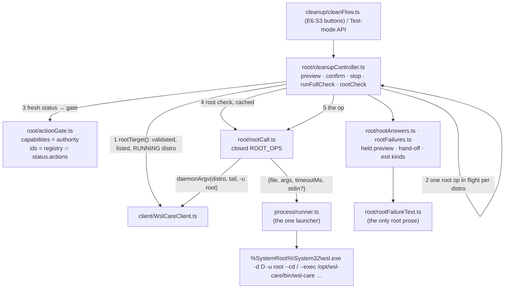
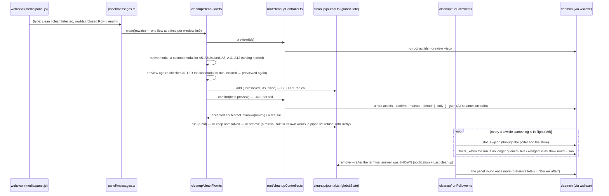
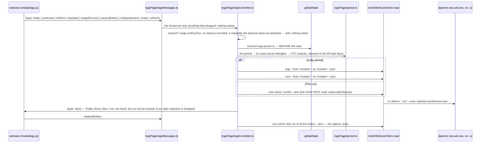

# Architecture — wsl_care: the extension's E6 (root boundary, cleanup buttons, Logs page)

> Part of [architecture.md](architecture.md), which stays the entry point (system overview, module map, cross-cutting
> concerns). These three sections were moved here unchanged on 2026-10-06 because `architecture.md` had outgrown the
> 256 KiB the conventions resolver (`.agents/conventions/tools/rules.mjs`) accepts for a required source;
> `.agents/PROJECT.md` requires each of the split files; the daemon's half of E6 is [architecture-daemon-e6.md](architecture-daemon-e6.md). The extension's E5 sections (client, status bar and panel, *Install daemon*
> and its release) are still in [architecture.md](architecture.md).

## The extension: the root boundary (E6.S2)

E6.S2 (2026-10-04, plan §15f #1–#3, §15j M1, M2, M5, m1, m4, m5, m9, m11, B3; §15k #3, #7, #10, #11, #19) gives the
extension the ONE place a root call can come from, and the host-side API the cleanup buttons call (since E6.S3 — section
*The extension: the cleanup buttons*; until then it was wired but nothing in the product invoked it). The boundary is a confused-deputy boundary, not a malware one — any process of this Windows user can
already run `wsl -u root`; what must never happen is a webview, a workspace setting or a daemon answer steering WHICH root
call is made.

**The closed union** (`root/rootCall.ts`, the only module spelling `-u`, `root`, `act`, `collect`, `--preview`,
`--confirm`, `--manual`, `--detach`, `--only`, `-`, `--stop`): every root call is `-d <distro> -u root --cd /
--exec /opt/wsl-care/bin/wsl-care` (the client's `daemonArgv`, so `-d` / `--cd` / `--exec` stay the client's words)
followed by exactly one of

| op | tail | host ceiling (§15k #19) |
|---|---|---|
| `preview` | `act <ids> --preview --json` | 330 s — the same per-action previews `preview --all` runs |
| `confirm` | `act <ids> --confirm --manual --detach [--only -] --json`, A4's names on stdin | 90 s — a detach: the 10 s stdin ceiling + one sweep `systemctl show` (15 s) + `systemctl start --no-block` (30 s) + a second look after a timed-out start (15 s) + the relay |
| `stop` | `act --stop <runId> --json` | 150 s — `systemctl stop` (120 s; the units carry `TimeoutStopSec=90`) |
| `fullCheck` | `collect --detach --json` (*Run full check now*, never `--timer`) | 90 s, as a detach |
| `rootCheck` | `--version` | 20 s |

The op is built from typed values only (`root/rootIds.ts`: the compiled registry `ACTION_IDS` — held EQUAL to
`contracts/actions.json` —, run ids in the daemon's one spelling, 64-hex volume names); a confirm is ALWAYS detached, and
A4 is ALWAYS bound to the list its preview showed (`--only -` even for an empty list; a list without A4 or A4 without a
list builds nothing). It spawns only through the runner it is handed; it imports no process API. Its ceilings are
DERIVED from the daemon's own; the real times are E6 live-gate measurements.

**The runner's stdin** (`process/runner.ts`): `ProcessRequest.stdin?: Buffer`, written then ENDED (the daemon refuses a
list with no end after 10 s); absent, the child's stdin is closed from the start. A child that exits without reading it
(EPIPE) is no crash — its exit is the answer. 650 000 bytes (10 000 names) relay byte for byte — measured through
`wsl.exe` by the coordinator (facts row 20) and held in the suite against a Node child.

**The controller** (`root/cleanupController.ts`) runs each op as ONE host transaction and stops at the first refusal
having started nothing further: (1) `WslCareClient.rootTarget()` — the same launcher / pattern / `--list` / running checks
as every read verb, never `startIfStopped`; (2) one root operation in flight per distribution (host-side, a second is
refused at once — the daemon's run lock stays the authority); (3) a FRESH `status` and the gate — `status.capabilities`
must hold what the op needs (`running.block`, `runs.show` for every op; `act.shownList` for a preview, `act.detach` for a
confirm or a full check, plus `act.onlyStdin` when A4 is confirmed, `act.stop` for a stop) — the version only supplies the
message ("the daemon is x.y; cleanups need `MIN_DAEMON_FOR_ACTIONS` or newer — Update daemon"), so an unstamped build that
advertises them acts — and the ids, the compiled registry ∩ `status.actions`, in the registry's order; (4) the root check,
cached per session per distribution once it answered, a refusal ("needs root") asked again next time; (5) the call.

- **A4's names come from the held preview and nowhere else** (§15j B1): `preview()` returns a frozen `HeldPreview` the
  controller registers (a `WeakSet`); `confirm()` takes only a registered one, re-checks the gate over a fresh status,
  refuses another distribution, and re-validates every name before it becomes a stdin line. The preview's shown list
  must satisfy `shown.length == min(count, cap)` with `shownTruncated` exactly when capped (§15k #11) — or the preview
  is refused, never a partial list. The cap is the one IN FORCE (`root/rootIds.ts` `shownCap`, plan §15p): the daemon's
  published `status.limits.maxShownNames`, never above the compiled `MAX_SHOWN_VOLUMES` (10 000, also the fallback).
  The preview is parsed under the limits of its gate's fresh status; the confirm re-checks the held list against the cap
  of ITS fresh status ("preview again" when the daemon's value fell); `rootRequest` builds no confirm whose list is longer
  than the cap in force, so the stdin never carries more names than the daemon takes; the modal's cut line names the cap.
- **An unknown detach is never a failure** (§15k #3; refined by the review round below): with a run id it goes back at once
  as `outcomeUnknown{runId}` for E6.S3 to follow; with none the controller follows `status.running` of this distribution and
  adopts only the panel's run of exactly the asked actions. A stop's unknown is reported as unknown (its run IS live).
- **Every exit code of `contracts/exit-codes.json`** is its own kind (`rootFailures.ts`): 69 needs systemd, 71 did not
  start, 73 too many requests, 75 busy and 76 wedged (each with the `running` block read right after), 77, 78, 79, 80,
  3, 4; exit 2 on a confirm that piped a list is `shownListRefused` — nothing started, a retry offered; the rest through the
  read client's `classifyExit`. Every daemon enum goes through `client/enumValue.ts` — an unknown value reads "unknown
  (<value>)", sanitised by the one sanitiser `text/safeText.ts` (extracted from the panel's, which now calls it).

**What holds it.** `structure.test.ts`: only `rootCall.ts` spells a root argv word (exact literals; `-` is held by the next
two), nobody spells `--timer` / `--user` / `config`, only the cleanup controller imports `rootCall.ts`, no panel / bar /
poller / install / store module imports `root/`. `bundleScan.test.ts`: the shipped bundle is partitioned by esbuild's
`// src/<module>.ts` headers (unminified); the root region must exist and its literals equal an exact set; every other
region carries no root or mutating flag and the word "root" only as an exact literal of `rootFailureText.ts`. The strict
fake refuses a synchronous confirm, stdin outside `--only -`, an id outside the intersection, an unadvertised capability.

**The minima and the release (§15j M5, B3; §15k #7).** `client/handshake.ts` gains `MIN_DAEMON_FOR_ACTIONS` (0.1.0 —
E6.S0 + E6.S1 merge before the owner cuts `daemon-v0.1.0`, B3's first case); `scripts/bundle.mjs` emits both minima into
`dist/min-daemon.json`, the checked-in `src_vs_code/min-daemon.json` holds both, check-vsix compares all four places for
each (`--min-daemon`, `--min-daemon-actions`). *Install daemon* typed the ACTIONS minimum until the rebase onto #37; it now
types `INSTALL_DAEMON` (0.1.2, `installDaemon` in the artefact, `--install-daemon`), at or above both minima. `release-extension-guard.sh`
requires both published and verified, and keeps the FIRST PUBLIC EXTENSION ROOT-FREE keyed on TAGS: a checkout carrying
`src/root/rootCall.ts` is refused unless the release is above `extension-v0.1.0`, that tag's own tree carries no root module and it is a published, non-draft release (the review round's S1, below); its
answer is the output `root_allowed`, which the build hands to check-vsix (`--root-allowed`), which refuses a BUNDLE
carrying the root module's marker when it is `false`.

**Settings and trust.** Both settings stay `"scope": "application"`; `untrustedWorkspaces.supported: true` stays, with the
reason written in the extension README (§15j m5): no input from the workspace reaches a root call.

**Past the cap** (§15k #11): `GoldenContractTests` runs `act A4 --preview --json` over 10 001 synthetic volumes
(`ReadContractScenes.CappedVolumes`) IN MEMORY and asserts `count` 10 001, `shown` the first 10 000, `shownTruncated:
true`; the host's case is a generated 10 000-name preview that pipes 650 000 bytes. (A 765 KB golden of that answer was
checked in first; the E6.S2 review round dropped it.)

**What the E6.S2 review round changed** (2026-10-04, two own reviews; plan §16 E6.S2 row, *E6.S2 review round*):

- **B3 is stricter (S1).** Root is allowed only when `extension-v0.1.0` exists, its OWN tree carries no root module
  (`git cat-file -e refs/tags/extension-v0.1.0:src_vs_code/src/root/rootCall.ts` fails), it is a PUBLISHED non-draft GitHub
  release (asked last, only when everything local allows), and the release is above it. A refused 0.1.0 stays tagged (the
  ruleset blocks deleting a tag), so its existence alone opened the door before.
- **No `WSLENV` for root (S2).** `ProcessRequest.withoutEnv` takes variables out of the child's environment (case-
  insensitively); every root request takes out `WSLENV`, so the Windows user's choice of shared variables cannot shape a root
  daemon's environment. The strict fake refuses a root call that still carries it.
- **Which detach exits are certain (M1).** Only 1, 2, 69, 71, 73, 75–80 and wsl.exe's −1 (`CERTAIN_DETACH_EXITS`); 70, 130, a
  signal's 137 / 143, 3, 4 may come after the request was written — unknown, followed.
- **Who follows (M3).** A run id the daemon named goes back AT ONCE in `outcomeUnknown`; E6.S3's durable poll follows it. The
  controller follows only a detach with no run id, and adopts only a run of THIS distribution started by the panel
  (`trigger: manual`) with exactly the asked actions (M2, L3) — another is `outcomeUnknown.otherRun`; `followed` counts the
  polls and how many status answered; the real bound is ~60 s + one interval + one poll (≈ two minutes).
- **A preview is confirmed once (M4)** — consumed when the confirm's call went out; kept when nothing started.
- **One launcher reading (L1)** — `client/failures.ts` `launchFailure`, the timeout's reading a parameter; the client now names
  a signal as the root paths do. **The root check (L2)** is "needs root" only for an exit (not 0, not −1).

**The coai E6.S2 rounds** (2026-10-05): the release guard also refuses an artefact whose `minDaemonForActions` is below its
`minDaemonForRender` (then *Install daemon* typed the actions minimum; since #37 it types `INSTALL_DAEMON`, which the guard
holds at or above both minima), held in TS by `handshake.versionAtLeast`; the stdin
relay cites its measurement (facts row 20); and an expired no-run-id follow is E6.S3's to resolve from the daemon's records
(the contract is in `cleanupController.ts`'s header and the E6.S3 row).

### Tests (details: [module_tests.md](module_tests.md) § *What each E6.S2 guarantee rests on*)

`runner.test.ts` (stdin, `withoutEnv`), `rootIds.test.ts`, `rootCall.test.ts`, `cleanupController.test.ts`, `rootFailures.test.ts`,
`structure.test.ts`, `bundleScan.test.ts`, `fakeWsl.test.ts` (root shapes), `scenarios/rootFlows.test.ts` (derived from
`ROOT_OPS`), `minDaemon.test.ts`, `vsixCheck.test.ts`, `installDaemon.test.ts`, `manifest.test.ts`, `catalogue.test.ts`; in
C#, `ReleaseExtensionScriptFlows` (Linux legs) and `ReleaseExtensionWorkflowTests`, `GoldenContractTests`.

## The extension: the cleanup buttons (E6.S3)

E6.S3 (2026-10-05, plan §15j M4, M6, M7, M8, M9, m3, m8, m9; §15k #3, #4, #12, #19; the coai E6.S2 plan round #3 contract)
hangs the buttons on the root boundary. The page sends only closed messages; everything after them is the host's, and every
state the panel shows is DERIVED from what the daemon reported and what the host persisted — never only from a flag a window
holds (`common.durable-status`).

**The parts** (`src/cleanup/`, which may import `root/` — only the controller imports `rootCall.ts`, and no panel, bar,
poller, install or store module imports `root/`):

- **`rowIds.ts`** — the closed `ROW_IDS` enum: the rows `preview --all` reports (A4, A5, A5Testcontainers, A6, A6Unused, A7,
  A8, A9), held equal to the golden's rows and each in the action registry. The panel's validator reads it.
- **`cleanFlow.ts`** — the host transaction (the sequence above): Clean / Clean selected, Stop (a modal, then `act --stop`;
  a run the journal already follows is not followed twice) and Run full check now (no modal: a full run that is not the
  timer's measures and does not act — `CollectRun.TimerPassAsync`).
- **`modalText.ts`** — the modals' words: A4 bound to its list (and the cap line past the cap in force), A5 / A6 / A7 "re-checked at run
  time", the second confirmation naming `containers.stoppedOlderThanDays`, `images.unusedOlderThanDays`, `auto.A8`,
  `processes.idleOlderThanHours`, `auto.A12`; every daemon string through `safeText` and cut (names to 80 characters).
- **`journal.ts`** — `globalState` key `wslCare.cleanup.journal.v2` (`{ entries, removed }`): the runs this extension started
  that have had no terminal answer SHOWN, and the unresolved confirms; read as untrusted on every load (an invalid entry, an
  instant that does not exist or lies more than 5 minutes ahead, is dropped); at most 32 — past it a new entry is REFUSED, none
  evicted. Windows share it: no cached copy, serialised writes read back one turn later and re-applied, tombstones merged,
  and a result is shown by the window whose claim stands. `vscode.Memento` has only `update(key, value)`, so this is advisory;
  the residual race is in the module's header.
- **`runFollower.ts`** + **`runMatching.ts`** (its pure decisions) — the durable poll (M6): only while a journal entry this
  window may follow is open (its own always, another window's only while focused — the same predicate decides what a tick
  settles) or, focused, the store's newest `status.running` is queued / live (so it starts from idle); every 4 s; `status`
  only, and ONE `runs show` each time a followed run leaves flight; entries settled 4 at a time, each in its own `try`; one
  panel round a tick; `unknown` (and a state this build does not know) is terminal. Nothing ends on no evidence: past 30
  minutes an entry ends "state unknown" with its run id only after a status answered for its distribution and its record was
  read once; a failing read is tried 3 times with backoff, then "the record could not be read". An unresolved confirm is
  adopted from `status.running` (trigger `manual`, exactly its actions, queued / live / wedged), waited on while a matching
  run may be in flight or the block cannot be read, and otherwise — after the request grace (90 s) — resolved from `runs` over
  its window, both ends widened by a 5-minute clock skew and no further back than the 90-day retention: one match is the run,
  none "never ran", several candidates. A full check's line is matched KIND FIRST (plan §15o, additive): a line carrying
  `kind` is a full check exactly when it is `collect` (`act` never is), whatever its actions and reason; a line without it
  (a daemon older than §15o, or a kind this build does not know) is a full check when it is `[]` (completed) or
  `["collect"]` (refused / cut off / swept) and is not an unusable-request or reconciled-orphan line; an act's line, symmetric,
  must carry no kind or `act` (review C7: a `collect` line with the act's ids never resolves it). A run no entry follows (the timer's) is watched while focused
  and its result shown once.
- **`runAnswers.ts`** — `runs show` / `runs` read as untrusted (enums through `readEnum`, run ids through `runIdOf`, §15o's
  `kind` strictly: exactly `collect` or `act`, anything else absent).
- **`cleanupView.ts`** — the controls: "Cleaning… A4" / "Queued… A4" / "Wedged: …" from `status.running`; a dead run says it
  died and leaves the buttons enabled; the capability gate's "Update daemon" sentence; a journal entry of this distribution
  greys the buttons ("Waiting for the result of …"); the window's flag adds only "Confirming…"; Stop only for a wedged run of
  the daemon's own units (`manual` / `timer`) on a daemon advertising `act.stop`, else text with its pid; the results this
  window showed; "Docker after" — the preview's reclaimable total and the time it was read.
- **`resultText.ts`** — the hand-off and the terminal answer in words; a refusal's words are `rootFailureText.ts`'s (now in
  the bundle), each exit code of the plan's m3 list distinct.
- **`cleanupHost.ts`** / **`cleanUi.ts`** / **`cleanRecorder.ts`** — the wiring, the native modal and notifications, and the
  Test-mode recorder the test API and the node scenarios share. Every surface goes through ONE road: `noticeText`
  (`src/text/safeText.ts`) breaks markdown link syntax, so a daemon string can never become a clickable `command:` link; a
  fault at a button's detached edge is told and logged to the *AI OS Care* log output channel.
- **`src/shared/shapes.ts`** (the run-id and instant shapes the client, the root ids and the fake share) and
  **`src/text/format.ts`** (`gb`, `minuteOf`) — one place each.

**The client's two run reads** (`client/verbs.ts`, `WslCareClient.read`): `runs show <runId> --json` and `runs --from <instant>
--to <instant> --json`, unprivileged, 20 s each; the run id and the instants (`yyyy-MM-ddTHH:mm:ssZ`) checked before any spawn;
exit 4 with a readable answer is an answer. **`status.lastCleanup`** fills the *Last cleanup* row (M7).

**Not yet measured, so not relied on:** whether a detached run survives every `wsl.exe` closing (§15k #5 + #13) is the E6
daemon live gate's first measurement; the reload promise rests on it. A dead or vanished run still ends — `interrupted` or
`unknown` — so nothing sticks either way.

### Tests (details: [module_tests.md](module_tests.md) § *What each E6.S3 guarantee rests on*)

`runReads.test.ts`, `journal.test.ts`, `runFollower.test.ts` (the M6 churn measured), `modalText.test.ts`, `resultText.test.ts`,
`cleanFlow.test.ts`, `cleanupView.test.ts`, `panel/webviewHost.test.ts` (the messages), `panelPage.test.ts` (the controls RUN in
the strict harness), `fakeWsl.test.ts` (the run-read shapes), `scenarios/clientFlows.test.ts`, `scenarios/cleanupFlows.test.ts`
(the reload, dead, refused, 387 names, one act call), `catalogue.test.ts` (the run reads and the page messages derived), and in
VS Code 1.85.0 + stable `host/suite.ts` (*Clean A4 through the host*).

## The extension: the Logs page (E6.S4)

E6.S4 (2026-10-05, plan §7.4, §15j M3, M7, M8; §15k #19) is the second webview: a `WebviewPanel` in the editor area,
opened by *Logs* in the panel's title bar (`wslCare.openLogs`) and by *Logs* beside *Last cleanup* (that run). It reads
the daemon's history and NOTHING is computed on the page or in its view model — every figure is a field of an answer.

**The parts** (`src/logsPage/` — imports nothing under `src/root/`, held by `structure.test.ts`):

- **`period.ts`** — the ONE place a period becomes argv. *Today*, *Yesterday*, a date and a range are LOCAL calendar days
  (`yyyy-MM-dd`, real: 30 February is no day), sent as the UTC instants of the first day's local midnight and the midnight
  after the last day — so a 23- or 25-hour day under summer time is exactly that day, and a day whose midnight does not exist
  (America/Santiago, 2026-09-06) starts at its first instant. Calendar steps are UTC-stamped, only the two midnights go
  through the machine's zone (`common.utc-timestamps`). The days are clamped to the 90 the daemon keeps (today and the 89
  before it). *This run* is `runs show <runId>`. `periodOf` reads a stored or built period back as the closed shape exactly.
- **`logsMessages.ts`** — the page's closed set: a period by NAME, the picker's days as real calendar texts, a run as an
  INDEX into the list the host read; a run id never comes from the page.
- **`logsController.ts`** — vscode-free: the period persisted under `wslCare.logs.period.v1` before it is read (it survives a
  reload; a tampered value is no period — Today), every read through the client's unprivileged run reads, a capability
  gate on `status.capabilities` (`logs.instantRange` for a day, `runs.show` for a run), a generation count so the newest
  selection wins, and `choose` for a page about to load (persisted, read once on its `ready`).
- **`logsViewModel.ts`** + **`logsBlocks.ts`** + **`runDetail.ts`** — the view: Totals (freed, objects, per action), Runs (with
  / without a cleanup, dry runs and what they would have freed, timer / button / CLI, failed, interrupted, unreadable lines),
  Max / min (the runs that freed the most and the least, every metric's max and min with its time; `vmmemWSL` "arrives in
  E7.S3 / E11"), the trend (each full run's `RunLine.metrics` MemAvailable and swap — the sparkline's points, drawn as a
  table), the run list (time, trigger, dry run, actions, freed, outcome; the answer's `count`; `logs`' `detailsNotRead`
  shown). An expanded line shows what `runs show` answered: every object removed and not removed (type, name, size, note —
  the daemon's `ActionItem`; image and age are in its note) and every command with its outcome and exit. Times are local,
  with their offset; every daemon string passes `safeText`; the failure sentences are `failureText`'s.
- **The E6.S4 review round** (plan §15p): an answer carrying `problem` (the daemon could not read its history, exit 4) is
  its own `unreadable` state — "the run history could not be read: <problem> — no figures", no figure shown; the window
  shown is the one its answers were READ for (kept beside them, never recomputed per render, so midnight does not
  relabel them); a selection begins synchronously (generation, cleared slots, window) before its persist await; `ready`
  posts what is held and reads only when nothing is; *This run* greyed for one of three reasons (`status` not read,
  `status` failed, no cleanup recorded) and the view re-posted on every store change; the page keeps its header and
  date inputs across renders (a typed day survives); exactly one panel (`panelSlot.ts`: created or revealed before any
  await, a restored extra disposed).
- **`logsPanel.ts`** — the wiring: the panel's static shell (`panel/panelHtml.ts`, page `logs`: its own `<main id="logs">`
  and title, the same nonce-only CSP), scripts on, command URIs off, resources only from `media/`, the panel's ONE
  stylesheet; restored after a reload by `registerWebviewPanelSerializer` (`onWebviewPanel:wslCare.logs`) on the persisted
  period; a fault at the page's edge is logged.
- **`src/text/format.ts`** — now the one format module for both pages: `gb`, `gib`, `percent`, `minuteOf`, `localMinuteOf`
  (`2026-10-02 02:59 (UTC+03:00)`) and `metricText` (a metric in its unit).

**Every host ceiling from the daemon's worst case, every number a setting** (plan §15q N-1–N-3, the owner's rule; §15p):
`client/worstCases.ts` derives each call's worst case from the daemon's per-command ceilings — every killed command
counted with its 4 s drain — and what the call can do: a Docker snapshot 330 s; `doctor` 109 s; a detach 671 s (the shown
list, ONE `systemctl show` per queued request up to 32, the start, one more `systemctl show`); a stop 124 s; a cleanup's
preview the SUM of its rows (each Docker row its own snapshot, A9 a snap listing). `settings/numbers.ts` is the one table
of `wslCare.timeouts.*` / `wslCare.cleanup.*` / `wslCare.logs.*` (application scope; `package.json` held equal to it), each
ceiling's minimum its worst case + 10 s; `client/ceilings.ts` turns the settings into each call's ceiling, read at every
call by the client, the root calls, the controller's unknown-detach follow, the durable poll, the flow's preview expiry,
the journal's budget and the Logs page's index bound, the follower's read tries, backoff and batch, the preview rounds, the
tombstone life and the `wsl.exe --list` ceiling. A detach past its ceiling stays "outcome unknown", followed. Values that
MIRROR the daemon are never a second setting: `shared/daemonLimits.ts` reads `status.limits` (daemon #17; a compiled copy
of `contracts/status-limits.json`, held equal to it by a test), field by field, each falling back to its contract default —
the history retention and clock-skew allowance (the durable poll's runs window and matching, the journal's future
allowance, the Logs page's picker), the request grace (the poll waits past it), the drain grace and `systemctl stop`'s
ceiling (every worst case, so every call's ceiling is raised to stay above it under the limits the daemon answered), and
`maxShownNames` (A4's shown-list cap in force: the count rule, the stdin size and the confirm check). `configNotices` is
not read by this branch — it is E7.S3's (the settings story).
Exit 81 (`notAsRoot`, #17) is its own failure with the default-user fix; A18 is in the registry as button-only — the E6 gate
never allows it (its button is E7.S4's).

**The client's third run read** (`client/verbs.ts`): `logs --from <instant> --to <instant> --json`, unprivileged, 20 s —
never `--detail`, `--action` or `--period`. Each read's CLI verb comes from ONE explicit table, `RUN_READ_VERBS` (review K2).

### Tests (details: [module_tests.md](module_tests.md) § *What each E6.S4 guarantee rests on*)

`logsPage/period.test.ts` (each period's exact instants; DST in Berlin, a missing midnight in Santiago, UTC+14, the clamp),
`logsPage/logsMessages.test.ts`, `logsPage/logsController.test.ts` (each period → its exact argv, persisted before read,
survives a reload, a malicious message starts no process), `logsPage/logsPage.test.ts` (`media/logs.js` RUN in the strict
harness over the goldens: every block equals the JSON, no arithmetic, `detailsNotRead` shown, hostile text inert),
`textFormat.test.ts`, `runReads.test.ts` / `fakeWsl.test.ts` / `scenarios/clientFlows.test.ts` (the `logs` read),
`catalogue.test.ts` (the Logs flows derived), and in VS Code 1.85.0 + stable `host/suite.ts` (*E6.S4: the Logs page*).
