# Architecture — wsl_care

> As of 2026-10-02 the repository holds the **daemon skeleton, its foundation seams and its scenario
> harness** (E1.S1–E1.S3 of `todo/PLAN_wsl_care_daemon.md` §16): the build, the two product projects,
> the seams every later story hangs on, their tests, the harness that drives the built CLI, and CI on
> all three shipped RIDs — and, from E2.S1, the memory / process / container / disk collectors behind
> the two probes and the `status [--json]` verb, and from E2.S2 the Docker collectors, the first-sighting
> record `volume-seen.json`, the Docker hygiene audit, the `preview --all [--json]` verb and the live contract
> check against the real tools, and from E2.S3 the full run `collect` (health collectors, thresholds, the daily
> folder walk, run detail → history line with the startup reconcile and retention, read-only when unprivileged),
> `doctor` and the container-start follower `events follow`, and from E3.S1 the action engine, the command policy (the
> never-list and deny-by-default templates every argv passes), the root-only `act` verb, the target user and its
> `runuser` wrapper, and the reference action A10 (the journal vacuum), and from E3.S2 the irreversible deletions A4–A9, A11,
> A12, A14, A17 (one preview computation shared with `preview --all`, measured freed bytes, a pid-and-start signal seam, the
> target user's home for every per-user path), and from E3.S3 A1, A2, A3, A15, A16, the timer's action pass inside `collect`
> and the read-only `logs` / `runs` verbs — then hardened on 2026-10-03 by the epic's review round (section *E3 review
> fixes* below) — and from E4.S1 the installer `install.sh` with the three systemd units and the machine configuration
> layer it installs (section *The installer and the units*), and from E4.S2 the release pipeline — release-please, the
> per-RID `release.yml` with build-provenance attestations, the shared smoke / package / guard / verify scripts, and the
> owner-applied rulesets, Sonar and CodeRabbit settings (section *The release pipeline*), and from E5.S0 the threshold
> verdicts and the product version in `status --json` and the golden contracts the extension's client tests replay
> (section *The verdicts in `status`*), and from E5.S1 the VS Code extension's skeleton — the runner seam, `WslCareClient` over
four read-only verbs, the strict fake `wsl.exe` and `ci-extension.yml` (section *The extension: client, runner and fake*),
and from E5.S2 its status bar, the read-only panel driven by one field map, and the focused-window polling (section *The
extension: status bar, read-only panel and polling*), and from E5.S3 *Install daemon*, the universal `.vsix` with its leak checks, and the extension's own release pipeline as files and tests (section *The extension: Install daemon, packaging and its release*), and from E6.S0 the daemon read contract — `status`'s `actions`, `capabilities`, `running` and `lastCleanup`, A4's full `shown` list, `runs show`, the instant range, `RunLine.metrics`, SIGHUP as a cancellation and `contracts/*.json` (section *The daemon read contract*), and from E6.S1 the detached runs — `act` / `collect --detach`, the request files, `act --request`, the request sweep, `act --stop`, `--only -` and the template unit `wsl-care-act@.service` (section *Detached runs*); nothing is released yet. `wsl-care` answers `--help`, `--version`, the `config` verbs, `status`, `preview`, `collect`, `doctor`,
> `events follow`, `act` (with `--detach`, `--request`, `--stop`), `logs`, `runs` and `runs show`, and refuses everything else; the extension shows the daemon's state read-only (E5.S2). This file describes
> what exists and is rewritten as each part lands.

## What exists

- The family rules at `.agents/conventions` (tracking `release`) and the Claude host adapter.
- **Root build files**, mirrored from the family's credential-store repository: `global.json` (SDK
  `10.0.100`, `rollForward: latestFeature`, the Microsoft Testing Platform runner),
  `Directory.Build.props` (`net10.0`, nullable, warnings as errors, central package management,
  invariant globalization), `Directory.Packages.props` (Serilog for the CLI; test packages),
  `Directory.Build.rsp` (`-nr:false`), `nuget.config` (nuget.org only), `.editorconfig`, `wsl_care.slnx`.
- **`src_daemon/`** — the daemon/CLI ([module_tests.md](module_tests.md) lists what is tested):
  - `version.txt` — the daemon's one version; `src_daemon/Directory.Build.props` stamps every
    assembly under `src_daemon/` from it (`0.0.0` = nothing released yet).
  - `src/WslCare.Core` — class library, `IsAotCompatible`, **zero package references** (an
    architecture test keeps it so). Holds the seams below, the configuration system, the run-record
    type and its writer, `ProductVersion`, since E2.S1 the collectors (`Collectors/`) and the
    `status` report (`Status/`), and since E2.S2 the Docker collectors (`Docker/`), the cleanup preview
    (`Preview/`) and the `systemctl` / `journalctl` commands and parsers (`Systemd/`), and since E2.S3 the full
    run (`Collect/`), the health collectors (`Health/`), the thresholds (`Thresholds/`), the daily folder walk
    (`Folders/`), the container-start follower (`Events/`), `doctor` (`Doctor/`) and the run detail store, history
    reader, reconcile and retention (`Records/`), and since E3 the action engine and every action but A13 (`Actions/`), the
    command policy (`Processes/Policy/`) and, since E3.S3, `logs` / `runs` (`History/`).
  - `src/WslCare.Cli` — the executable `wsl-care` / `wsl-care.exe`: `PublishAot`, `StripSymbols`,
    reflection-free JSON, RIDs `linux-x64`, `linux-arm64`, `win-x64`; one package, Serilog.
    `CommandLine.Commands` is the one register of what the binary accepts — the parser, the help text
    and the derived test are all read from it. Exit codes live in one enum (`ExitCode`: 0 ok, 2 usage,
    70 internal, 130 interrupted).
  - `tests/WslCare.TestSupport` — the doubles and fixtures the test projects share (a temp root, a
    frozen clock, the recording command runner, a sandboxed host, a directory-link maker, and
    `ChildProcess` — the one launcher for a built executable: argv list, ceiling, tree kill).
  - `tests/WslCare.Core.Tests`, `tests/WslCare.Cli.Tests` — xUnit v3 on Microsoft Testing Platform,
    run as executables.
  - `tests/fixtures/procfs/ubuntu-2026-10-02` — the procfs / cgroup tree CAPTURED from WSL `Ubuntu` on
    2026-10-02 (its `SOURCE.txt` names source, date, redactions), linked into the three test outputs.
  - `tests/fixtures/docker/ubuntu-2026-10-02` — the `docker` / `systemctl` / `journalctl` answers CAPTURED by
    the live contract on 2026-10-02 for exactly the product's argv, redacted by
    `research/diagnostics/docker_fixture_redact.mjs` (its `SOURCE.txt`), linked into the three test outputs and
    replayed by the scenario fakes.
  - **Every captured fixture is anonymised** (E5 code round, 2026-10-04 — this repository is public) through ONE
    identity list, `tests/WslCare.TestSupport/FixtureIdentity.cs` (rules by shape, no original value in it), applied by
    `FixtureAnonymisationTests` (`WSL_CARE_ANONYMISE_FIXTURES=1` rewrites; otherwise it fails on any fixture the list
    would still change) and by the golden writer; `FixturePrivacyTests` scans every committed `fixtures` / `golden` tree
    on every OS (section *Fixture privacy*).
  - `tests/WslCare.LiveContract` — **the live contract check** (xUnit v3 MTP executable, in the solution, NOT in
    the CI test steps): the real tools of this machine through `ProcessCommandRunner` (30 s ceiling, tree
    kill), parsed by the product's parsers; an absent tool skips with its reason, `WSL_CARE_REQUIRE_LIVE=1`
    (the release checklist) makes a skip a failure.
  - `tests/WslCare.Scenarios` — **the scenario harness** (xUnit v3 MTP executable): the BUILT
    `wsl-care` run as a child process over a temporary `WSL_CARE_ROOT`, with fake `docker` /
    `systemctl` / `journalctl` / `powershell` alone on its `PATH`, plus the derived verb register that fails when a
    verb of `CommandLine.Commands` has no row in [module_tests.md](module_tests.md).
  - `tests/WslCare.FakeTool` — the fake tool (`wsl-care-fake-tool`), one console program the harness
    installs under each tool's name; it records argv and answers from fixtures. Ships in no binary.
- **`install.sh`** (E4.S1) — the installer and uninstaller a person pipes into `sudo sh`; with
  `src_daemon/systemd/` (`wsl-care.service`, `wsl-care.timer`, `wsl-care-events.service`) and
  `src_daemon/config/machine.json` (the empty machine layer) — what a release archive carries (section *The installer
  and the units*).
- **`.github/`** — `ci-daemon.yml`, `ci-workflows.yml`, `family-checks.yml`, `pr-title.yml`, since E5.S1
  `ci-extension.yml`, `dependabot.yml` (below); since E5.S3 `release-extension.yml` with `scripts/release-extension-guard.sh`,
  `verify-extension-assets.sh`, `lib/versions.sh` (since the E5 code round) and `rulesets/tags-extension.json` (section *The
  extension: Install daemon, packaging and its release*); since E4.S2 the release pipeline: `release-please.yml`, `release.yml`, the scripts both
  CI and the release run (`scripts/smoke-daemon.sh`, `package-daemon.sh`, `release-guard.sh`, `verify-release-assets.sh`,
  `lib/daemon-assets.sh`), `sonarcloud.yml` + `sonar.properties`, `coderabbit-review.yml`, and the owner-applied ruleset
  bodies `rulesets/tags-daemon.json` and `rulesets/branch-main.json` — with `release-please-config.json`,
  `.release-please-manifest.json` and `.coderabbit.yaml` at the root and the owner's commands in `docs/repo-settings.md`
  (section *The release pipeline*).
- **`src_vs_code/`** (E5.S1) — the VS Code extension: `package.json` (WSL Care, 0.0.0, `extensionKind ["ui"]`,
  `engines.vscode ^1.85.0`, two application-scoped settings), `src/process/runner.ts` (the one process launcher),
  `src/process/runnerSelection.ts`, `src/client/` (`WslCareClient`, the closed `VERBS`, the handshake, the failure
  reading, the exit-code names), `src/wsl/` (the launcher path, UTF-16LE, distribution names), `src/test/` (unit,
  structural, bundle and client-scenario tests, the strict fake, the tripwire), esbuild into `dist/extension.js`
  (section *The extension: client, runner and fake*); since E5.S2 `src/statusBar/`, `src/panel/` (the field map, the
  view model, the webview shell and provider), `src/poll/`, `src/state/`, `media/` (the page script, its styles, the
  activity-bar icon), the page harness and the extension-host suite (`src/test/host/`, `scripts/run-host.mjs`) (section
  *The extension: status bar, read-only panel and polling*); since E5.S3 `src/install/` (*Install daemon*),
  `scripts/bundle.mjs` (the build stamp and `dist/min-daemon.json`), `scripts/check-vsix.mjs` with `vsix-files.txt` /
  `vsix-denylist.txt`, `media/icon.png`, `CHANGELOG.md`, `LICENSE`, and since the E5 code round the checked-in
  `min-daemon.json` the release guard reads (section *The extension: Install daemon, packaging and its release*).
- **`contracts/golden/head/`** (E5.S0) — `status.json`, `preview.json`, `doctor.json`: the built CLI's answers over the
  captured fixtures, normalised, held current by `GoldenContractTests` (section *The verdicts in `status`*); since E6.S0
  also `status-running-*.json`, `act-a4-preview.json`, `runs-show-*.json`, `runs-local-day.json`, `logs-local-day.json`,
  and beside them `contracts/actions.json` / `contracts/exit-codes.json` held equal to `ActionId` / `ExitCode` by
  `ContractFilesTests` (section *The daemon read contract*).
- Read-only diagnostic scripts under `research/diagnostics/`, which produced the baselines.
- Plans: the daemon and extension (`todo/PLAN_wsl_care_daemon.md`), the Windows side
  (`todo/PLAN_windows_care.md`), the AI-session archive (`todo/PLAN_ai_session_archive.md`), the shared
  VS Code kit (`todo/PLAN_shared_vscode_kit.md`).

## The seams (E1.S2)

Everything a later story does to the machine goes through one of these. Each is an interface in
`WslCare.Core` with exactly one real implementation and a test double in `WslCare.TestSupport`.

| Seam | Namespace | Real implementation | What it guarantees |
|---|---|---|---|
| `IHostPaths` | `Core.Hosting` | `LinuxHostPaths`, `WindowsHostPaths`; `HostPaths.ForThisMachine()` | every path per OS (plan §6, §4.6): state, logs, temp, the two config layers, the protected roots (AI agents, `~/git`, Claude's temp folder). Since E2.S2 also Docker Desktop's `daemon.json` (the Windows-side file; empty inside the distro) and `DistroPath` (where a path Docker reports inside the distro is seen from this process: itself, under the sandbox root, or nowhere on Windows). Since E2.S3 `UserLogDirectory` (`$XDG_STATE_HOME/wsl-care/logs` — the log root of a run that may not write `/var/log/wsl-care`), the apt / snap / sysstat / atop / `wsl.conf` paths (Linux) and `.wslconfig` (Windows). `WSL_CARE_ROOT=<dir>` lays the whole thing out under one directory — what tests and the built-binary tests use so nothing real is touched. No path literal exists outside these two classes. |
| `PathRules` | `Core.Hosting` | values `Linux`, `Windows` | pure path arithmetic per OS family (separators, case, roots), so the Windows policy is checked on the Linux CI leg and vice versa |
| `IFileSystem` | `Core.Files` | `PhysicalFileSystem` | the only road to delete/move/atomic-write/append; since E2.S1 also the read-only `ReadLink` (the same attributes-first reader the policy trusts, so an uninspectable link is `Unreadable`, not "not a link") and `MeasureVolume` (one `DriveInfo` = `statvfs` / `GetDiskFreeSpaceEx`, no walk); since E2.S2 `FileSize` (one stat, never a read: a container log can be gigabytes); every destructive call resolves the REAL path (`RealPath`: links followed component by component, `..` applied to the real parent) of the target, the destination and the declared root, and asks the `DeletionPolicy` first; a path whose real location cannot be established — a component that cannot be inspected, a cycle of links — is refused by `Unresolvable` (fail closed); the atomic write makes its temporary file in the RESOLVED parent, judges it, re-resolves the target and its parent just before the rename (`PathChanged`) and renames the resolved paths (§ *Fail-closed resolution and the atomic write*); `AppendLine` is a cross-process-safe JSONL append (exclusive open of `{file}.lock`, released by the OS); since E2.S3 `ListFiles`, the bounded `MeasureTree` (links never followed, a stat per entry, an entry and time ceiling), `ProbeWriteAccess` (a delete-on-close probe file: privilege is the OS's answer), `TryLockExclusive` (an exclusive open the OS releases), `RewriteLines` (a line file rewritten atomically under the SAME lock as the append) and a last-write time on `FileSize`; since the E5 code round (2026-10-04) `ListDirectories` and `ListFiles` answer in ORDINAL order, never the disk's — an ext4 directory reads in the order of a hash seeded per filesystem, so `status --json`'s container list (read from the cgroup directories) came out in a different order on every machine and the head golden went stale on both Linux CI legs |
| `DeletionPolicy` | `Core.Files.Deletion` | the one class | the never-list as a pure decision over resolved paths: never `projects/*/memory/` (even for the archive), never under an AI agent folder except an archive MOVE with the permit, never under `~/git`, never under `%TEMP%\claude` / `/tmp/claude`, never outside the action's declared root (strictly inside), never a root that is `/`, `C:\` or the home; move destinations are judged too |
| `ICommandRunner` + `CommandPolicy` | `Core.Processes` (+ `.Policy`) | `ProcessCommandRunner`, whose ONLY constructor takes the sealed `CommandPolicy` (E3.S1: the never-list, then deny by default against the declared templates — § *The action engine, the command policy and `act`*) | argv list only, a bare executable name resolved on `PATH` ALONE and started by its full path (`ExecutableResolver`, below), a required ceiling, (since E2.S2 every collector command is a named `ToolCommand` — executable, argv, ceiling, output cap — built in ONE place per tool), the WHOLE process tree killed on timeout, bounded capture of both streams, a closed outcome (`Exited` / `TimedOut` / `FailedToStart` / `Refused`), the caller's cancellation thrown as such after the kill; the policy is asked before any start; since E2.S3 `StreamAsync` — the same launcher for a child whose stdout is a stream (`docker events`), each line handed to a callback as it arrives and cut at the output cap |
| `IHostProbe` | `Core.Hosting` | `Collectors.LinuxProbe`, `Collectors.WindowsProbe` (E2.S1) | the platform split of plan §8: ONE fast `Sample` per binary, its own side read, the other side unavailable naming the other binary; a probe holds no command runner, so it starts no process (§ *The collectors and `status`*) |
| run records | `Core.Records` | `RunRecordWriter` → `{state}/history.jsonl` | `RunRecord` (schemaVersion, `RunId` = UTC second + pid, trigger `timer|manual|cli`, UTC start/end, outcome `completed|failed|interrupted|observeOnly`, actions) as one JSON line, source-generated; since E2.S3 the line names its detail (`detail`), carries `dryRun`, `reason`, the non-ok `warnings` and headline `metrics`; `RunDetailStore` writes `{state}/runs/{day}/{runId}.json` atomically FIRST; `RunHistory` is the one parser; `RunReconcile` and `RunRetention` (§ *The full run*) |
| configuration | `Core.Config` | `ConfigLoader`, `UserConfigWriter`, `ConfigKeys` | three layers (embedded `default.json` < machine < user), validated against the one register in code; an invalid layer makes the result **observe-only** with `configError {file, line, message}` and the layer's valid keys still in force (plan §15a #1); `config set`/`reset` rewrite the user layer atomically and repair it (invalid keys dropped and named, an unparseable file moved aside with a UTC stamp, `-2`, `-3`, … appended when a repair in the same second already took that name — an aside file is never overwritten) |

**Which file a tool name means** (`ExecutableResolver`, since the E2 CI fix). The runner never hands the operating
system a bare name to search for: `docker` is looked up on `PATH` alone — each absolute entry in order, empty and
relative entries skipped (both mean "the current directory"), `.exe` / `.com` only on Windows (a `.cmd` / `.bat` needs a
shell, and no shell is ever involved), an execute bit on Linux — and the FULL path is what `Process.Start` gets; an
absolute path passes through, a relative one is refused, nothing found is `FailedToStart` naming the name and the
search. Found by CI run 37045304356 (win-x64): Windows `CreateProcess` searches the application's directory, the
current directory, System32 and the Windows directory BEFORE `PATH` (and .NET's Unix launcher tries the application's
and the current directory first), and GitHub's Windows image ships `C:\Windows\System32\docker.exe` — so nine
scenarios measured the runner's real Docker instead of their fake. The same lookup on an owner's machine would let a
`docker.exe` in whatever directory the daemon started from win; the family's `gh` resolver
(`dew_flow_conventions/.github/scripts/lib/resolved.mjs`) records the same lesson.

**The one fallback: Windows programs on the mounted system drive** (`WindowsSystemDrive`, `SystemDriveFiles`,
`SystemDriveLookup`; live finding 2026-10-04, plan §17 #1). systemd gives `wsl-care.service` the PATH
`/usr/local/sbin:/usr/local/bin:/usr/sbin:/usr/bin:/snap/bin`; WSL appends the Windows folders to PATH only for
interactive and login sessions, so under the timer `powershell.exe` was "not found on PATH", `clock.drift` unknown and
A16 refused — on every machine. Now, inside the distro only, when PATH does not hold a name in the CLOSED list
`WindowsSystemDrive.Programs` (`powershell.exe` → `Windows/System32/WindowsPowerShell/v1.0`, nothing else), the resolver
asks four questions, in this order, under a 5 s ceiling (`WindowsSystemDrive.Ceiling` — the share is 9p served by the
host; a lookup that does not answer is a named refusal, its blocked thread abandoned once per resolve):

1. **Where is `C:` mounted?** From `/proc/self/mountinfo` (it carries each mount's root and device): a line whose root is
   `/` (the whole drive, not a bound folder), at an absolute mount point, of type `9p` with `aname=drvfs` and a `path=`
   option naming `C:\` or `C:` (the source label is not read — a manual `mount -t drvfs C:` writes `path=C:`), or of
   type `drvfs` (WSL 1) with the source `C:\` or `C:`. Kernel octal escapes are decoded. One mount point is the answer;
   several DIFFERENT ones are refused, naming them. WSL's virtiofs mode (a share mounted by tag, a child bound onto the
   drive's folder) is not identified: the refusal names the filesystem found at the automount folder (read from
   `/etc/wsl.conf` `[automount] root=` for that sentence only). Only root and WSL's init can mount, so a folder nobody
   mounted is never searched. WHICH drive holds Windows is a documented assumption, `C:`: nothing a service can read names
   `%SystemDrive%`, and searching every drive would let a folder a Windows user may create on a data drive be started by
   the root daemon.
2. **Can a Windows program run here?** WSL's binfmt_misc handler (`WSLInterop`, or `WSLInterop-late` on newer WSL) is
   registered and its first line is `enabled` (observed: interpreter `/init`, magic `4d5a` = `MZ`).
3. **Can anybody but root change what is under the mount point?** Every ancestor from `/` down is a directory, never a
   link, owned by root and writable by neither its group nor others.
4. **Is the file what may be started?** No component from the mount point down is a symbolic link, each is on the
   mount's device; the file is opened once with `O_NONBLOCK` (a FIFO never blocks — `RegularFiles.ReadHead` /
   `StatNoFollow`, the statx reader A4's `--only` list already uses) and from that descriptor it is a
   regular file, the same file (device and inode) the path check saw, carries an execute bit (exec(2)'s own requirement,
   not a protection — drvfs reports `0555` on the whole path) and starts with `MZ`. At most two bytes are read.

What that rests on, and does not check: Windows lets only administrators change `C:\Windows\System32`. Residuals,
recorded: an administrator can replace the file (already above the daemon); another `MZ` handler in binfmt_misc (wine,
mono) could claim the file before interop; the file is checked by descriptor but started by path, so a swap in the
milliseconds between is not excluded. PATH still wins, every other name is PATH-only, Windows is unchanged. The
`CommandPolicy` judges the argv with the BARE name (it would refuse the absolute path — the catalogue declares bare
names); the launcher starts the resolved path as found, never re-resolved, reports it as `CommandOutcome.StartedFrom`, and
an action's command record names both (`powershell.exe -NoProfile … (started from /mnt/c/…/powershell.exe)`). The
not-found reason names both searches (`… not found on PATH (5 directories searched, …); not started from the Windows
system drive: …`).

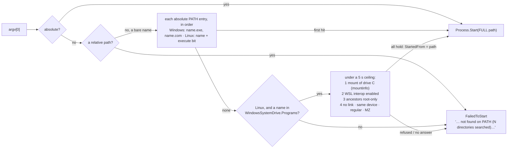

Logging (`Cli.Logging`, per the family rule): Serilog configured in code before the verb runs; the
coloured console sink is the repository's own `AnsiConsoleSink` on **stderr** (stdout carries the
answers the extension parses); `DailyRunFileSink` writes `{log dir}/{yyyy-MM-dd}/wsl-care-{HH-mm-ss}-{pid}.log`
in UTC and segments at UTC midnight; the level and the retention window come from `logging.*` in the
configuration; `LogRetention` prunes day folders older than the window at startup **through
`IFileSystem`**, so the deletion policy judges it like any cleanup. An unwritable log directory degrades
to console-only with a note. `ShutdownSignals` turns Ctrl+C / SIGTERM / SIGQUIT into the root
`CancellationToken` that reaches every command.

What reaches the terminal is printable. `Cli.Output` is the one road from a verb to a stream — answers
on stdout; refusals, notes, internal errors and the interruption line on stderr — and every stderr
message passes `CommandLine.Printable`, which replaces control characters, so a key typed with a
newline or an escape sequence, a key read from the user's file, or a path in a refusal reason cannot
split or repaint the line. The console sink, the one road for log lines, does the same to the message
it renders (and to each line of an exception) and keeps only its own colour escapes. `OutputRoadTests`
fails the build on a stream write anywhere else in the CLI. The file sink writes values as they are.

### Deviations from the plan recorded in E1.S2

- `processes.killEnabled` (plan §7.5) is not a key: it would duplicate `auto.A11`. A5 and A6 carry two
  switches each (`auto.A5` / `auto.A5Testcontainers`, `auto.A6` / `auto.A6Unused`) because §5 gives them
  two defaults.
- `aiAgents.extra` is not in the schema yet; E7 adds it with its object shape (the schema today holds
  scalars and string lists only).
- The log file is written by the sink's own `StreamWriter`, not `Serilog.Sinks.File`: one package in
  the AOT binary instead of two, and the segment logic owns the file either way.
- `WslCare.Core` takes no `ILogger<T>` yet because nothing in it logs; the host does. When a Core
  component needs to log, it takes `Microsoft.Extensions.Logging.Abstractions` then.
- The Linux analogue of `%TEMP%\claude\` is `/tmp/claude` (Claude Code's `$TMPDIR/claude`); the plan
  names only the Windows folder.
- A `RootTooBroad` rule exists (not in the plan): a declared root of `/`, a drive root or the home
  directory is refused before "inside the root" is asked.
- The agent roots protected today are the §4.6 entries with named folders (Claude Code, Codex, Gemini,
  Antigravity, Copilot, Rovo Dev, Ollama); the catalogue of E7 must feed the same list.
- Only `history.jsonl` is written here; the per-run detail file `runs/{day}/{runId}.json` is E2.S3.
- `config reset` of a key absent from the user layer is a no-op that says so (exit 0); an unparseable
  user file is moved to `config.json.broken-{utc}` (or `…-2`, `…-3` when that name is taken) rather
  than overwritten.

## The collectors and `status` (E2.S1)

`WslCare.Core/Collectors` holds the fast collectors; `WslCare.Core/Status` the wire shape of
`status --json`; `WslCare.Cli/Commands/StatusCommand.cs` the verb. Every figure is a `Reading<T>` —
`Available(value)` or `Unavailable(reason)` — from the parser to the JSON edge, so an unread figure is
never a 0: in JSON it is `"available": false` with a `reason` and no value key (the context writes with
`WhenWritingNull`, and the nullable members exist only in the `Status/StatusReport.cs` DTOs).

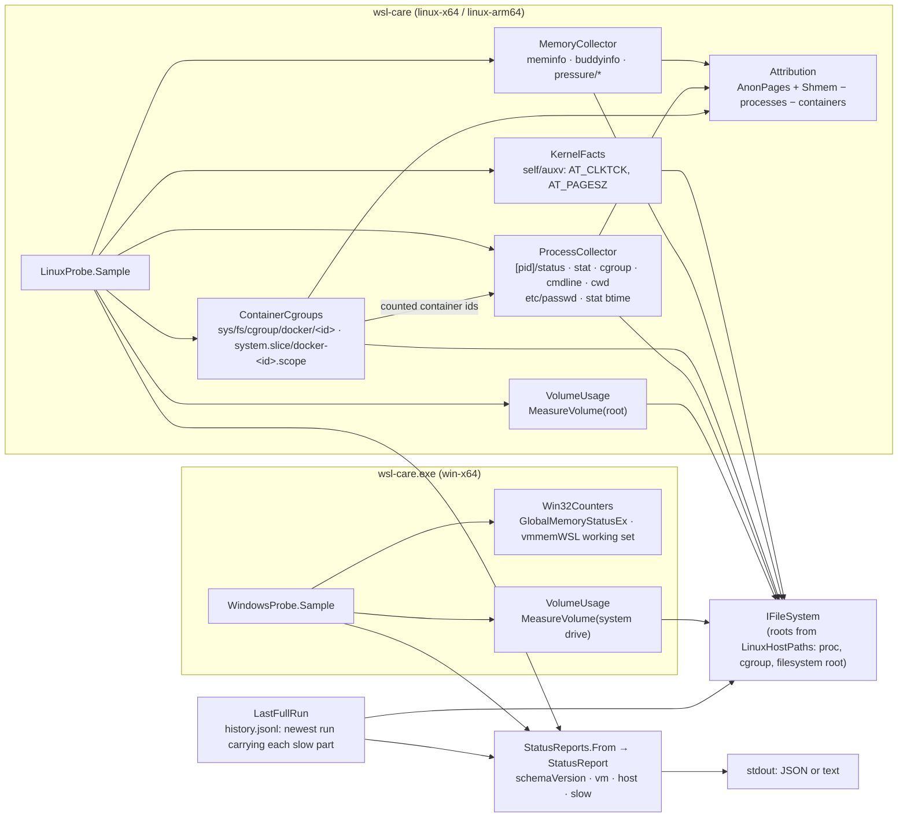

**No slow process in `status`** (plan §15b #5): the probes are constructed without the command runner,
so `docker stats` and `powershell.exe Get-Date` cannot be reached from `status`; their values come from
the newest `history.jsonl` line that carries each part (`RunRecord.Slow`, optional, absent on E1's lines),
reported with that run's id, the sample instant and its age — or unavailable with *no full run has been
recorded yet* / *no recorded full run has sampled …* / *the last full run that tried (id) could not sample
…: reason*. `collect` (E2.S3) and the Docker collector (E2.S2) write those parts; this story reads them.

**Who holds the memory** (plan §4.2 as amended by §15b #4):

- process memory is `RssAnon` + `RssShmem` from `/proc/[pid]/status` — never `VmRSS`, whose `RssFile`
  share is page cache; the top 30 are ranked by it, every counted process is kept in
  `ProcessSnapshot.All` (the input A11's suspect selection will read), kernel threads (`Kthread: 1`, or no
  `RssAnon`) and pids that vanish between listing and reading are counted apart;
- a process whose cgroup path is a container's (`/docker/<64-hex>` — Docker Desktop, cgroupfs driver — or
  `/system.slice/docker-<64-hex>.scope` — an Engine in the distro, systemd driver) is NOT counted as a
  process when that container's cgroup was read: the container is counted once, through its cgroup;
- container memory is read from the cgroup tree, never `docker stats`: both `memory.current` (shown) and
  `memory.stat` `anon` + `shmem` (subtracted);
- the remainder `AnonPages + Shmem − Σ processes − Σ containers` is `remainder`, or
  `inconsistentSample` with its overshoot when below zero, or `unavailable` when an input was not read.

**Deviation, measured:** the subtraction uses the containers' `anon` + `shmem`, not `memory.current` as
§4.2's wording has it. `memory.current` also charges page cache and kernel memory, which `AnonPages` +
`Shmem` do not hold; on 2026-10-02 (~13:45 UTC, ten containers) mixing the units made the live remainder
−1.05 GiB, like for like it was +0.46 GiB — and the captured fixture reproduces it (a test).

**Disk** (§4.4): `df /` through `MeasureVolume` of the filesystem root. Host `C:`, `vmmemWSL` and host RAM
are the Windows binary's (§2: no walk of `C:` from the VM); the `.vhdx` sizes are named in the answer and
unavailable until the Windows collectors (E11) read them. The daily folder sizes of §4.4 are a full-run
figure (E2.S3).

**Other decisions recorded here:**

- The clock tick and page size come from `/proc/self/auxv` (the source glibc's `sysconf` reads), so no
  native call is needed on Linux and a captured tree carries its own values (100 / 4096 here).
- Command lines are shown cut to 200 characters with secret-looking values redacted (`--x=v`, `--x v`
  where the name holds token, secret, password, apikey or credential) — measured on this machine: the VS
  Code server's `--connection-token=` and an agent hub's `--csrf_token=` are in plain argv.
- Families are a built-in catalogue (`ProcessFamilies`, first match wins: build servers, testhost, AI
  agents, Docker Desktop proxy, vscode-server, node, other): regex-per-family settings need the
  object-shaped configuration keys E7 brings.
- The minimal Windows probe reads host RAM (`GlobalMemoryStatusEx`, the project's one `LibraryImport`,
  hence `AllowUnsafeBlocks` for the generated stub), the system drive and `vmmemWSL`'s working set (the
  process snapshot the OS keeps — nothing is started, no handle opened). Under `WSL_CARE_ROOT` only the
  system drive follows the sandbox; RAM and `vmmemWSL` are the real host's, read-only.
- `status` without `--json` prints a short ASCII summary; the JSON is what the extension reads.

## The Docker collectors and `preview` (E2.S2)

`WslCare.Core/Docker` holds the Docker collectors, `WslCare.Core/Preview` the cleanup rows and the wire shape of
`preview --all --json`, `WslCare.Core/Systemd` the `systemctl` / `journalctl` commands and parsers (their
collectors are E2.S3's), `WslCare.Cli/Commands/PreviewCommand.cs` the verb.

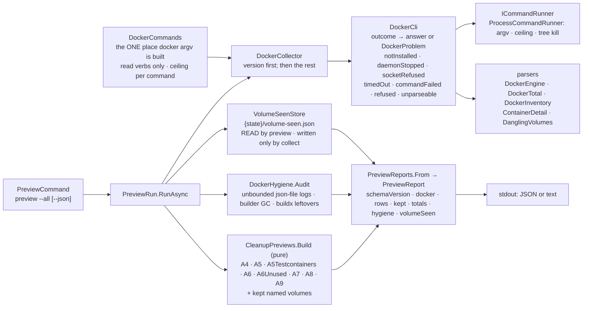

**Read commands only.** `DockerCommands` builds every docker argv — `version`, `system df`, `system df -v`,
`volume ls --filter dangling=true`, `container inspect` (batches of 100), `ps -a`, `stats --no-stream`,
`events --since/--until` — and its `ReadVerbs` list is what a Core test holds every buildable command to (enumerated
by reflection, so a new command is checked without being listed) and what the scenario holds every argv the fake
saw to. `container inspect` goes through a Go template that names its fields, so a container's environment,
command and bind sources never reach the process or a fixture; it reads a mount with `index $m "Name"` because
`$m.Name` fails the WHOLE command on a bind mount (found by the live contract, see below).

**Ceilings.** `version` 10 s (a daemon still starting reads as unavailable, not as a hung panel), listings 30 s,
`system df [-v]` 2 min (plan §4.3: "seconds to minutes"; 2 s measured here). Output caps of 1–64 MiB; an answer cut
by its cap is `unparseable`, never read as a shorter truth.

**Unavailable, never 0** (plan §15b #7). The version probe runs first; when no daemon answers nothing else is
started and every Docker figure is `available: false` with the reason — `notInstalled` (no executable),
`daemonStopped` (Docker's own "failed to connect to the docker API" / "Cannot connect to the Docker daemon", or
`"Server": null`), `socketRefused` (permission denied, connection refused), `timedOut` (our ceiling, tree killed,
or Docker's own i/o timeout), `commandFailed` (anything else, Docker's message quoted), `refused` (the command
policy), `unparseable`. A later command that fails leaves only the parts that depend on it unavailable (no
`system df -v` → no rows, no inspect; the totals still answer). `container inspect` exiting 1 with ONLY "No such
container" lines is read for the containers that still exist — a container removed between the listing and the
inspect is gone, which is all a cleanup preview needs to know (measured 2026-10-02, a parallel session replacing its
containers). The classification phrases are Docker 29.6.1's own, measured on Linux and Windows.

**The rows** (plan §4.3, the preview figures of §5). One row per `auto` switch:

| Row | Selected | Bytes | Left out, as notes |
|---|---|---|---|
| A4 | the dangling list ∩ ANONYMOUS volumes — Docker's `com.docker.volume.anonymous` label AND a 64-hex name (since 2026-10-03; a 64-hex name alone is what `docker volume create` without a name leaves, and Docker 23+ keeps it as named) ∖ `wsl-care.keep=true`, first seen unattached ≥ `volumes.anonymousOlderThanDays` ago | `system df -v` volume sizes | younger than the limit; kept by label; 64-hex names without the label (named to Docker: kept, listed with the named volumes); unattached volumes whose labels are unknown (missing from `system df -v`) |
| A5 / A5Testcontainers | stopped (`exited`, `created`, `dead`) since `FinishedAt` (or `Created` for one never started) ≥ the days / hours limit, by the `org.testcontainers=true` label | writable layer + the distinct anonymous volumes they hold (anonymous by the same label rule, each counted once however many of them share it) | their named volumes (kept); volumes whose labels are unknown (not counted); stopped more recently; kept by label |
| A6 / A6Unused | dangling / tagged images with Docker's container count 0 AND not the image id of any inspected container (a stopped one included), A6Unused created ≥ `images.unusedOlderThanDays` ago | unique size | created more recently |
| A7 | build-cache entries neither in use nor shared | entry sizes | last used more than `buildCache.olderThanDays` ago (an age filter alone); above the `buildCache.maxGb` cap (2³⁰ per GB, as Docker reads `--keep-storage`) |
| A8, A9 | — | — | `available: false`: the npm / apt / snap figures are file walks the full run takes (E2.S3) |

The arithmetic is Docker's own, checked by hand on 2026-10-02 and held by the live contract: images reclaimable =
Σ unique size of the images no container uses; volumes reclaimable = Σ size of the unattached volumes (A4 + the
kept named ones); build-cache reclaimable = Σ size of entries neither in use nor shared. A4 is counted on Docker
below 23 but carries the refusal (plan §5). **Kept**: the unattached named volumes with their sizes, report-only.

**`volume-seen.json`** (plan §5 "Volume age", §15 #0/#4, §15b #3). `{state}/volume-seen.json` maps each anonymous
volume name (anonymous by `AnonymousVolumes`: the label AND the name — `DockerSnapshot.UnattachedAnonymous` needs the
inventory for the labels) to when it was first seen UNATTACHED; each look keeps the first sighting of a name still unattached,
stamps new names now and drops every name that is no longer an unattached anonymous volume (removed or attached
again) — so the file is bounded by what Docker lists. Written atomically through `IFileSystem` (scope: the state
directory). **Who writes it:** only the full run (`collect`, later the cleanup actions) — `preview` is strictly
read-only, privileged or not (plan §15b #3; gate finding #3/#6/#10 found a root `preview` recording sightings in
E2.S2): it observes the record against the snapshot IN MEMORY for its rows, reports `volumeSeen.recorded: false`
with *read-only: preview only reads volume-seen.json…*, and leaves the file byte-identical (absent if it was
absent). **Privilege** for `collect` is the operating system's answer, not an id check: the write is ATTEMPTED, and
on the installed layout (`/var/lib/wsl-care`, `root:root 0755`, E4.S1) only root succeeds; an unprivileged run writes
nothing at all. A run that does not record reads the stored record plus "first seen now" for new names — which can
only make A4 select fewer. When Docker did not list
its volumes the record is neither observed nor written, so an outage never drops a first sighting. A sandbox under
`WSL_CARE_ROOT` belongs to the test user and is the writable case; the unwritable case is tested with the state
directory denied (`AccessDenial`).

**Hygiene audit** (plan §4.5, report only): containers on `json-file` without `max-size` and the size of each log
— one `FileSize` stat of `DistroPath(LogPath)`; under Docker Desktop the logs live inside its own VM, so the Linux
binary reports each size unavailable with that reason and the Windows binary names the Linux binary; Docker
Desktop's `daemon.json` builder GC (`present`, `enabled`, `defaultKeepStorage`) — read by `wsl-care.exe` from
`%USERPROFILE%\.docker\daemon.json`, unavailable inside the distro, which does not know the Windows profile yet
(E2.S3's `.wslconfig` audit resolves it); `buildx_buildkit_*` containers and `buildx_buildkit_*_state` volumes.

**`docker stats`** for a full run: `DockerStats.SampleAsync` returns the `ContainerStatsSample` E2.S1's record
carries (binary units of `MemUsage`, full ids), or the problem's reason with no containers — never an empty
success. `collect` (E2.S3) calls it; `status` keeps reading it back with its age.

### The live contract (`src_daemon/tests/WslCare.LiveContract`, plan §15a C2, §15b #2/#6)

A separate xUnit v3 executable, in the solution but in none of CI's test steps. It runs the product's own
`DockerCommands` / `SystemdCommands` against the REAL tools through `ProcessCommandRunner` with a 30 s ceiling and
tree kill, parses with the product's parsers, and asserts what holds on any healthy machine — and that the
product's sums over `system df -v` rows land on Docker's own `system df` totals. Two answers compared with each
other are taken while Docker holds still (probe, subject, probe again; three attempts), and an error Docker printed
is retried twice 5 s apart — both measured necessities on 2026-10-02, while a parallel session was building images
and replacing containers. No `docker` / no daemon / no `systemctl` / not booted with systemd → an explicit skip with
the reason; `CI=true` → skip; `WSL_CARE_REQUIRE_LIVE=1` (the release checklist in `POST_DEPLOY.md`) → every skip is
a failure. `WSL_CARE_LIVE_CAPTURE=<dir>` writes each answer to a file — how `tests/fixtures/docker/*` was recorded.

### Deviations from the plan recorded in E2.S2

- Rows are named by their `auto` switch — `A5Testcontainers` and `A6Unused` are rows of their own — so each row
  carries the one switch and the one age limit that governs it.
- `volume-seen.json` records the first sighting UNATTACHED and drops a name that is attached again (the plan:
  "first time it sees each anonymous volume"), so A4's age means "unused for", which is what §5 says it limits.
- ~~A `preview` run by root also records first sightings~~ — **withdrawn after the E2 code round** (gate finding
  #3/#6/#10): `preview` never writes `volume-seen.json`, as §15b #3 says; `collect` records the sightings.
- A8 and A9 are present and `available: false` until the full run measures the folders (E2.S3).
- The builder-GC figure is the Windows binary's; inside the distro it is unavailable until E2.S3 resolves the
  Windows profile. Log sizes under Docker Desktop are unavailable (the logs are in Docker Desktop's VM).
- `docker ps -a` is not used by `preview` (`system df -v` lists the containers with their sizes); the live contract
  parses it with the same row parser and holds its ids to `system df -v`'s.
- The `systemctl show` / `journalctl --disk-usage` / `docker events` parsers ship here for the live contract;
  their collectors are E2.S3's. Measured: Docker's in-memory event buffer held only 255 healthcheck `exec_*`
  events — no container start of the last 24 h survived in it — so the follower's backfill (E2.S3) must expect an
  empty `events --since` even right after starts.

## The full run, `doctor` and the events follower (E2.S3)

`WslCare.Core/Collect` holds the full run (`CollectRun`) and the wire shape of its run detail; `Health` the health
collectors of plan §4.5 and their parsers; `Thresholds` the threshold rules; `Folders` the daily folder walk; `Events`
the container-start follower; `Doctor` the installation check; `Records` gained the run detail store, the history
reader, the startup reconcile and the retention sweep. The verbs are `CollectCommand`, `DoctorCommand`,
`EventsCommand` in `WslCare.Cli/Commands`.

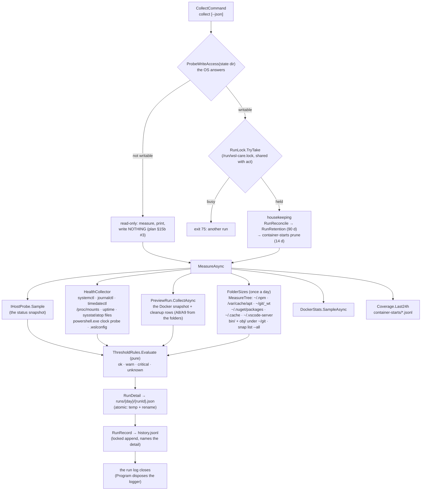

**What a full run measures.** Everything `status` reads (the fast probe), plus what only `collect` may start (plan
§15b #5): Docker's full numbers and the cleanup rows (the same `PreviewRun` as `preview`), `docker stats`, the
Windows clock, the health collectors, and once a day the folder walk; and what the follower recorded — container
starts of the last 24 h, complete or partial. The thresholds are evaluated over all of it; the detail holds every
verdict, the history line the ones that are not `ok` (`warnings`) and a few headline `metrics`.

**The health collectors** (plan §4.5, read-only, each command with its ceiling, built in `SystemdCommands` /
`HealthCommands`): failed units (`systemctl list-units --failed --output=json`), journal size and history
(`journalctl --disk-usage`, the oldest `first_entry` of `--list-boots --output=json`), clock jumps since the last run
(systemd-resolved's "Clock change detected" — `journalctl --unit=systemd-resolved --grep`, 875 in ~3.9 h measured),
the kernel's allocation failures and OOM kills since the last run (`journalctl --dmesg --grep` — journald's copy of
the kernel log, no `dmesg`), time sync (`timedatectl show`), `wsl-pro.service` and `fstrim.timer`
(`systemctl show`, now with `UnitFileState`), earlyoom / systemd-oomd present, uptime and `discard` on `/` from
`/proc`, sysstat / atop collecting (the newest file's last write, < 30 min). journalctl exits 1 printing nothing when
nothing matched — read as 0, never as a failure. A missing tool leaves only its part unavailable with the reason.

**The Windows clock** (plan §4.5, §15b #5). `powershell.exe` prints Windows' "now", its OWN start and
`%USERPROFILE%`, all on Windows' clock. The start lines up with the instant this side launched it, so the offset is
*Windows start − our launch instant* and the launch latency (*printed − started*, measured on one clock) is
subtracted rather than counted as skew — measured 2026-10-02: −2.89 s and −2.74 s a second apart this way,
−2.05 s / −2.18 s without the subtraction. A drift is reported only on TWO observations above
`clock.maxDriftSeconds` at least 5 minutes apart — this run's and the previous full run's (plan §15 #10). The printed
profile, seen through `/etc/wsl.conf`'s automount root (`/mnt/c/Users/…`), is how the distro reads `.wslconfig` and
Docker Desktop's `daemon.json` (the builder-GC figure E2.S2 left unavailable) without a walk; `preview` reuses the last
full run's profile.

**Thresholds** (`ThresholdRules`, pure). Settings where the plan made them settings (`thresholds.*`, `volumes.*`,
`images.unusedMaxGb`, `buildCache.maxGb`, `npm.maxCacheGb`, `clock.maxDriftSeconds`); plan §4's other starting points
are named constants (page cache / inactive anon 15 GiB, order-7 blocks < 32 warn / 0 critical, PSI > 10, `/` > 80 %,
journal > 1 GiB or < 7 days, > 100 clock jumps per 4 h). An unread figure is `unknown` with its reason, never `ok`.
**`.wslconfig`**: the VM's ceiling (inside the VM `MemTotal` IS the ceiling) is red above 90 % used; the row SHOWS
the owner's recommendation `memory=36GB` and the file's own settings (`sparseVhd=true` and `autoMemoryReclaim=gradual`
warn) — nothing ever writes the file.

**The daily folder walk** (`FolderSizes`, plan §4.4 and the A8 / A9 rows). `IFileSystem.MeasureTree`: one
`FileSystemEnumerable` pass, a stat per entry and no read, links (symlinks, junctions — `ReparsePoint`) neither counted
nor entered, a folder that is itself a link not walked, a ceiling of 2 000 000 entries or 2 minutes per folder (a
stopped walk is marked a lower bound). Measured when the newest recorded sample is older than 20 h; the other runs
carry none and readers take the newest line that does. A9's disabled snap revisions come from `snap list --all`, each
one's size a stat of `{name}_{rev}.snap`. `preview` shows A8 / A9 from that sample with its age in the basis.

### Write order, reconcile, retention (plan §15b #1)

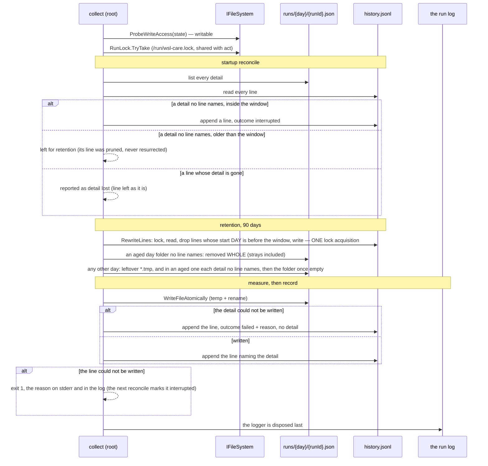

**One boundary, one lock** (after the E2 code round, gate findings #0/#4 and #11). Retention ages by the UTC DAY
(`RunRetention.CutoffDay` = today − 90 days): a history line whose start's day is before it, and a
`runs/{yyyy-MM-dd}/` folder whose day is. A line and the detail it names share that day (the run id carries it), so
they age out in the same sweep — E2.S3 aged the line by the instant and the folder by the day, and a run 90 days and
one hour old lost its line while its detail stayed, which the next reconcile turned into an `interrupted` run. The
reconcile now ignores a detail older than the window (`RunRetention.IsAged`), so a detail whose deletion failed is
never resurrected either. An aged day folder no line names goes whole, through `IFileSystem.DeleteDirectory` with
`runs/` as the declared root. The history is read, filtered and atomically rewritten inside ONE acquisition of
`history.jsonl.lock` (`IFileSystem.RewriteLines`, the lock `AppendLine` takes), so an append that arrives meanwhile
waits and lands in the new file — proved by an append interleaved inside the rewrite (`RunRetentionTests`).

Every delete and the history rewrite pass `IFileSystem` with a declared root (`runs/`, the state directory,
`container-starts/`), so the `DeletionPolicy` judges them like any cleanup. `RunHistory` is the one parser of
`history.jsonl` (`LastFullRun`, the reconcile, retention, `doctor` read through it); a line that does not parse is never
aged out — it has no start to age it by.

**Read-only** (plan §15b #3). The write probe answers no for an unprivileged process on the installed layout
(`/var/lib/wsl-care` is root's): the run still measures everything and prints it, and writes nothing — no reconcile, no
retention, no detail, no line, no first sighting (`PreviewExtras.MayRecord`) — and says *read-only: run as root to
record*. Its log goes to `$XDG_STATE_HOME/wsl-care/logs` (`IHostPaths.UserLogDirectory`; `WslCareLogging.LogRoot` picks
it whenever the system log directory is not writable — for every verb, not only `collect`).

**One run at a time.** THE run lock is held for the whole privileged run — an exclusive open the OS releases
when the holder dies — so the reconcile never takes a running run's detail for an orphan; a second `collect` exits 75.
Since E3.S1 it is `/run/wsl-care.lock` (`RunLock`), ONE file for `collect` and `act` (E2.S3 held `{state}/run.lock`).

### `events follow` — the container-start follower (plan §4.3, §15b #0, #8)

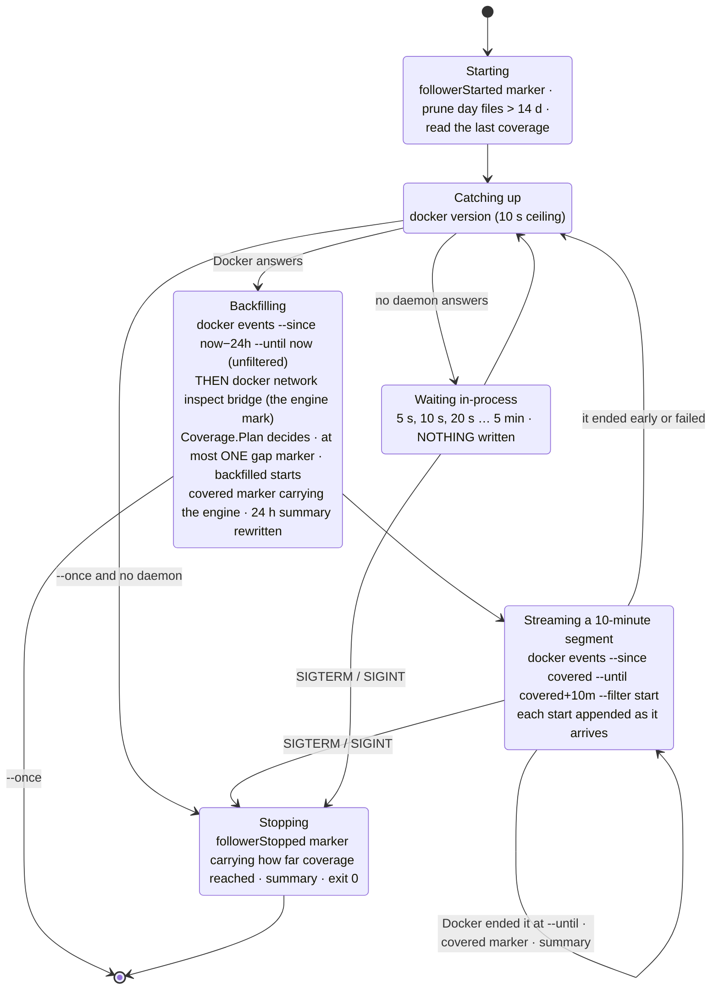

**Files.** `{state}/container-starts/{yyyy-MM-dd}.jsonl`, one line per start (`id`, `name`, `image`,
`testcontainers`, `backfilled`) and the markers — `followerStarted`, `followerStopped` (with the coverage it reached),
`covered` (every start up to this instant is recorded), `gap` (from, to, reason) — filed under the UTC day of the line,
appended under the cross-process lock, kept 14 days (pruned at start and by `collect`). A `covered` marker also carries
the engine instance it came from (`engineId`, `engineStartedAt`). One follower at a time
(`{state}/events-follower.lock`; a second exits 75); a process that may not write the state directory exits 1.
**`{state}/starts-summary.json`** (gate finding #8): the trailing-24-hour count (`StartsSummary`: when it was written,
how far coverage reached, the `StartsWindow`), recomputed over the day files and written atomically after EVERY marker.
`status` reads only this file (`ContainerStartsStore.ReadSummary`) — its cost no longer grows with the starts recorded —
and marks it partial with the open gap when the newest coverage is more than 15 minutes old; with no summary yet it
answers a partial 0 naming why. `collect` and the follower still count over the raw files (`Coverage.Last24h`). A
failed summary write is noted and the follower goes on: the summary is a cache, the day files are the record.

**Leaving a segment** (gate finding #1/#5). `StreamAsync` drains stderr concurrently into a bounded capture, and every
way out of a segment but a normal end — its ceiling, SIGTERM's cancellation, a callback that throws — kills the whole
tree and waits for the child (bounded by a 2 s grace) in a `finally`, before the outcome or the exception propagates.

**Why segments.** A stream that never ends would be a wait without a ceiling. Docker closes `docker events` by itself
at a FUTURE `--until` (observed by the live contract), so each segment is a bounded command (ceiling: the segment and
one minute) run through `ICommandRunner.StreamAsync` — the same launcher, policy and tree kill, its lines handed over
as they arrive (each cut at the output cap) — and the next segment resumes `--since` the previous `--until` from
Docker's buffer.

**The continuity rule** (`Coverage.Plan` + `Continuity`, pure; amended after the E2 code round, gate finding
#2/#7/#9 — E2.S3 treated an empty or short buffer as proof of loss). Docker keeps its events in a RING in memory:
moby's `eventsLimit` is **256**, the oldest dropped first — measured 2026-10-02: the unfiltered window answered 248, 255
and 255 events, all healthcheck `exec_*`, spanning **91 seconds** on a busy engine. So the buffer is complete from its
oldest event onward, always; and while it is not full it is complete from the moment the ENGINE STARTED. Events can
have been lost only when the buffer is FULL (≥ 240 events, `Coverage.FullAt` — within 16 of the capacity, because a
full buffer never answered 256) or the engine RESTARTED since the last coverage. The proven start of completeness is
the earlier of the oldest buffered event and — for a buffer that is not full — the engine's start (never before the
24 h window); coverage holds when it is at or before the last coverage, otherwise the stretch between them is ONE
`unrecoverable` gap with its reason (engine restarted at …, buffer full and reaching back only to …, older than the
24-hour window, the follower's first start). An idle engine with an empty buffer is covered with zero starts; a host
that slept (the engine suspended, the same instance after) is covered.

**The engine signal** (`DockerCommands.EngineStart`, read-only: `docker network inspect bridge`, its `Id` and
`Created`). The engine deletes and re-creates the default `bridge` network at every start, so its id is new per engine
start and its creation is the start instant — measured 2026-10-02 on Docker Desktop 4.81.0 / Engine 29.6.1: `bridge`
created 13:39:47.63Z, the restart-policy containers started from 13:39:48.27Z, while `host` and `none` still carry
2026-07-16 (they persist). `docker info` has no start time and its `ID` persists across restarts, so it cannot tell a
restart. Plain `dockerd` runs the same engine start-up, so the same re-creation is EXPECTED there (unless `live-restore`
keeps the bridge) — not measured: this machine runs Docker Desktop only, and the live contract is what checks it on an
installation that has a plain `dockerd`. The
follower reads the mark AFTER the events (a restart between the two then reads as a gap, never as false
completeness) and records it on each `covered` marker; a different bridge id with a start before the marker means a
different engine answers, and only the oldest-event rule is trusted. When the mark cannot be read (no `bridge`
network, the command failing) the rule falls back to E2.S3's: only the oldest buffered event proves anything. The
live contract checks the signal on this machine: every running container started no earlier than the engine.
The wait for Docker writes nothing, so one outage is one
gap, however many retries and even across a restart of the follower. **Counts** (`Coverage.Last24h`): starts in the last
24 h, Testcontainers apart, the top images; `complete` only when no gap overlaps the window — a recorded gap, the stretch
before the first record, or an open gap when the newest coverage is more than 15 minutes old — so a count is complete
again only once a whole 24 h lies after a gap's end. `status` and `collect` report it.

### `doctor` (plan §6)

Read-only: the configuration (observe-only is a problem), the state directory (missing is a problem; read-only for
this process is expected), the last run (older than 5 h or `failed` is a problem), lost details, the four units
(`wsl-care.timer`, `wsl-care-events.service`, `sysstat.service`, `atop.service` — `systemctl show`), sysstat / atop
collecting, the follower's coverage (≤ 15 min), root reachability `notChecked` (E6), and the versions of `wsl-care`,
Docker (server and CLI), systemd and the kernel. `healthy` is true when no check is a `problem`; the exit code is 0
whatever it finds (the JSON is the verdict).

### Exit codes (`ExitCode`)

0 answered / recorded / read-only / follower stopped by a signal · 1 the run could not be recorded, or `events follow`
without a writable state directory · 2 usage · 70 a defect · 75 busy (another run or follower holds the lock) ·
130 interrupted. Since E3.S1 also, for `act`: 3 an action failed · 76 wedged · 77 needs root · 78 observe-only (§ *The action
engine, the command policy and `act`*); since 2026-10-03 · 79 `running.json` unreadable after retries (gate finding #7). Since
E3.S3, for `logs` / `runs`: 4 the history exists but cannot be read.

### Deviations from the plan recorded in E2.S3

- Thresholds without a setting in `ConfigKeys` stay named constants in `ThresholdRules` (plan §4's starting points);
  their keys arrive with E7's settings sync if the week of data asks for tuning.
- `collect` takes `{state}/run.lock` (not in the plan for E2) so the reconcile cannot race a running run; E3.S1's lock
  supersedes it. The trigger is `timer` only with `--timer` (the timer unit passes it in its `ExecStart`), `cli` otherwise — never
  inferred from `INVOCATION_ID`, which every descendant of any systemd unit inherits (a CI runner job, a VS Code Server
  user service; CI run 37129452377 caught four act tests taking a runner job for the timer).
- The backfill reads the WHOLE 24-hour window unfiltered (`events --since now−24h --until now`), not `--since <marker>`:
  the oldest buffered event of any kind is the only evidence that the buffer reaches back past the marker. Its lines
  are parsed in memory only (healthcheck command lines are in them) and never stored.
- The live follower runs in bounded 10-minute segments rather than one endless stream (a ceiling on every wait); each
  segment's end is a `covered` marker.
- `events follow --once` (catch up and stop) is not in the plan; it is what the derived register's example and a
  manual backfill use.
- `.vhdx` sizes and their growth stay unavailable (the Windows collectors, E11); "what grew since yesterday" is the
  growth of each walked folder against the previous sample, not of `$HOME` and `/var` (a walk of the whole home is
  not a 4-hourly or daily cost this run pays). inotify usage, VS Code Server builds (A14's input) and the WSL
  "failed to start within" boot error are not collected yet.
- The kernel's signals come from journald's copy of the kernel log (`journalctl --dmesg`), of THIS boot.
- The run log's retention stays `logging.retentionDays` (14, E1.S2), not §6's 30 days.
- Under the root timer `$HOME` is root's: whose home the daily walk, `~/.npm` and the protected `~/git` mean was left
  to E4.S1 — **decided in E3.S2**: the TARGET user's (§ *The irreversible deletions* below).
- **Amended after the E2 code round** (gate session `714367be`): the gap rule became the continuity rule above (an engine
  mark, the ring's capacity), `status` reads `starts-summary.json` instead of the day files, retention ages lines and
  day folders by one UTC-day boundary under one lock and the reconcile ignores aged details, `StreamAsync` kills and
  reaps in a `finally`, and `preview` writes no first sighting.
- `ICommandRunner` gained `StreamAsync`; `IFileSystem` gained `ListFiles`, `MeasureTree`, `ProbeWriteAccess`,
  `TryLockExclusive`, `RewriteLines` and a last-write time on `FileSize`; `IHostPaths` gained `UserLogDirectory`
  (Linux: `$XDG_STATE_HOME`), `LinuxHostPaths` the apt / snap / sysstat / atop / `wsl.conf` paths, `WindowsHostPaths`
  `.wslconfig`. The fake tool learned prefix matching, a per-answer call budget (`upTo`: down, then up) and output
  followed by a hang (a live stream); `timedatectl` and `snap` joined the fakes.

## The action engine, the command policy and `act` (E3.S1)

`WslCare.Core/Actions` holds the action interface (`ICleanupAction`), the closed set of action ids (`ActionId`, derived
from the `auto.*` keys of `ConfigKeys`, with the fixed `ExecutionOrder`), the registry (`ActionRegistry.Product` — this
release holds ONE action), the reference action A10 (`JournalVacuum`), the target-user discovery
(`TargetUserDiscovery`) and the `runuser` wrapper (`TargetUserCommands`), and the executor an action runs its commands
through (`ActionCommands`); `Actions/Engine` the engine (`ActionEngine`), `running.json` (`RunningState`, `Heartbeat`,
`IProcessTable`), the timer's dry-run window (`DryRunWindow`) and the idle gate (`IdleGate`). `Processes/Policy` is the
command policy (`CommandPolicy`, `NeverList`, `CommandTemplate`, `SlotKind`, `CommandCatalogue`, `ReadCommandTemplates`,
`TargetUserArgv`). `Records` gained THE run lock (`RunLock`) and the write order shared by every kind of run
(`RunRecorder`, extracted from `CollectRun`). `Hosting` gained `ProcessPrivilege`. The verb is `ActCommand` in
`WslCare.Cli/Commands`.

### One run of `act`

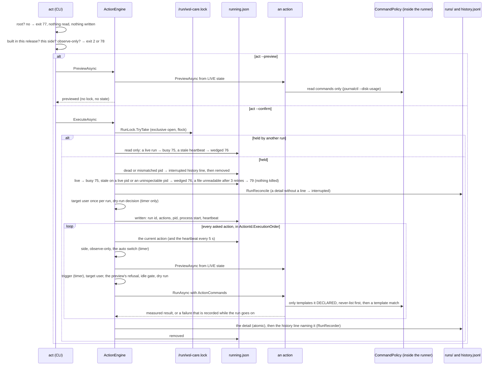

**The gates, in order, per action** (each stop is an outcome with its reason, never a silent skip): the action's SIDE
(`skipped`); observe-only (`skipped`); on the timer its `auto.<id>` switch (`skipped`); the LIVE preview (unreadable →
`refused`); on the timer its trigger (`skipped`); a user-scoped action without a target user (`refused`); the
preview's own refusal (`refused`); the idle gate (`deferred`, logged as a warning); the dry run (`dryRun`, the preview
recorded as *would have freed*); then the run — `ran`, or `failed` with the reason, and the next action. ANY exception
of an action is caught at that unit boundary and recorded as `failed` (reliability rule: one unit's failure is the
unit's); the caller's cancellation is not — it ends the loop, the run is recorded `interrupted`, `running.json` is
removed and the cancellation flies on (exit 130).

**Order** is the engine's, whatever order the actions were asked in (`ActionId.ExecutionOrder`): A5Testcontainers, A5,
A4, A6, A6Unused, A7, A8, A9 (plan §7.3: removing containers first frees their volumes and images), A12, A14, A17, A10,
A13, A15, A16, A3, A11, A1, A2 (the build servers and suspects before the cache drop, A2 after A1).

**`running.json`** (plan §6, §15 #6, §15a #0): the run id, the trigger, the asked actions, the CURRENT one, the pid,
the process's START as the operating system reports it (`Process.GetProcessById(pid).StartTime` — inspected, never
started or killed), the start of the run and a heartbeat. Rewritten at once when the run moves to its next action, and
by a detached loop every 5 s (`PeriodicTimer` on the run's `TimeProvider`; its outermost frame ends in a catch-all that
keeps the failure in the run's notes). A reader judges it: no file → none; the pid gone, or alive with a start more
than 2 s from the recorded one (a reused pid) → **dead**: an `interrupted` history line (the asked actions, the one it
was on, the last heartbeat) and the file removed — unless the run had already recorded itself (it died between its
history line and the removal), then the file alone goes; the pid alive with that start and a heartbeat at most 30 s old
→ **live** (busy); older → **wedged**: no new run, nothing killed, the file left exactly as it is; a pid that cannot be
inspected → refused like wedged, because a guess there is a second run beside a live one. A file that cannot be read or
does not parse is read again — three more times, 100 ms apart (`RunningReadRetry`; a writer's temp + rename can race a
reader on Windows) — and only then judged: **unreadable**, its OWN state (`RunningStatus.Unreadable`,
`ActResult.StateUnreadable`, exit 79, the file and the reason named), never taken for a wedged live process. The sweep
itself is `RunningSweep` (since 2026-10-03), ONE implementation for the engine and every full run's housekeeping.

### The command policy — the one filter every argv passes

`ProcessCommandRunner`'s only public constructor takes a `CommandPolicy`, a sealed class whose never-list no caller can
switch off; `CommandPolicy.Product` is the never-list over `CommandCatalogue.Product` = the collectors' read commands
(`ReadCommandTemplates`, each fixed one taken from its own `ToolCommand`) + every template a registered action
declares. A test may build `CommandPolicy.Over(itsOwnCatalogue)` — which templates, never which rules. The runner's own
tests use `ProcessCommandRunner.UnguardedForItsOwnTests` (internal; their child is a shell, which the never-list
refuses), and a test fails if any other product file names it.

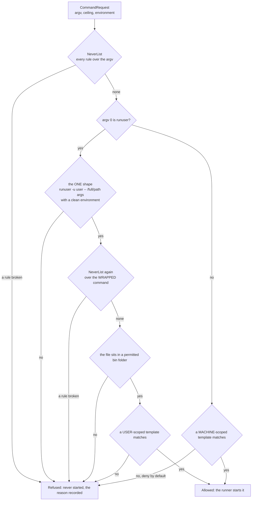

**The never-list** (`NeverList.Rules`, each a named rule with a known instance in `CommandPolicyTests`): a control
character in any argument; a SHELL in any form (`sh`, `bash`, `dash`, `zsh`, …, `cmd` — plan §15c #3, no shell
anywhere, so not only `-c` / `-ic`); PowerShell with anything but the fixed Windows clock probe (E2.S3's one PowerShell
argv, a literal with no slot); an interpreter given inline code (`python -c`, `perl -e`, `node -e`, `awk`, …);
`git worktree prune`; `docker system prune` in ANY form; `docker volume prune` in any form; `vm.drop_caches` with any
value but `1`, and any argument naming `/proc/sys/vm/drop_caches`; `sysctl` loading a file (`-p`, `--load`,
`--system`); `wsl --shutdown` / `--terminate` / `--unregister`; deleting or moving by command (`rm`, `rmdir`, `unlink`,
`shred`, `mv`, `del`, `find -delete`, `rsync --delete`, `git clean` — files go only through `IFileSystem` and its
`DeletionPolicy`); a path under ANY home's `git`, an AI agent's folder or Claude's temp folder as an argument to ANY
command; `sparseVhd` / `--set-sparse`; `autoMemoryReclaim` with `gradual`; a command that runs another command
(`sudo`, `su`, `env`, `xargs`, `nohup`, `timeout`, `nice`, `wsl`, …) — `runuser` only in its one shape; killing by
name (`pkill`, `killall`, `taskkill`). Broader than plan §5 wherever breadth costs nothing: no action needs any of it.

**Deny by default.** A template (`CommandTemplate`) is the executable as a BARE name (never a path — the catalogue
refuses one), fixed literals and typed slots (`SlotKind`, a closed set: a bounded number with a suffix, `@unix`
seconds, an RFC 3339 UTC instant, n hex digits, a unit name, a POSIX user name, plain search text, one of a fixed set,
a fixed prefix plus a slot, any of several), the last part optionally a bounded repeat. No slot accepts a value that
starts with `-` (except a fixed set) or holds a control character; the text slot holds only letters, digits, space and
`| . _ : -`. An action may BIND only the templates it declares itself (`ActionCommands`, compared by identity), and the
runner's policy then judges the argv again — two filters, one written by the action's author and one nobody can skip.

**The property test** (`CommandPolicyPropertyTests`, a seeded generator in `TestSupport/HostileInputs` — no package):
20 000 generated requests — every never-command in many spellings (paths, case, `.exe`, extra words, behind a
wrapper), every declared template with valid and with hostile slot values (`--all`, `;`, `$(…)`, `../`, `~/git`, agent
folders, unicode, newlines, NUL), token soup, all of it also wrapped in `runuser` with a clean or an inherited
environment — none the policy allows is a never-command by the INDEPENDENT oracle (`NeverOracle`: the plan's list
written a second time, as patterns over the joined argv with every wrapper peeled), and every one it allows matches a
declared template; every declared template instantiated with values its slots accept is never a never-command; and
every registered action, previewed AND run 2 000 times over generated configurations and generated journals with
hostile file names, asks only for argv the policy allows, of its OWN templates, none a never-command. Each property has
a companion that goes red: a permissive policy (`_ => Allowed`), a policy asking the never-list of the outer argv only
(the refuted shape: it admits undeclared argv and never-commands behind `runuser`), a planted template whose slot is
too wide (`vm.drop_caches=<0..3>` — the template property names it, and the never-list still refuses it at run time),
and a planted action that builds a shell string from a preview name.

### The execution context (plan §15c)

- **Root, first.** `act` asks `ProcessPrivilege` before anything else (`Environment.IsPrivilegedProcess`: effective uid
  0; elevated on Windows). Unprivileged — `--preview` included — it refuses the whole run (exit 77) before the lock,
  before any read command, before any state. Under `WSL_CARE_ROOT` alone, `WSL_CARE_SANDBOX_PRIVILEGED=1` makes the
  process ANSWER root — the harness and the AOT smoke drive `act` with it; it changes the answer, never what the
  operating system lets the process do, and every path of the run is under the sandbox root.
- **The target user**, once per run: `/etc/wsl.conf`'s `[user] default=` (a valid account name that `/etc/passwd`
  holds, with an absolute home), else the single account with uid ≥ 1000 (not 65534) and a login shell; anything else —
  two candidates, a default user `passwd` does not hold, an unreadable file — is *ambiguous* and every USER-scoped
  action refuses with the reason (machine-scoped ones still run — since 2026-10-03 for real: the run reads the defaults
  and the machine layer without the user layer, instead of going observe-only as a whole). The run detail records who it
  was and how.
- **`runuser`.** A user-scoped tool runs as `runuser -u <user> -- <full path> <args…>`: the file resolved BEFORE the
  start in the fixed bin folders — `~/.nvm/versions/node/<the default version>/bin` (nvm's `alias/default` resolved to
  an installed version, or left out), `~/.local/bin`, `~/.cargo/bin`, `/usr/local/bin`, `/usr/bin` — with a CLEAN
  environment (`HOME`, `USER`, `LOGNAME`, a `PATH` of those folders; nothing of root's). The policy refuses any other
  `runuser` shape, an inherited environment, and a file outside those folders even when its name matches. E3.S1 held no
  user-scoped action; E3.S2's A8, A12, A14 and A17 are.
- **Protected homes.** Inside the distro the CLI protects the `git` and AI-agent folders of root's AND every login
  account's home (from `/etc/passwd`), besides `$HOME`'s (`LinuxEnvironment.ProtectedHomes`) — under the root timer
  `$HOME` is root's, and the target user's folders must be protected whoever the target is. The daily folder WALK and
  the user configuration layer followed `$HOME` in E3.S1; since E3.S2 they follow the TARGET user's home when root.

### Decisions taken in E3.S1

- **The 7-day dry run starts at the timer's FIRST action pass**, recorded once in `{state}/first-timer-run.json`
  (root-written), not at install: the week is a week of the timer's own decisions. The timer is dry while `dryRun` is
  on OR the 7 days have not passed; a button never is. An unreadable stamp is rewritten with now (the week restarts);
  one that cannot be written leaves the run dry.
- **The lock rule between `collect` and `act`: one file (`/run/wsl-care.lock`), and the second one refuses (75), it
  never waits.** A run that waited would be a run nobody sees; the timer runs again at its next tick, a button shows
  busy.
- **"CPU below `idle.cpuPercent` for `idle.minutes`" is the kernel's load average** — the shortest of its 1 / 5 /
  15-minute windows covering `idle.minutes` (15 when longer), divided by the CPUs of `/proc/stat`, capped at 100 %. A
  run is a moment, and the load average is the only CPU history the kernel keeps; it counts I/O wait as busy, the
  conservative direction. Builds are `docker … build|bake`, `dotnet build|test|publish|pack|msbuild`, `npm ci|install`
  among the distro's processes (the fast probe's table). An unread figure defers.
- **Heavy actions** (`IdleRule`): `TimerOnly` for A1 / A2, `Always` for A7 / A15 — a button press of A7 while a build
  runs is deferred too (refused with the reason); A10 never waits.
- **A preview takes no lock** and writes nothing — it is a question, like `preview --all`; only `--confirm` locks.
- **`act --timer` is the timer** (as for `collect`; never `INVOCATION_ID`); `collect` does not call the engine yet (E3.S3:
  the timer pass does).

### Exit codes of `act`

0 previewed / run recorded (an action skipped, deferred, refused or dry-run is still 0 — the answer names it) · 1 the
run could not be recorded · 2 usage: an unknown id, an action this build does not hold, the other side's action · 3 an
action failed (the run was recorded, the rest ran) · 75 busy · 76 wedged · 77 needs root · 78 observe-only · 79 the running
state unreadable (since 2026-10-03) · 130 interrupted.

### Deviations from the plan recorded in E3.S1

- The never-list is broader than §5 (every shell, every delete-by-command, every `docker system prune`, every command
  wrapper, every argument path under a protected folder), and PowerShell is allowed only as the clock probe's literal
  argv — the one interpreter E2 already started.
- The action ids include `A5Testcontainers` and `A6Unused` (plan §5 gives A5 and A6 two switches each); an id is its
  `auto` key, so the registry and the switches cannot drift.
- ~~The timer pass is not scheduled yet: `collect` (the timer's target) does not run the engine; E3.S3 wires it with
  A1 / A2's triggers.~~ **Closed by E3.S3**: the timer pass (§ *The timer pass*). `act` under systemd behaves as the timer.
- `CommandRequest` gained an `Environment` (inherited, or clean); `ExecutableResolver` gained `ResolveIn` (a list of
  folders, where a `PATH` string would split a Windows sandbox path at its drive letter); `IHostPaths` gained
  `RunLockFile`, `LinuxHostPaths` `JournalDirectories` and `WithProtectedHomes`; `ActionRecord` gained `status` and
  `wouldFreeBytes`; the `RunRecorder` was extracted from `CollectRun` so both kinds of run share one write order.
- `runuser`'s environment handling is read from util-linux's `su-common.c` (without `-l` / `-m` it sets `HOME`,
  `SHELL`, `USER`, `LOGNAME` and keeps `PATH` unless `ALWAYS_SET_PATH`), not observed: it needs root, and nothing here
  runs as root.
- The button's trigger was `cli` in E3.S1; E3.S2 added `--manual` (the trigger `manual`) and A4's `--volume` / `--only`
  (what the preview SHOWED) — E6 passes both.

## The irreversible deletions (E3.S2)

Eleven more `ICleanupAction`s in `ActionRegistry.Product` — the engine, the policy, the lock, `running.json`, the dry run
and the idle gate are E3.S1's, reused unchanged. Each declares its `CommandTemplate`s (so the policy's catalogue and the
property tests pick them up), runs commands only through its `ActionCommands`, previews from LIVE state, and returns a
MEASURED `ActionRun` with the removed objects and — new — `NotRemoved` (each with why) and `Notes`.

| Folder (`WslCare.Core/Actions/…`) | Actions | Scope |
|---|---|---|
| `DockerCleanups/` — `VolumeRemoval`, `ContainerRemoval`, `ImagePrune`, `BuildCachePrune`; `DockerCleanupCommands` (the WRITE templates and the answer parsers), `DockerLook` (one live look) | A4, A5 + A5Testcontainers, A6 + A6Unused, A7 | machine |
| `UserCaches/` — `NpmCacheClean`, `ToolCacheTrims`, `BrowserAndHttpCaches`, `EditorServerCleanup`; `CacheFolders` (the target user's folders, the one bounded measure) | A8, A17, A12, A14 | user (`runuser`) |
| `PackageCaches/` — `PackageCacheClean` | A9 | machine |
| `Suspects/` — `SuspectTermination` | A11 | machine |

### One preview, two readers

`Preview/CleanupTargets` is now the ONE place a Docker row's objects are SELECTED (anonymous volumes, stopped containers
and their anonymous volumes, unused images, reclaimable cache entries — every protection applied there), and
`CleanupPreviews` builds each row (`A4Row` … `A9Row`) from those selections. A Docker action's preview takes its own live
look (`DockerLook`: the same `DockerCollector`, run through `ActionCommands.AsRunner()` — the action's declared machine
templates and the collectors' shared read-only templates (`ReadCommandTemplates.All`, gate finding #3) run, every argv still
judged by the policy — and the
first sightings observed in memory exactly as `preview` observes them) and calls the SAME row builder, so
`act <A#> --preview` and that row of `preview --all` are one computation: same what, count, bytes, basis and refusal
(`RowPreviews`; held by `DockerCleanupTests.Every_docker_and_folder_actions_preview_equals_its_row_of_preview_all`, derived
over every registered action that has a row). The full target list travels from the preview to the run in memory only
(`ActionPreview.Targets`, `ActionItem.Key`, both `[JsonIgnore]`); the JSON keeps the first 20 items.

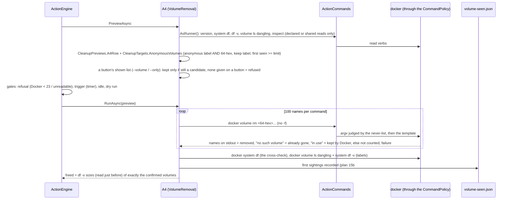

### Per action — what it runs, and what "freed" is

| Action | Command | Freed bytes | Refuses / skips |
|---|---|---|---|
| A4 | `docker volume rm <64-hex>{1..100}` | `system df -v` sizes of exactly the volumes Docker printed back (§15c #1); Docker's Local Volumes total before / after beside it | Docker < 23, or a version that is not a number (E3.S2: unknown is not "new enough" — the row's refusal too); a `manual` run without a shown list |
| A5, A5Testcontainers | `docker rm -v <64-hex id>{1..100}` | the confirmed containers' layers + their anonymous volumes that `docker volume ls` no longer lists | — (a container that started since: Docker refuses, kept; its refusal quotes the NAME, matched as an alias) |
| A6, A6Unused | `docker image prune -f` / `-a -f --filter until=<days×24>h`, both `--filter label!=wsl-care.keep=true` | Docker's "Total reclaimed space" | no prune at all when the live selection is empty |
| A7 | timer: `docker builder prune -f --max-used-space <N>GB` or `--keep-storage <N>GB` — whichever `docker builder prune --help` lists (read-only probe; captured 2026-10-02: buildx lists `--max-used-space`, no `--keep-storage`); button: `-a -f` | Docker's "Total:" | timer with neither flag; `IdleRule.Always` |
| A8 | `runuser -u <user> -- <npm> cache clean --force` | `~/.npm` walked before / after (complete walks only) | npm not in the user's bin folders = skip |
| A9 | `apt-get clean`; `snap list --all` again, then `snap remove <snap> --revision=<n>` per revision still disabled | `/var/cache/apt` before / after + each `{name}_{rev}.snap` gone | a missing tool skips its part; an x-revision or an odd name is kept |
| A11 | `IProcessSignals.TerminateAllAsync(pid + start …)`: SIGTERM to all, ONE shared 10 s grace, then SIGKILL to the survivors | none (memory, not disk; the preview counts no bytes either — the memory held is the `heldMemoryBytes` fact) | off by default; see below |
| A12 | `IFileSystem.DeleteDirectory` per unreferenced browser (root `~/.cache/ms-playwright`); `runuser … dotnet nuget locals http-cache --clear` | folders measured before, counted when gone; http-cache before / after | timer never (button only); the Playwright part refuses whole when what is referenced cannot be told |
| A14 | `IFileSystem.DeleteDirectory` per old build / obsolete extension (root: the editor's folder) | folders measured before, counted when gone | an unreadable process table |
| A17 | `runuser … pnpm store prune`, `uv cache prune`, `pip cache purge` (`pip3` only without `pip`) | each cache before / after | none installed = skip; `cargo sweep` and Gradle not run (below) |

A tool's absence is a SKIP: `ActionPreview.Skip` (new) makes the engine record `skipped` with the reason — never
`refused`, never `failed`. A user-scoped action asks `ActionCommands.Locate(template)` (new) whether the tool is in the
target user's bin folders before anything runs.

### A11 — suspects, by pid and start time

Candidates (`SuspectTermination.Candidates`, pure): orphaned (parent pid 1 or a `systemd --user`), in
`processes.families`, older than `processes.idleOlderThanHours`, no terminal, not a zombie, not root's, not this process.
Each candidate's `/proc/[pid]/stat` and `status` are read, then again after a 5 s window: only a process whose CPU ticks
did not move AT ALL, with the same start and still no terminal and not uid 0, is a suspect. Just before its signal the
run reads it a THIRD time and keeps it if it used any CPU since, gained a terminal or is another process now. The signal
goes through the new seam `Processes/ProcessSignals.cs`:

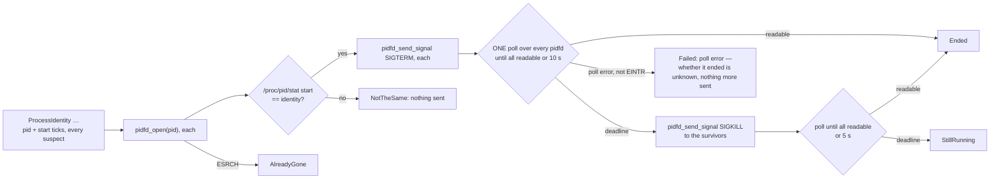

The pidfd pins the process before its start is compared, so the pid can never be reused between the check and the
signal. Since 2026-10-03 the suspects share ONE grace (gate finding #9: three that ignore SIGTERM take 10 s, not 30 s; a
cancellation is seen within a 200 ms slice and every pin is closed), and a `poll` that fails with anything but `EINTR` is
a FAILURE, never an end (independent review): the native calls sit behind `IPidfdCalls` (`LibcPidfdCalls`, the only
implementation the product builds) and the waits on a `TimeProvider`, so both are tested on any platform.
`PidfdProcessSignals` (glibc's `pidfd_open` / `pidfd_send_signal` / `poll`, by the soname `libc.so.6`) is wired
by the CLI only inside the distro and never under `WSL_CARE_ROOT` (a fixture's pids are not this machine's:
`RefusingProcessSignals.Sandboxed`); a context nobody wired refuses (`NotWired`). An architecture test keeps every
signalling call (`"pidfd_send_signal"`, `"kill"`, `"tgkill"`, …) in that one file, with a companion that still finds the
seam's own calls.

### A12 — "not referenced by any project" is Playwright's own rule

Every project that ran `playwright install` left a file in `~/.cache/ms-playwright/.links/` naming its `playwright-core`
folder (seen on this machine on 2026-10-02: four links, one into a `/tmp` scratch folder that no longer exists); that
folder's `browsers.json` names the revisions it uses, and a browser's folder is `<name, '-' as '_'>-<revision>`. A link
whose package is gone references nothing (Playwright drops it too). No link, an unreadable link, a package without a
readable `browsers.json`, a running install (`__dirlock`), an unreadable process table — each refuses the Playwright part
whole; a folder a running process names is kept.

### The target user's home (plan §15c #2, closed here)

`TargetHome.Resolve` (in `Actions/TargetUser.cs`), called by `CliHost.ForThisMachine` when the process is root (real or
claimed in a sandbox): the target user found → `LinuxHostPaths.WithHome(<their home>)` — `Home`, the user configuration
layer (`~/.config/wsl-care/config.json`, never root's `XDG_CONFIG_HOME`) and the user's state folder follow it, the
replaced home stays protected; so the daily folder walk (A8 / A9's rows), the caches of A8 / A12 / A14 / A17 and the
user layer are the TARGET user's. Ambiguous → `HomeOwner.Unknown`: the run reads the embedded defaults and the machine
layer only (`HomeOwner.UserLayerSkipped` names why; `CliHost.LoadConfig`) — machine-scoped actions run, the engine's
target-user gate refuses every user-scoped one (§15c #2, gate finding #2; until 2026-10-03 the user layer was loaded as
unreadable and the whole run went observe-only). The residual: a machine-scoped `auto` switch a user turned off in their
OWN layer is not seen until `/etc/wsl.conf` names the user.
None (no login account, or no `/etc/passwd` at all — now `None`, it was `Ambiguous`) → `$HOME`, there is no user layer to
miss. `config set` / `reset` refuse to run as root for the target user (a root-owned file in their home would lock them
out of it).

### The CLI: the panel's mark and A4's shown list

`act … [--manual or --timer] [--volume <name>]... [--only <file>]`: `--manual` records the trigger `manual`, `--timer` the
timer (the timer wins if both are given — more gates, not fewer); `--volume` (repeatable, each a 64-hex anonymous volume name) and
`--only` (a file of such names, one per line, at most 1 MiB and 10 000 names; read as root through
`IFileSystem.ReadRegularFile` — a REGULAR file only, a directory, FIFO, socket or device refused at once and never waited
on (on Linux `open(O_NONBLOCK)` + `statx` of the open descriptor), never more bytes read than the cap whatever the length
claims — validated line by line, a bad line refused BY NUMBER, its content never echoed) need A4 among the actions and
travel as `ActRequest.ShownVolumes`.

### Decisions taken in E3.S2

- **Re-checked = the run's own live preview.** A4 / A5 / A6 / A7 act on the targets of the preview the engine took
  seconds before, in the same call (§15a #0), never on a stored list; Docker itself refuses a volume attached or a
  container started in between (no `-f` anywhere), and labels and ages cannot change the other way.
- **A6's `-a` also takes a dangling image of that age** (A6's target, run first); a keep label on an IMAGE is honoured by
  the prune's filter but not shown by the preview (`system df -v` carries no image labels) — the run can only take fewer.
- **A7's dry run records the row's figure** (all reclaimable entries); what the timer's capped prune would free is the
  row's "above the cap" note.
- **`cargo sweep` is not run**: it deletes projects' `target/` folders and the projects live under `~/git`, under which
  nothing is ever deleted; **Gradle** has no cache command (it prunes itself). Both are named in A17's preview.
- **A17's trigger** is one cache above 5 GiB (npm's default) — no measurement of these caches exists here yet; auto is off.
- **A8 / A9's previews are their rows** (the daily walk's sample): before the first full run they are unavailable and the
  action is refused with that reason; the RUN measures live.
- **A14's trigger** fires on any target (more than 2 builds of an editor, or an obsolete extension).

## The memory, build-server, trim and clock actions, the timer pass, `logs` / `runs` (E3.S3)

Five more `ICleanupAction`s in `ActionRegistry.Product` — every action of plan §5 but A13 (the archive, E9) is now built —
and the two contract additions they needed, both defaulting to the safe answer: `ActionContext.RanEarlier` (whether an
earlier action of THIS run ran; nothing by default) and `ActionPreview.Urgent` (an EVENT that does not wait for idle;
empty by default — the engine's idle gate is skipped for it, every other gate still applies).

| Folder (`WslCare.Core/Actions/…`) | Action | Runs | Trigger (timer) | Idle | Measured |
|---|---|---|---|---|---|
| `Memory/CacheDrop` | A1 | `sync`, then `sysctl -w vm.drop_caches=1` (two argv, the value a LITERAL; `sync` failing stops before the drop) | `MemAvailable` < `thresholds.memAvailableActPercent`, or page cache > 12 GiB with < 30 % available (plan §4.1) | timer only | page cache and `MemAvailable` before / after (`/proc/meminfo`); memory, so `freedBytes` unknown |
| `Memory/Compaction` | A2 | `sysctl -w vm.compact_memory=1` | A1 ran in this run, or the EVENT: no free order-7 block in zone Normal, or a `page allocation failure` in the kernel log since the last run (`journalctl --dmesg --grep`) | timer only — the EVENT is `Urgent` and runs at once | free order-7 blocks before / after (`/proc/buddyinfo`) |
| `BuildServers/BuildServerShutdown` | A3 | `runuser -u <user> -- dotnet build-server shutdown` | one of the target user's `dotnet-build-servers` processes alive ≥ `buildServers.idleHours` | never | the servers gone after (each with the memory it held); the rest `notRemoved` |
| `Disk/FilesystemTrim` | A15 | `fstrim -av` | weekly (the history's newest A15 `ran`), only without `discard` on `/` and with `fstrim.timer` not enabled (`systemctl show`) | always | fstrim's own per-filesystem report; trimmed blocks go to the VHDX, `freedBytes` unknown; exit 64 a success with a note |
| `Clock/ClockFix` | A16 | `chronyc makestep` when `chronyd` runs, else `hwclock -s` | a drift on two observations ≥ 5 min apart (the last full run's and a LIVE probe; `ThresholdRules.IsDrift`, the one rule the health report shares) not yet corrected | never | the offset before / after (a second probe) |

**Refusals and skips.** A3 REFUSES while any `dotnet build|test|run|publish|pack|msbuild|watch` is alive — a button too —
and re-reads the process table just before the command (a build that started since stops it, nothing asked); no `dotnet`
in the target user's bin folders, or no server, is a skip. A16 skips a clock timesyncd / chrony reports synchronised
(§15 #10) and a live observation within the limit; a correction less than an hour ago REFUSES (a button too); the timer
fires once per drift EVENT: `{state}/clock-fix.json` records the correction, and the event lasts until a full run records
an observation within the limit after it — a step that did not cure the drift is not repeated every run. A1 / A2 / A15
with an unreadable `/proc` are unavailable (refused), never zero.

**Where A2's event comes from.** Every run that previews A2 looks — the timer pass inside `collect` (every 4 h), a button,
and `act A2` started by any timer. There is no watcher process: E4.S1's units may schedule `act A2` more often, and the
event is then acted on within that period.

### The timer pass — the exact order of a timer's full run

`collect --timer` (as the timer unit starts it) runs the engine AFTER measuring, under the lock it already holds, for every
action this build holds; a `collect` from a terminal or the panel's *Run full check now* never acts, and a button's `act`
stays a separate run with its own record. EVERY full run — whatever started it — sweeps a dead run's `running.json` in its
housekeeping (gate finding #8) and holds its own `running.json` (`collect`, pid, start, heartbeat) from the moment it holds
the lock, removed in a `finally` (gate finding #11: *Run full check now* survives a window reload); another run's live,
wedged or unreadable file is left alone and named in the detail's `housekeeping.running`.

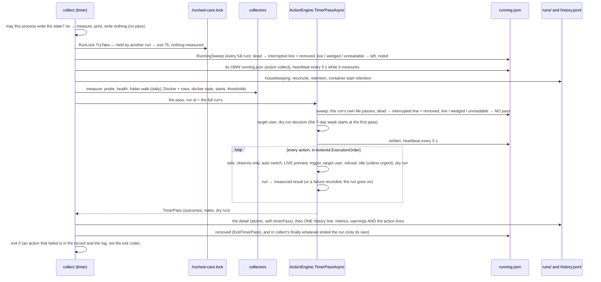

The run's `dryRun` is the pass's decision; the detail keeps every outcome with its live preview and measured result
(`RunDetail.timerPass`), the history line the per-action `{id, status, count, freedBytes, wouldFreeBytes}`
(`ActionRecords.Of`, shared with `act`). `CollectContext` gained `Actions`, `Processes` and `Signals` (no action, a table
that can tell no pid, a refusing sender by default); the CLI sets them from its host.

### `logs` and `runs` (plan §7.4)

`WslCare.Core/History`: `LogPeriod` (`today` — the default — `yesterday`, `yyyy-MM-dd`, `yyyy-MM-dd..yyyy-MM-dd`, at most 366
days; a run belongs to the UTC day it STARTED), `RunLogs` (pure over `IFileSystem`: no lock, nothing written, any user may
ask — the state is 0644) and the wire shapes (`LogsReports`). `runs` lists every run of the period: trigger, outcome, dry
run, detail state (`present` / `lost` / `none`), per-action lines, freed, would-free, and whether it was a cleanup (an
action ran and removed or freed something). `logs` answers the Logs page: freed in total and per action (runs, objects,
bytes; dry runs and what they would have freed apart), the runs with and without a cleanup, dry, by trigger, failed and
interrupted, the run that freed the most and the least (non-zero), each metric's max and min with its time and run
(`memAvailablePercent`, `memAvailableBytes`, `pageCacheBytes`, `swapUsedBytes`, `rootUsedPercent`,
`dockerReclaimableBytes`, `containerStarts24h` — absent when never recorded), and every cleanup in detail: the objects it
removed and those it did not, from the run's detail (an `act` detail's actions or a full run's `timerPass`; a lost
detail still counts from its history line, with no objects). `--action <A#>` narrows the totals, the cleanups and the run
counts to one action. Exit codes: 0 answered, 2 a period that is none of the shapes, 4 a history that exists but cannot
be read (new: `ExitCode.RecordsUnreadable`).

Since 2026-10-03: the totals, counts, extremes and metrics come from the history lines ALONE — no detail file is opened
for them (gate finding #10); the objects each cleanup removed are read from the run details only with `--detail` or one
`--action`, and from at most the newest `RunLogs.MaxDetailsRead` (50) runs (`detailsRead` / `detailsNotRead`; an unread
cleanup's state is `notRead`). A FAILED action's measured deletions count wherever a successful one's do (A4 removing 386
of 387 volumes removed 386), and its failure — on the history line since 2026-10-03 (`ActionRecord.failure`, ≤ 300
characters) — is shown beside its figures; `ActionTotal.failed` counts the runs it failed in. Readers of the line files
(`history.jsonl`, the container-start days) ignore a trailing line without its newline — a write in progress — and the
next append first ends such torn remains (`LineFiles`, gate finding #6).

### Decisions taken in E3.S3

- **Memory actions free no disk.** A1, A2, A3 (and A11) leave `freedBytes` unknown; their before / after and notes say what
  moved, and their previews count no bytes (the item carries the memory) so a dry run's would-free stays disk. `logs` sums
  disk only — A1's history line counts one operation, freed 0. A11's preview counted the memory its suspects hold as
  preview bytes until the code round (gate finding #4): it is the `heldMemoryBytes` fact now, never bytes.
- **A15 waits for `fstrim.timer`.** An enabled `fstrim.timer` already trims weekly, so the timer's A15 does not double it
  (the plan's row names only `discard`); an unread timer state does not fire either.
- **A16's two observations** are the last recorded full run's and the preview's live probe; inside the timer pass the
  full run's own observation is not recorded yet, so it is never counted twice.
- **`sync` is a bare name** resolved on `PATH` like every tool (the plan writes `/bin/sync`; the catalogue takes bare names
  only, and on Ubuntu `/bin` is `/usr/bin`).
- **`ReadCommandTemplates.SystemctlShow` / `JournalSearch`** became named members so A15 and A2 declare the SAME template
  instances the collectors use; `HealthCollector.MeasureWindowsClockAsync` is the one clock observation (the full run's
  and A16's); `ThresholdRules.IsDrift` the one drift rule.

## E3 review fixes (2026-10-03)

The epic's gate code round (session `a90e342d`) and an independent code review, every finding accepted but the gate's #5
(`pidfd_send_signal` is exported by glibc 2.39 as `pidfd_send_signal@@GLIBC_2.36` — verified). Each landed with a test that
was first seen failing for the real symptom ([module_tests.md](module_tests.md) records the red messages).

| Finding | What changed | Where |
|---|---|---|
| review 1 | A4 selects an ANONYMOUS volume only: Docker's `com.docker.volume.anonymous` label AND a 64-hex name; a hex name without the label (named to Docker 23+) and a volume missing from `system df -v` are never selected; the same rule for the first sightings, the kept list and A5's "goes with the container" | `Docker/DockerInventory` (`AnonymousVolumes`), `Preview/CleanupTargets`, `DockerCollector`, `VolumeRemoval` |
| review 2 | a failed action's measured deletions count in `logs` / `runs`, its failure beside them | `History/RunLogs`, `ActionRecord.failure` |
| review 3 | A5 counts a volume two removed containers share once | `ContainerRemoval` (one item per distinct volume, keyed by every holder) |
| review 4 | A3 refuses when the process table cannot be read again just before the command | `BuildServerShutdown` |
| review 5 | `--only` is read as a regular file only, never past the cap | `Files/RegularFiles`, `IFileSystem.ReadRegularFile` |
| review 6 | a `poll` error is a failure, never an end | `Processes/ProcessSignals` (`IPidfdCalls`) |
| review 7 | every method written in E3 at cyclomatic complexity ≤ 4 (C# doctrine §6), without a change of behaviour: conditions extracted into named predicates, chains of one-fact tests written as `Checks.All(value, tests…)` (asked in order, stopping at the first that fails), the per-outcome log line ONE `Cli/Logging/OutcomeLog` (`act` and the timer pass), the folder deletion of A12 / A14 ONE `CacheFolders.RemoveFolder` + `FolderRemovals` | across `Actions/`, `Processes/Policy/`, `History/`, `Cli/` |
| gate #0/#1 | this file's overview, verbs and actions nodes | here |
| gate #2 | an ambiguous target user refuses user-scoped actions only | `TargetHome`, `ConfigLoader`, `CliHost.LoadConfig` |
| gate #3 | an action's runner also runs the collectors' shared read templates | `ActionCommands.AsRunner` |
| gate #4 | A11's preview counts no bytes | `SuspectTermination` (`heldMemoryBytes`) |
| gate #6 | line-file readers ignore an unfinished last line; the next append ends torn remains | `Files/LineFiles`, `PhysicalFileSystem.AppendLine` |
| gate #7 | `running.json` read again before a verdict; unreadable is its own state | `RunningState` (`RunningReadRetry`, `Unreadable`), exit 79 |
| gate #8 | every full run sweeps a dead `running.json` | `RunningSweep`, `CollectRun` |
| gate #9 | A11's suspects share one grace | `PidfdProcessSignals.TerminateAllAsync` |
| gate #10 | `logs` totals from history lines alone; details only when asked, bounded | `RunLogs`, `logs --detail` |
| gate #11 | `collect` holds its own `running.json` | `CollectRun` |

## The installer and the units (E4.S1)

`install.sh` (repository root, POSIX `sh`, `set -eu`, no `eval`, shellcheck-clean) is the install trust boundary:
`curl … | sudo sh` runs it as root on the owner's distro. It installs what a release archive carries —
`wsl-care-$VERSION-$RID.tar.gz` holding `wsl-care-$VERSION-$RID/` with `wsl-care`, `systemd/` (the three units of
`src_daemon/systemd/`) and `config/machine.json` (`src_daemon/config/machine.json`) — the layout E4.S2's release job
packs (plan §15e #1).

```mermaid
flowchart TD
    args["arguments<br/>--version · --skip-attestation · --set-default-user · --dry-run · --uninstall [--purge]<br/>each value checked against a whole-string pattern"]
    pre["preflight — nothing written yet<br/>Linux · root (or --dry-run) · systemd booted (/run/systemd/system)<br/>arch → linux-x64 / linux-arm64 · tools<br/>/usr/local/bin/wsl-care absent or ours · wsl.conf decision"]
    ghpre{"gh ≥ 2.56.0 with attestation verify<br/>--bundle · --cert-identity · --deny-self-hosted-runners<br/>(unless --skip-attestation; asked BEFORE any download)"}
    rel["release: --version, or the newest daemon-v* of the releases API<br/>(never releases/latest — the extension's)"]
    dl["download archive + .sha256 into a mktemp folder (trap removes it)<br/>curl https-only, redirects too, --max-time"]
    sum{"sha256 of the archive<br/>= the .sha256?"}
    fetchatt["root fetches the attestations itself, unauthenticated:<br/>GET /repos/R/attestations/sha256:digest → each bundle_url<br/>→ the snappy bundle → unsnappy (od + awk)"]
    att{"as root, gh isolated in the temp folder, no token:<br/>gh attestation verify --bundle · --repo<br/>--cert-identity release.yml@refs/tags/daemon-vVERSION<br/>--deny-self-hosted-runners — any ONE bundle passes"}
    skip["--skip-attestation:<br/>ATTESTATION NOT VERIFIED, on stderr"]
    unp{"members: regular files and folders,<br/>all under wsl-care-V-RID/, no '..', no link"}
    files["/opt/wsl-care/bin/wsl-care 0755 · link /usr/local/bin/wsl-care<br/>3 units → /etc/systemd/system 0644<br/>/etc/wsl-care/config.json ONLY if absent<br/>/var/lib/wsl-care · /var/log/wsl-care 0755"]
    conf["/etc/wsl.conf: [user] default= ONLY with the flag and only when none is set<br/>otherwise advice, nothing written"]
    pkgs["sysstat + atop via apt when missing<br/>debconf sysstat/enable=true; dpkg-reconfigure when still off"]
    units["systemctl daemon-reload · try-restart follower (upgrade)<br/>enable --now wsl-care.timer wsl-care-events.service<br/>enable --now sysstat.service atop.service"]
    first["/opt/wsl-care/bin/wsl-care collect<br/>(one full run: records, never acts)"]
    ver["verify: sar · atop on PATH → is-active timer · events<br/>→ doctor --json healthy (bounded wait)"]
    fail["exit 1: FAILED at step #quot;…#quot;<br/>+ how to re-run or --uninstall once something was written"]
    ok["summary"]

    args --> pre --> ghpre
    ghpre -- "missing / too old / a flag missing" --> fail
    ghpre -- usable --> rel --> dl --> sum
    sum -- no --> fail
    sum -- yes --> fetchatt --> att
    sum -- "yes, --skip-attestation" --> skip --> unp
    att -- refused --> fail
    att -- verified --> unp
    unp -- no --> fail
    unp -- yes --> files --> conf --> pkgs --> units --> first --> ver
    ver -- "a check fails" --> fail
    ver -- all hold --> ok
```

**What each check proves.** The `.sha256` is integrity only — whoever can replace the archive can replace its checksum
beside it. Authenticity is the build-provenance attestation, pinned to the EXACT certificate identity
`https://github.com/oleksandrdubyna88/wsl_care/.github/workflows/release.yml@refs/tags/daemon-v<version>`
(`--cert-identity`) with `--repo oleksandrdubyna88/wsl_care` and `--deny-self-hosted-runners`. E4.S1 used
`--signer-workflow …/release.yml`, which gh matches as a literal PREFIX of the identity, so `release.yml` built from any
branch passed (independent review HIGH, 2026-10-03; measured on gh 2.97.0 with cli/cli's own attestation:
`--signer-workflow …/deploy` accepted `…/deployment.yml@refs/heads/trunk`).

**How it is verified — root, a bundle, no login** (review LOW, the better design taken). E4.S1 ran `gh` online as
`SUDO_USER` through `runuser`, so that user's gh login, configuration and Sigstore cache decided the verdict. Now root
asks GitHub's attestation API for the archive's digest **unauthenticated** (`Accept: application/vnd.github+json`,
`X-GitHub-Api-Version: 2026-03-10`); the API answers every attestation by `bundle_url` alone (`bundle: null`, observed
for every probe on 2026-10-03), a blob of snappy-compressed JSON (`application/x-snappy`), which the installer fetches
(≤ 1 MiB, ≤ 10 bundles) and decompresses itself — `unsnappy`, awk over `od`, `LC_ALL=C` so mawk and gawk both write
each value as one byte (a real bundle carries bytes above 127). Then root runs `gh attestation verify <archive>
--bundle <file> …` with `HOME`, `GH_CONFIG_DIR`, `XDG_{CONFIG,CACHE,DATA,STATE}_HOME` inside the run's temporary folder
and every token variable unset: **measured, a `--bundle` verification needs no login** (gh 2.56.0–2.97.0, empty
configuration, no token); gh still fetches Sigstore's trusted root by TUF from `tuf-repo-cdn.sigstore.dev`, unauthenticated
(with the network cut it hangs until the 180 s ceiling — a refusal, never a pass). Each bundle is verified on its own
and any ONE passing suffices (gh before 2.65 stops at the first bundle in a set that fails — GitHub's own immutable-release
attestation sits beside a build attestation for some artifacts).

**Which gh** (review MEDIUM, corrected by measurement). The review assumed `gh attestation` (2.49.0+) suffices; bisected
over gh's releases on 2026-10-03, **2.56.0** is the oldest that verifies a public-good attestation today — 2.49.0 to
2.55.0 fail with `unsupported tlog public key type: PKIX_ED25519` (Sigstore's trusted root now carries a Rekor v2
Ed25519 key), and Ubuntu 24.04's own gh is 2.45.0 (no `gh attestation`). The preflight asks BOTH the version (≥
2.56.0) and `gh attestation verify --help` for the four flags, BEFORE any download, and points at GitHub's apt
repository (`cli.github.com/packages`) — never `apt-get install gh`, never a login. `--skip-attestation` proceeds with
a banner on stderr and the checksum still applies.

**Every step that writes goes through `run`**, which under `--dry-run` only prints `would run: …`; the dry run still
downloads and verifies into its temporary folder, needs no root, and changes nothing else. A failed step exits 1 naming
it (`preflight`, `resolve-release`, `download`, `checksum`, `attestation`, `unpack`, `install-binary`, `install-units`,
`machine-config`, `wsl-conf`, `packages`, `enable-units`, `first-run`, `verify: …`); a usage refusal exits 2.
`apt-get install` has no kill ceiling on purpose (a dpkg killed mid-configure breaks the package database) — its waits
are bounded by `DPkg::Lock::Timeout=300`; every other wait has one (`curl --max-time`, `timeout` around `gh`, `apt-get
update`, `collect` and `doctor`).

**Uninstall** stops and disables the timer and the follower, stops a running full run, removes the three units, the
binary, the link (only when it is the installer's) and the emptied `/opt/wsl-care`, and verifies the timer inactive and
the files gone. It keeps `/var/lib/wsl-care`, `/var/log/wsl-care` and `/etc/wsl-care`; `--purge` names and removes
exactly those and `/run/wsl-care.lock`. It never removes sysstat, atop, `/etc/wsl.conf` or a user's own layer.

**The units** (`src_daemon/systemd/`, all root):

| Unit | Shape | Why |
|---|---|---|
| `wsl-care.service` | `Type=oneshot`, `ExecStart=/opt/wsl-care/bin/wsl-care collect --timer`, `Nice=19`, `IOSchedulingClass=idle`, `MemoryMax=1G`, `TimeoutStartSec=10min`, `SuccessExitStatus=75`, `NoNewPrivileges=yes`; no `[Install]` | `--timer` is the only thing that makes a run the timer (§15d CI). 75 is `ExitCode.Busy`: a second run meeting the lock is designed, not a failed unit (the health collector counts failed units). `MemoryMax` is the cgroup's, so it covers every child — npm, dotnet, pip, the Docker CLI, the 2M-entry walk — and §8's 256M (a guess for the binary alone) was raised to 1G by the E4 review |
| `wsl-care.timer` | `OnCalendar=*-*-* 00/4:00:00`, `Persistent=true`, `RandomizedDelaySec=5min`, `AccuracySec=1min` | Persistent= acts on calendar timers only; the stored last trigger makes the first boot of the day run ONCE for the night's missed slots — the case §8's monotonic timer was chosen for |
| `wsl-care-events.service` | `Type=simple`, `ExecStart=/opt/wsl-care/bin/wsl-care events follow`, `Restart=always`, `RestartSec=30`, `NoNewPrivileges=yes`, `WantedBy=multi-user.target` | the follower waits for Docker in-process (§15b #8); the restart is the outer net |

**Hardening, decided per action.** Deliberately NOT set, because each breaks a named action: `ProtectHome` (A8, A12,
A14, A17 clean caches under the target user's home), `ProtectSystem=strict` (state, A9's `/var/cache/apt`, A10's
journal), `ProtectKernelTunables` (A1, A2 write `/proc/sys/vm`), `ProtectClock` (A16's `hwclock -s`), `PrivateDevices`
(A15's `fstrim`), `ProtectProc` / `PrivateUsers` / `PrivateTmp` (A11 and the collectors read every user's processes and
signal them by pidfd), a `CapabilityBoundingSet` (the set the actions need is nearly all of root's). Set: only what no
action relies on — `NoNewPrivileges=yes` (the run already is root; `runuser` only drops privilege; `sudo` is on the
never-list) and §8's resource limits. **One known risk is kept on purpose:** no_new_privs also blocks the AppArmor profile
change a snap application makes at start, so a Docker installed as a snap would fail under the timer (Docker figures
unavailable, A4–A7 refused) while working from a terminal; Docker Desktop's CLI and apt's docker-ce are not snaps. The
README says what to do, `POST_DEPLOY.md` #11 checks the journal for it (and for an OOM kill at `MemoryMax`). None of it
has been OBSERVED on a live systemd yet (E4's live install): it is a request to systemd until then, and the unit files
say so. `ShippedFilesTests` keeps the breaking directives out; CI's
`systemd-analyze verify` step reads the units with systemd's own parser.

**The machine layer is deliberately empty** (`src_daemon/config/machine.json`: comments and `{}`), not a copy of the
embedded defaults: a copy would freeze every default at the installed version, show every key as `(machine)` in `config
get`, and — the moment a later release renames a key — make the layer invalid and every run observe-only. Its comment
documents an example that `ShippedFilesTests` runs through the real loader.

**The test harness** is `InstallWorld` / `InstallFlows` in `WslCare.Scenarios` (C#, the product's language, no new
dependency): the real script under `/bin/sh` over a temporary prefix `WSL_CARE_INSTALL_ROOT` (every path the script
reads or writes as a file sits under it), `TMPDIR` the world's own, a `PATH` of exactly two folders — the fake tool under
the names of everything that changes the machine or reaches the network (curl, gh, systemctl, apt-get, debconf,
runuser, sudo, plus `id` / `uname` so a test can be root or arm64) and links to an allowlist of real text and file
tools. The fake gained one answer option for it, `OutputFlag` (write the fixture to the file named after `--output`),
and since the E4 review a verifying `gh`: `VerifiesAttestation` makes it ENFORCE the identity flags of the call over a
bundle in Sigstore's own shape (`FakeAttestation`: the certificate's SAN and Fulcio extensions, the statement's digests;
`--cert-identity` exact, `--signer-workflow` a prefix, as measured on the real gh), and `WSL_CARE_FAKE_RECORD_ENV` makes
every call record the named environment variables — so a test proves what the installer's check lets through, and
under whose configuration, rather than the argv it sent. The worlds publish an attestation per release
(`AttestationBundles`: a self-signed certificate with the SAN and extensions, snappy-compressed, served at a bundle URL
named by the API answer), and a captured cli/cli bundle (`src_daemon/tests/fixtures/attestation/`) exercises the
decoder's copy elements.
The released binary is a stub that logs the path it was started as and hands its argv to a fake `wsl-care`, so the
absolute-path rule is observed, not assumed. [module_tests.md](module_tests.md) lists every flow and its red run.

## The release pipeline (E4.S2)

A daemon release is the tag `daemon-v<version>` plus a GitHub release holding, per RID, an archive, its `.sha256`, and a
build-provenance attestation of the archive signed by `.github/workflows/release.yml` — the three things `install.sh`
checks. Nothing has been released yet: the first cut, `daemon-v0.1.0`, is the owner's step after the settings of
`docs/repo-settings.md` (the App, its secrets, the two rulesets) are in place.

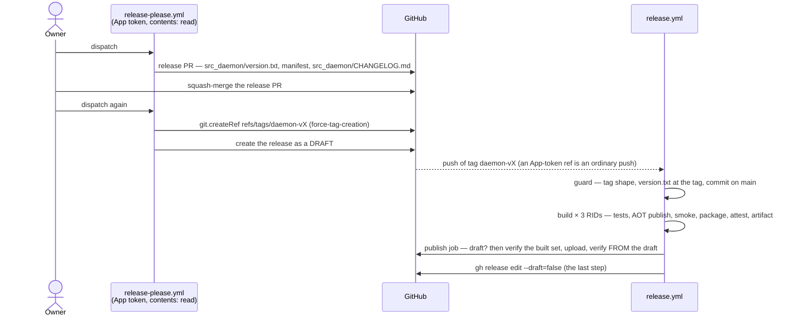

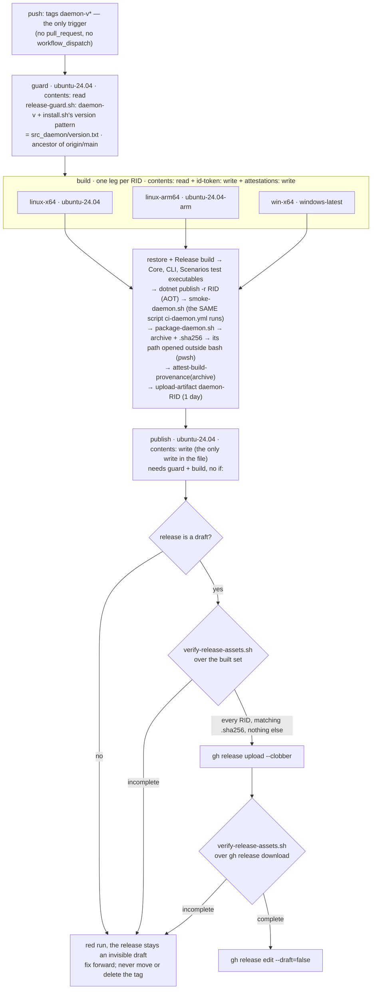

**Why the tag push is the trigger.** With `draft: true` + `force-tag-creation: true` release-please (holding the App's
token) creates the tag ref through `git.createRef` before it creates the draft release — read in its bundled source
(`release-please-action` v5.0.0, `dist/index.js`). That ref creation is an ordinary tag push, so `push: tags` fires —
the event the family's `bugs-v0.3.0` ran on. `release: published` never fires for a draft, and the draft is the point
(nothing public until every RID's asset is on it, plan §15e #2); `workflow_dispatch` carries no tag, so its attestation would not
carry the identity `install.sh` pins (`release.yml@refs/tags/daemon-v<version>`). A failed run is re-run, which replays the tag event.

**Permissions** (plan §15e #0): workflow level `contents: read`; the build job alone holds `id-token: write` +
`attestations: write` (it signs) and nothing that writes the repository, so it hands its archive to the run as an
artifact instead of to the draft; the publish job alone holds `contents: write`. `release-please.yml`'s job holds only
`contents: read` — every write there is the App token's.

**The scripts** (`.github/scripts/`, bash): `lib/daemon-assets.sh` is the asset contract in one place — the RIDs
(`DAEMON_RIDS`), the version pattern (equal to `install.sh`'s `VERSION_PATTERN`) and `daemon_archive_name` (tarball for
Linux, zip for Windows, an unknown RID refused rather than mapped). `package-daemon.sh` packs one archive with exactly the
E4.S1 layout (`wsl-care-$V-$RID/` with `wsl-care` 0755, every file of `src_daemon/systemd/` and `config/machine.json`
0644, folders, owner 0:0, sorted names, `gzip -n`; Windows: the exe alone, zipped with 7-Zip) and writes the `.sha256`
line itself (`<hash>  <name>`, so Git Bash's binary-mode `*` can never reach it) and prints the archive's path spelled for
the caller — from `<out-dir>` as given, through `cygpath -m` under Git Bash (E4 review B1). `release-guard.sh` and
`verify-release-assets.sh` are the two refusals the pipeline rests on; the latter takes optional RIDs to check one leg's
pair (`ci-daemon.yml`). `smoke-daemon.sh` is ci-daemon.yml's former smoke steps, now one script both workflows call
(plan §15e #5), six parts since the review added `preview --all --json`. Every one is shellchecked by `ci · workflows`;
`package-daemon.sh` and `verify-release-assets.sh` run on every pull request leg (all three RIDs, the Windows zip
included), and the scenario suite runs the scripts too (`PackageFlows` and `ReleaseScriptFlows` on Linux,
`PackagePathFlows` on every OS — under Git for Windows' bash on Windows, the zip wherever 7-Zip is on `PATH`). The
smoke itself runs in CI, not in the suite.

**What makes a daemon release** is the package path: release-please hands `src_daemon` only the commits touching a file
under `src_daemon/`, so a `.github/`- or root-only commit never reaches it. The former `exclude-paths: [".github"]` was
inert (no exclude path can remove a commit the split never handed over) and was removed by the E4 review;
`ReleaseConfigTests` holds the package-path rule and the key's absence. Before 1.0.0, `bump-minor-pre-major: true` makes
a breaking change a MINOR (release-please's default would jump to 1.0.0) and `bump-patch-for-minor-pre-major: false`
keeps a `feat:` a minor.

**The first version** is 0.1.0 exactly: the manifest says `"src_daemon": "0.0.0"` (release-please backfills a "previous
release" from the manifest only when it is not 0.0.0) and the package sets `initial-version: 0.1.0` (what
`buildNewVersion` returns with no previous release; the `simple` strategy does not override it). After the first release
both files say 0.1.0 and `initial-version` is never read again.

**Owner-applied settings, as files** (GitHub reads none of them; `docs/repo-settings.md` applies them, each with a probe
that must be refused): `.github/rulesets/tags-daemon.json` (target tag, `refs/tags/daemon-v*`, creation + update +
deletion, bypass = the release App alone) and `.github/rulesets/branch-main.json` (the default branch: no deletion, no
force push, linear history, pull requests with resolved conversations, squash or rebase, the six check names a pull
request reports — pinned to the GitHub Actions app, id 15368 — strict, no bypass). Sonar: `sonarcloud.yml` passes every
`key=value` of `.github/sonar.properties` to `dotnet-sonarscanner begin` (pinned 11.3.0, with `dotnet-coverage`
18.11.2 over the three test executables) and skips with a warning when `SONAR_TOKEN` is absent; the settings file is
deliberately NOT a `sonar-project.properties` — the .NET scanner 11.3.0 fails its `end` step when one sits in the folder
`begin` ran in (`SonarProjectPropertiesValidator`, read in its source). CodeRabbit: `.coderabbit.yaml` (ru-RU, chill,
per-path instructions) and `coderabbit-review.yml` (asks for the review once; the App's installation is the owner's).

**Kept equal by tests** (`ReleaseWorkflowTests`, `ReleaseConfigTests`, every OS — the workflows read with a small YAML
subset reader that refuses what it does not understand): the trigger, the permissions per job across every workflow,
`publish` needing `guard` + `build` with no `if:`, the release matrix = `DAEMON_RIDS` = ci-daemon.yml's matrix (same
runner per RID) with Linux on `ubuntu-24.04*`, both workflows calling `smoke-daemon.sh` with no inline copy, the stage
order inside a leg, the publish order, every `uses:` pinned to a 40-hex commit with its version, a ceiling on every job,
`persist-credentials: false` on every checkout, no `${{ }}` inside a `run:`, the release-please tag = the release
trigger = the tag ruleset's pattern, manifest = `version.txt`, and the required checks = the jobs a pull request runs —
the gating workflows DERIVED (every workflow a `pull_request` / `pull_request_target` triggers, minus the two named
non-gating ones, `sonarcloud.yml` and `coderabbit-review.yml`), every workflow declaring `permissions:` at the top or on
every job (a workflow without one would pass the per-job checks vacuously), and every pull-request leg packing the
archive and opening its path outside bash (E4 review B2, B5, B6).

## The verdicts in `status`, `productVersion` and the golden contracts (E5.S0)

The read-only panel of E5 colours its status bar from verdicts, and `status --json` had only figures (plan §15g B1).
E5.S0 adds two members to it, both additive, `schemaVersion` still 1, riding `daemon-v0.1.0`:

- **`verdicts`** — the SAME `Verdict` records and ids a full run writes into its detail (`RunDetail.Thresholds`), in the
  same order, from ONE evaluator. `ThresholdRules.Evaluate` was split, without a behaviour change, into
  `FromSample` (the eight thresholds a fast sample decides: `memory.available`, `.pageCache`, `.inactiveAnon`, `.swap`,
  `.fragmentation`, `.pressure`, `wslconfig.memory`, `disk.root`) and the full-run rest; `UnreadFullRun(config)` evaluates
  the rest over inputs that were NOT read, so a reader takes the ids, the order and the limits in force from the rules
  themselves — no second list of ids exists. `StatusVerdicts.From` (`WslCare.Core/Status`) answers:
  - the sample's eight, evaluated NOW over `status`'s own sample with the effective configuration — a threshold changed in
    a configuration layer moves them at once; `basis: {source: "sample", evaluatedAt: <the sample's instant>,
    ageSeconds: 0}`. The VM-ceiling verdict's level is the memory's; its value says the `.wslconfig` audit is a full run's
    (read through the Windows profile the clock probe prints, a slow process `status` never starts);
  - every other id carried EXACTLY as the newest full run recorded it, with `basis: {source: "fullRun", runId,
    evaluatedAt: <that run's end>, ageSeconds}`; or `unknown` under the limit the configuration puts in force, with the
    reason: no full run yet, a full run whose detail is gone or does not parse, a run that recorded no verdict for that id.
    A carried verdict keeps the limit its run applied (its `limit` says which); a setting changed since reaches it at the
    next full run — status never re-judges a figure it did not read.
  - `FullRunVerdicts.Read` finds the newest FULL run (a `collect` history line — the only kind carrying the slow parts —
    that names its detail; `act` lines and the reconcile's `interrupted` lines are not full runs) and reads ONE file, its
    detail, through a narrow DTO (`RunDetailVerdicts`: the head and `thresholds`), normalising null strings (C# doctrine
    §4a). `status` reads `history.jsonl` once for the slow parts and the verdicts (`LastFullRun.From`).
- **`productVersion`** — the assembly's informational version, `Program.VersionText`, the ONE expression `--version` prints
  too (`0.0.0+<sha>` before the first release). The default JSON encoder writes the `+` as `\u002B`; a reader parses.
- The text form adds one line, `verdicts: 1 critical (memory.fragmentation), 2 warn (…), 12 ok, 8 unknown`.

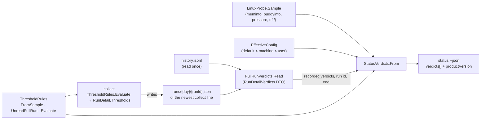

**The compatibility rule** (plan §6, §15g M2) — written before the first public consumer reads these answers:
`schemaVersion` changes only on a BREAKING change (a field removed, renamed, retyped or its meaning changed); an
ADDITIVE field never bumps it. A client ignores keys it does not know and treats every field added after 0.1.0 —
`verdicts` and `productVersion` are the first two — as optional, an absent one reading as "update the daemon to see
this", never as 0 or an error. Refusal is per verb. The extension's client tests replay every golden set present: `head`
now, and `daemon-0.1.0` once it is frozen at the E5 live gate.

**The golden contracts** (`contracts/golden/head/{status,preview,doctor}.json`, plan §15f #10, §15g m7). Written by
`WslCare.Scenarios/GoldenContracts` on the Linux legs: the BUILT CLI over the captured procfs, Docker and health
fixtures, every age limit at 0 (`PreviewFlows.AllAges`, so the rows do not move as the fixtures age), one `collect`
first, then the three verbs. Every value that moves between two runs of one build over one fixture set is replaced by a
fixed value of the same type, through a NAMED, reviewed list — paths (`**.sampledAt`, `**.sampleMilliseconds`,
`**.ageSeconds`, `**.ageSeconds.value`, `**.evaluatedAt`, `**.runId`, `checkedAt`, `productVersion`, `vm.disk.*`,
`slow.windowsClock.offsetSeconds`, `containerStarts.from|to`, `containerStarts.gaps[*].from|to`), objects picked by a key
(`id: disk.root`, `id: journal.history`, `id: clock.drift`, `component: wsl-care`) and run ids quoted inside sentences;
the sandbox root becomes `/golden-root`. A verdict whose figure moves with the clock is fixed to the CONCRETE value it had
at the capture — `journal.history` 0.8 days (the health capture's instant minus the oldest entry), `clock.drift` +0.19 s
(the clock probe's process start minus that instant, so `ok` with the product's own sentence) — never to placeholder
prose a client would render as a figure (E5 code round #1). Part 4 of the list is IDENTITY: `FixtureIdentity.Rules`, the
same rules the captured fixtures were anonymised with, applied to every string after the sandbox root is rewritten —
the sandbox's own home (`/golden-root/home/me`) becomes `/home/user` like any other — so a golden regenerated from a new
capture is anonymised by the code that anonymised the capture; part-4 rules need not match (they guard a future
capture, and `FixturePrivacyTests` proves the files). `productVersion` and doctor's own version become `unknown` — the release number
moves at every release-please bump and a golden pinned to it would turn the release pull request red. `GoldenContractTests`
fails when a checked-in file is not what the CLI answers at that commit (naming the file and the first differing line)
and when a rule no longer matches anything; `WSL_CARE_WRITE_GOLDENS=1` regenerates them. The set frozen at the tag,
`contracts/golden/daemon-0.1.0/`, is an E5 live-gate step, not part of E5.S0. The goldens are test data and never ship.

## The extension: client, runner and fake (E5.S1)

`src_vs_code/` holds the VS Code extension's skeleton: TypeScript (the family's strict set, `noEmitOnError`), built
in place into `out/` for the tests and bundled by esbuild into ONE file, `dist/extension.js` (CommonJS, `--platform=node
--target=node18` — the Node of VS Code 1.85 —, `vscode` external, no source map). No runtime dependency. E5.S1 wires the
client; the status bar and the panel are E5.S2's (next section), *Install daemon* and packaging E5.S3's.

**The process model.** `extensionKind: ["ui"]`: the extension runs in the WINDOWS extension host whether the window is
local or *Remote – WSL*. It reaches the daemon only by starting `%SystemRoot%\System32\wsl.exe` (absolute; `PATH` holds a
second, Store-alias `wsl.exe` on this machine, and a bare name searches the current directory first) with argv built in
one place. The settings `wslCare.distro` (empty = WSL's default, the `*` row of `wsl.exe -l -v`) and
`wslCare.refreshSeconds` (≥ 30, default 120) are `"scope": "application"`: a cloned repository's `.vscode/settings.json`
cannot steer either; the extension declares untrusted- and virtual-workspace support.

**Root-free, by construction and by test (plan §15f #5).** The four verbs are the closed set `VERBS` in
`client/verbs.ts`: `status --json`, `preview --all --json`, `doctor --json`, `--version`. No `-u`, no `act`, no `collect`,
no `config`. `structure.test.ts` parses the shipped sources and holds: only `process/runner.ts` imports `child_process`;
only `client/WslCareClient.ts` spells a `wsl.exe` argv word or the daemon's path; only `verbs.ts` spells the verbs' option
words. `bundleScan.test.ts` parses the SHIPPED bundle and fails on any string carrying `-u`, `--user`, `root`, `--timer`,
`--confirm`, `--manual` or `config` — each with planted-instance companions.

**The seams.**

- **Runner** (`process/runner.ts`) — `{file, args, timeoutMs, env?}` in, a typed ending out (`exited` with the code as a
  signed 32-bit value — Windows reports `wsl.exe`'s -1 as 4294967295 —, `signalled`, `timedOut`, `tooMuchOutput`,
  `failedToStart`); `shell: false`, streams as BYTES, output capped (16 MiB / 1 MiB), the ceiling enforced by
  `child.kill()` and a 2 s grace. Killing `wsl.exe` ends the Linux process through the relay's hang-up (measured; a
  process ignoring SIGHUP survives, reparented to PID 1). `nodeScriptRunner(script)` starts `node <script> <args>` in
  place of the requested file (the strict fake); `closedRunner` starts nothing.
- **Runner selection** (`process/runnerSelection.ts`) — `extension.ts` passes `context.extensionMode ===
  ExtensionMode.Test`. Outside Test mode: the real runner, always (no variable is read). In Test mode: the fake named by
  `WSL_CARE_TEST_FAKE_WSL` (an absolute `.js`), otherwise the CLOSED runner — a test run that forgot the fake spawns
  nothing.
- **Client** (`client/WslCareClient.ts`) — per verb: the platform (`win32` only), the launcher, the configured
  distribution SETTING checked against a strict pattern (`^[A-Za-z0-9][A-Za-z0-9._-]{0,63}$`, never a leading `-`) BEFORE any
  spawn, `--list --quiet` (UTF-16LE), the default from `-l -v` when none is set — a name `wsl.exe` LISTS is taken as it is
  (argv reaches `wsl.exe` without a shell; only a leading `-` is refused, §15h #4) and an unlisted one is refused naming
  the listed names and the pattern —, `--list --running --quiet` — and when the
  distribution is not running (or the question fails) it STOPS: no `-d` call, so polling never starts the VM. Then
  `-d <distro> --cd / --exec /opt/wsl-care/bin/wsl-care <verb>` (`--exec`, never `--`: measured, `--` hands argv to the
  distro's shell). One call per verb in flight (a second caller shares the first's outcome), and the `--version` the
  handshake may need is shared the same way — `preview` and `doctor` asked at once with no version known make ONE
  `--version` call (E5 code round).
- **Reading the ending** (`client/failures.ts`, `client/handshake.ts`, `wsl/*`) — `wsl.exe`'s own output is decoded from
  its bytes (UTF-16LE when a BOM leads or a NUL sits at an odd offset; UTF-8 otherwise, which is what `WSL_UTF8=1` and
  the Linux side produce). `--list --quiet` or `-l -v` failing in any way (a non-zero exit, no answer within 15 s) is a
  WSL failure with `wsl.exe`'s own sentence; the RUNNING check (`--list --running --quiet`) failing reads as NOT
  running — *stopped*, and no `-d` call — never as a WSL failure. For a daemon call: exit -1 → `wsl.exe` refused (its sentence from STDOUT); exit 1 with the measured relay
  signature for OUR path → *not installed* (exit 1 is also the daemon's `RunFailed`, so nothing else reads as not
  installed); a `GLIBC_… not found` line → *unsupported distribution*; 2 → refused, 70 → a daemon defect, 130 →
  interrupted, anything else → unknown — each showing only the daemon's `wsl-care:` lines, colour stripped. Exit 0 →
  the per-verb schema handshake of plan §6: `SUPPORTED_SCHEMA = [1]`; an unknown major blanks THAT verb only ("needs a
  newer extension"); unknown keys ignored; `verdicts` / `productVersion` optional; the daemon version from
  `status.productVersion`, else one cached `--version` per distribution; a released daemon below
  `MIN_DAEMON_FOR_RENDER = 0.1.0` blanks the view, `unknown` and `0.0.0(+sha)` (a build before the first release) render.
  The client's exit-code names are read back from `ExitCode.cs` by a test.
- **Per-verb ceilings** above the daemon's own: `status` / `--version` 20 s (no child process), `doctor` 100 s (four
  `systemctl show` at 15 s + `systemctl --version` 15 s + `docker version` 10 s = 85 s), `preview` 330 s (`docker version`
  10 s + two `system df` at 2 min + the dangling listing 30 s + one `container inspect` batch 30 s = 310 s); the three WSL
  questions 15 s each (measured: ~50 ms).

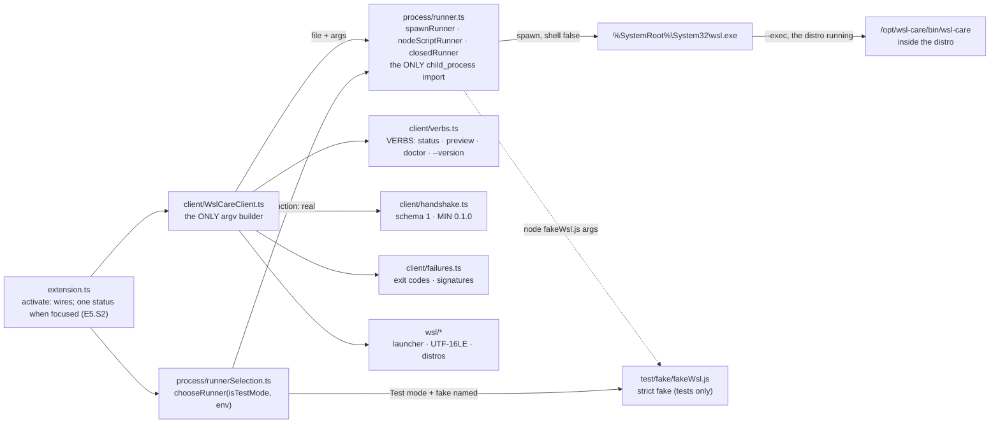

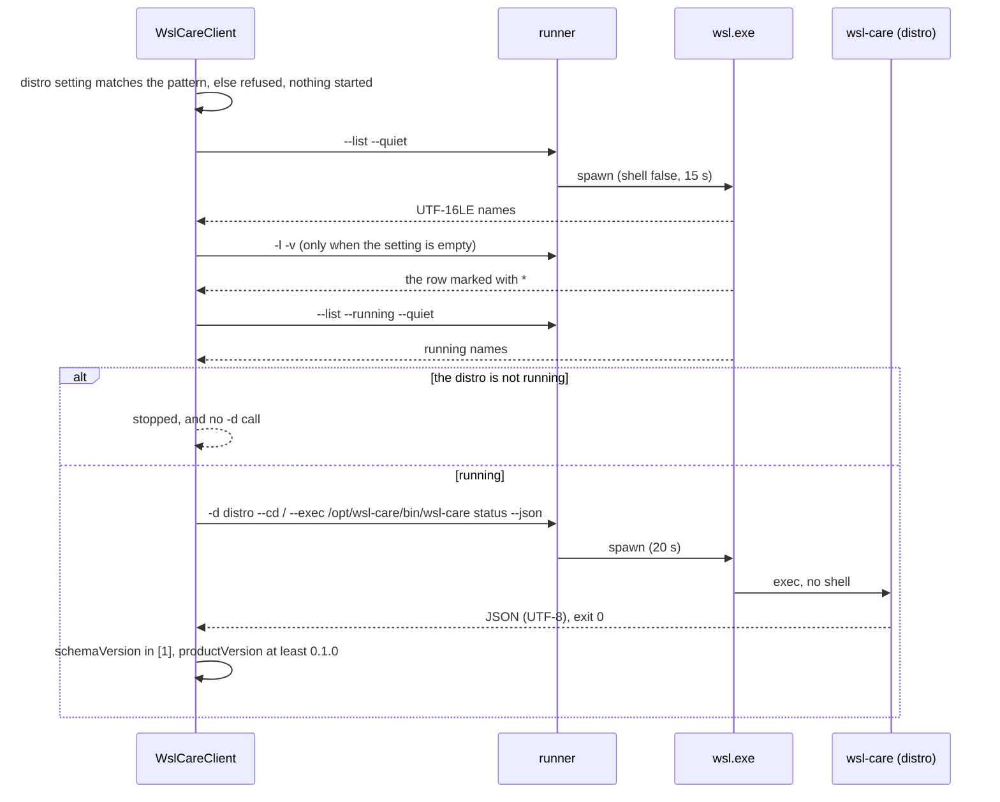

**The strict fake** (`src/test/fake/fakeWsl.ts`, never bundled) answers only the shapes the client may send, in the
measured encodings, and refuses everything else with its own exit codes — `-u`, `--`, any verb outside the four, a `-d`
to a stopped distribution, a start as anything but `…\System32\wsl.exe`. **No test can reach the real `wsl.exe`**: the
test runner loads a tripwire into every test process that throws on any start of `wsl` / `wsl.exe`, and a test asserts it
is armed. Tests, flows and what they do not prove: [module_tests.md](module_tests.md) § *The extension*. The measurements:
[2026-10-03_wsl_exe_facts.md](2026-10-03_wsl_exe_facts.md).

**CI.** `ci-extension.yml` (`ci · extension`), unconditional, on `windows-latest` and `ubuntu-24.04`: setup-node (SHA
pinned, Node 22), `npm ci`, a clean `tsc`, the linter, `npm test`. Its two job contexts are required in
`.github/rulesets/branch-main.json` (`ReleaseConfigTests` derives the gating workflows and holds the list equal). Dependabot
watches `/src_vs_code` weekly, holding `@types/vscode` at 1.85.0 (major and minor ignored), `typescript` on 6.x,
`@types/node` on 18.x.

## The extension: status bar, read-only panel and polling (E5.S2)

E5.S2 hangs the first visible surface on E5.S1's client: a **status-bar item**, a **read-only panel** (a `WebviewView`
in its own activity-bar container "WSL Care"), and the **poller** that decides when the daemon is asked. All three read
ONE store of the newest outcome per verb, so the bar and the panel can never disagree about what the daemon last said.
Still read-only and root-free: the same four verbs, the bundle scan unchanged (it caught the shell's first draft —
`<main id="root">` spells the forbidden word — and the element became `id="panel"`).

| Module | Role |
|---|---|
| `state/outcomeStore.ts` | the newest `status` / `preview` / `doctor` outcome and a "checking" flag; listeners |
| `poll/poller.ts` | WHEN the daemon is asked (below); the only caller of `client.run` |
| `statusBar/statusBarModel.ts` + `statusBar.ts` | the bar as a pure function of the `status` outcome; thin VS Code wiring |
| `panel/fieldMap.ts` | THE field map — every row, its section, verb, JSON path, refresh trigger, or the epic it arrives in |
| `panel/viewModel.ts`, `rowRenderers.ts`, `read.ts`, `jsonPath.ts`, `format.ts` | the view as a pure function of the store's snapshot and the field map |
| `panel/panelHtml.ts`, `messages.ts`, `panelProvider.ts` | the static shell + CSP + webview options, the closed page→host message set, the `WebviewViewProvider` |
| `media/panel.js`, `panel.css`, `wsl-care.svg` | the page script (DOM by `createElement` / `textContent` only), its theme-variable styles, the activity-bar icon |
| `failureText.ts` | the short label and the sentence for every client failure kind, one typed table |
| `testApi.ts` | what `activate` returns in Test mode only — the extension-host scenarios' handles |

**The status bar** — `WSL RAM <used>% · swap <x>G · <n> containers` from `status --json` (`used` = 100 − `availablePercent`),
coloured by the worst RELEVANT verdict (§15g B1): the `memory.*` and `kernel.*` verdicts — what the bar shows, plus the
allocation-failure / OOM alerts — as `statusBarItem.warningBackground` (warn) or `statusBarItem.errorBackground`
(critical), theme colours; `ok` and `unknown` colour nothing, and the clock / systemd / collector warnings of the head
golden leave it uncoloured on purpose. A daemon without `verdicts` → uncoloured, the tooltip says "update the daemon to
see warnings". A figure answered `available: false` is `?`, never 0, with its reason in the tooltip. Failures are their
short state: "WSL stopped" (no call was made into the distribution), "WSL Care: daemon not installed", "… unsupported
distro", "… needs a newer extension", "… Windows + WSL only" (the non-win32 notice — nothing is asked off Windows). A
click opens the panel (`wslCare.openPanel`).

**The panel** renders the field map below. Each row is, in this order: "arrives in E# — why" for a row the four verbs
cannot fill; "checking…" before its verb was asked; its verb's failure label (per verb — an unknown `preview` major
blanks only the `preview` rows, plan §6); "update the daemon to see this" when the answering daemon lacks the path (the
compatibility rule — never 0); "unavailable — <reason>" for an `available: false` figure; otherwise its renderer. Lists
(top processes, families, container stats, folders, cleanup rows, kept volumes, hygiene, checks, versions, verdicts)
render as sub-tables. Slow parts say which full run measured them and how long ago. *Cleanup* is READ-ONLY: no
checkboxes, no buttons ("the cleanup buttons arrive in E6"). The panel's buttons are Refresh, Settings and — only when
the distribution is stopped — **Start WSL and check**.

### The panel's field map (plan §15g B2)

Generated from `src_vs_code/src/panel/fieldMap.ts` — the table the renderer reads — by `npm run fieldmap:doc`;
`fieldMap.test.ts` fails while this block and the code differ, and `viewModel.test.ts` fails when a READ row's path is
absent from the head goldens. *Refresh trigger*: a `status` row is refreshed by every poll of the focused window and on
panel open / Refresh; a `preview` / `doctor` row only on panel open / Refresh.

<!-- field-map:begin (generated from src_vs_code/src/panel/fieldMap.ts by npm run fieldmap:doc) -->
| Section | Row | JSON path | Verb | Refresh trigger | In E5 |
|---|---|---|---|---|---|
| Memory | VM ceiling (MemTotal) | `vm.memory.total` | `status --json` | status poll (focused window) + panel open / Refresh | yes |
| Memory | Available (MemAvailable) | `vm.memory.memAvailable` | `status --json` | status poll (focused window) + panel open / Refresh | yes |
| Memory | Available, share of the ceiling | `vm.memory.availablePercent` | `status --json` | status poll (focused window) + panel open / Refresh | yes |
| Memory | Free | `vm.memory.free` | `status --json` | status poll (focused window) + panel open / Refresh | yes |
| Memory | Page cache | `vm.memory.pageCache` | `status --json` | status poll (focused window) + panel open / Refresh | yes |
| Memory | Inactive anonymous | `vm.memory.inactiveAnon` | `status --json` | status poll (focused window) + panel open / Refresh | yes |
| Memory | Anonymous | `vm.memory.anonPages` | `status --json` | status poll (focused window) + panel open / Refresh | yes |
| Memory | Shared memory (shmem) | `vm.memory.shmem` | `status --json` | status poll (focused window) + panel open / Refresh | yes |
| Memory | Fragmentation | `vm.memory.fragmentation` | `status --json` | status poll (focused window) + panel open / Refresh | yes |
| Memory | Unattributed | `vm.unattributed` | `status --json` | status poll (focused window) + panel open / Refresh | yes |
| Memory | MemAvailable today (sparkline) | — | — | — | arrives in E6 — needs the logs / runs verbs |
| Memory | vmmemWSL | — | — | — | arrives in E7 — read by wsl-care.exe on the Windows side (E7.S3) |
| Memory | Host RAM | — | — | — | arrives in E7 — read by wsl-care.exe on the Windows side (E7.S3) |
| Top holders | Top processes by held memory | `vm.processes.top` | `status --json` | status poll (focused window) + panel open / Refresh | yes |
| Top holders | Process families | `vm.processes.families` | `status --json` | status poll (focused window) + panel open / Refresh | yes |
| Top holders | Containers by memory (docker stats) | `slow.containerStats` | `status --json` | status poll (focused window) + panel open / Refresh | yes |
| Top holders | Processes working under /mnt | `vm.processes.mntWalkers` | `status --json` | status poll (focused window) + panel open / Refresh | yes |
| Swap | Swap used | `vm.memory.swapUsed` | `status --json` | status poll (focused window) + panel open / Refresh | yes |
| Swap | Swap total | `vm.memory.swapTotal` | `status --json` | status poll (focused window) + panel open / Refresh | yes |
| Swap | Swap trend today | — | — | — | arrives in E6 — needs the logs / runs verbs |
| Disk | The distribution's / file system | `vm.disk` | `status --json` | status poll (focused window) + panel open / Refresh | yes |
| Disk | C: free | — | — | — | arrives in E7 — read by wsl-care.exe on the Windows side (E7.S3) |
| Disk | .vhdx sizes | — | — | — | arrives in E11 — read by the Windows collectors (E11) |
| Folders | Big folders (the daily walk) | `folders` | `status --json` | status poll (focused window) + panel open / Refresh | yes |
| Containers | Running now | `vm.containers` | `status --json` | status poll (focused window) + panel open / Refresh | yes |
| Containers | Docker engine | `docker` | `preview --all --json` | panel open / Refresh | yes |
| Containers | Docker totals (docker system df) | `totals` | `preview --all --json` | panel open / Refresh | yes |
| Container starts | Started in the last 24 h | `containerStarts` | `status --json` | status poll (focused window) + panel open / Refresh | yes |
| Cleanup (read-only) | Cleanup candidates | `rows` | `preview --all --json` | panel open / Refresh | yes |
| Cleanup (read-only) | Kept named volumes (never cleaned) | `kept` | `preview --all --json` | panel open / Refresh | yes |
| Cleanup (read-only) | Containers logging without max-size | `hygiene.unboundedLogs` | `preview --all --json` | panel open / Refresh | yes |
| Cleanup (read-only) | Builder garbage collection (daemon.json) | `hygiene.builderGc` | `preview --all --json` | panel open / Refresh | yes |
| Cleanup (read-only) | Forgotten buildx builders | `hygiene.buildkit` | `preview --all --json` | panel open / Refresh | yes |
| Health | Daemon version | `productVersion` | `status --json` | status poll (focused window) + panel open / Refresh | yes |
| Health | Healthy | `healthy` | `doctor --json` | panel open / Refresh | yes |
| Health | Last full run | `checks[id=lastRun]` | `doctor --json` | panel open / Refresh | yes |
| Health | Configuration error | `configError` | `doctor --json` | panel open / Refresh | yes |
| Health | Checks | `checks` | `doctor --json` | panel open / Refresh | yes |
| Health | Versions | `versions` | `doctor --json` | panel open / Refresh | yes |
| Health | Verdicts | `verdicts` | `status --json` | status poll (focused window) + panel open / Refresh | yes |
| Health | Clock jumps | `verdicts[id=clock.jumps]` | `status --json` | status poll (focused window) + panel open / Refresh | yes |
| Health | Journal history | `verdicts[id=journal.history]` | `status --json` | status poll (focused window) + panel open / Refresh | yes |
| Health | Warnings since the last full run | — | — | — | arrives in E6 — needs the logs / runs verbs |
| AI agents | AI agents (both sides, Add CLI path) | — | — | — | arrives in E7 — needs the agents list verb (E7) |
| Last cleanup | Last cleanup (freed, Docker after) | — | — | — | arrives in E6 — needs the logs / runs verbs and the cleanup buttons (E6) |
<!-- field-map:end -->

### Webview rules (§15g M7, m10)

- **A static shell** (`panelShell`): no daemon data in the HTML at all — the data arrives only by `postMessage` as a
  plain view object (strings, numbers, arrays), so there is nothing to escape and the TypeScript doctrine's
  `scriptInterpolation` scan stays green with an EMPTY allowlist.
- **CSP** `default-src 'none'; script-src 'nonce-N'; style-src 'nonce-N'` with a fresh 128-bit nonce per render
  (`crypto.randomBytes`); one script and one stylesheet, both from `media/`, both carrying the nonce; no inline code, no
  inline handler, no inline style. The shell refuses a nonce that is not 32 hex characters and a URI with a quote or
  angle bracket.
- **Options**: `enableScripts: true`, `enableCommandUris: false`, `localResourceRoots: [media/]`.
- **The page builds its DOM with `createElement` / `textContent` / `setAttribute('data-…')` only.** Every daemon string
  is first passed through `safeText` in the host: C0/C1 controls, DEL and the bidi embedding / override / isolate
  characters become a visible U+FFFD (a process name chosen by any distro process cannot re-order what the panel shows),
  and anything past 500 characters is clipped with an ellipsis.
- **A closed message set from the page**, validated EXACTLY in the host (`parsePageMessage`: no extra key, no other
  type): `ready` (send the current view), `rendered {rows}` (how many rows the page drew — what the extension-host
  scenarios read), `refresh`, `openSettings`, `startWsl`. E5.S3 adds `installDaemon`. Nothing from the page becomes
  argv: each message maps to a host action built from the host's own closed verb set.

### The polling policy (§15f #8, §15g M1, m3)

- Only the **focused** window polls (`window.state.focused`): once when it gains focus (and at activation, if
  focused), then every `wslCare.refreshSeconds` (default 120, schema minimum 30; a non-number reads as 120) while it
  keeps focus; losing focus disarms the timer, and a timer that fires just after focus was lost asks nothing.
- A poll asks **`status` only**. `preview` and `doctor` are asked when the panel opens (or becomes visible again) or
  Refresh is pressed — `status` first; when it ends in a target failure (stopped, not installed, unsupported, WSL
  missing / failed, distribution refused) the other two are NOT asked and their rows show the same state.
- Every call goes through the client, which asks `wsl.exe --list --running --quiet` first and makes **no `-d` call**
  when the distribution is not running — so neither a poll nor opening the panel starts the VM. **Start WSL and check**
  (`wslCare.startWsl`, the panel's button) is the one call that may: `status` with `startIfStopped`, which keeps every
  check but lets the `-d` that starts the distribution through, because the user asked for exactly that.
- **The race, stated:** a distribution that stops between the running check and the `-d` call is started again by
  that call; the window is the ~50 ms between two `wsl.exe` starts (each answers in 46–59 ms, measured 2026-10-03).
- **The churn** this costs the daemon (every `status` run opens one run-log file): measured over a simulated day by
  the real poller — 721 runs per fully focused day at 120 s, 241 for an 8-hour focused day, 2 881 at the 30 s floor —
  [2026-10-04_extension_poll_churn.md](2026-10-04_extension_poll_churn.md). Accepting it or recording a logging-rule
  exception is the **owner's open M1 decision**.

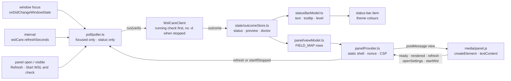

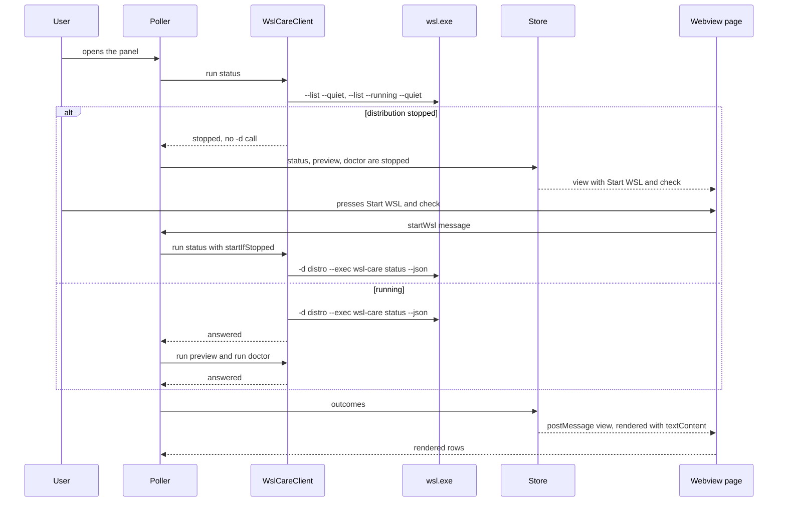

### Tests (details: [module_tests.md](module_tests.md) § *The extension*)

Unit tests over the goldens for the bar, the view model, the field map (held equal to this document), the poller (a
manual clock), the shell / CSP / options and the message set; the page script RUN in a ported `node:vm` harness that is
stricter than a browser (every HTML sink and unmodelled member throws), over every golden set and over hostile process /
container strings; and `@vscode/test-electron` against **1.85.0 and stable** (`npm run test:host`, two launches per
version: with the strict fake, and in Test mode without it — which must start nothing), wired into `ci · extension` on
both legs (xvfb on `ubuntu-24.04`, the downloads cached).

## The extension: Install daemon, packaging and its release (E5.S3)

Three things, none of which runs anything privileged: *Install daemon* TYPES a pinned command for the person; the
universal `.vsix` is checked as an ARTEFACT before it can ship; and `release-extension.yml` publishes it — the GitHub
draft first, the Marketplace second, public last — behind a guard that refuses until the minimum daemon is out and was
seen working. Nothing is released yet (the publisher, the Environment and the tag ruleset are the E5 live gate's,
`docs/repo-settings.md` steps 9–11).

### *Install daemon* (plan §15g m2, §15f #5)

- **One module builds the command** (`install/installCommand.ts`): `curl -fsSL
  https://raw.githubusercontent.com/oleksandrdubyna88/wsl_care/refs/tags/daemon-v<MIN>/install.sh | sudo sh -s -- --version <MIN>`,
  `MIN` = the compiled `MIN_DAEMON_FOR_RENDER` (0.1.0), checked `x.y.z` when the module loads; never `--skip-attestation`,
  never `main`, no argument at all. The ref is spelt in full, `refs/tags/…`, so no branch of that name can be served
  instead (observed 2026-10-04: raw.githubusercontent.com answers 200 for an existing tag in that form, 404 for a missing
  one). If the installer then stops for want of `gh`, its last-resort `--skip-attestation` line repeats the SAME ref and
  version (`install.sh`'s `rerun_command`), never main's installer. The prerequisites are TEXT (systemd, Ubuntu 24.04 / glibc 2.39, `gh` 2.56.0+, `sudo`):
  `gh --version` is outside the four verbs, and the installer checks each one itself before it changes anything.
- **The flow** (`install/installDaemon.ts`, collaborators injected): the client's `terminalTarget()` validates the
  distribution — the setting's pattern before any spawn, then `wsl.exe --list` (no VM start) — and refuses before anything
  opens; a MODAL (`showWarningMessage({ modal: true })`) shows the command and the prerequisites; on its one confirm button
  ONE terminal `createTerminal({ shellPath: %SystemRoot%\System32\wsl.exe, shellArgs: ['-d', <distro>, '--cd', '~'] })` —
  the user's home, not the Windows folder VS Code was started from (observed: `--cd ~` lands in `/home/<user>`) — and
  `sendText(command, false)` — typed, not run. `terminalTarget` lives in the client so it stays the only module that
  spells a `wsl.exe` argument.
- **Its surfaces** — the command `wslCare.installDaemon` and the panel's first button when `status` answers *daemon not
  installed*; the page sends the BARE message `installDaemon` (any extra key is dropped), so nothing from the page reaches
  the text. In Test mode the modal and the terminal are RECORDERS (`install/installUi.ts`, chosen like the runner, by the
  extension mode alone): a real terminal would start the real `wsl.exe`, and a pseudo-terminal is outside the tripwire.
- **Held by structure** — only `installCommand.ts` spells the installer, its URL or `sudo`; the install modules import
  neither the runner nor `child_process`; only `installUi.ts` touches `createTerminal`; in the BUNDLE, `sudo` appears only
  in the command's template part and its prerequisite line, and the forbidden set (`-u`, `--user`, `root`, `--timer`,
  `--confirm`, `--manual`, `config`) needed no exception.

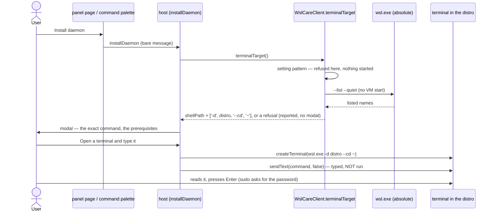

### The package and its leak checks (plan §15g M8, §15f #6 / #13)

- **One universal `.vsix`** (`npm run package` = `vsce package --no-dependencies`, `@vscode/vsce` 4.0.0 pinned):
  `vscode:prepublish` runs `scripts/bundle.mjs` — esbuild's API with the CLI's old options (CommonJS, node18, `vscode`
  external, no source map) plus a **build stamp**: `WSL_CARE_BUILD_STAMP` := `"wsl-care-build <package.json version>"`
  (`src/buildStamp.ts`; the test API reads it back in the extension host). It also EMITS `dist/min-daemon.json` —
  `{ "minDaemonForRender": "<x.y.z>" }` — read by RUNNING `src/client/handshake.ts` (esbuild's transform in a bounded
  `node:vm`), never matched as text; the checked-in `src_vs_code/min-daemon.json` is the copy the release guard reads at
  the tag with a JSON parser (E5 code round #2/#5), held equal to the constant by `minDaemon.test.ts` on every pull request.
- **`.vscodeignore` is an ALLOWLIST** (`**`, then `package.json`, `README.md`, `CHANGELOG.md`, `LICENSE`,
  `dist/extension.js`, `media/**`). `vsix-files.txt` is what `vsce ls --no-dependencies` must print, exactly.
- **`scripts/check-vsix.mjs`** (logic in `src/test/support/vsixCheck.ts`, a dependency-free ZIP reader in
  `zipFile.ts`) opens the built `.vsix`: the entry list equals the allowlist under `extension/` (vsce's renames
  `readme.md`, `changelog.md`, `LICENSE.txt`) plus vsce's two own files; no drive path (`X:\` / `X:/`), `/home/`, `/mnt/`,
  `\\wsl`; no user name of the machine running the check (derived then — `os.userInfo()`, `USERNAME`, `USER`, the home
  folder — never stored) nor a word of `vsix-denylist.txt` (the bundle's string LITERALS only: an identifier named
  `runner` is code, and `runner` is a CI account); no e-mail address; no source map; exactly one build stamp, equal to the
  `.vsix`'s version; with `--release`, a real publisher; the minimum daemon equal in the compiled constant, the emitted
  `dist/min-daemon.json` and the checked-in `min-daemon.json` — and, with `--min-daemon <x.y.z>` (the release guard's
  output), the minimum the guard found published and verified. A denied word is reported by its index, never printed.
- **Marketplace metadata** — `icon` (`media/icon.png`, 256 px, drawn by `src/test/support/iconPng.ts`: no third-party art,
  only IHDR/IDAT/IEND, held to its recipe by its pixels), `pricing: Free`, `repository` / `bugs` / `homepage` (https),
  `categories`, `keywords`, `galleryBanner`, `preview: true`; a README with no images (screenshots are a live-gate item:
  no synthetic-fixture pipeline exists here); `CHANGELOG.md` written by release-please. The publisher stays the
  placeholder `publisher-tbd` until the owner creates the real id.
- **On every pull request** `ci · extension` packages and runs the checks on both legs (job names unchanged); the
  release's build job runs the same with `--release`.

### `release-extension.yml` (plan §15g M4/M5, §15h #0)

```mermaid
flowchart TD
    tag["push: tags extension-v* — the only trigger"]
    guard["guard · contents: read<br/>release-extension-guard.sh: tag = package.json version · real publisher · on main<br/>min-daemon.json (JSON) → daemon-v&lt;MIN&gt; published non-draft (gh api, read-only token)<br/>POST_DEPLOY.md 'Last verified: date · … · daemon x.y.z', x.y.z ≥ MIN (lib/versions.sh)<br/>outputs: version · publisher · min_daemon"]
    build["build · contents: read ONLY<br/>npm ci → typecheck → lint → npm test → test:host (xvfb)<br/>→ vsce package ONCE → check-vsix --release --min-daemon → .sha256 → artifact"]
    attest["attest · contents: read + id-token: write + attestations: write<br/>sparse checkout of .github/scripts · NO npm, no node<br/>download artifact → verify the pair → attest-build-provenance(.vsix)"]
    draft["github-draft · contents: write<br/>verify set → upload only what the DRAFT lacks (never replace; nothing if public)<br/>→ download back → verify + cmp (a difference: re-run FAILED jobs only)"]
    mkt["publish-marketplace · environment: marketplace · contents: read<br/>npm ci --ignore-scripts → verify set → vsce show: served?<br/>not served → vsce publish --packagePath the attested file (VSCE_PAT)<br/>→ wait until served (≤ 15 min)"]
    pub["github-public · contents: write<br/>download the attested artifact → the draft's set + cmp → --draft=false (no-op if public)"]
    stop["red run: the release stays a draft — re-run FAILED jobs, or fix forward;<br/>never re-run all jobs, never move or delete the tag"]
    tag --> guard --> build --> attest --> draft --> mkt --> pub
    guard -. refuses .-> stop
    build -. fails .-> stop
    attest -. fails .-> stop
    draft -. fails .-> stop
    mkt -. fails .-> stop
```

- **A file of its own** — `release.yml` is untouched (its triggers are pinned, `install.sh` trusts its identity), and the
  `VSCE_PAT` Environment secret is named by one job of one workflow (`ReleaseExtensionWorkflowTests`).
- **The order** puts the rollback source first: the `.vsix` is on the draft before the Marketplace serves anything, and
  the release goes public only after it does — compared once more with the attested build immediately before.
- **The signing scope** (E5 code round #3): the build runs `npm ci` with dependency install scripts, every test and a
  downloaded VS Code, so it holds `contents: read` only; the ONLY job with `id-token` / `attestations: write` is
  `attest`, which checks out `.github/scripts` alone, downloads the build's artifact, checks the pair and attests it.
- **Re-runs** — "Re-run FAILED jobs" only: it reuses the successful build's artifact. "Re-run all jobs" rebuilds a
  .vsix that is not byte-identical while the Marketplace may already serve the first, so an asset on the release is
  NEVER replaced (draft or public): the draft upload adds only what is missing, and both GitHub jobs compare the release
  with this run's build and refuse on a difference, saying to re-run failed jobs only.
- **The guard's minimum** comes from `src_vs_code/min-daemon.json` (JSON, `python3`), never from TypeScript with a line
  pattern, and its comparisons — and POST_DEPLOY item 6's ranking of the versions the Marketplace serves — go through ONE
  POSIX file, `.github/scripts/lib/versions.sh` (`version_at_least`, `highest_version`, `is_top_version`). Every line the
  guard prints is a declared output; the build checks its .vsix against `min_daemon`.
- **The credential**: `VSCE_PAT` today (a global Azure DevOps PAT — those stop working on 2026-12-01, so its expiry is
  `POST_DEPLOY.md` item 12); the recommended alternative is OIDC (`azure/login` + `vsce publish --azure-credential`), a
  one-pull-request switch written in the workflow's header and `docs/repo-settings.md` step 9.
- **The tag ruleset** `.github/rulesets/tags-extension.json` — `refs/tags/extension-v*`, creation / update / deletion, the
  release App the only bypass; `tags-daemon.json` is not edited.
- **release-please** gains the package `src_vs_code` (`extension`, `node`, `initial-version` 0.1.0, manifest 0.0.0,
  `package.json` 0.0.0): the first extension release is 0.1.0 exactly, by the daemon's bootstrap.

### Two client behaviours added by the gate round (§15h)

- **A crowded preview** — when `preview --all --json` times out and the newest `status` answered more running containers
  than the ceiling assumes (`PREVIEW_CONTAINER_ASSUMPTION` = one `container inspect` batch, 100), the failure is
  `previewTooManyContainers` — "too many containers for a quick preview (<n>)" — instead of a bare timeout. The count is
  running containers, a lower bound of what `preview` inspects.
- **Listed distribution names** are taken as `wsl.exe --list` reports them (§15h #4); only a leading `-` is refused, and
  the strict pattern applies to the setting's value only.

### What the E5 code round changed in the extension (2026-10-04)

- **The interval is clamped to a day** — `effectiveSeconds` keeps `wslCare.refreshSeconds` within 30–86 400
  (`MAX_REFRESH_SECONDS`, also the schema's `maximum`): above 2^31-1 ms `setInterval` overflows and fires every
  millisecond.
- **An unavailable PARENT** — a part the daemon could not read (`vm`, `vm.memory`) arrives as `{ available: false,
  reason }` with no children; `jsonPath.unavailableAncestor` finds the deepest such ancestor of a missing path, so every row
  under it reads "unavailable — <its reason>" (never "update the daemon to see this") and the bar shows `?` with that
  reason in its tooltip.
- **The notice is the page's one live region** — `aria-live="polite"` moved from `<main>` (whose whole tree is rebuilt
  on every render) to the notice, which is ONE element for the page's life whose text changes only when it differs.
- **The call log exists in Test mode only** — `clientRunner(testMode, …)` hands the real runner over unwrapped outside it;
  before, every request of a long-lived window was appended to a list nobody read.

### Tests (details: [module_tests.md](module_tests.md) § *The extension*)

`installDaemon.test.ts`, `vsixCheck.test.ts`, `icon.test.ts`, the new rows of `structure.test.ts`, `bundleScan.test.ts`,
`manifest.test.ts`, `client.test.ts`, `fakeWsl.test.ts` and `viewModel.test.ts`; since the E5 code round
`minDaemon.test.ts` and `testApi.test.ts`; the host suite's *Install daemon* scenarios on 1.85.0 and stable; and in C#,
`ReleaseExtensionWorkflowTests` (the workflow's structure, the attest job, the re-run rule, POST_DEPLOY item 6),
`ReleaseExtensionScriptFlows` (the guard, `lib/versions.sh` and the asset set, run under bash / sh on Linux) and the
widened `ReleaseWorkflowTests` / `ReleaseConfigTests`.

## The daemon read contract (E6.S0)

What the cleanup buttons and the Logs page of E6.S2–E6.S4 will read, built on the daemon side first (plan §15j, the E6
plan round). Every addition is ADDITIVE — `schemaVersion` stays 1 on every answer (asserted by the tests), a client ignores
keys it does not know, treats an absent newer field as "update the daemon", and reads an unknown enum value as unknown.
Nothing here writes: every new read is unprivileged and takes no lock.

- **`status --json`** gains four members, set by `StatusCommand` after the probe:
  - `actions` — the ids THIS binary's registry holds for its own side, in `ActionId.ExecutionOrder` (the distro's binary:
    every built action, A13 not yet; the Windows binary: none — its actions are E12's).
  - `capabilities` — `Status/Capabilities.All`: `act.shownList`, `runs.show`, `running.block`, `logs.instantRange`. The
    AUTHORITY a client acts on (§15j M5), never the version; E6.S1 added `act.detach`, `act.onlyStdin`, `act.stop`.
  - `running` — `Status/RunningReports.Read`: `RunningState.Read` (the same judge the engine uses; it writes nothing) over
    `running.json`, else `Actions/Engine/RunRequests.List` over `{state}/requests/<runId>.json` (the request files E6.S1's
    `--detach` will write — the reader exists now, the folder is empty until then). It NEVER calls `RunningSweep`: a dead
    run is reported and its file left exactly as it was; the next root run sweeps it (plan §15b #3, §15j M3).
  - `lastCleanup` — `Status/LastCleanups.From` over the history `status` already read: the newest run in which an action
    acted AND removed or freed something — `RunLogs.IsCleanup`, the ONE definition `logs` counts by too — with its trigger,
    objects and freed bytes (a failed action's real deletions count, as in `logs`); `available: false` with the reason
    before the first or when the history cannot be read.
- **`act … --json`** answers name `productVersion` (`Program.VersionText`). **A4's preview outcome** carries `shown`: every
  name its preview selected — the keys its run matches (`VolumeRemoval.Shown`, through the new `IBoundToShownList`, A4
  alone), at most `ShownList.MaxNames` (10 000, the same cap `--volume` / `--only` keep) — because `items` stops at 20 and a
  button that sent the items back would pass 20 of 387 names (§15j B1). Run details never carry it.
- **`runs show <runId> [--json]`** — `History/RunShow.Read`, its own `schemaVersion` 1. The history decides first (a line
  is terminal: `done` for completed / failed / observe-only, `refused` for the outcome `refused` — added to `RunOutcome`
  now, written by E6.S1's `act --request` — and `interrupted`), with the line as `runs` answers it and the detail
  (`act` → every action's preview and run: removed, not removed, commands with their exits, notes; a full run → its timer
  pass). Then `running.json` naming the run (`running`; a DEAD holder is `interrupted`, never running — it will never
  finish — and is not swept). Then a request naming it (`queued`). Nothing: `unknown`. Exit 0 whatever the state; 4 only
  when the history exists and cannot be read. `runs log` is CUT (§15j M3): `runs show` answers the commands and exits.
- **The instant range** — `logs` / `runs --from <RFC3339> --to <RFC3339>` (`LogPeriod.ParseInstants`), beside the UTC-day
  periods and never with `--period`, both ends required: each instant with its offset spelt out (a bare date or a time
  without an offset is refused — never bound to the reading machine's zone, the UTC rule), half-open, at most 366 days. The
  answer's `period` keeps `label` (`instants`), `from` / `to` (the UTC days the instants touch) and adds `fromInstant` /
  `toInstant` in UTC. This is how a client asks for a LOCAL day, which crosses UTC midnight (§15j M7).
- **`RunLine.metrics`** — the `metrics` the history line recorded (a full run's `MemAvailable`, page cache, swap, `/`,
  Docker reclaimable, container starts), absent on a line that recorded none (an `act`, a swept run, lines before E2.S3).
- **SIGHUP** joins SIGINT / SIGTERM / SIGQUIT in `ShutdownSignals` as a cancellation; `ShutdownSignals.Cause` (the first
  signal, set once) reaches the engine through `CliHost.InterruptCause` → `EngineContext.InterruptCause`, so a confirm cut
  off when its terminal or `wsl.exe` went away records `interrupted by SIGHUP (…)` with its detail, kills its child and
  exits 130 — before E6.S0 it died by the signal's default action (exit 129) with no detail and no history line (§15j B2;
  defence in depth — the panel's confirm runs detached from E6.S1).
- **`--manual` and `--timer` are exclusive** in `act` (§15j m2; E3 let the timer win).
- **`contracts/actions.json` and `contracts/exit-codes.json`** — the action ids (with `A5Testcontainers` / `A6Unused`), the
  execution order, and every exit code by name, generated by `WslCare.Scenarios/ContractFilesTests` from `ActionId.All`,
  `ActionId.ExecutionOrder` and `Enum.GetValues<ExitCode>()` — enumerated, never retyped — and held equal by it
  (`WSL_CARE_WRITE_GOLDENS=1` rewrites). The extension reads them in E6.S2.

```mermaid
flowchart TB
    status["status --json"]
    show["runs show &lt;runId&gt;"]
    rr["RunningReports.Read<br/>read-only, never a sweep"]
    rs["RunningState.Read<br/>(pid + start + heartbeat)"]
    req["RunRequests.List / Find<br/>{state}/requests/&lt;runId&gt;.json (E6.S1 writes)"]
    hist["RunHistory.Read<br/>history.jsonl"]
    det["RunDetailStore<br/>runs/{day}/{runId}.json"]
    last["LastCleanups.From<br/>RunLogs.IsCleanup"]
    status --> rr
    status --> last
    last --> hist
    rr --> rs
    rr -->|no running.json| req
    show -->|1 a line: done / refused / interrupted| hist
    show -->|line's detail| det
    show -->|2 running.json names it: running, dead = interrupted| rr
    show -->|3 a request names it: queued| req
```

```mermaid
stateDiagram-v2
    [*] --> none
    none --> queued: a request file, E6.S1 detach
    queued --> live: the run writes running.json
    none --> live: act or collect writes running.json
    live --> wedged: heartbeat older than 30 s, process alive
    live --> dead: process gone or another process
    wedged --> dead: process gone
    live --> none: the run records itself and removes running.json
    dead --> none: the next root run sweeps it as interrupted
    none --> unreadable: running.json or a lone request does not parse
    live --> unknown: the pid cannot be inspected
```

**The goldens it adds** (`contracts/golden/head/`, written by `GoldenContracts` on the Linux legs, staged by
`ReadContractScenes`): `status-running-{live,wedged,dead,unreadable,queued,earlier-boot}.json` — `status --json` over an otherwise
EMPTY sandbox with the running state staged against the REAL process table (live / wedged on the test process's own pid
and start; dead on a pid no process has; unreadable = `{}`; queued = a request file); the main `status.json` is the `none`
state over the captured tree — `act-a4-preview.json` (`act A4 --preview --json` over 387 SYNTHETIC anonymous volumes,
`SyntheticDocker`: 387 × 154 MB, `shown` holding all 387 names), `runs-show-{done,interrupted,unknown}.json` (a confirmed
A10 through the fake `journalctl`, the dead run it swept, a stranger) and `runs-local-day.json` / `logs-local-day.json`
(the local day 2026-10-02 at +03:00 over a seeded history: the first instant in, the end instant out, one run on each side
of UTC midnight). Normalisation rules added, each matched: `running.pid` (4242), `running.heartbeatAt`,
`running.heartbeatAgeSeconds` (0 live, 600 wedged), `run.startedAt`, `run.endedAt`, and in sentences `pidInText`,
`heartbeatAgeInText`, `detailDayInText`. Every instant a scene does not judge against the clock is FIXED
(`ReadContractScenes.Staged`), so the list stays short.

### What the E6.S0 review round changed (2026-10-04, plan §15j)

- **Run identity survives a clock step.** `running.json` gains three additive fields its writers (the engine, `collect`)
  fill through `RunningState.Identified` / `WithHeartbeat`: `startTicks` (`/proc/[pid]/stat` field 22, ticks after boot),
  `bootId` (`/proc/sys/kernel/random/boot_id`) and `heartbeatMonotonicMs` (`Environment.TickCount64`, system-wide).
  `IProcessTable` gains `Boot()` and `ProcessLookup.Alive.StartTicks` (`SystemProcessTable` reads the REAL `/proc`).
  `RunningState.Judge`: same boot id + exact ticks = the run; another boot = dead; the heartbeat age is monotonic within one
  boot. Only where a side cannot tell (an older file, the Windows binary) does it fall back to `Process.StartTime` ± 2 s and
  the wall clock — on Linux .NET derives `StartTime` from a boot time computed off the wall clock, so a step moved it.
- **The request reader trusts nothing it did not check.** `IFileSystem.ReadStateFile` → `RegularFiles.ReadOwned`: no link
  (`O_NOFOLLOW`), never blocking (`O_NONBLOCK`), regular, owned by `PhysicalFileSystem.TrustedStateOwner` (uid 0; a
  sandbox's own euid) with no group / other write — type, uid and mode from ONE `statx` of the open descriptor — at most
  `RunRequests.MaxRequestBytes` (1 MiB); then the content: schema 1, kind `act` / `collect`, known ids, 64-hex shown names,
  ≤ 10 000; at most `RunRequests.MaxRequestsRead` (64) files per read. A file gone as it is read is skipped.
- **The running block.** `pid` and `heartbeatAgeSeconds` only for `live` / `wedged`; `unknown` keeps the run id; a dead
  holder whose run has a history line is `none` with the reason "recorded itself as <outcome>; only its running.json is
  left"; `status` reads `running.json` again when the requests show nothing (`RunningReports.Read` takes the history it
  already read). `runs show` reads request → `running.json` → history and answers the most advanced
  (`RunningReports.OfHolder` for the holder); an `unknown` holder is `running`.
- **An interrupted run says what it was doing.** `DockerRemovals.RemoveAsync` returns a partial `RemovalResult`
  (`Interrupted`) on cancellation; A4 / A5 return an `Interrupted` `ActionRun` with what Docker confirmed; the engine
  records the action in flight as `interrupted` (with its removals, or without when it threw) and every requested action
  that never ran as `interrupted / not run`; `logs` counts an interrupted action's real deletions.
- **One run, one id** (`RunId.TryParse` refuses a leading zero), and A4's preview outcome carries `shownTruncated: true`
  past 10 000 names (coai E6 plan round #11).

## Detached runs, the request, the stop (E6.S1)

A confirm the panel starts must survive the window that asked for it (a VS Code reload kills `wsl.exe`, and the AOT
binary dies with it — facts note), so the panel never runs the work in its own process tree: it asks root to HAND the run
to systemd (plan §15j B2, M2, M4, M9; the coai E6 plan round §15k). Nothing here falls back to a synchronous run.

- **`act <A#>… --confirm --detach [--only -]` / `collect --detach`** (`Cli/Commands/DetachedRuns.Detach` /
  `CollectDetach`, root first): refuses without systemd — `/run/systemd/system` (sd_booted) absent, exit 69; with the
  request folder at its budget (`RunRequests.MaxQueued` = 32 files, exit 73 — checked BEFORE the running state, so a full
  folder answers its own code); while a run is live or queued (75), wedged or uninspectable (76), unreadable (79). Then it
  writes `{state}/requests/<runId>.json` through `IFileSystem.CreateFileExclusively` — a temporary sibling, 0644, then
  `link(2)` to the final name (a non-replacing move on Windows), which fails when the name exists, so a reader sees a
  whole request or none and nothing replaces one; the folder 0755 SET after `mkdir` (the umask would mask it) — and runs
  `systemctl start --no-block wsl-care-act@<runId>.service` (`Systemd/UnitCommands.Start`). A start that does not exit 0
  removes the request again and exits 71 (§15k #1). The answer is `HandOffReport` (`schemaVersion` 1): `accepted`,
  `kind`, `runId`, `unit`, `productVersion` — golden `act-detach-accepted.json`. The run id is the detaching process's
  (`RunId.New(now, pid)`); the run that executes it is another process and keeps that id.
- **`--only -`** (`Cli/StdinList`): A4's shown list from stdin, read on a worker under the same 1 MiB cap as an
  `--only` file (one byte more is a refusal) and a 10 s ceiling for the end of input (`CliHost.StdinCeiling`); a line is
  refused by its NUMBER, never echoed; all of it before any state is touched. The relay through `wsl.exe` was measured
  (facts note row 20: 650 000 bytes with the EOF).
- **The template unit** `src_daemon/systemd/wsl-care-act@.service` (installed beside the others, never enabled):
  `ExecStart=/opt/wsl-care/bin/wsl-care act --request %i` — the instance name IS the run id, the only variable, validated
  by the CLI's parse. `TimeoutStartSec=infinity` (a confirm is never time-killed as a whole — every command it starts has
  its own ceiling with a tree kill, §15k #0), `TimeoutStopSec=90` (both units, §15k #18), `SuccessExitStatus=3 75 76 78
  79 80` (the RECORDED answers — an action failed, a refusal recorded `refused`, a missing request — are not unit failures,
  §15k #8), `CollectMode=inactive-or-failed` (a finished instance is unloaded, failed or not, so none lingers in
  `systemctl --failed` — systemd's own mechanism standing for §15k #8's `reset-failed`), and the hardening of
  `wsl-care.service` (`Nice`, `IOSchedulingClass`, `MemoryMax`, `NoNewPrivileges`, `KillMode`, `TimeoutStopSec`) —
  held EQUAL by `ShippedFilesTests` (§15k #9).
- **`act --request <runId>`** (`DetachedRuns.FromRequest`, what the unit runs): no request → exit 80, a named no-op, no
  history line (§15k #2); a request the hardened reader refuses (`RunRequests.Find` → `ReadStateFile`: root's, no group
  / other write, ≤ 1 MiB, schema 1, known ids, 64-hex shown names) → exit 2, nothing run; a request whose run already has a
  history line (it recorded itself and died before removing the file) → removed, exit 80 — never run twice. Otherwise the engine (or
  `CollectRun`) runs under the request's run id (`ActRequest.RunId` / `CollectContext.RunId`) with the persisted shown
  list, and the request is removed by `OnRunningWritten` — once `running.json` stands, never before (the E6.S0 review
  round: states move request → `running.json` → history line, with no gap) — and again on every other way out. Meeting
  the lock, a wedged or unreadable state, or observe-only, it appends ONE history line with the outcome `refused` and the
  reason, removes the request and exits with the refusal's code (never a silent busy).
- **The request sweep** (`Actions/Engine/RequestSweep`), at the start of every ROOT run under the lock — `collect` (timer
  or detached) and `act --request` (through `ActRequest.UnderLock`) — never by `status` (§15k #15): history FIRST (a
  request whose run has a line only loses its file); a request younger than 60 s (`RequestSweep.Grace`, on the MONOTONIC clock
  within its boot — the request carries `bootId` and `createdMonotonicMs`; another boot is stale at once; only an unstamped
  request falls back to the wall clock, and one stamped in the future is stale) is left alone; an older one is
  pending while `systemctl show --property=ActiveState --property=Job wsl-care-act@<runId>.service` shows a queued job or
  an active / activating / deactivating / reloading state (`UnitCommands.Busy`; a queued start has no active state yet);
  otherwise ONE `interrupted` line ("swept: the detached run never recorded itself — its unit … is <state> with no queued
  job, and its request is N min old") and the request goes. A unit whose state cannot be read keeps its request; the run's
  own request is never swept. Notes land in `housekeeping.requests` (collect) or the run's notes (act).
- **`act --stop <runId> [--json]`** (`RunStops.Stop`): only a WEDGED holder of `running.json` (a live one → 75, any
  other → 2), and only when `/proc/<pid>/cgroup` puts its process in `wsl-care.service` or its own
  `wsl-care-act@<runId>.service` — otherwise nothing is stopped and its pid is named. It writes a stop marker
  `{state}/stops/<runId>` (`StopMarkers`), then `systemctl stop <unit>` (`UnitCommands.Stop`, a 120 s ceiling above
  systemd's 90 s); SIGTERM lets the run record itself `interrupted` (the E6.S0 cancellation path); a run SIGKILLed after
  90 s leaves `running.json`, and the next root run's `RunningSweep` records it `interrupted` with the reason "stopped:
  act --stop asked systemd to stop it (…) and it did not exit within 90 s of SIGTERM". A refused stop removes the marker;
  the sweep removes markers whose run has a line, or older than a day. Never a kill by pid.
- **The commands** — `UnitCommands.All` (start `--no-block`, stop, show), in `CommandCatalogue.Product`, each with the
  CLOSED unit slot `SlotKind.ActUnit` (`wsl-care-act@` + a run id `RunId.TryParse` accepts + `.service`; a stop also
  `wsl-care.service`), judged by the property tests and `UnitCommandsTests` over hostile names. Never `systemd-run`.
- **A full run cut off during the measurement** now leaves ONE `interrupted` line ("interrupted by <signal> during the
  measurement: nothing was recorded but this line", `CollectRun.RecordCutOff`) — the E6.S0 durable review's item; before,
  `runs show` answered `unknown`.
- **Capabilities** `act.detach`, `act.onlyStdin`, `act.stop` join `status`'s list (the authority a client acts on).
  **Exit codes** 69 `detachUnavailable`, 71 `detachStartFailed`, 73 `queueFull`, 80 `requestGone` join
  `contracts/exit-codes.json`.
- **`install.sh`** installs and removes the template with the other units (uninstall first stops every loaded
  `wsl-care-act@*.service`); installs the binary as `…/wsl-care.new` and RENAMES it over the old one (never an in-place
  overwrite of a running file); and an upgrade waits — bounded, 10 minutes (`WSL_CARE_INSTALL_RUN_WAIT_SECONDS`) — while
  the installed binary's `status --json` reports a run `live` or `queued`, then refuses at step `upgrade-wait` with
  nothing replaced (§15k #16). The request schema stays 1 and additive, so a queued request survives an upgrade.

```mermaid
sequenceDiagram
    participant P as panel (E6.S3)
    participant D as wsl-care act --detach (root, via wsl.exe)
    participant FS as {state}/requests/
    participant S as systemd
    participant R as wsl-care act --request (wsl-care-act@runId)
    participant H as running.json / history.jsonl
    P->>D: act A4 --confirm --manual --detach --only - (stdin)
    D->>D: root? systemd? budget? nothing live / queued / wedged?
    D->>FS: create <runId>.json exclusively (0644)
    D->>S: systemctl start --no-block wsl-care-act@<runId>.service
    alt the start failed
        D->>FS: remove the request
        D-->>P: exit 71
    else queued
        D-->>P: accepted {runId, unit}
    end
    S->>R: ExecStart act --request <runId>
    R->>FS: read through the hardened reader, re-validate
    alt the lock is held / wedged / observe-only
        R->>H: ONE refused line
        R->>FS: remove the request
    else
        R->>H: running.json (pre-allocated runId)
        R->>FS: remove the request
        R->>R: request sweep, then the actions
        R->>H: detail + history line, running.json removed
    end
    P->>H: runs show <runId> — queued, running, done / refused / interrupted
```

```mermaid
flowchart TB
    start(["root run: collect / act --request, under the lock"]) --> each{"each request<br/>but its own"}
    each -->|its run has a history line| rmonly["remove the file only"]
    each -->|within 60 s, monotonic| keep1["leave it"]
    each -->|older| show["systemctl show ActiveState, Job"]
    show -->|a queued job, or active / activating / deactivating / reloading| keep2["pending: leave it"]
    show -->|unreadable| keep3["keep it, note why"]
    show -->|inactive / failed / unknown, no job| swept["ONE interrupted line, then remove it"]
```

### What the E6.S1 review round changed (2026-10-04, plan §15l)

- **`--detach` sweeps first** (D1): it takes THE run lock (busy → 75, or 76 when a wedged run holds it), runs the request sweep
  under it, then asks the budget and the running state and writes the request; the lock is released before `systemctl start`.
  An orphaned request no longer blocks the panel for hours: it is stale after the 60 s monotonic grace or at once from an earlier
  boot, and the next detach records it `interrupted`.
- **Records are kept on every way out** (D2, D4, D5): the sweep's `systemctl show` runs uncancelled; `act --request` /
  a detached collect cut off by a signal append ONE `interrupted` "cut off before it started" line unless the run has one;
  `collect`'s sweep is inside the cut-off guard; after the unit is seen done the history is read AGAIN before appending; an
  unusable request is recorded `refused` and removed (by the sweep and by `act --request`).
- **A timed-out start** (D6) asks the unit: busy → `accepted`; done → 71; unreadable → `result: unknown` (exit 0), request kept.
- **Modes** (S1): temporaries created 0600 then made 0644 before the link / rename; every folder created 0755 level by level
  (`PhysicalFileSystem.CreateDirectory`, `EnsureParent`); history, lock files and run logs created 0644 at most.
- **The reader** (S2) refuses a trigger root never writes (`collect` → `manual`; `act` → `manual` / `cli`).
- **`act --stop`** (S3) is `Cli/Commands/RunStops`: the whole cgroup path must be `/system.slice/wsl-care.service` or
  `/system.slice/system-wsl\x2dcare\x2dact.slice/wsl-care-act@<runId>.service`.
- **`install.sh`** (S4): no status answer counts as in flight (fails closed), `wedged` is waited on, a failed rename and
  uninstall remove `wsl-care.new`.

### What the coai E6 code round changed (2026-10-05, plan §15m)

- **Typed run ids**: `Request.ActFromRequest` / `ActStop` / `RunsShow` carry `Core.Records.RunId` (one parse, `CommandLine.RunIdVerb`,
  one refusal sentence for a bad id).
- **`status` reads one request** (`RunRequests.Peek`): ordered and counted by file name, the oldest read (the next only when it
  cannot be used); a request written in an earlier boot is reported `dead` (`RunningReports.EarlierBootReason`) and
  `runs show` answers it `interrupted` — still read-only; the root sweep records it.
- **`logs` / `runs`**: `Period` is empty in the instant-range mode.
- **`install.sh`**: the running block's state is read without layout; in flight unless `none` / `dead` (fails closed for any other
  state); the wait is measured on the wall clock, prints progress every 30 s, and when the installed binary cannot answer names
  the manual escape (`WSL_CARE_INSTALL_SKIP_RUN_WAIT=1`, or removing `running.json` / `requests/*.json` by hand).

## Fixture privacy (E5 code round, 2026-10-04)

The repository is public, and the captured fixtures and the goldens built from them carried the owner's Linux and
Windows user names, home and profile paths, project and repository names, installed extension ids and versions, and a
Claude scratchpad path. Since the code round:

- **ONE identity list** — `WslCare.TestSupport/FixtureIdentity`: eight named rules (`tempFolder`, `linuxHome`,
  `windowsProfile`, `passwdAccount`, `accountToken`, `projectDirectory`, `extensionId`, `email`), each a SHAPE; the
  mappings (projects → `project-a`…, extension ids → `vendor.extension-a`…) are LEARNT from the corpus at run time, in
  ordinal order, so the file holds no original value and every file is rewritten the same way (a cwd in `links.txt` and
  an argv in `cmdline` still name the same project). Numbers, ids, sizes, times and structure are kept.
- **Applied twice, by the same code** — to the captured fixtures by `FixtureAnonymisationTests` (it fails while any text
  fixture would still change; `WSL_CARE_ANONYMISE_FIXTURES=1` rewrites), and as part 4 of the golden writer's list.
- **Detected apart** — `FixturePrivacyTests` (Scenarios, every OS) walks every `fixtures` / `golden` / `goldens` directory
  of the repository (build output, `node_modules`, the editor downloads and the shared-rules submodule excluded) and fails
  on a `/home/<name>` or a Windows profile path whose name is not `user`, an e-mail address (a systemd template instance
  is not one) and the user name of the machine RUNNING it (read from the environment and the home folder, like
  check-vsix, never stored); a finding names file, line and rule, never the value. Each rule has a planted instance, and a
  known file proves the walk still reaches the trees.
- **Widened to the whole repository** — `FixturePrivacyTests.No_tracked_text_file…` applies the same rules to EVERY tracked
  text file (`git ls-files`; a walk skipping build output, dependencies and the editor downloads when there is no `.git`),
  admitting besides `user` only the commented list of invented test accounts (`FixturePrivacy.SyntheticNames`: `me`,
  `ann`, `sam`, `alice`, …) and, for e-mail, `noreply@anthropic.com` and the RFC 2606 / 6761 example domains. The
  machine-name rule leaves out a service account (`FixturePrivacy.ServiceAccounts`: `runner` and `runneradmin` — the
  GitHub-hosted runners' accounts, which `vsixCheck.test.ts` names too and a test holds in step —, `root`, `vscode`,
  `codespace`, `user`), a synthetic name and a name shorter than 3 characters (check-vsix's floor), and matches the rest
  as a whole word: `runner` is an ordinary word here, and CI run 37202261532 reported 541 findings per Linux leg. The research notes,
  the cleanup scripts and two test sources were anonymised by it (2026-10-04).
- **Not undone by this**: the data before the code round remains in git history (main and the pull-request branches);
  removing it needs a history rewrite and a force-push — the owner's decision.

## Fail-closed resolution and the atomic write

Hardened on 2026-10-02 from the review of the E1 pull request.

**Fail closed.** `RealPath.Resolve` answers a typed `RealPathResult` — `Resolved(path)` or
`Unresolvable(component, reason)` — from a typed `LinkInspection` per component (`NotALink`,
`Link(target)`, `Uninspectable(reason)`). An inspection that fails is never taken for a plain name: the
walk stops there, and `PhysicalFileSystem` refuses the operation by `DeletionRule.Unresolvable`, naming
the component. A cycle of links ends the same way (it used to escape as an `IOException`). The real
reader reads `FileInfo.Attributes` before `FileInfo.LinkTarget`, because — measured 2026-10-02 on
Windows 11 and WSL Ubuntu with .NET 10, inside a directory this account was denied — `LinkTarget`
answers `null` for a component it cannot inspect and never throws, while `Attributes` throws
`UnauthorizedAccessException`; `Attributes` answers `-1` for a missing component (a plain name) and
carries `ReparsePoint` for a symlink or junction. A reparse point whose target cannot be read (a cloud
placeholder, for one) is refused too rather than vouched for. A protected root that cannot be resolved
is kept as spelled: a target spelled under it is under it, and one that reaches it through a link meets
the same uninspectable component and is refused.

**The atomic write** judges, builds, re-checks and acts on REAL paths:

```mermaid
sequenceDiagram
    participant C as caller (UserConfigWriter)
    participant FS as PhysicalFileSystem
    participant RP as RealPath
    participant P as DeletionPolicy
    participant D as disk
    C->>FS: WriteFileAtomically(path, bytes, scope)
    FS->>RP: resolve path and declared root
    RP->>D: Attributes, then LinkTarget, per component
    RP-->>FS: R (real target), or Unresolvable
    FS->>P: Decide(R)
    FS->>RP: resolve T = R.guid.tmp, in the real parent of R
    FS->>P: Decide(T), and T must still resolve to itself
    FS->>D: create T (CreateNew), write, flush
    FS->>RP: re-resolve path and the parent of R
    FS->>P: Decide again, the result must still be R
    alt refused (policy rule, PathChanged or Unresolvable)
        FS->>D: delete T through the policy, or leave it and name it
    else still approved
        FS->>D: rename T onto R (resolved paths, overwrite)
    end
    Note over FS,D: residual window - between the last check and the rename
```

A link swapped in after the approval makes the temporary file's own judgement fail; one swapped in
after the temporary file was written makes the re-check fail — by the policy's own rule when the new
place is outside the scope or protected, by `PathChanged` when it is merely not the approved place.

**The residual window.** Between the last re-check and the rename a component can still be swapped,
because the rename takes a path and the kernel resolves it again. Closing it needs a rename relative to
a directory handle held since the check (`renameat` on Linux, `SetFileInformationByHandle` on Windows);
.NET does not expose one and this code does not P/Invoke. Exploiting the window needs write access to
the directory being written — for the one caller today, the user's own config directory — which means
being the same user: outside the threat model, which guards against this product's own mistakes and
against links planted where a cleanup walks, not against the account the daemon runs as. Deletes and
moves still act on the caller's spelling after judging the real path: acting on the real path would
change what they do (deleting a link inside a root would delete its target), so they keep that
narrower window and say so here.

## Projects and CI

```mermaid
flowchart LR
    subgraph root["repository root"]
        props["Directory.Build.props<br/>Directory.Packages.props<br/>Directory.Build.rsp<br/>global.json · nuget.config"]
        slnx["wsl_care.slnx"]
    end

    subgraph daemon["src_daemon/"]
        ver["version.txt"]
        dprops["Directory.Build.props<br/>(imports root, stamps Version)"]
        core["WslCare.Core<br/>class library · IsAotCompatible · 0 packages"]
        cli["WslCare.Cli<br/>exe wsl-care · PublishAot · Serilog"]
        support["WslCare.TestSupport<br/>doubles · ChildProcess launcher"]
        coreT["WslCare.Core.Tests<br/>xUnit v3 MTP exe"]
        cliT["WslCare.Cli.Tests<br/>xUnit v3 MTP exe"]
        fake["WslCare.FakeTool<br/>exe wsl-care-fake-tool"]
        scn["WslCare.Scenarios<br/>xUnit v3 MTP exe · fixtures/"]
        live["WslCare.LiveContract<br/>xUnit v3 MTP exe · real tools · not in CI"]
    end

    subgraph ci[".github/workflows"]
        ciD["ci-daemon.yml<br/>linux-x64 · linux-arm64 · win-x64"]
        ciE["ci-extension.yml<br/>windows-latest · ubuntu-24.04 (E5.S1)"]
        ciW["ci-workflows.yml<br/>actionlint + shellcheck · shellcheck install.sh"]
        ciF["family-checks.yml<br/>plans · pin · adapter · build flags"]
        prT["pr-title.yml"]
        rp["release-please.yml<br/>App token · proposes, cuts daemon-v* + draft"]
        rel["release.yml<br/>daemon-v* tag · guard · 3 RID legs · publish"]
        son["sonarcloud.yml<br/>skips loudly without SONAR_TOKEN"]
        cr["coderabbit-review.yml"]
    end

    subgraph scripts[".github/scripts (E4.S2)"]
        smoke["smoke-daemon.sh"]
        pack["package-daemon.sh"]
        guardS["release-guard.sh · verify-release-assets.sh"]
        contract["lib/daemon-assets.sh<br/>RIDs · version pattern · archive names"]
    end

    rules[".github/rulesets/*.json<br/>owner-applied (docs/repo-settings.md)"]

    vsc["src_vs_code/<br/>TypeScript · esbuild · node:test (E5.S1)"]
    golden["contracts/golden/head/<br/>(E5.S0)"]

    conv[".agents/conventions<br/>submodule, tools/*.mjs"]

    subgraph ship["what a release carries besides the binary (E4.S1)"]
        inst["install.sh<br/>POSIX sh"]
        unitsF["src_daemon/systemd/<br/>wsl-care.service · .timer · wsl-care-events.service"]
        machine["src_daemon/config/machine.json<br/>the empty machine layer"]
    end

    props --> dprops
    ver --> dprops
    dprops --> core
    dprops --> cli
    slnx --> core
    slnx --> cli
    slnx --> support
    slnx --> coreT
    slnx --> cliT
    slnx --> fake
    slnx --> scn
    slnx --> live
    cli -->|ProjectReference| core
    support -->|ProjectReference| core
    coreT -->|ProjectReference| core
    coreT -->|ProjectReference| support
    cliT -->|ProjectReference| cli
    cliT -->|ProjectReference| support
    scn -->|"ProjectReference: apphost + CommandLine.Commands"| cli
    scn -->|"ProjectReference: apphost + protocol"| fake
    scn -->|ProjectReference| support
    live -->|ProjectReference| core
    ciD -->|format · build · run 3 test exes| slnx
    ciD -->|"publish -r RID, smoke --help --version, config round trip, status --json"| cli
    ciF -->|node| conv
    inst -->|installs| unitsF
    inst -->|"installs when absent"| machine
    scn -->|"InstallFlows: runs under /bin/sh over a prefix"| inst
    ciW -->|shellcheck| inst
    ciD -->|"systemd-analyze verify"| unitsF
    ciD -->|"smoke the published binary"| smoke
    rel -->|"the same smoke"| smoke
    rel --> pack
    rel --> guardS
    pack --> contract
    guardS --> contract
    pack -->|"packs"| unitsF
    pack -->|"packs"| machine
    rp -->|"tag push starts"| rel
    scn -->|"PackageFlows · ReleaseScriptFlows: run under bash"| pack
    scn -->|"ReleaseWorkflowTests · ReleaseConfigTests: read"| rel
    scn -->|"ReleaseConfigTests: read"| rules
    ciW -->|shellcheck| scripts
    ciE -->|"tsc · eslint · npm test"| vsc
    vsc -->|"client tests replay"| golden
    scn -->|"GoldenContracts writes"| golden
    scn -->|"ReleaseConfigTests: the ci-extension contexts"| ciE
```

## The seams inside the binary

```mermaid
flowchart TB
    main["Program.Main<br/>ShutdownSignals → CancellationToken"]
    host["CliHost<br/>IHostPaths · IFileSystem · TimeProvider · ICommandRunner"]
    loader["ConfigLoader<br/>default.json, then machine, then user"]
    logging["WslCareLogging<br/>AnsiConsoleSink (stderr) · DailyRunFileSink · LogRetention"]
    verbs["CommandLine.Parse → ConfigCommand get / set / reset · StatusCommand · PreviewCommand<br/>CollectCommand · DoctorCommand · EventsCommand · ActCommand · LogsCommand (logs, runs, runs show)"]
    probe["IHostProbe<br/>LinuxProbe (procfs, cgroup fs) · WindowsProbe (Win32 counters)"]
    history["LastFullRun<br/>slow parts from history.jsonl"]
    writer["UserConfigWriter<br/>repair + atomic write"]
    fs["PhysicalFileSystem<br/>RealPath → DeletionPolicy → disk"]
    runner["ProcessCommandRunner<br/>CommandPolicy (never-list, templates) → Process (tree kill)"]
    records["RunRecordWriter<br/>history.jsonl (locked append)"]

    main --> host
    main --> loader
    main --> logging
    main --> verbs
    verbs -->|status| probe
    verbs -->|status| history
    probe -->|ReadFile · ListDirectories · ReadLink · MeasureVolume| fs
    history -->|ReadFile| fs
    loader -->|ReadFile| fs
    logging -->|DeleteDirectory| fs
    verbs --> writer
    writer -->|WriteFileAtomically · MoveFile| fs
    host --> runner
    preview["PreviewRun<br/>DockerCollector · CleanupPreviews · DockerHygiene"]
    seen["VolumeSeenStore<br/>volume-seen.json"]
    verbs -->|preview| preview
    preview -->|docker read commands| runner
    preview --> seen
    seen -->|ReadFile · WriteFileAtomically| fs
    preview -->|FileSize · ReadFile| fs
    records -->|AppendLine| fs
    collect["CollectRun<br/>housekeeping · probe · HealthCollector · FolderSizes · PreviewRun · DockerStats · ThresholdRules"]
    store["RunDetailStore · RunHistory<br/>RunReconcile · RunRetention"]
    follower["EventsFollower<br/>ContainerStartsStore · Coverage"]
    doctor["DoctorRun"]
    verbs -->|collect| collect
    collect --> probe
    collect -->|read commands, ceilings| runner
    collect --> store
    collect --> records
    store -->|WriteFileAtomically · RewriteLines · DeleteFile| fs
    verbs -->|events follow| follower
    follower -->|StreamAsync · RunAsync: docker events / version| runner
    follower -->|AppendLine · DeleteFile| fs
    verbs -->|doctor| doctor
    doctor -->|systemctl show / --version · docker version| runner
    engine["ActionEngine<br/>RunLock · RunningSweep · RunningState + Heartbeat · DryRunWindow · IdleGate · TargetUserDiscovery"]
    actions["ActionRegistry via ActionCommands<br/>CacheDrop A1 · Compaction A2 · BuildServerShutdown A3 · VolumeRemoval A4<br/>ContainerRemoval A5, A5Testcontainers · ImagePrune A6, A6Unused · BuildCachePrune A7<br/>NpmCacheClean A8 · PackageCacheClean A9 · JournalVacuum A10 · SuspectTermination A11<br/>BrowserAndHttpCaches A12 · EditorServerCleanup A14 · FilesystemTrim A15 · ClockFix A16 · ToolCacheTrims A17"]
    signals["IProcessSignals<br/>PidfdProcessSignals (IPidfdCalls) · RefusingProcessSignals"]
    logs["RunLogs<br/>history lines alone · details only with --detail / --action"]
    verbs -->|act, as root| engine
    engine --> actions
    actions -->|declared templates + shared reads| runner
    actions -->|A11: pid + start| signals
    actions -->|DeleteDirectory · ReadRegularFile · walks| fs
    engine -->|running.json · first-timer-run.json · TryLockExclusive| fs
    engine --> store
    engine --> records
    collect -->|timer pass| engine
    collect -->|RunningSweep · own running.json| fs
    verbs -->|logs · runs, read-only| logs
    logs -->|ReadFile history · details when asked| store
    running["RunningReports · RunShow<br/>RunningState.Read · RunRequests (read-only, never a sweep)"]
    verbs -->|status running block · runs show, read-only| running
    running -->|ReadFile running.json · requests · history · a detail| fs
```

## The scenario harness (E1.S3)

```mermaid
flowchart LR
    test["a scenario test<br/>HelpAndVersionFlows · ConfigFlows · StatusFlows · VerbRegisterTests"]
    home["ScenarioHome<br/>temp dir per test"]
    launcher["TestSupport.ChildProcess<br/>argv · ceiling · tree kill"]
    cli["built wsl-care<br/>(apphost beside the harness)"]
    root["root/ = WSL_CARE_ROOT<br/>config layers · logs · state"]
    bin["fakebin/ = the WHOLE PATH<br/>docker · systemctl · journalctl · powershell"]
    log["fake-calls.jsonl<br/>argv log"]
    script["fake-script.json<br/>→ fixtures/"]
    register["CommandLine.Commands"]
    catalogue["research/module_tests.md<br/>§ Flow catalogue"]

    test --> home
    home --> launcher
    launcher --> cli
    cli -->|reads / writes| root
    cli -.->|"a verb that shells out (E2+)"| bin
    bin -->|append| log
    bin -->|answer from| script
    test -->|asserts| log
    test -->|"enumerates verbs, runs each Example"| register
    test -->|"every verb has a row"| catalogue
```

Every run gets `WSL_CARE_ROOT`, so nothing real is read or written, and a `PATH` holding only the
fakes, so a verb can reach no real tool. The harness reads the product's own types (the verb register,
`ExitCode`, `ConfigKeys`, `ConfigValidation`, the source-generated JSON context) instead of retyping
them. What it covers and what it does not prove: [module_tests.md](module_tests.md).

### `ci · daemon` (`.github/workflows/ci-daemon.yml`)

On every push to `main`, every pull request to `main`, and by hand; unconditional (no path filter),
`concurrency` with cancel-in-progress, `permissions: contents: read`, `timeout-minutes: 30`, every
`uses:` pinned by SHA. Matrix `ubuntu-24.04` (`linux-x64`; `ubuntu-latest` until E4.S2 — pinned by name since, because
the release builds on it and the Linux binaries link its glibc 2.39, plan §15 #15), `ubuntu-24.04-arm` (`linux-arm64`) and
`windows-latest` (`win-x64`) — every shipped binary-and-platform pair, per the family platform rule,
mapped in the workflow header, and the same runner per RID as `release.yml` — each: restore → `dotnet format --verify-no-changes` → Release build →
the three test executables (Core, CLI, Scenarios — since E4.S1 the Scenarios run `install.sh` end to end on the two
Linux legs) → on Linux, `systemd-analyze verify` of the three units, failing on ANY output because it exits 0 on an
unknown key → Native AOT `dotnet publish -r <rid>` → `.github/scripts/smoke-daemon.sh` (since E4.S2 ONE script, which
`release.yml` runs too, plan §15e #5): the
published binary must list `--help`/`--version` and print the version in `src_daemon/version.txt` →
the configuration round trip under a temporary `WSL_CARE_ROOT` (set, read back from the user layer,
a refused set exits 2 with one `wsl-care:` line, the value still holds) → `status --json` under a sandbox root (on Linux holding the captured procfs tree, whose `MemTotal` must come back; on Windows the host side) → the full run: `collect --json` must record (one history line naming a run detail under `runs/`), `status --json` must name that run, `doctor --json` must answer → `act <every action --help names> --preview --json` under a sandbox root with root CLAIMED there (E3.S2: preview only, never destructive — exit 0, `previewed`, every id answered, no state written; the Windows binary exits 2 naming the side) → since the E4 review `preview --all --json` with no docker reachable (`PATH` an empty folder): the JSON parsed, `schemaVersion` 1, every row `available: false` with its reason, nothing written → **the release archive packed from the published binary by `package-daemon.sh`, exactly as `release.yml` packs it** (version.txt's version, this RID), checked by `verify-release-assets.sh` for this RID's pair alone, and its printed path opened by a `shell: pwsh` step (Test-Path) — a step that is NOT bash, because Git Bash rewrites a path-looking variable on its way to any child (observed: `ASSET=/c/…` reached node and pwsh as `C:/…`), which would hide the MSYS spelling the check exists to catch. Before the review the Windows packaging ran on no pull request and `package-daemon.sh` printed `/d/a/…`, which the attest and upload actions read as `D:\d\a\…`. Every MSBuild command carries
`-m:4`.

### `ci · family checks` (`.github/workflows/family-checks.yml`)

The shared rules' own checks, run from the `.agents/conventions` submodule (fetched alone, shallow):
`plan-lifecycle.mjs`, `adapter-check.mjs`, `pin-check.mjs` (the pin equals the tip of `release`),
`build-flags-check.mjs`. Separate from the daemon workflow because it gates neither the build nor the
tests. Mirrors the credential-store repository's `docs · plans` workflow.

### `ci · workflows`, `pr · title`, Dependabot

`ci-workflows.yml` runs a version- and checksum-pinned actionlint over every workflow after asserting
shellcheck is on `PATH` (without it actionlint silently skips the `run:` blocks), then shellcheck v0.11.0 — the image
pinned by digest, `-x` to follow a sourced file — over `install.sh` (E4.S1) and `.github/scripts/` (E4.S2). `pr-title.yml` requires
a conventional-commit pull request title. `dependabot.yml` watches NuGet and GitHub Actions weekly,
FluentAssertions held below 8.x.

## Planned module map

| Part | Where | Role | State |
|---|---|---|---|
| daemon / CLI | `src_daemon/` | C# Native AOT, `linux-x64`, `linux-arm64`, `win-x64`: collectors, rules, actions, run records | skeleton + seams + `config` verbs (E1.S1–S2); collectors + `status` (E2.S1); Docker collectors + `preview` (E2.S2); `collect`, `doctor`, `events follow` (E2.S3); the action engine, the command policy, `act` and A10 (E3.S1); A4–A9, A11, A12, A14, A17 (E3.S2); A1–A3, A15, A16, the timer pass, `logs` / `runs` (E3.S3); the review fixes (2026-10-03); `verdicts` + `productVersion` in `status --json` (E5.S0) |
| scenario harness | `src_daemon/tests/WslCare.Scenarios` (+ `WslCare.FakeTool`) | drives the built CLI end to end over a temp home with fake tools on `PATH`; the derived verb register | built (E1.S3): help, version, refusal, the config verbs, `status` (E2.S1), `preview` replaying captured Docker answers (E2.S2), `collect` / `doctor` / `events follow` over captured Docker and health answers, a live follower stopped by SIGTERM on Linux (E2.S3); the status verdicts and the golden contracts' writer and drift test (E5.S0) |
| live contract | `src_daemon/tests/WslCare.LiveContract` | the real `docker` / `systemctl` / `journalctl` against the product parsers; skip locally, required at release | built (E2.S2); E2.S3 adds the health commands, the Windows clock probe and the event stream |
| installer + units | `install.sh`, `src_daemon/systemd/`, `src_daemon/config/machine.json` | install / uninstall into the distro with checksum + attestation, the timer, the follower, the machine layer | built (E4.S1), tested over a prefix with fakes; first live install is the E4 live gate (plan §16), after E4 merges |
| release pipeline | `release-please-config.json`, `.github/workflows/release*.yml`, `.github/scripts/`, `.github/rulesets/`, `sonarcloud.yml`, `.coderabbit.yaml`, `docs/repo-settings.md` | proposes and cuts `daemon-v*`; per-RID tests, AOT, smoke, archive, attestation; completeness-checked publish of a draft | built (E4.S2), structure and scripts tested on every pull request; the owner's settings and the cut of `daemon-v0.1.0` outstanding |
| golden contracts | `contracts/golden/head/` | the read-only verbs' answers the extension's client tests replay | built (E5.S0); anonymised through the identity list and held by `FixturePrivacyTests` (2026-10-04); the set frozen at `daemon-v0.1.0` is an E5 live-gate step |
| extension | `src_vs_code/` | status bar, panel, cleanup table, logs page, settings, help | skeleton, runner seam, `WslCareClient` over four read-only verbs, strict fake, structural + bundle tests, `ci-extension.yml` (E5.S1); the status bar, the read-only panel from one field map, focused-window polling, the page harness and `@vscode/test-electron` on 1.85.0 + stable (E5.S2); *Install daemon*, the universal `.vsix` with its leak checks, Marketplace metadata, `release-extension.yml` + `tags-extension.json` as files and tests (E5.S3); the code round's fixes, the attest job and `min-daemon.json` (2026-10-04); released at the E5 live gate |

## Cross-repository

| Repository | Relationship |
|---|---|
| `dew_flow_vscode_kit` | the extension's help page and display controls come from its npm package (E8). E5.S1 PORTED, not depended on: the strict tsconfig, the eslint config, `scripts/run-tests.mjs` (made recursive, with the tripwire) and `scriptInterpolation.test.ts` (`dew_flow_vscode_kit · src/test/scriptInterpolation.test.ts`, 2026-10-03); E5.S2 PORTED its `pageHarness.ts` (`node:vm`, allowlisted globals, the deadline, `null` for a miss) and made it stricter — a proxy per element that throws on every member it does not model, every HTML sink included, plus `createElement` / `appendChild` / `replaceChildren` |
| `dew_flow_creds_for_devs` (extension) | the model for the absolute `%SystemRoot%System32wsl.exe` and the UTF-16LE list decoding (`dew_flow_creds_for_devs · src_vs_code/src/wslProcess.ts`, `wslRelay.ts`); wsl_care decodes from the bytes (also handling `WSL_UTF8=1`), has no `windir` / `C:Windows` fallback, and kills `wsl.exe` alone — measured to end the Linux process — where the model tree-kills |
| `dew_flow_creds_for_devs` | the model for this repository's build files, CI/CD, the logging sinks (`AnsiConsoleSink`, `DailyRunFileSink`, `LogRetention` are ports) and `install.sh` (its structure: POSIX sh, the newest tag of ONE component through the releases API, the `.sha256` check, a trap-cleaned temporary folder — `dew_flow_creds_for_devs · install.sh`; wsl_care's REQUIRES the `.sha256` where the model warns without one, adds the attestation, and never calls sudo) |
| `dew_flow_creds_for_devs` (release) | the model for E4.S2: `release-please-config.json` (`draft` + `force-tag-creation`, `separate-pull-requests`, `simple` + `version.txt`; its `exclude-paths: [".github"]` was copied and then removed here as inert, E4 review), the App-token `release-please.yml`, the per-RID AOT release legs, ONE publish job that asserts every RID from the release and flips the draft last, the tag ruleset with the App as the only bypass, `sonarcloud.yml`, `.coderabbit.yaml` / `coderabbit-review.yml`. wsl_care differs: the build job cannot write the repository (it uploads a run artifact, the publish job uploads), every archive is attested, the `.sha256` is checked again FROM the draft, the smoke and the packing are scripts the scenario suite runs, and `main` is protected by a ruleset rather than classic branch protection |
| `dew_flow_connect_other_ais` (extension) | the model for E5.S2's extension-host harness: `scripts/run-host.mjs` drives `@vscode/test-electron` without mocha (test-electron only downloads and launches; the scenario list inside throws, and an empty list is red), strips the `ELECTRON_RUN_AS_NODE` / `VSCODE_*` variables a run started from inside VS Code inherits, and runs under `xvfb-run -a` on Linux (`dew_flow_connect_other_ais · src_vs_code/scripts/run-host.mjs`, `src/test/host/scenarios.ts`). wsl_care runs it against 1.85.0 AND stable, twice per version (with the strict fake, and in Test mode without it) |
| `dew_flow_vscode_kit` (release) | its `release-please.yml` (the loud missing-secret refusal, `contents: read` with every write the App token's) and its first-version bootstrap reasoning, applied here as manifest `0.0.0` + `initial-version: 0.1.0` |
