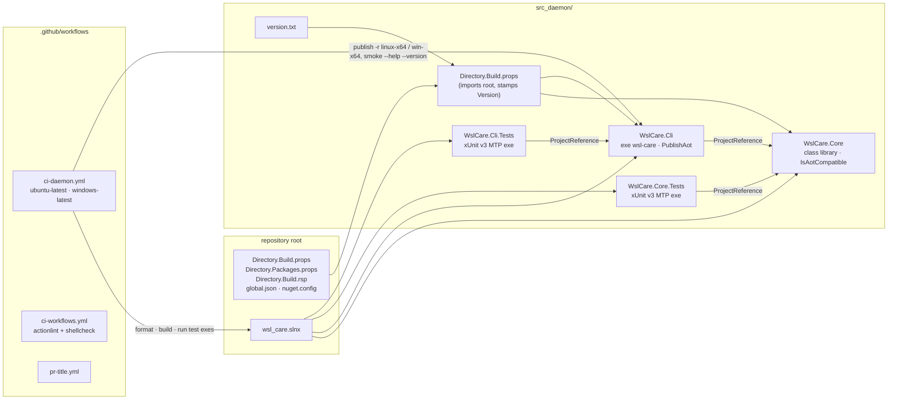

# Architecture — wsl_care

> As of 2026-10-02 the repository holds the **daemon skeleton** (E1.S1 of
> `todo/PLAN_wsl_care_daemon.md` §16): the build, the two product projects, their tests and the daemon
> CI. `wsl-care` answers `--help` and `--version` and refuses everything else; no collector, rule or
> action exists yet, and there is no extension. This file describes what exists and is rewritten as
> each part lands.

## What exists

- The family rules at `.agents/conventions` (tracking `release`) and the Claude host adapter.
- **Root build files**, mirrored from the family's credential-store repository: `global.json` (SDK
  `10.0.100`, `rollForward: latestFeature`, the Microsoft Testing Platform runner),
  `Directory.Build.props` (`net10.0`, nullable, warnings as errors, central package management,
  invariant globalization), `Directory.Packages.props` (test packages only), `Directory.Build.rsp`
  (`-nr:false`), `nuget.config` (nuget.org only), `.editorconfig`, `wsl_care.slnx`.
- **`src_daemon/`** — the daemon/CLI ([module_tests.md](module_tests.md) lists what is tested):
  - `version.txt` — the daemon's one version; `src_daemon/Directory.Build.props` stamps every
    assembly under `src_daemon/` from it (`0.0.0` = nothing released yet).
  - `src/WslCare.Core` — class library, `IsAotCompatible` (trim, AOT and single-file analyzers on every
    build). Holds `ProductVersion`, the version a build reports. Collectors, rules, actions and
    records land here from E1.S2 on.
  - `src/WslCare.Cli` — the executable `wsl-care` / `wsl-care.exe`: `PublishAot`, `StripSymbols`,
    reflection-free JSON, RIDs `linux-x64`, `linux-arm64`, `win-x64`. `CommandLine.Commands` is the one
    register of what the binary accepts — the parser and the help text are both derived from it.
    Exit codes live in one enum (`ExitCode`: 0 ok, 2 usage, 70 internal).
  - `tests/WslCare.Core.Tests`, `tests/WslCare.Cli.Tests` — xUnit v3 on Microsoft Testing Platform,
    run as executables.
- **`.github/`** — `ci-daemon.yml`, `ci-workflows.yml`, `pr-title.yml`, `dependabot.yml` (below).
- Read-only diagnostic scripts under `research/diagnostics/`, which produced the baselines.
- Plans: the daemon and extension (`todo/PLAN_wsl_care_daemon.md`), the Windows side
  (`todo/PLAN_windows_care.md`), the AI-session archive (`todo/PLAN_ai_session_archive.md`), the shared
  VS Code kit (`todo/PLAN_shared_vscode_kit.md`).

## Projects and CI

### `ci · daemon` (`.github/workflows/ci-daemon.yml`)

On every push to `main`, every pull request to `main`, and by hand; unconditional (no path filter),
`concurrency` with cancel-in-progress, `permissions: contents: read`, `timeout-minutes: 30`, every
`uses:` pinned by SHA. Matrix `ubuntu-latest` (`linux-x64`) and `windows-latest` (`win-x64`), each:
restore → `dotnet format --verify-no-changes` → Release build → both test executables → Native AOT
`dotnet publish -r <rid>` → the published binary must list `--help`/`--version` and print the version in
`src_daemon/version.txt`. Every MSBuild command carries `-m:4`. **`linux-arm64` has no pull-request leg
yet** — the workflow header records that gap; the release workflow (E4) builds it on
`ubuntu-24.04-arm`.

### `ci · workflows`, `pr · title`, Dependabot

`ci-workflows.yml` runs a version- and checksum-pinned actionlint over every workflow after asserting
shellcheck is on `PATH` (without it actionlint silently skips the `run:` blocks). `pr-title.yml` requires
a conventional-commit pull request title. `dependabot.yml` watches NuGet and GitHub Actions weekly,
FluentAssertions held below 8.x.

## Planned module map

| Part | Where | Role | State |
|---|---|---|---|
| daemon / CLI | `src_daemon/` | C# Native AOT, `linux-x64`, `linux-arm64`, `win-x64`: collectors, rules, actions, run records | skeleton (E1.S1) |
| scenario harness | `src_daemon/tests/WslCare.Scenarios` | drives the built CLI end to end over fixtures | planned (E1.S3) |
| extension | `src_vs_code/` | status bar, panel, cleanup table, logs page, settings, help | planned (E5) |

## Cross-repository

| Repository | Relationship |
|---|---|
| `dew_flow_vscode_kit` | the extension's help page and display controls come from its npm package |
| `dew_flow_creds_for_devs` | the model for this repository's build files and CI/CD |
