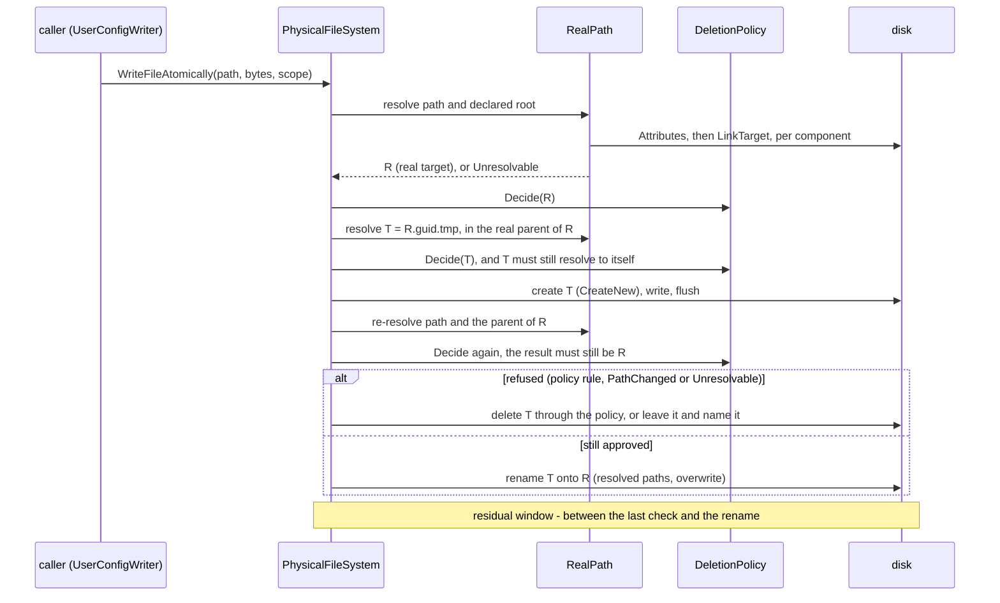
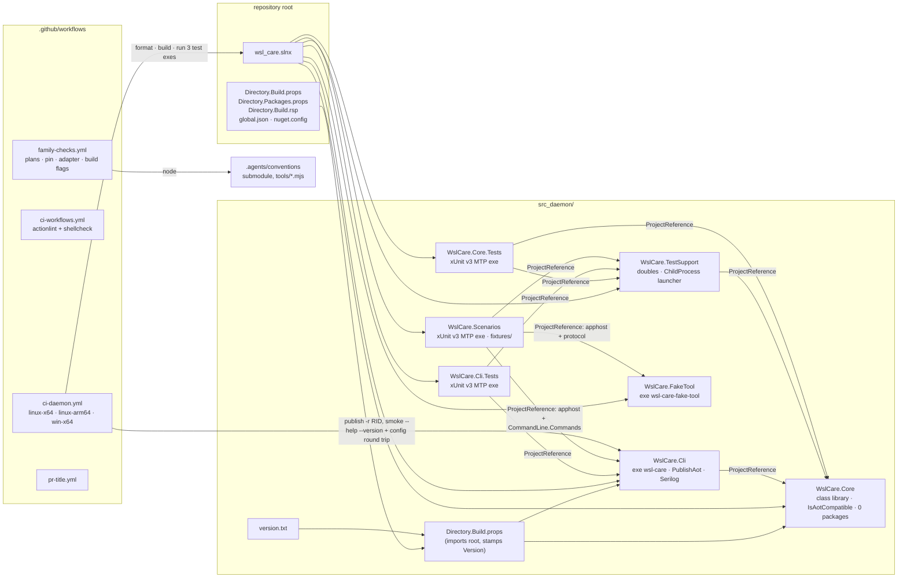
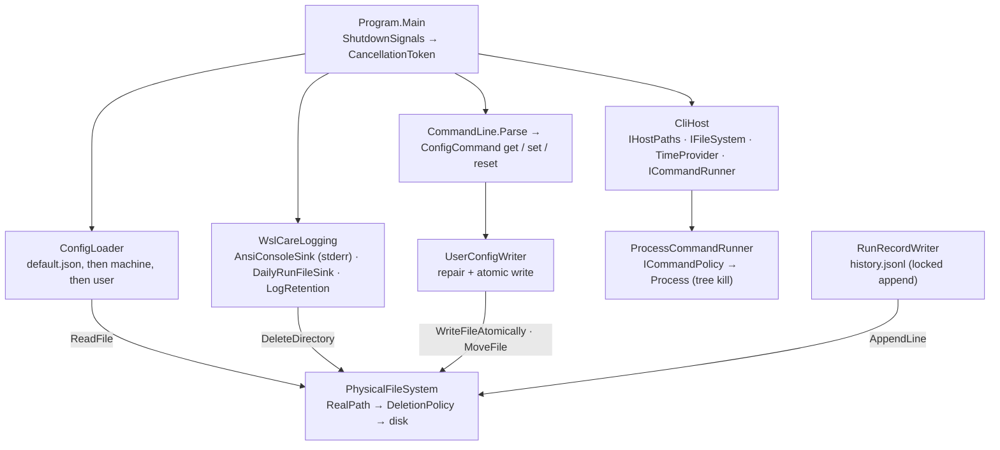
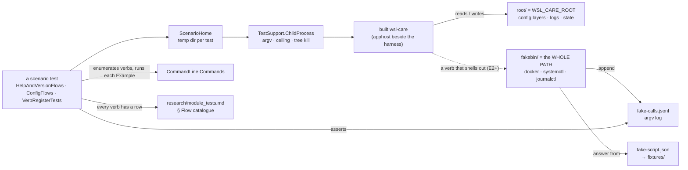

# Architecture — wsl_care

> As of 2026-10-02 the repository holds the **daemon skeleton, its foundation seams and its scenario
> harness** (E1.S1–E1.S3 of `todo/PLAN_wsl_care_daemon.md` §16): the build, the two product projects,
> the seams every later story hangs on, their tests, the harness that drives the built CLI, and CI on
> all three shipped RIDs. `wsl-care` answers `--help`, `--version` and
> the `config` verbs and refuses everything else; no collector, rule or action exists yet, and there is
> no extension. This file describes what exists and is rewritten as each part lands.

## What exists

- The family rules at `.agents/conventions` (tracking `release`) and the Claude host adapter.
- **Root build files**, mirrored from the family's credential-store repository: `global.json` (SDK
  `10.0.100`, `rollForward: latestFeature`, the Microsoft Testing Platform runner),
  `Directory.Build.props` (`net10.0`, nullable, warnings as errors, central package management,
  invariant globalization), `Directory.Packages.props` (Serilog for the CLI; test packages),
  `Directory.Build.rsp` (`-nr:false`), `nuget.config` (nuget.org only), `.editorconfig`, `wsl_care.slnx`.
- **`src_daemon/`** — the daemon/CLI ([module_tests.md](module_tests.md) lists what is tested):
  - `version.txt` — the daemon's one version; `src_daemon/Directory.Build.props` stamps every
    assembly under `src_daemon/` from it (`0.0.0` = nothing released yet).
  - `src/WslCare.Core` — class library, `IsAotCompatible`, **zero package references** (an
    architecture test keeps it so). Holds the seams below, the configuration system, the run-record
    type and its writer, and `ProductVersion`.
  - `src/WslCare.Cli` — the executable `wsl-care` / `wsl-care.exe`: `PublishAot`, `StripSymbols`,
    reflection-free JSON, RIDs `linux-x64`, `linux-arm64`, `win-x64`; one package, Serilog.
    `CommandLine.Commands` is the one register of what the binary accepts — the parser, the help text
    and the derived test are all read from it. Exit codes live in one enum (`ExitCode`: 0 ok, 2 usage,
    70 internal, 130 interrupted).
  - `tests/WslCare.TestSupport` — the doubles and fixtures the test projects share (a temp root, a
    frozen clock, the recording command runner, a sandboxed host, a directory-link maker, and
    `ChildProcess` — the one launcher for a built executable: argv list, ceiling, tree kill).
  - `tests/WslCare.Core.Tests`, `tests/WslCare.Cli.Tests` — xUnit v3 on Microsoft Testing Platform,
    run as executables.
  - `tests/WslCare.Scenarios` — **the scenario harness** (xUnit v3 MTP executable): the BUILT
    `wsl-care` run as a child process over a temporary `WSL_CARE_ROOT`, with fake `docker` /
    `systemctl` / `journalctl` alone on its `PATH`, plus the derived verb register that fails when a
    verb of `CommandLine.Commands` has no row in [module_tests.md](module_tests.md).
  - `tests/WslCare.FakeTool` — the fake tool (`wsl-care-fake-tool`), one console program the harness
    installs under each tool's name; it records argv and answers from fixtures. Ships in no binary.
- **`.github/`** — `ci-daemon.yml`, `ci-workflows.yml`, `family-checks.yml`, `pr-title.yml`,
  `dependabot.yml` (below).
- Read-only diagnostic scripts under `research/diagnostics/`, which produced the baselines.
- Plans: the daemon and extension (`todo/PLAN_wsl_care_daemon.md`), the Windows side
  (`todo/PLAN_windows_care.md`), the AI-session archive (`todo/PLAN_ai_session_archive.md`), the shared
  VS Code kit (`todo/PLAN_shared_vscode_kit.md`).

## The seams (E1.S2)

Everything a later story does to the machine goes through one of these. Each is an interface in
`WslCare.Core` with exactly one real implementation and a test double in `WslCare.TestSupport`.

| Seam | Namespace | Real implementation | What it guarantees |
|---|---|---|---|
| `IHostPaths` | `Core.Hosting` | `LinuxHostPaths`, `WindowsHostPaths`; `HostPaths.ForThisMachine()` | every path per OS (plan §6, §4.6): state, logs, temp, the two config layers, the protected roots (AI agents, `~/git`, Claude's temp folder). `WSL_CARE_ROOT=<dir>` lays the whole thing out under one directory — what tests and the built-binary tests use so nothing real is touched. No path literal exists outside these two classes. |
| `PathRules` | `Core.Hosting` | values `Linux`, `Windows` | pure path arithmetic per OS family (separators, case, roots), so the Windows policy is checked on the Linux CI leg and vice versa |
| `IFileSystem` | `Core.Files` | `PhysicalFileSystem` | the only road to delete/move/atomic-write/append; every destructive call resolves the REAL path (`RealPath`: links followed component by component, `..` applied to the real parent) of the target, the destination and the declared root, and asks the `DeletionPolicy` first; a path whose real location cannot be established — a component that cannot be inspected, a cycle of links — is refused by `Unresolvable` (fail closed); the atomic write makes its temporary file in the RESOLVED parent, judges it, re-resolves the target and its parent just before the rename (`PathChanged`) and renames the resolved paths (§ *Fail-closed resolution and the atomic write*); `AppendLine` is a cross-process-safe JSONL append (exclusive open of `{file}.lock`, released by the OS) |
| `DeletionPolicy` | `Core.Files.Deletion` | the one class | the never-list as a pure decision over resolved paths: never `projects/*/memory/` (even for the archive), never under an AI agent folder except an archive MOVE with the permit, never under `~/git`, never under `%TEMP%\claude` / `/tmp/claude`, never outside the action's declared root (strictly inside), never a root that is `/`, `C:\` or the home; move destinations are judged too |
| `ICommandRunner` + `ICommandPolicy` | `Core.Processes` | `ProcessCommandRunner`, `AllowAllCommandPolicy` (E3.S1 replaces it with the never-list) | argv list only, a required ceiling, the WHOLE process tree killed on timeout, bounded capture of both streams, a closed outcome (`Exited` / `TimedOut` / `FailedToStart` / `Refused`), the caller's cancellation thrown as such after the kill; the policy is asked before any start |
| `IHostProbe` | `Core.Hosting` | none yet (E2: `LinuxProbe`, `WindowsProbe`) | the platform split of plan §8; interface only in this build |
| run records | `Core.Records` | `RunRecordWriter` → `{state}/history.jsonl` | `RunRecord` (schemaVersion, `RunId` = UTC second + pid, trigger `timer|manual|cli`, UTC start/end, outcome `completed|failed|interrupted|observeOnly`, actions) as one JSON line, source-generated |
| configuration | `Core.Config` | `ConfigLoader`, `UserConfigWriter`, `ConfigKeys` | three layers (embedded `default.json` < machine < user), validated against the one register in code; an invalid layer makes the result **observe-only** with `configError {file, line, message}` and the layer's valid keys still in force (plan §15a #1); `config set`/`reset` rewrite the user layer atomically and repair it (invalid keys dropped and named, an unparseable file moved aside with a UTC stamp, `-2`, `-3`, … appended when a repair in the same second already took that name — an aside file is never overwritten) |

Logging (`Cli.Logging`, per the family rule): Serilog configured in code before the verb runs; the
coloured console sink is the repository's own `AnsiConsoleSink` on **stderr** (stdout carries the
answers the extension parses); `DailyRunFileSink` writes `{log dir}/{yyyy-MM-dd}/wsl-care-{HH-mm-ss}-{pid}.log`
in UTC and segments at UTC midnight; the level and the retention window come from `logging.*` in the
configuration; `LogRetention` prunes day folders older than the window at startup **through
`IFileSystem`**, so the deletion policy judges it like any cleanup. An unwritable log directory degrades
to console-only with a note. `ShutdownSignals` turns Ctrl+C / SIGTERM / SIGQUIT into the root
`CancellationToken` that reaches every command.

What reaches the terminal is printable. `Cli.Output` is the one road from a verb to a stream — answers
on stdout; refusals, notes, internal errors and the interruption line on stderr — and every stderr
message passes `CommandLine.Printable`, which replaces control characters, so a key typed with a
newline or an escape sequence, a key read from the user's file, or a path in a refusal reason cannot
split or repaint the line. The console sink, the one road for log lines, does the same to the message
it renders (and to each line of an exception) and keeps only its own colour escapes. `OutputRoadTests`
fails the build on a stream write anywhere else in the CLI. The file sink writes values as they are.

### Deviations from the plan recorded in E1.S2

- `processes.killEnabled` (plan §7.5) is not a key: it would duplicate `auto.A11`. A5 and A6 carry two
  switches each (`auto.A5` / `auto.A5Testcontainers`, `auto.A6` / `auto.A6Unused`) because §5 gives them
  two defaults.
- `aiAgents.extra` is not in the schema yet; E7 adds it with its object shape (the schema today holds
  scalars and string lists only).
- The log file is written by the sink's own `StreamWriter`, not `Serilog.Sinks.File`: one package in
  the AOT binary instead of two, and the segment logic owns the file either way.
- `WslCare.Core` takes no `ILogger<T>` yet because nothing in it logs; the host does. When a Core
  component needs to log, it takes `Microsoft.Extensions.Logging.Abstractions` then.
- The Linux analogue of `%TEMP%\claude\` is `/tmp/claude` (Claude Code's `$TMPDIR/claude`); the plan
  names only the Windows folder.
- A `RootTooBroad` rule exists (not in the plan): a declared root of `/`, a drive root or the home
  directory is refused before "inside the root" is asked.
- The agent roots protected today are the §4.6 entries with named folders (Claude Code, Codex, Gemini,
  Antigravity, Copilot, Rovo Dev, Ollama); the catalogue of E7 must feed the same list.
- Only `history.jsonl` is written here; the per-run detail file `runs/{day}/{runId}.json` is E2.S3.
- `config reset` of a key absent from the user layer is a no-op that says so (exit 0); an unparseable
  user file is moved to `config.json.broken-{utc}` (or `…-2`, `…-3` when that name is taken) rather
  than overwritten.

## Fail-closed resolution and the atomic write

Hardened on 2026-10-02 from the review of the E1 pull request.

**Fail closed.** `RealPath.Resolve` answers a typed `RealPathResult` — `Resolved(path)` or
`Unresolvable(component, reason)` — from a typed `LinkInspection` per component (`NotALink`,
`Link(target)`, `Uninspectable(reason)`). An inspection that fails is never taken for a plain name: the
walk stops there, and `PhysicalFileSystem` refuses the operation by `DeletionRule.Unresolvable`, naming
the component. A cycle of links ends the same way (it used to escape as an `IOException`). The real
reader reads `FileInfo.Attributes` before `FileInfo.LinkTarget`, because — measured 2026-10-02 on
Windows 11 and WSL Ubuntu with .NET 10, inside a directory this account was denied — `LinkTarget`
answers `null` for a component it cannot inspect and never throws, while `Attributes` throws
`UnauthorizedAccessException`; `Attributes` answers `-1` for a missing component (a plain name) and
carries `ReparsePoint` for a symlink or junction. A reparse point whose target cannot be read (a cloud
placeholder, for one) is refused too rather than vouched for. A protected root that cannot be resolved
is kept as spelled: a target spelled under it is under it, and one that reaches it through a link meets
the same uninspectable component and is refused.

**The atomic write** judges, builds, re-checks and acts on REAL paths:

A link swapped in after the approval makes the temporary file's own judgement fail; one swapped in
after the temporary file was written makes the re-check fail — by the policy's own rule when the new
place is outside the scope or protected, by `PathChanged` when it is merely not the approved place.

**The residual window.** Between the last re-check and the rename a component can still be swapped,
because the rename takes a path and the kernel resolves it again. Closing it needs a rename relative to
a directory handle held since the check (`renameat` on Linux, `SetFileInformationByHandle` on Windows);
.NET does not expose one and this code does not P/Invoke. Exploiting the window needs write access to
the directory being written — for the one caller today, the user's own config directory — which means
being the same user: outside the threat model, which guards against this product's own mistakes and
against links planted where a cleanup walks, not against the account the daemon runs as. Deletes and
moves still act on the caller's spelling after judging the real path: acting on the real path would
change what they do (deleting a link inside a root would delete its target), so they keep that
narrower window and say so here.

## Projects and CI

## The seams inside the binary

## The scenario harness (E1.S3)

Every run gets `WSL_CARE_ROOT`, so nothing real is read or written, and a `PATH` holding only the
fakes, so a verb can reach no real tool. The harness reads the product's own types (the verb register,
`ExitCode`, `ConfigKeys`, `ConfigValidation`, the source-generated JSON context) instead of retyping
them. What it covers and what it does not prove: [module_tests.md](module_tests.md).

### `ci · daemon` (`.github/workflows/ci-daemon.yml`)

On every push to `main`, every pull request to `main`, and by hand; unconditional (no path filter),
`concurrency` with cancel-in-progress, `permissions: contents: read`, `timeout-minutes: 30`, every
`uses:` pinned by SHA. Matrix `ubuntu-latest` (`linux-x64`), `ubuntu-24.04-arm` (`linux-arm64`) and
`windows-latest` (`win-x64`) — every shipped binary-and-platform pair, per the family platform rule,
mapped in the workflow header — each: restore → `dotnet format --verify-no-changes` → Release build →
the three test executables (Core, CLI, Scenarios) → Native AOT `dotnet publish -r <rid>` → the
published binary must list `--help`/`--version` and print the version in `src_daemon/version.txt` →
the configuration round trip under a temporary `WSL_CARE_ROOT` (set, read back from the user layer,
a refused set exits 2 with one `wsl-care:` line, the value still holds). Every MSBuild command carries
`-m:4`.

### `ci · family checks` (`.github/workflows/family-checks.yml`)

The shared rules' own checks, run from the `.agents/conventions` submodule (fetched alone, shallow):
`plan-lifecycle.mjs`, `adapter-check.mjs`, `pin-check.mjs` (the pin equals the tip of `release`),
`build-flags-check.mjs`. Separate from the daemon workflow because it gates neither the build nor the
tests. Mirrors the credential-store repository's `docs · plans` workflow.

### `ci · workflows`, `pr · title`, Dependabot

`ci-workflows.yml` runs a version- and checksum-pinned actionlint over every workflow after asserting
shellcheck is on `PATH` (without it actionlint silently skips the `run:` blocks). `pr-title.yml` requires
a conventional-commit pull request title. `dependabot.yml` watches NuGet and GitHub Actions weekly,
FluentAssertions held below 8.x.

## Planned module map

| Part | Where | Role | State |
|---|---|---|---|
| daemon / CLI | `src_daemon/` | C# Native AOT, `linux-x64`, `linux-arm64`, `win-x64`: collectors, rules, actions, run records | skeleton + seams + `config` verbs (E1.S1–S2) |
| scenario harness | `src_daemon/tests/WslCare.Scenarios` (+ `WslCare.FakeTool`) | drives the built CLI end to end over a temp home with fake tools on `PATH`; the derived verb register | built (E1.S3): help, version, refusal, the config verbs |
| extension | `src_vs_code/` | status bar, panel, cleanup table, logs page, settings, help | planned (E5) |

## Cross-repository

| Repository | Relationship |
|---|---|
| `dew_flow_vscode_kit` | the extension's help page and display controls come from its npm package |
| `dew_flow_creds_for_devs` | the model for this repository's build files, CI/CD, and the logging sinks (`AnsiConsoleSink`, `DailyRunFileSink`, `LogRetention` are ports) |
