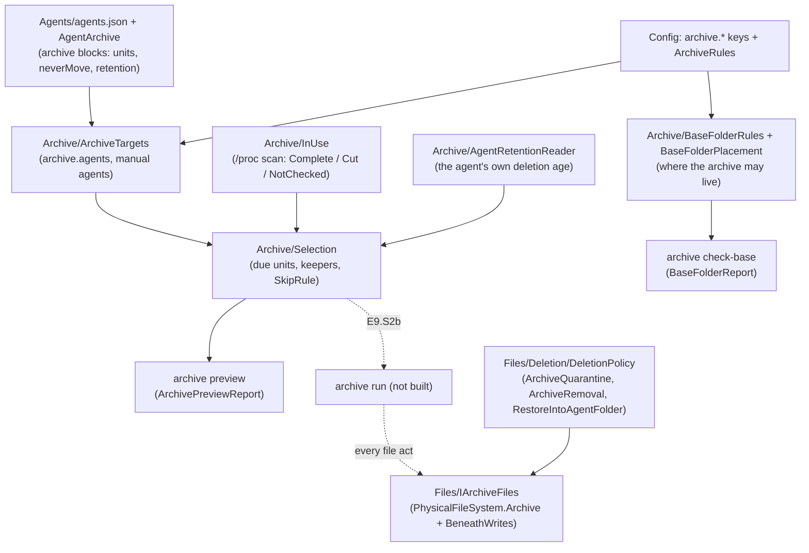
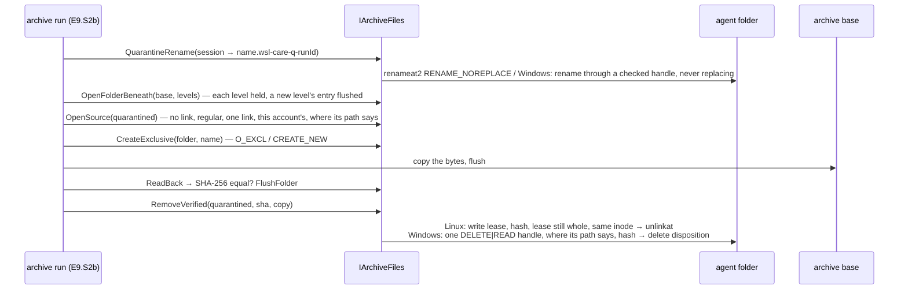

# Module — the AI-session archive (E9)

> Built so far: **E9.S0** (catalogue blocks, keys, base folder rules, `archive check-base`), **E9.S1** (the selection and
> `archive preview`, read-only), **E9.S2a** (the file seam `IArchiveFiles`, with its gate round). Not built yet: the move
> protocol and `archive run` (E9.S2b), restore / list / status (E9.S3), A13 in the engine and the root → user boundary (E9.S4),
> the Windows open-file check (E9.S5). The design and every decision: `todo/PLAN_wsl_care_daemon.md` §15r. The tests, their
> red runs and their break-it checks: [module_tests.md](module_tests.md), the E9 sections (from *The AI-session archive:
> catalogue blocks, keys, base folder* to *The E9.S2a gate round*). The longer history of each
> story: [architecture.md](architecture.md) § *The AI-session archive*.

## Purpose

AI coding agents (Claude Code, Codex, Gemini CLI, Antigravity) keep every session as files in their own folders, on both sides
(the WSL distribution and Windows). The archive moves sessions older than a configured age out of those folders into a base
folder the user chose, so the agent folders stay small and nothing is lost. It acts only as the user who owns the sessions,
never as root; it never touches `memory`, never replaces a file, and removes an agent's file only after its archived copy
hashes equal.

## How it fits together

## The move, as the seam allows it (E9.S2a; the protocol itself is E9.S2b)

## Core entities

| Entity | File | What it is |
|---|---|---|
| `AgentArchive`, `AgentArchiveRules` | `Agents/AgentArchive.cs`, `Agents/AgentArchiveRules.cs` | the catalogue's `archive` block per agent and its soundness rules; `IsNeverMoved` |
| `ArchiveTargets` | `Archive/ArchiveTargets.cs` | which agents the archive covers on this side (`archive.agents`, `manual:<name>`) |
| `BaseFolderReport`, `BaseFolderRules`, `BaseFolderPlacement` | `Archive/BaseFolderRules.cs`, `Archive/BaseFolderPlacement.cs` | whether a folder may be the archive base, judged under its canonical mount |
| `WindowsProfilePlaces`, `WindowsShares`, `WindowsIdentity`, `WindowsAccess` | `Archive/Windows*.cs` | the Windows places a base must stay clear of, share refusal, file identity, who may read it |
| `Selection`, `AgentSelection`, `SkipRule` | `Archive/Selection.cs` | the units due to move and why others stay |
| `InUseState` | `Archive/InUse.cs` | `Complete` / `Cut` / `NotChecked`; only `Complete` lets a due unit move |
| `RetentionFound` | `Archive/AgentRetentionReader.cs` | `Known(days)` / `Unknown(why)` — the agent's own deletion age |
| `ArchiveNames`, `QuarantineCount` | `Archive/ArchiveNames.cs`, `Archive/QuarantineCount.cs` | name rules, the quarantine mark `.wsl-care-q-`, the side folder |
| `ArchivePreviewReport` | `Archive/ArchivePreview.cs` | the answer of `archive preview` |
| `IArchiveFiles` and its closed results | `Files/IArchiveFiles.cs` | the ONLY way the archive touches a file: `SourceOpen`, `FolderBeneath`, `ExclusiveFile`, `FileHash`, `NoReplaceRename`, `FolderFlush`, `VerifiedRemoval`; `BeneathFolder` (abstract: each implementation subclasses it) |
| `ArchiveSourceRules` | `Files/ArchiveSourceRules.cs` | pure: what makes an opened session file copyable (regular, one link, this account's) |
| `ArchiveFileStep` | `Files/PhysicalFileSystem.Archive.cs` | the fault seam's steps between the primitive acts |
| archive permits | `Files/Deletion/DeletionPolicy.cs` | `ArchiveQuarantine`, `ArchiveRemoval`, `RestoreIntoAgentFolder`; rule `ArchiveShape`; `memory` never |

## Entry points

| Verb | Command file | Contract | State |
|---|---|---|---|
| `archive check-base <path> [--json]` | `WslCare.Cli/Commands/ArchiveCommand.cs` | `contracts/golden/head/archive-check-base.json`, capability `archive.checkBase` | built (E9.S0) |
| `archive preview [--agent <id>] [--json]` | `WslCare.Cli/Commands/ArchiveCommand.cs` | `contracts/golden/head/archive-preview.json`, capability `archive.preview` | built (E9.S1) |
| `config set archive.baseFolder` | the config verbs | the base rules, refused as root (81) | built (E9.S0) |
| `archive run`, `restore`, `list`, `status`, `reconcile --scan` | — | — | E9.S2b–E9.S4 |

Both built verbs run as the user; root is refused with exit 81.

## The seam's guarantees (E9.S2a and its gate round)

- **Linux:** every folder below a trusted one is opened from the previous one's descriptor with `O_NOFOLLOW`, so a link on the
  way is refused and nothing can be swapped between the open and the act. A removal takes a write lease (the kernel grants it
  only when no other open file description of the file exists), hashes, checks the lease is still whole and the name still
  names the same inode, and only then unlinks.
- **Windows:** the destination's folders are HELD by handles that never share delete — measured on NTFS, neither the folder nor
  any folder above it can be renamed while held, so a checked level stays the folder that was checked. A source or a removal is
  opened by path and then asked where it really is (`GetFinalPathNameByHandle`): a file reached through a link swapped in after
  the reparse check is never copied, renamed or removed. A new level's entry and the destination folder are flushed with
  `FlushFileBuffers` on the held folder handle (measured: it needs `FILE_ADD_FILE`; a read-only handle answers error 5). The
  rename and the empty-folder removal act THROUGH a checked handle (the rename with its folder held, by `FILE_RENAME_INFO`
  without replace; the folder by its delete disposition, which a non-empty folder refuses). A source must be owned by this
  account's SID, as on Linux by its uid.
- **Open, unmeasured (owner questions, plan §15r *E9.S2a gate round*):** whether the folder flush works on a Windows
  NETWORK share — until measured, a level whose entry cannot be flushed refuses, so nothing moves there; and a source owned by
  `Administrators` (an elevated process's file) is refused and stays, until the owner decides.
- **Both:** creates never replace (`O_EXCL` / `CREATE_NEW`), renames never replace (`RENAME_NOREPLACE` / no replace flag), a
  removal acts only when the bytes hash equal to the archived copy, and every write is judged first by the deletion policy on
  the REAL paths.

## External dependencies

- **Linux:** `libc` — `openat`, `mkdirat`, `renameat2`, `unlinkat`, `statx`, `fcntl` (`F_SETLEASE`, `F_SETSIG`, `F_GETLEASE`),
  `fsync`; `/proc/<pid>/fd` and `/proc/self/mountinfo`.
- **Windows:** `kernel32` — `CreateFileW`, `GetFileInformationByHandle`, `GetFinalPathNameByHandleW`, `SetFileInformationByHandle`
  (delete disposition, `FILE_RENAME_INFO` rename), `FlushFileBuffers`; the file's security descriptor (owner SID) through
  `System.Security.AccessControl`.
- **Configuration:** the `archive.*` keys (`Config/ConfigKeys.cs`, `Config/ConfigKeys.Numbers.cs`) and their coupled rules
  (`Config/NumberRules.cs` → `ArchiveRules`).
- **Other modules:** the AI-agent catalogue and walk (E7), the deletion policy (E3), `TreeWalk` (`TreeRules.ListFiles`).
