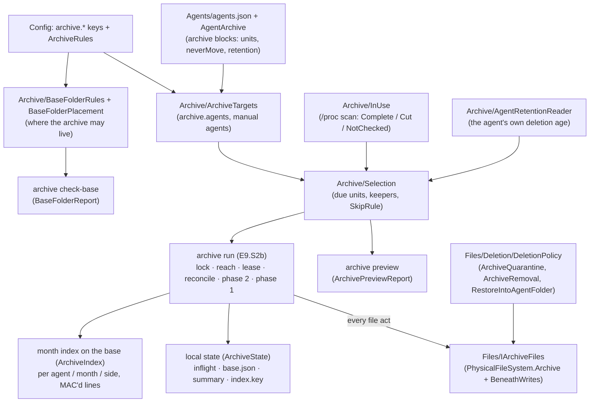
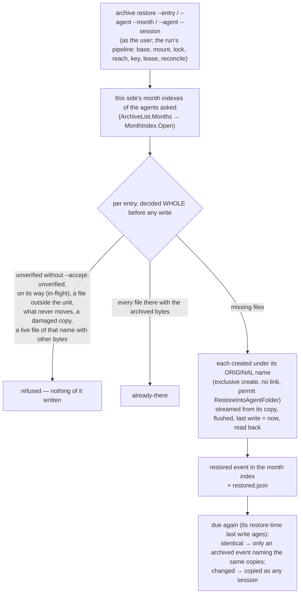
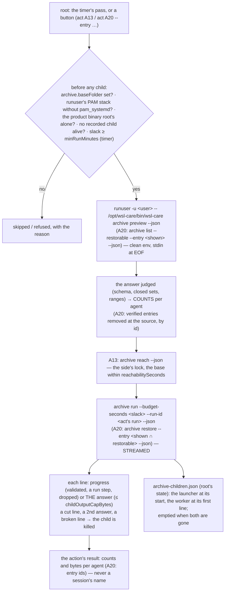
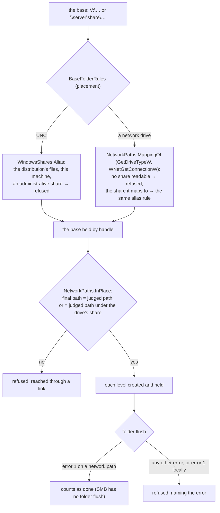
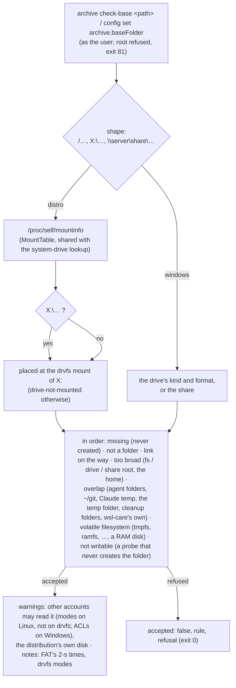
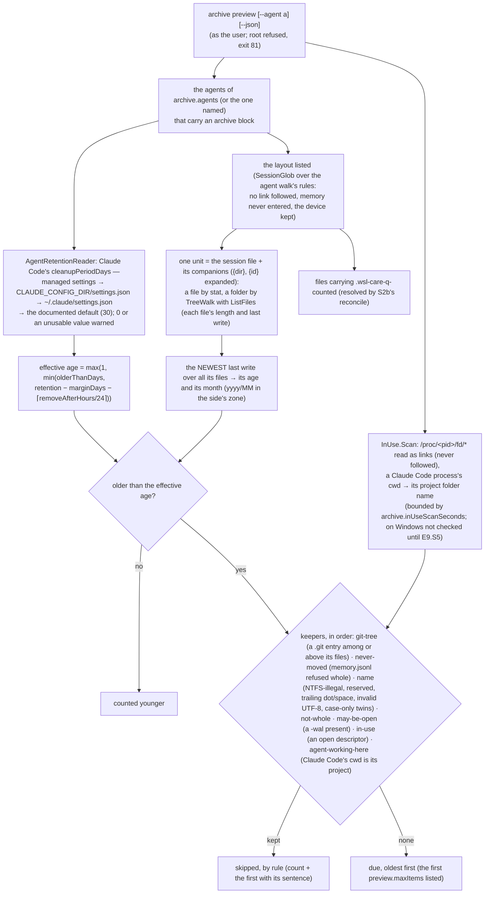
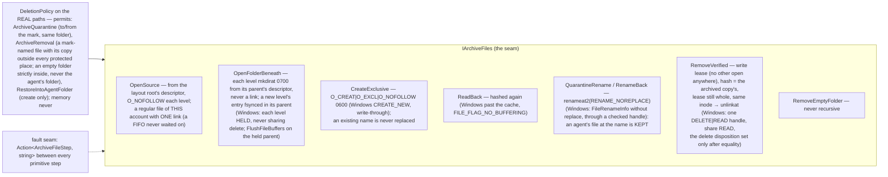

# Module — the AI-session archive (E9)

> Built so far: **E9.S0** (catalogue blocks, keys, base folder rules, `archive check-base`), **E9.S1** (the selection and
> `archive preview`, read-only), **E9.S2a** (the file seam `IArchiveFiles`, with its gate round and own review round), **E9.S2b**
> (the two-phase move: `archive run`, `archive status`, `archive reconcile --scan`, with its own review round), **E9.S3** (`archive restore`, `archive list`), **E9.S4** (A13 and A20 in the engine — the root → user boundary,
> `archive reach`), **E9.S5** (the Windows side's open-file check: the Restart Manager, and a live Claude Code on Windows; amended 2026-10-09 — the Windows idle rule, `archive.windowsIdleDays`). **E10.S0** (the daemon half of the extension's archive, plan §15s: `act A20 … --entry -` with the ids on stdin, `restoreCeiling` on every list answer, `archive check-base --json <path>`; capability `act.entryStdin`). The design and every decision: `todo/PLAN_wsl_care_daemon.md` §15r. The tests, their
> red runs and their break-it checks: [module_tests.md](module_tests.md), the E9 sections (from *The AI-session archive:
> catalogue blocks, keys, base folder* to *The E9.S2a gate round*). The longer history of each
> story: *Story history* below.

## Purpose

AI coding agents (Claude Code, Codex, Gemini CLI, Antigravity) keep every session as files in their own folders, on both sides
(the WSL distribution and Windows). The archive moves sessions older than a configured age out of those folders into a base
folder the user chose, so the agent folders stay small and nothing is lost. It acts only as the user who owns the sessions,
never as root; it never touches `memory`, never replaces a file, and removes an agent's file only after its archived copy
hashes equal.

## How it fits together



## The move: two runs (plan §15r D2, risk consult 9/9.2; the seam is E9.S2a, the protocol E9.S2b)

A session moves in TWO phases, in two different runs. Phase 1 copies from the session's ORIGINAL names and touches nothing at
the source. Phase 2 runs at least `archive.removeAfterHours` later: it re-hashes the archived copy first, and only then
renames, checks and removes the source. A crash anywhere leaves the session whole at the source, or whole in the archive with
its index line, or both.

```mermaid
sequenceDiagram
    participant N as run N (phase 1)
    participant K as run N+k (phase 2, ≥ removeAfterHours later)
    participant Local as local state (inflight.json)
    participant Seam as IArchiveFiles
    participant Agent as agent folder
    participant Base as archive base (index.jsonl per agent / month / side)
    N->>Local: intent — the session as "copying" (atomic, flushed)
    N->>Seam: OpenFolderBeneath(base, agent/yyyy/MM/side/…) — each level made and flushed
    loop every file of the session
        N->>Seam: OpenSource(original name) — no link, regular, one link, this account's
        N->>Seam: CreateExclusive — O_EXCL / CREATE_NEW, never replacing
        N->>Base: the bytes, hashed as they are read; the file flushed
        N->>Seam: ReadBack — hashed again (one retry, then the run stops)
    end
    N->>Seam: FlushFolder
    N->>Base: the "archived" index line (every file, its hash, its MAC), flushed
    N->>Local: the entry moves to "archived"
    Note over N,Agent: phase 1 touches nothing at the source
    K->>Seam: ReadBack of every archived file — equal to the index? else "damaged", the source stays
    K->>Seam: QuarantineRename of each source file → name.wsl-care-q-runId (never replacing)
    K->>Seam: OpenSource of each quarantined file — hashed; any change → RenameBack all, "superseded"
    K->>Local: the entry moves to "removing" — the COMMIT POINT
    K->>Seam: RemoveVerified of each quarantined file (expected hash = the archived copy's)
    Seam->>Agent: Linux: write lease, hash, lease still whole, same inode → unlinkat<br/>Windows: one DELETE|READ handle, where its path says, hash → POSIX delete
    K->>Seam: RemoveEmptyFolder of the folders the session left (never recursive)
    K->>Base: the "sourceRemoved" (or "split") index line
    K->>Local: the entry is dropped
```

What the SEAM alone holds (E9.S2a) and what the PROTOCOL holds (E9.S2b) are not the same: `RemoveVerified` removes a file only
when its name carries the quarantine mark, the archived copy it names lies outside every protected place, that copy — opened
and hashed by the seam itself first — exists and equals the expected hash, and the quarantined bytes equal it too. That the
expected hash is the index's and the copy was written in an EARLIER run is E9.S2b's (plan §15r H1, *E9.S2a own review round*
C-M4 / S-M2).

## Core entities

| Entity | File | What it is |
|---|---|---|
| `AgentArchive`, `AgentArchiveRules` | `Agents/AgentArchive.cs`, `Agents/AgentArchiveRules.cs` | the catalogue's `archive` block per agent and its soundness rules; `IsNeverMoved` |
| `ArchiveTargets` | `Archive/ArchiveTargets.cs` | which agents the archive covers on this side (`archive.agents`, `manual:<name>`) |
| `BaseFolderReport`, `BaseFolderRules`, `BaseFolderPlacement` | `Archive/BaseFolderRules.cs`, `Archive/BaseFolderPlacement.cs` | whether a folder may be the archive base, judged under its canonical mount |
| `WindowsProfilePlaces`, `WindowsShares`, `WindowsIdentity`, `WindowsAccess` | `Archive/Windows*.cs` | the Windows places a base must stay clear of, share refusal, file identity, who may read it |
| `Selection`, `AgentSelection`, `SkipRule` | `Archive/Selection.cs` | the units due to move and why others stay |
| `InUseState` | `Archive/InUse.cs` | `Complete` / `Cut` / `NotChecked`; only `Complete` lets a due unit move |
| `RetentionFound` | `Archive/AgentRetentionReader.cs` | `Known(days)` / `Unknown(why)` — the agent's own deletion age |
| `ArchiveNames`, `QuarantineCount` | `Archive/ArchiveNames.cs`, `Archive/QuarantineCount.cs` | name rules, the quarantine mark `.wsl-care-q-`, the side folder |
| `ArchivePreviewReport` | `Archive/ArchivePreview.cs` | the answer of `archive preview` |
| `IArchiveFiles` and its closed results | `Files/IArchiveFiles.cs` | the ONLY way the archive touches a file: `SourceOpen`, `FolderBeneath`, `ExclusiveFile`, `FileHash`, `NoReplaceRename`, `FolderFlush`, `VerifiedRemoval`; `BeneathFolder` (abstract: each implementation subclasses it) |
| `ArchiveSourceRules` | `Files/ArchiveSourceRules.cs` | pure: what makes an opened session file copyable (regular, one link, this account's), and the Linux removal's checks after its hash |
| `FileIdentity` | `Files/IArchiveFiles.cs` | what names one file whatever its name (Linux device + inode, Windows volume serial + file index): the own-copy removal and the Windows base rules |
| `NativeOpen`, `WindowsFileInfo`, `BeneathWrites` | `Files/BeneathWrites.cs` | the natives and their closed answers |
| `ArchiveFileStep` | `Files/PhysicalFileSystem.Archive.cs` | the fault seam's steps between the primitive acts |
| `ArchiveIndex`, `IndexLine`, `IndexEntry` | `Archive/ArchiveIndex.cs` | the month index: one MAC'd JSON line per event, read as untrusted input, merged per `entryId` |
| `ArchiveState`, `InflightEntry`, `InflightBook` | `Archive/ArchiveState.cs`, `Archive/ArchiveMove.cs` | the side's local state: the in-flight file (`copying` / `archived` / `removing`), `base.json`, `holder.json`, `last-run.json`, `summary.json`, `index.key` |
| `ArchiveCopy`, `ArchiveRemove`, `ArchiveReconcile`, `MoveSteps` | `Archive/ArchiveMove.cs`, `Archive/ArchiveRemove.cs`, `Archive/ArchiveReconcile.cs` | phase 1, phase 2 (per UNIT: the transcript first), the reconcile; the protocol's own fault steps |
| `SideLease`, `LeaseRecord` | `Archive/SideLease.cs` | one writer per side on the base: the lease file, another host refused, a dead run taken over; an EMPTY lease (a run killed between its create and its write) read again after `archive.leaseSettleMilliseconds` and, still empty, taken over |
| `ArchiveRun`, `ArchiveRunReport`, `ArchiveScan`, `ArchiveStatus` | `Archive/ArchiveRun.cs`, `Archive/ArchiveScan.cs`, `Archive/ArchiveStatus.cs` | one run of a side; `reconcile --scan`; the status from local state only |
| archive permits | `Files/Deletion/DeletionPolicy.cs` | `ArchiveQuarantine`, `ArchiveRemoval`, `RestoreIntoAgentFolder`; rule `ArchiveShape`; `memory` never |

## Entry points

| Verb | Command file | Contract | State |
|---|---|---|---|
| `archive check-base <path> [--json]` (or `--json` first, E10.S0 — plan §15s D10) | `WslCare.Cli/Commands/ArchiveCommand.cs` | `contracts/golden/head/archive-check-base.json`, capability `archive.checkBase` | built (E9.S0) |
| `archive preview [--agent <id>] [--json]` | `WslCare.Cli/Commands/ArchiveCommand.cs` | `contracts/golden/head/archive-preview.json`, capability `archive.preview` | built (E9.S1) |
| `config set archive.baseFolder` | the config verbs | the base rules, refused as root (81) | built (E9.S0) |
| `archive run [--agent <id>] [--budget-seconds <n>] [--run-id <runId>] [--json]` | `WslCare.Cli/Commands/ArchiveRunCommand.cs` | `contracts/golden/head/archive-run.json`; `--json` streams one-line JSON objects, the answer last; `--run-id` carries root's run id (E9.S4) | built (E9.S2b) |
| `archive reach [--json]` | `WslCare.Cli/Commands/ArchiveRunCommand.cs` → `ArchiveRun.Run` with `ReachOnly` | the run's answer: `done` / `unreachable` / `busy` / `refused` / `no-base`; exit 1 unless `done` or `no-base` | built (E9.S4) |
| `archive status [--json]` | `WslCare.Cli/Commands/ArchiveRunCommand.cs` | `contracts/golden/head/archive-status.json` | built (E9.S2b) |
| `archive reconcile --scan [--json]` | `WslCare.Cli/Commands/ArchiveRunCommand.cs` | the run's answer with its `scan` counts | built (E9.S2b) |
| `archive restore (--entry <id>[,<id>...] or --agent <id> --month <yyyy-MM> or --agent <id> --session <path>) [--accept-unverified] [--json]` | `WslCare.Cli/Commands/ArchiveRunCommand.cs` → `Archive/ArchiveRestore.cs` | the run's answer with its `restore` block (`contracts/golden/head/archive-restore.json`); `--json` streams one-line JSON progress objects, the answer last (the gate round); exit 1 when a session was refused | built (E9.S3) |
| `archive list [--agent <id>] [--month <yyyy-MM>] [--run <runId>] [--restorable [--entry <id>[,<id>...]]] [--json]` | `WslCare.Cli/Commands/ArchiveRunCommand.cs` → `Archive/ArchiveList.cs` | `contracts/golden/head/archive-list.json`; read-only (no lock, no lease, no key made); every answer carries `restoreCeiling` — the effective `archive.maxRestoreEntries` (E10.S0, plan §15s D6); `--restorable --entry` answers exactly those entries still restorable — what A20's preview asks, so an entry older than the newest window is never lost (the E10.S0 own review, finding 1) | built (E9.S3) |
| `act A13 (--preview or --confirm) [--manual or --timer]` (as root; the timer's pass) | `Archive/ArchiveAction.cs` | the engine's run record — agents and counts, never a session; capability `archive.run` | built (E9.S4) |
| `act A20 (--preview or --confirm) --manual --entry <id>...` (as root; a button only — A19 is the idle MCP servers' stop, E14 S2a) | `Archive/RestoreAction.cs` | the engine's run record — entry ids, never a key; capability `archive.restore` | built (E9.S4) |
| `act A20 (--preview or --confirm) --manual --entry -` — the ids on STDIN, one per line (a trailing CR tolerated), under the flag's checks (16 hex, none twice, at most `archive.maxRestoreEntries`' ceiling, A20 among the actions); never beside `--entry <id>` or `--only -`; a bad line named by its number, never echoed | `WslCare.Cli/Commands/ActCommand.cs` `EntriesOf`, `ArchiveArguments.StdinEntries` (the stdin reader of `--only -`: 1 MiB, 10 s) | the request both halves are tested against: `contracts/requests/act-a20-entry-stdin.json`; capability `act.entryStdin` | built (E10.S0, plan §15s D7) |

Every built verb runs as the user; root is refused with exit 81. The progress of `archive run` and `archive restore` goes through one writer, `WslCare.Cli/Commands/ArchiveProgress.cs`
(JSON lines on stdout with `--json`, human lines on stderr without it).

## The seam's guarantees (E9.S2a, its gate round and its own review round)

- **Both — along the judged path:** every act locates its target on its REAL, link-free path first (the path the policy
  judged), and acts along it — never along the spelled path, so a link swapped in anywhere afterwards, the root's ancestors
  included, makes the act refuse. A folder handle the seam made is refused once closed (every verb holds a reference on it for
  the call). The archive's own copy is removed only while its name still names the file the create made (`FileIdentity`).
  Every failure of a seam VERB is a closed answer — `Gone`, `Kept`, `Refused` — never an exception. The stream a create hands
  out is written by the copy (and the lease) itself; an I/O failure there is caught by them since the S2b own review round (M8:
  the partial copy or the lease removed again, the run stopped as `base-failed`).
- **Linux:** the chain is opened from the file system's root with `O_NOFOLLOW` at every level, each folder from the previous
  one's descriptor, so a link on the way is refused and nothing can be swapped between the open and the act. Only a regular
  file is renamed, and the new name must hold the same device and inode afterwards. A removal takes a write lease (the kernel grants it
  only when no other open file description of the file exists), hashes, checks the lease is still whole and the name still
  names the same inode, and only then unlinks.
- **Windows:** the destination's folders are HELD by handles that never share delete — measured on NTFS, neither the folder nor
  any folder above it can be renamed while held, so a checked level stays the folder that was checked. A source, a rename or a
  removal is opened by its real path and then asked where it really is (`GetFinalPathNameByHandle`), compared with that real
  path: a file reached through a link swapped in after the check is never copied, renamed or removed. A name NTFS does not
  hold as itself (`:` — an alternate stream of another file —, a device name, a trailing dot or space) is refused. Under an
  agent's folder only the POSIX delete is used (without it the file stays). A new level's entry and the destination folder are flushed with
  `FlushFileBuffers` on the held folder handle (measured: it needs `FILE_ADD_FILE`; a read-only handle answers error 5). The
  rename and the empty-folder removal act THROUGH a checked handle (the rename with its folder held, by `FILE_RENAME_INFO`
  without replace; the folder by its delete disposition, which a non-empty folder refuses). A source must be owned by this
  account's SID, as on Linux by its uid.
- **Open, unmeasured (owner questions, plan §15r *E9.S2a gate round*):** whether the folder flush works on a Windows
  NETWORK share — until measured, a level whose entry cannot be flushed refuses, so nothing moves there; and a source owned by
  `Administrators` (an elevated process's file) is refused and stays, until the owner decides.
- **Both:** creates never replace (`O_EXCL` / `CREATE_NEW`), renames never replace (`RENAME_NOREPLACE` / no replace flag), a
  removal acts only when the bytes hash equal to the hash the caller passes (E9.S2b passes the archived copy's re-hash), and
  every write is judged first by the deletion policy on the REAL paths.

## The protocol's guarantees after the E9.S2b own review round (2026-10-07, plan §15r *E9.S2b own review round*)

- **Phase 2 asks again, before it touches anything:** the agent's folder is still where the selection may walk (no link on the
  way — a folder stowed into a dotfiles repository is never acted on), no git working tree is around the key along the spelled
  OR the real path, below its companion folders or on the way to its files, and no agent works on it (`Archive/Liveness.cs`, the
  selection's own rules: the open-file scan, taken before the reconcile, is complete, no file is open, Claude Code is not in its
  project). Past the commit point a live agent sends every file back and the entry returns to `archived`.
- **The index, untrusted:** a line with a field missing is malformed (skipped, counted); a `recovered` line is unverified
  whoever signed it; an entry with a verified `archived` event counts its verified events only; its files are those of its
  LATEST `archived` event (a damaged copy copied again is removed against the repaired one); an append after a torn last line
  starts on a line of its own, and an index the append created is flushed into its folder. `MonthIndex.Open` tells
  `Missing` / `Read` / `Unreadable` — the scan never takes an unreadable index for an empty one.
- **No entry waits for ever:** past `archive.keptEntryDays` (14) an entry phase 2 keeps waiting is let go — its source where it
  is; a `removing` one first returns every file under its quarantine name. An archived entry of an agent `archive.agents` no
  longer names is let go too. The selection's quarantine count walks the whole layout, so a companion stranded aside is found.
- **Stops by kind** (`Archive/RunStops.cs`): limits (budget — phase 2 included —, session cap, free space, cancelled) exit 0,
  faults (verification, state write, index write, a base that failed mid-copy) exit 1; `archive run --json` carries `stopKind`.
  An I/O failure of the base mid-copy removes our partial copy and stops the run (`base-failed`); one of the source skips the
  unit. A file back at an original name after the removal closes the entry `split`.

## The restore and the list (E9.S3, 2026-10-07, plan §15r D6, *E9.S3 as built*)



- **`Archive/ArchiveRestore.cs`:**
  - The candidates come from this side's indexes only: an entry belongs to the side that archived it.
  - The target is the CURRENT layout root joined with each file's original relative path. The key matches the unit's glob and
    every other file lies inside a companion of it.
  - The source is the entry's own `<agent>/<yyyy>/<MM>/<side>/` folder; the copy is hashed first.
  - Files are only ever created, never replaced; the copies stay. A restore writes the restore time as each file's last write,
    so Claude's own sweep does not delete the session at its next start.
  - **After the own review round** (plan §15r *E9.S3 own review round*):
    - Nothing is restored where the selection would not walk, nor inside a git working tree (`AgentWalk.PlaceProblem`,
      `GitTrees.InUnit`).
    - Each file is streamed into `<name>.wsl-care-r-<runId>`, capped at its indexed length, hashed and read back, then renamed
      to its name without replacing (`IArchiveFiles.PromoteRestored`). Any failure removes that temporary file by its identity,
      so nothing that did not match stands under the session's name. The permit allows exactly the promotion and that removal.
    - Only entries whose agent and month are their folder's own are taken. A session or a month takes its newest VERIFIED
      entry whose source is gone. An id found in two months restores nothing. `--accept-unverified` goes with `--entry` only.
    - Unread months and unknown ids are rows (`unreadable`, `not-found`) and fail the restore.
    - A `split` entry restores only its missing files (`partial`).
    - The disk must hold the declared bytes.
  - **After the coai code round over S2b/S3** (2026-10-08, plan §15r *E9.S2b/S3 gate round*):
    - A restore has a budget, `archive.restoreLimitMinutes`. Between sessions the run meter asks whether the next session's declared
      bytes fit; a session not started is a row `stopped` and fails the restore.
    - Each file put back is one `file` progress line. Run and restore share one writer, `Cli/Commands/ArchiveProgress.cs`:
      JSON lines with `--json`, a short human line on stderr without it, a `PeriodicTimer` heartbeat, and nothing after the
      answer. A closed pipe ends the progress, never the run.
    - An agent given with `--entry` is validated. A key with a control character is not a plain relative path: an index line
      carrying one is malformed.
- **`restored.json`** is read as a closed result: a file that does not read is never written over. An entry leaves after
  `archive.restoredKeepDays`.
- **Re-archive** (`ArchiveCopy.Rearchived`): a unit in `restored.json` is hashed. If it is identical to its entry, one `archived`
  event in the original month names the existing copies (no bytes, `CopyOutcome.Archived` with `EventOnly`, not counted again in
  `summary.json`). Otherwise it is copied
  as any session. Either way it leaves `restored.json`.
- **`Archive/ArchiveList.cs`:** `archive list` is read-only.
  - Only the months asked are read, through `MonthIndex.Open`, so an unreadable index is named, never shown as empty.
  - A torn line is counted as skipped.
  - An entry is `verified: false` unless its archived event is this side's. A `recovered` entry is never verified.
  - `--run` lists the entries that run's lines touched.
  - A base mounted differently than at its first run is not refused (the list reads only); a note names the recorded mount and
    today's (owner decision 2026-10-07).
- **`archive status`** (human form) names each entry on its way: state, agent, key, files and month (the gate round).

## A13 and A20 — the root → user boundary (E9.S4, 2026-10-08, plan §15r D1, D8, *E9.S4 as built*)



- **Why root starts the product's own binary** (D1): root never opens a session file nor the base. A child of the TARGET USER
  does every byte. Its executable is checked as root's alone every time (`Processes/SelfBinary.cs`, `Processes/RootOwnedPaths.cs`
  — the latter shared with the Windows system drive's check), and the policy allows that path only for the self-invocation
  templates (`Archive/ArchiveChildren.cs`).
- **What root reads of a child:** the last line — every verb root starts answers on ONE line (the S4 own review round C-8:
  `archive preview` and `archive list` answered indented, so their last line was a lone brace) — judged by
  `Archive/ArchiveChildAnswers.cs`, and counts only. Every string root writes is judged against a closed set or a shape: the outcome
  and stop kind, a skip rule (`SkipRule.InRuns`), ROOT's own run id for the run child, a restored session's agent / month / outcome,
  a listed entry's month / status (S-m3). The reasons are root's own sentences per outcome (`ArchiveGates.OutcomeWords`), never the
  child's text. The child's notes, keys and first-skipped names never reach root's world-readable run detail. Progress lines are
  dropped after their check (`Archive/ArchiveChildStream.cs`).
- **What bounds a run's answer:** only the sessions it COPIED are bounded by `archive.maxSessionsPerRun`; the waiting, removed,
  gone, superseded, damaged and skipped counts accumulate over runs and are only not negative (the S4 gate round, finding 6).
- **The exits** (C-1): `Archive/ArchiveExits.cs` — 0, 1, 75 — is the contract the CLI's `ExitCode` is pinned to by a test. An answer
  with any of them is read; `busy` is NOTHING DONE with its reason for A13 (the reach or the run child), a failure for an A20 press. A20
  fails unless its child answered `done` (C-2); A13's reach failure is the reach's own outcome in root's words (C-3).
- **The budget** (D8): the run child is budgeted from the run limit's slack (`RunBudget.WorstCaseOf` the actions behind A13 —
  A20, A1, A2 — and the margin) and is no term of the timer run's worst case. The restore is a button only, never in a timer run.
  Both are streamed, so a long run is progress line by line. In a timer run the slack subtracts `archive.finishGraceMinutes` too:
  the child's CEILING, not only its budget, fits the run limit with the actions behind it (C-5). After a budgeted action ran, the
  engine reads a fresh idle sample for the next action that waits for idle (C-6).
- **Containment** (risk consult 9/9.4; the S4 own review round S-M1, C-7): EVERY child root starts is recorded — the preview, the
  reach and the list as well as the streamed ones: the launcher at its start, the worker at a stream's first line and right before
  any kill (`CommandRequest.OnKilling`, told while the tree is whole), the record retired at the end. A recorded child of this boot
  still alive (pid and start ticks) — stuck in the kernel on a share, most likely — keeps A13 and A20 from starting a second one. A
  record write that fails is said: a live child left out of the record fails the run or refuses the preview, a record that cannot be
  retired refuses the next child. In the child, every verb takes the side's lock FIRST, then judges the base LATE
  (`Archive/BaseWindow.cs`): inside one task bounded by `archive.reachabilitySeconds`, with the checks that read it (until then its
  input holds `BaseFolderRules.NotYetJudged`, refused as `not-judged`). A check that timed out is left behind, blocked in the kernel,
  and its process KEEPS the side's lock while it lives — the next verb answers `busy` at once without touching the base (the S4 gate
  round). `archive list` takes no lock (read-only) but judges and reaches inside the same window. (Before this round the reach and the list judged the
  base before the lock, unbounded and unrecorded — what this bullet used to claim was not so.) Root signals nothing a child or the
  base names.
- **The runuser gate fails closed** (S-M2, `Archive/RunuserPam.cs`): the stack PAM would read — `/etc/pam.d`, then
  `/usr/lib/pam.d`, then the service `other` — and every file it pulls in, looked up the same way. No stack, a file that cannot be
  read as root's own, or an include by a path refuses.
- **`archive preview`** now carries `removalsDue` (the archived entries past `archive.removeAfterHours`, from the local in-flight
  file): A13's trigger fires on a session due OR a removal due, from ONE child.
- **Doctor** adds the `archive.runuser` check: a problem only where an archive is configured.
- **After the S4 code round:** the PAM check follows every file the stack pulls in (each once) and refuses an included file it
  cannot read; A20 lists with `archive list --restorable` — the verified entries removed at their source, newest first, at most
  `archive.maxRestoreEntries`, the rest counted in `omitted` — so its answer stays inside the cap however large the archive grows.

## A base on a network share (the E9 live gate step 8, 2026-10-10)

The owner's only share is a NAS mounted as `V:` = `\\192.168.1.113\Shared_Drive_Work`. Step 8 found two defects there and the fix
removes both (plan §15r *E9 live gate step 8, first run*). Before it, `archive run` refused both spellings of the base before it
touched anything.



- **The mapped drive is its share.** `GetFinalPathNameByHandle` answers a mapped drive's files under their UNC root (`\\?\UNC\…`,
  its device prefix taken off). `NetworkPaths.InPlace` accepts exactly one swap of the drive letter for the drive's share, and
  nothing else: a link inside the share, another share, a local drive and an empty answer still refuse.
- **SMB has no folder flush.** `FlushFileBuffers` on a folder handle answers `ERROR_INVALID_FUNCTION` over SMB. On a network path
  that one error counts as flushed. **Why that is safe:** no source is removed until phase 2, a later run in a new process,
  re-hashes every archived copy in the base against its index line. A copy the server lost marks the entry damaged and the source
  stays.
- **A mapped drive is judged by the share it maps to:**
  - a drive mapped to the distribution's own files (`\\wsl.localhost\…`), to this machine or to an administrative share is refused
    as its UNC spelling is;
  - a network drive whose share cannot be read is refused.
- **A refusal says why.** The lease's refusal carries the folder's own reason. That reason is how the run found the two defects.
- **Residuals of any network base, said plainly:**
  - The in-place check sees only the links the CLIENT follows. A link the server resolves (Samba's `follow symlinks`, a DFS
    referral) never shows in a final path.
  - With Offline Files on, a re-hash could be answered from the local cache.
  - A drive letter remapped between the judgement and the open is not seen. Drive letters belong to one logon session, so only
    this account can remap one, and every removal in the base is by identity or hash.

### The live gate on the NAS (2026-10-10)

- **The binary.** This fix merged locally with the Windows idle rule (PR #78), built in Debug. The merge was a local
  worktree, never pushed.
- **The setup.** Throwaway sessions only, in sandboxes (`WSL_CARE_ROOT`) whose profile is never the real one. They live in ONE new
  subfolder, `V:\connectOtherAis\wsl-care-archive-livegate-20261010T0831Z`. The run uses the real process table and the real
  Restart Manager, and a live `claude.exe` was running. Each leg has three sessions:
  - `old1`: 40 days old;
  - `held1`: 40 days old, held open by a PowerShell process with no sharing;
  - `recent1`: 20 days old, with `archive.windowsIdleDays` 30.
- **The legs:**
  - `drive`: a local profile, the base on `V:\…`;
  - `uncbase`: a local profile, the base on the UNC spelling;
  - `unc`: the profile itself on the share.
- **Results:**
  - **Both bases were accepted** by `archive check-base`: *network NTFS* and *network*.
  - **On the drive and uncbase legs,** the run copied `old1`. It kept `held1` as "held open by a process (pid N)", naming the holder's
    real pid, and kept `recent1` by the idle rule. Once the holder was stopped, the next run copied `held1`.
  - **On the unc leg,** the Restart Manager was asked about the session on the share in its `\\?\UNC\` form and named the holder. The
    copy itself is refused, because a file on the share is owned by the NAS's account, not this one. That is the source rules
    working, not a defect.

## External dependencies

- **Linux:** `libc` — `openat`, `mkdirat`, `renameat2`, `unlinkat`, `statx`, `fcntl` (`F_SETLEASE`, `F_SETSIG`, `F_GETLEASE`),
  `fsync`; `/proc/<pid>/fd` and `/proc/self/mountinfo`.
- **Windows:** `kernel32` — `CreateFileW`, `GetFileInformationByHandle`, `GetFinalPathNameByHandleW`, `SetFileInformationByHandle`
  (delete disposition, `FILE_RENAME_INFO` rename), `FlushFileBuffers`; the file's security descriptor (owner SID) through
  `System.Security.AccessControl`.
- **Configuration:** the `archive.*` keys (`Config/ConfigKeys.cs`, `Config/ConfigKeys.Numbers.cs`) and their coupled rules
  (`Config/NumberRules.cs` → `ArchiveRules`).
- **Other modules:** the AI-agent catalogue and walk (E7), the deletion policy (E3), `TreeWalk` (`TreeRules.ListFiles`).

## Story history (moved from architecture.md, 2026-10-07)

What each story built and changed, in the order it landed; plan §15r has the decisions and the review tables.

### The archive's catalogue blocks, keys and base folder (E9.S0, 2026-10-06, plan §15r)

E9.S0 lands what everything later in E9 reads: what the catalogue says the archive may move, the archive's keys and the rules
between them, and where the archive may live. Nothing is moved yet (the move is E9.S2a/S2b; A13 in the engine E9.S4).

**The catalogue's `archive` blocks** (`Agents/agents.json`, `Agents/AgentArchive.cs`). An entry may carry `archive: { units,
neverMove, retention }`: a `session` unit is the entry's own session layout with its companions — never redefined (§15q D2) —
and a `file` unit is a glob of its own, each file aged on its own last write (Antigravity's `log/cli-*.log`); `skipWhilePresent`
names companions whose presence keeps a unit in place (Antigravity's `{dir}/{id}.db-wal`); `neverMove` the archive plan's
"never moved" column (`memory` for every agent whatever a block says); `retention` where the agent keeps its own deletion
(`claude-settings`, 30 days by default) or `none` with what was checked. Claude Code, Codex, Gemini CLI and Antigravity carry
one (`AgentCatalogue.ArchivableIds`); the one-time run's Windows Antigravity layout (`%USERPROFILE%\.gemini\antigravity-cli`) and
the conversation's SQLite sidecars joined the catalogue here. `AgentArchiveRules.Problems` holds the blocks sound — no unit's
literal name matches a never-move name, the kinds and sources are the closed sets — and `AgentArchiveRules.IsNeverMoved` is the
check the selection (E9.S1) applies to every concrete path.

**The keys** (`Config/ConfigKeys.cs`, `Config/ConfigKeys.Numbers.cs` → `Archive`): the ages (`olderThanDays` 14,
`removeAfterHours` 24, `marginDays` 7, `agentRetentionDays` 30, `urgentWithinDays` 7), `minFreeGb`, `copyBufferKib` — the
user's; the budget, the ceilings and the caps of what root reads back (`runBudgetMinutes`, `finishGraceMinutes`,
`minRunMinutes`, `previewTimeoutSeconds`, `reachabilitySeconds`, `progressSilenceSeconds`, `restoreLimitMinutes`,
`maxSessionsPerRun`, `maxIndexBytes`, `maxStateFileBytes`, `childOutputCapBytes`, `progressLineMaxBytes`, `inUseScanSeconds`) —
machine-layer only. `archive.agents` is a closed list over the archivable ids (safe direction: a subset). The coupled rules
(`Config/NumberRules.cs` → `ArchiveRules`, held per layer like every rule): ⌈removeAfterHours / 24⌉ + olderThanDays +
marginDays ≤ agentRetentionDays (1 + 14 + 7 ≤ 30); urgentWithinDays ≤ marginDays; noProgressMinutes × 60 ≥
progressSilenceSeconds + 60 s; (runBudgetMinutes + finishGraceMinutes) × 60 + 60 s ≤ commands.maxTimeoutHours × 3600;
maxStateFileBytes ≥ 600 B × maxSessionsPerRun.

**`archive.baseFolder` is an ordinary key** (was machine-only, §15q R1.3): root never opens, writes or removes anything under it
— the target user's own process moves (§15r D1) — so the user layer may name it. Its shape (`TextRule.AbsolutePathOrEmpty`) now
takes a Windows share too (`\\server\share\…`, never a device path); its filesystem rules are `Archive/BaseFolderRules.cs`.



- **`Files/MountTable.cs`** is the ONE mountinfo parser (extracted from `WindowsSystemDrive`, which now asks
  `MountTable.IsWholeDrive(entry, 'C')`): the escapes decoded once, `Holding` the deepest mount a path lies on,
  `IsWholeDrive` a drvfs mount of a whole drive letter.
- **`ExtraAgentRules.ProtectedPlaces`** is the shared list a manual agent's folder and the base both stay clear of; the base adds
  every agent root of its side and the temporary folder.
- **`IFileSystem.ProbeExistingWriteAccess`** writes the probe file inside an EXISTING folder only (`ProbeWriteAccess` creates a
  missing one).
- **`Archive/WindowsAccess.cs`** reads a folder's access rules on Windows and names Everyone / Users / Authenticated Users when
  they may read it.
- **The answer** is `BaseFolderReport` (`contracts/golden/head/archive-check-base.json`), the capability `archive.checkBase`.
  Its mount is reported, not yet recorded: `base.json` and its check at every run are E9.S2b's.

**The E9.S0 review round (2026-10-06, plan §15r *E9.S0 review round*)** widened the base rules where a spelling could hide
what a folder IS:

- **A device's folders are judged under its canonical mount** (`Archive/BaseFolderPlacement.cs`): a bind mount (root ≠ `/`) or a
  second mount of a filesystem is judged as the folder it really is under that device's whole mount — the distribution's `/`
  when it is that disk — so `/mnt/bound` bound from `~/.claude` is `~/.claude`; a device mounted whole nowhere is refused. The
  distribution's own disk is the root mount's DEVICE, not the mount point `/`.
- **A drvfs base is a Windows folder too** (`Archive/WindowsProfilePlaces.cs`): spelt as Windows spells it (the mount's `path=`)
  and judged, case-blind, against the Windows profile's places — from the profile the last full run's clock probe found
  (`BaseFolderContext.WindowsProfile`) — and against any profile's `AppData` and agent folders whoever's they are.
- **On Windows a share back to this machine is refused by name** (`WindowsShares`: `\\wsl$`, `\\wsl.localhost`, loopback, this
  machine's name, `X$` / `ADMIN$` / `IPC$`), and the overlap rule compares the file system's IDENTITY of the base and every folder
  above it with each protected place's (`Archive/WindowsIdentity.cs`: volume serial + file index, through an attributes-only
  handle that follows no reparse point).
- **Owners on the way are said** (a folder owned by an account other than root and this one), and `config set
  archive.baseFolder` as root is refused (81) before anything is looked at.
- **Every rule answers a closed `RuleVerdict`** (`Holds` / `Refuses(rule, why)`, `Archive/RuleVerdict.cs`) — the base rules and
  the selection's keepers alike — and `BaseFolderReport.Mount` is never null (`BaseMountReport.Unknown`).
- **The judge is advice at the moment it answers:** a run binds itself to the base through its own no-follow descriptor chain
  with the recorded mount compared on the opened descriptor (E9.S2a/S2b), never through `Judge`'s verdict.
- **The keys:** `archive.minRunMinutes` ≤ `archive.runBudgetMinutes`; `archive.restoreLimitMinutes` 1–59 (59); the in-flight
  file bounded by the WAITING sessions — `maxStateFileBytes` ≥ 600 B × `maxSessionsPerRun` × (⌈`removeAfterHours` /
  `timer.periodHours`⌉ + 1), each file's hash and archived path in the index only — with `maxSessionsPerRun` 1 000 and
  `maxStateFileBytes` 16 MiB (8 MiB until the rebase onto main of 2026-10-07: at 8 MiB the hourly timer — 25 waiting runs — broke
  the rule, so a machine layer asking for `timer.periodHours` 1 was refused and the daemon fell to observe-only; main's
  `TimerCalendarTests` caught it); an invalid user-layer `archive.baseFolder` is a notice, never observe-only.
- **Manual agents may be archived** (`Archive/ArchiveTargets.cs`, off by default): `archive.agents` takes `manual:<name>`; a named
  manual agent with a `sessionGlob` is judged by `ExtraAgentRules` at every selection and archived by its own glob under its first
  data folder.

#### Selection and `archive preview` (E9.S1, 2026-10-06, plan §15r D2.1–D2.2, D10)

`archive preview [--agent <id>] [--json]` answers what the archive WOULD move on this side now, per agent, as the user (root is
refused with 81, like `check-base`) — from listings and stats alone. Not one session file is opened (the inotify proof of E7.S1,
carried over), nothing is written; the agent's own retention setting is the one file read.



- **`Archive/Selection.cs`** is the selection the run (E9.S2b) will move by: `Select(SelectionInput)` → per agent an
  `AgentSelection` (`Due`, `Skipped` with their `SkipRule`, `Younger`, `Quarantined`, the listing's `Note`). The keepers are an
  ordered array of checks (complexity ≤ 4); a unit is moved whole or not at all, so a companion folder the walk could not see
  whole (cut, unreadable, holding `memory` or another filesystem) keeps it as `not-whole`.
- **Nothing inside a git working tree is selected** (owner rule 2026-10-07, `Archive/GitTrees.cs`): an agent folder with a `.git`
  entry in it or in any folder above it, up to the root, selects nothing (the note names the entry); a unit with a file under a
  `.git` name (any case), or a folder on its way that holds a `.git` entry — a folder (a clone), a FILE (a worktree's or a
  submodule's pointer) or a link — is kept whole as `git-tree`, its neighbours untouched. Names and stats only, nothing opened.
  **Phase 2 checks again** (`GitTrees.InUnit`, through `MoveContext.Stats`): around the key's folder up to the root, on the way to
  every indexed file, and below every companion-only folder (one bounded walk each). A repository that appeared since the copy
  keeps the whole session — before the quarantine, or, resumed past the commit point, with every file renamed back — and the
  entry is `superseded` (the copies stay a snapshot); a walk that could not finish keeps the entry for the next run.
- **`Files/TreeWalk.cs` widened, not copied:** `TreeRules.ListFiles` makes the same walk return each counted file
  (`TreeFile(Path, Length, LastWriteUtc)` in `TreeMeasure.Measured.Listed`); every other caller's answer is unchanged.
- **`Archive/InUse.cs`** reads `/proc` as the user (only this account's `fd` folders open — and the agents are this account's);
  the Claude Code attribution reuses `AgentProcesses.AgentOfPrograms` over the raw argv (main's one attribution, shared with A18
  and the MCP servers since the rebase of 2026-10-07). On Windows (E9.S5) the view is `InUseWindows`'s: each unit's files are
  ASKED of the Restart Manager (`Archive/RestartManager.cs`, extended-length paths; a path past `MAX_PATH` asked of the file
  system's own list of users, its attributes opened only) — never an open of a session file; a holder (named by its pid only), an
  error, a stalled question, a spent budget or a cancellation keeps the unit, and once a question stalls no later view of the
  process asks (`StallLatch`). Claude Code's working folder cannot be read on Windows, so while a Claude Code runs there (`claude.exe`, or
  `node.exe` running its package; an unreadable `node.exe` of this session or an unreadable process table counts) a Claude Code
  session moves only when IDLE — every file of it untouched for `archive.windowsIdleDays` past the `archive.clockSkewMinutes`
  tolerance (`Archive/WindowsIdle.cs`, `InUseView.ClaudeIdle`, given by `WithIdle` in the run and the preview; a view never given
  it keeps every such unit). Whether Claude runs is asked again at every unit, the selection's and phase 2's, and before the
  Restart Manager; the times are read at the question. A file dated after the clock by more than the tolerance, or a time that
  cannot be read (`PhysicalFileSystem.FileSize` answers *unreadable*, not *missing*, for a file it may not stat), keeps the unit; a
  name that does not exist is skipped, and a unit with none left is idle (the E9.S5 amendment, owner decision 2026-10-09).
  **Residual risk, said plainly:** a Claude Code window left open on a session for the whole window, with no new turn, is not
  seen — Claude keeps no handle open and a resume only reads; such a session is moved, and the next turn writes a fresh file at
  the source, which the archive records as a `split` (nothing is lost). Phase 2 resuming past its commit point asks the
  quarantine names too (`ArchiveRemove.ResumeNames`).
- **`Archive/ArchiveNames.cs`**: the name rules (`Problem`, `CaseCollision`), Claude's project-folder encoding
  (`ClaudeProjectOf`), the quarantine mark, and the side folder (`SideName`: `windows-<host>`, `wsl-<host>-<distro>`, §15r D4).
- **`Archive/AgentRetentionReader.cs`** reads one key through the bounded user-file reader (`userFiles.maxJsonBytes`).
- **The answer** is `ArchivePreviewReport` (`contracts/golden/head/archive-preview.json`): the side, its side folder, the zone,
  the configured base (empty is fine — the preview still answers), what the open-file check saw, and per agent its retention,
  its effective age, due units / files / bytes, the oldest due write, the skip counts, the quarantined count and the warnings.
  The capability is `archive.preview`. Its listing budget is DERIVED from the ceiling it runs under — three quarters of
  `archive.previewTimeoutSeconds` — and the open-file scan, the layouts and every companion walk share it (E9.S1 review round
  m1; the first build coupled it to `agents.measureBudgetSeconds` by a rule that made the bottom of its own range invalid).
  Only a COMPLETE open-file scan lets a due unit move (`inUse.state`: `complete` / `cut` / `not-checked`; on Windows the
  Restart Manager answers per unit, E9.S5); an agent asked for by `--agent` that `archive.agents` does not hold is previewed with
  `enabled: false`; Claude Code is not listed while `CLAUDE_CONFIG_DIR` names another folder than `~/.claude`; a session whose
  id is empty or a dot name is refused (its companions would name the folder around it); the agents' own retention is a closed
  `Known(days)` / `Unknown(why)`, unknown warned (E9.S1 review round, plan §15r).

#### The archive's seam (E9.S2a, 2026-10-06, plan §15r R1, review M12, risk consult 9/9.2)

E9.S2a lands the ONLY way the archive touches a file — `Files/IArchiveFiles.cs`, implemented by `PhysicalFileSystem`
(`Files/PhysicalFileSystem.Archive.cs`) with its natives in `Files/BeneathWrites.cs`. Nothing moves yet: E9.S2b's protocol
(`archive run`) is the first caller.



- **The policy** (`Files/Deletion/DeletionPolicy.cs`) gained `FileOperation.Create`, three permits and the rule `ArchiveShape`;
  a plain delete under an agent's folder stays refused by every permit, and `projects/*/memory` by all of them. The quarantine
  mark (`.wsl-care-q-`) lives on the policy; `ArchiveNames.QuarantineMark` reads it.
- **Why a write lease** (risk consult 9/9.2): a `/proc/*/fd` scan does not see a child that inherited a writer by fork after the
  scan's snapshot, nor a writable shared mapping whose descriptor was closed; the kernel grants `F_SETLEASE F_WRLCK` only when no
  other open file description of the inode exists — those included. A lease break is routed to SIGURG (ignored), never SIGIO; the
  lease must still be whole after the hash. Residual: a NEW opener of the quarantine name after the final check, with the
  remover stalled for `fs.lease-break-time`.
- **The scan** (`ArchitectureTests.ArchiveSeam.cs`): outside the seam's files (`PhysicalFileSystem.cs`, its archive halves,
  `BeneathWrites.cs`, `RegularFiles.cs`) no `File.Copy` / `File.Replace`, no `FileInfo` `CopyTo` / `Replace`, no
  `FileOptions.DeleteOnClose`, no delete disposition, and no native rename / unlink / link / rmdir / move entry point — each
  pattern with a planted companion.
- **The gate round (coai code round, plan §15r *E9.S2a gate round*)** closed the Windows path windows: every Windows verb that
  opens by path (the source, the removal, the rename, the empty-folder removal) asks the open handle where it really is
  (`GetFinalPathNameByHandleW`) and acts only when that is where its path says — a folder swapped for a junction after the
  reparse check makes it refuse, never act elsewhere; the rename and the folder removal go through that handle
  (`FileRenameInfo` without replace, the delete disposition) instead of `MoveFileExW` / `Directory.Delete`. The destination's
  levels are HELD by handles that never share delete (neither the folder nor its parents can then be renamed — measured), a new
  level is flushed in its held parent and `FlushFolder` flushes the held handle. A Windows source must be owned by this
  account's SID. `BeneathFolder` became abstract (any `IArchiveFiles` can make one; `PhysicalFileSystem` refuses one it did not
  open), and the source rules moved to the pure `Files/ArchiveSourceRules.cs`.
- **The own review round** (plan §15r *E9.S2a own review round*): every act follows the judged REAL path; the seam hashes the
  archived copy itself before a removal; the details are in this file's sections above.
