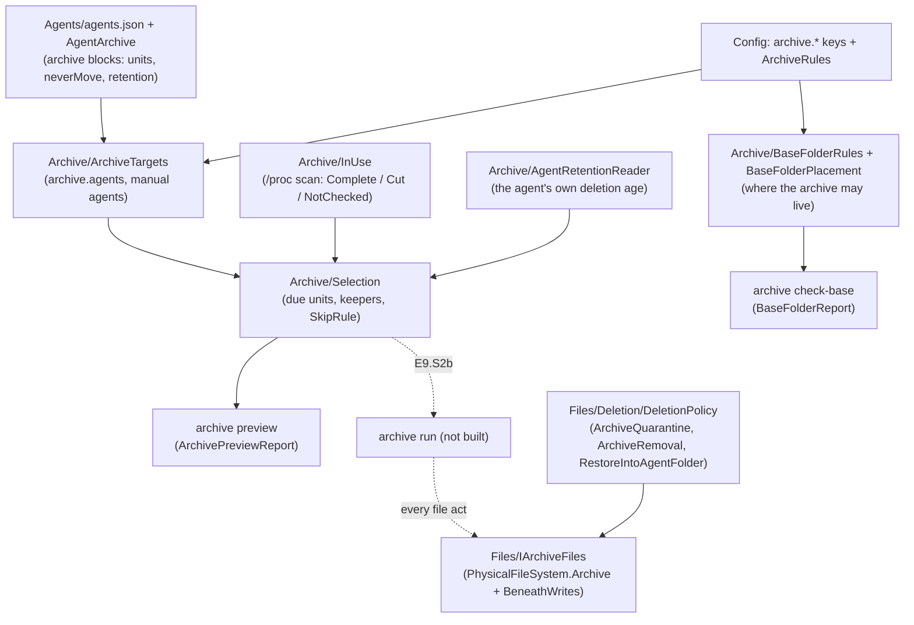

# Module — the AI-session archive (E9)

> Built so far: **E9.S0** (catalogue blocks, keys, base folder rules, `archive check-base`), **E9.S1** (the selection and
> `archive preview`, read-only), **E9.S2a** (the file seam `IArchiveFiles`, with its gate round). Not built yet: the move
> protocol and `archive run` (E9.S2b), restore / list / status (E9.S3), A13 in the engine and the root → user boundary (E9.S4),
> the Windows open-file check (E9.S5). The design and every decision: `todo/PLAN_wsl_care_daemon.md` §15r. The tests, their
> red runs and their break-it checks: [module_tests.md](module_tests.md), the E9 sections (from *The AI-session archive:
> catalogue blocks, keys, base folder* to *The E9.S2a gate round*). The longer history of each
> story: [architecture.md](architecture.md) § *The AI-session archive*.

## Purpose

AI coding agents (Claude Code, Codex, Gemini CLI, Antigravity) keep every session as files in their own folders, on both sides
(the WSL distribution and Windows). The archive moves sessions older than a configured age out of those folders into a base
folder the user chose, so the agent folders stay small and nothing is lost. It acts only as the user who owns the sessions,
never as root; it never touches `memory`, never replaces a file, and removes an agent's file only after its archived copy
hashes equal.

## How it fits together



## The move: two runs (plan §15r D2, risk consult 9/9.2; the seam is E9.S2a, the protocol E9.S2b)

A session moves in TWO phases, in two different runs. Phase 1 copies from the session's ORIGINAL names and touches nothing at
the source. Phase 2 runs at least `archive.removeAfterHours` later: it re-hashes the archived copy first, and only then
renames, checks and removes the source. A crash anywhere leaves the session whole at the source, or whole in the archive with
its index line, or both.

```mermaid
sequenceDiagram
    participant N as run N (phase 1)
    participant K as run N+k (phase 2, ≥ removeAfterHours later)
    participant Local as local state (inflight.json)
    participant Seam as IArchiveFiles
    participant Agent as agent folder
    participant Base as archive base (index.jsonl per agent / month / side)
    N->>Local: intent — the session as "copying" (atomic, flushed)
    N->>Seam: OpenFolderBeneath(base, agent/yyyy/MM/side/…) — each level made and flushed
    loop every file of the session
        N->>Seam: OpenSource(original name) — no link, regular, one link, this account's
        N->>Seam: CreateExclusive — O_EXCL / CREATE_NEW, never replacing
        N->>Base: the bytes, hashed as they are read; the file flushed
        N->>Seam: ReadBack — hashed again (one retry, then the run stops)
    end
    N->>Seam: FlushFolder
    N->>Base: the "archived" index line (every file, its hash, its MAC), flushed
    N->>Local: the entry moves to "archived"
    Note over N,Agent: phase 1 touches nothing at the source
    K->>Seam: ReadBack of every archived file — equal to the index? else "damaged", the source stays
    K->>Seam: QuarantineRename of each source file → name.wsl-care-q-runId (never replacing)
    K->>Seam: OpenSource of each quarantined file — hashed; any change → RenameBack all, "superseded"
    K->>Local: the entry moves to "removing" — the COMMIT POINT
    K->>Seam: RemoveVerified of each quarantined file (expected hash = the archived copy's)
    Seam->>Agent: Linux: write lease, hash, lease still whole, same inode → unlinkat<br/>Windows: one DELETE|READ handle, where its path says, hash → POSIX delete
    K->>Seam: RemoveEmptyFolder of the folders the session left (never recursive)
    K->>Base: the "sourceRemoved" (or "split") index line
    K->>Local: the entry is dropped
```

What the SEAM alone holds (E9.S2a) and what the PROTOCOL holds (E9.S2b) are not the same: `RemoveVerified` removes a file only
when its name carries the quarantine mark, the archived copy it names lies outside every protected place, that copy — opened
and hashed by the seam itself first — exists and equals the expected hash, and the quarantined bytes equal it too. That the
expected hash is the index's and the copy was written in an EARLIER run is E9.S2b's (plan §15r H1, *E9.S2a own review round*
C-M4 / S-M2).

## Core entities

| Entity | File | What it is |
|---|---|---|
| `AgentArchive`, `AgentArchiveRules` | `Agents/AgentArchive.cs`, `Agents/AgentArchiveRules.cs` | the catalogue's `archive` block per agent and its soundness rules; `IsNeverMoved` |
| `ArchiveTargets` | `Archive/ArchiveTargets.cs` | which agents the archive covers on this side (`archive.agents`, `manual:<name>`) |
| `BaseFolderReport`, `BaseFolderRules`, `BaseFolderPlacement` | `Archive/BaseFolderRules.cs`, `Archive/BaseFolderPlacement.cs` | whether a folder may be the archive base, judged under its canonical mount |
| `WindowsProfilePlaces`, `WindowsShares`, `WindowsIdentity`, `WindowsAccess` | `Archive/Windows*.cs` | the Windows places a base must stay clear of, share refusal, file identity, who may read it |
| `Selection`, `AgentSelection`, `SkipRule` | `Archive/Selection.cs` | the units due to move and why others stay |
| `InUseState` | `Archive/InUse.cs` | `Complete` / `Cut` / `NotChecked`; only `Complete` lets a due unit move |
| `RetentionFound` | `Archive/AgentRetentionReader.cs` | `Known(days)` / `Unknown(why)` — the agent's own deletion age |
| `ArchiveNames`, `QuarantineCount` | `Archive/ArchiveNames.cs`, `Archive/QuarantineCount.cs` | name rules, the quarantine mark `.wsl-care-q-`, the side folder |
| `ArchivePreviewReport` | `Archive/ArchivePreview.cs` | the answer of `archive preview` |
| `IArchiveFiles` and its closed results | `Files/IArchiveFiles.cs` | the ONLY way the archive touches a file: `SourceOpen`, `FolderBeneath`, `ExclusiveFile`, `FileHash`, `NoReplaceRename`, `FolderFlush`, `VerifiedRemoval`; `BeneathFolder` (abstract: each implementation subclasses it) |
| `ArchiveSourceRules` | `Files/ArchiveSourceRules.cs` | pure: what makes an opened session file copyable (regular, one link, this account's), and the Linux removal's checks after its hash |
| `FileIdentity` | `Files/IArchiveFiles.cs` | what names one file whatever its name (Linux device + inode, Windows volume serial + file index): the own-copy removal and the Windows base rules |
| `NativeOpen`, `WindowsFileInfo`, `BeneathWrites` | `Files/BeneathWrites.cs` | the natives and their closed answers |
| `ArchiveFileStep` | `Files/PhysicalFileSystem.Archive.cs` | the fault seam's steps between the primitive acts |
| archive permits | `Files/Deletion/DeletionPolicy.cs` | `ArchiveQuarantine`, `ArchiveRemoval`, `RestoreIntoAgentFolder`; rule `ArchiveShape`; `memory` never |

## Entry points

| Verb | Command file | Contract | State |
|---|---|---|---|
| `archive check-base <path> [--json]` | `WslCare.Cli/Commands/ArchiveCommand.cs` | `contracts/golden/head/archive-check-base.json`, capability `archive.checkBase` | built (E9.S0) |
| `archive preview [--agent <id>] [--json]` | `WslCare.Cli/Commands/ArchiveCommand.cs` | `contracts/golden/head/archive-preview.json`, capability `archive.preview` | built (E9.S1) |
| `config set archive.baseFolder` | the config verbs | the base rules, refused as root (81) | built (E9.S0) |
| `archive run`, `restore`, `list`, `status`, `reconcile --scan` | — | — | E9.S2b–E9.S4 |

Both built verbs run as the user; root is refused with exit 81.

## The seam's guarantees (E9.S2a, its gate round and its own review round)

- **Both — along the judged path:** every act locates its target on its REAL, link-free path first (the path the policy
  judged), and acts along it — never along the spelled path, so a link swapped in anywhere afterwards, the root's ancestors
  included, makes the act refuse. A folder handle the seam made is refused once closed (every verb holds a reference on it for
  the call). The archive's own copy is removed only while its name still names the file the create made (`FileIdentity`).
  Every failure is a closed answer — `Gone`, `Kept`, `Refused` — never an exception.
- **Linux:** the chain is opened from the file system's root with `O_NOFOLLOW` at every level, each folder from the previous
  one's descriptor, so a link on the way is refused and nothing can be swapped between the open and the act. Only a regular
  file is renamed, and the new name must hold the same device and inode afterwards. A removal takes a write lease (the kernel grants it
  only when no other open file description of the file exists), hashes, checks the lease is still whole and the name still
  names the same inode, and only then unlinks.
- **Windows:** the destination's folders are HELD by handles that never share delete — measured on NTFS, neither the folder nor
  any folder above it can be renamed while held, so a checked level stays the folder that was checked. A source, a rename or a
  removal is opened by its real path and then asked where it really is (`GetFinalPathNameByHandle`), compared with that real
  path: a file reached through a link swapped in after the check is never copied, renamed or removed. A name NTFS does not
  hold as itself (`:` — an alternate stream of another file —, a device name, a trailing dot or space) is refused. Under an
  agent's folder only the POSIX delete is used (without it the file stays). A new level's entry and the destination folder are flushed with
  `FlushFileBuffers` on the held folder handle (measured: it needs `FILE_ADD_FILE`; a read-only handle answers error 5). The
  rename and the empty-folder removal act THROUGH a checked handle (the rename with its folder held, by `FILE_RENAME_INFO`
  without replace; the folder by its delete disposition, which a non-empty folder refuses). A source must be owned by this
  account's SID, as on Linux by its uid.
- **Open, unmeasured (owner questions, plan §15r *E9.S2a gate round*):** whether the folder flush works on a Windows
  NETWORK share — until measured, a level whose entry cannot be flushed refuses, so nothing moves there; and a source owned by
  `Administrators` (an elevated process's file) is refused and stays, until the owner decides.
- **Both:** creates never replace (`O_EXCL` / `CREATE_NEW`), renames never replace (`RENAME_NOREPLACE` / no replace flag), a
  removal acts only when the bytes hash equal to the hash the caller passes (E9.S2b passes the archived copy's re-hash), and
  every write is judged first by the deletion policy on the REAL paths.

## External dependencies

- **Linux:** `libc` — `openat`, `mkdirat`, `renameat2`, `unlinkat`, `statx`, `fcntl` (`F_SETLEASE`, `F_SETSIG`, `F_GETLEASE`),
  `fsync`; `/proc/<pid>/fd` and `/proc/self/mountinfo`.
- **Windows:** `kernel32` — `CreateFileW`, `GetFileInformationByHandle`, `GetFinalPathNameByHandleW`, `SetFileInformationByHandle`
  (delete disposition, `FILE_RENAME_INFO` rename), `FlushFileBuffers`; the file's security descriptor (owner SID) through
  `System.Security.AccessControl`.
- **Configuration:** the `archive.*` keys (`Config/ConfigKeys.cs`, `Config/ConfigKeys.Numbers.cs`) and their coupled rules
  (`Config/NumberRules.cs` → `ArchiveRules`).
- **Other modules:** the AI-agent catalogue and walk (E7), the deletion policy (E3), `TreeWalk` (`TreeRules.ListFiles`).
