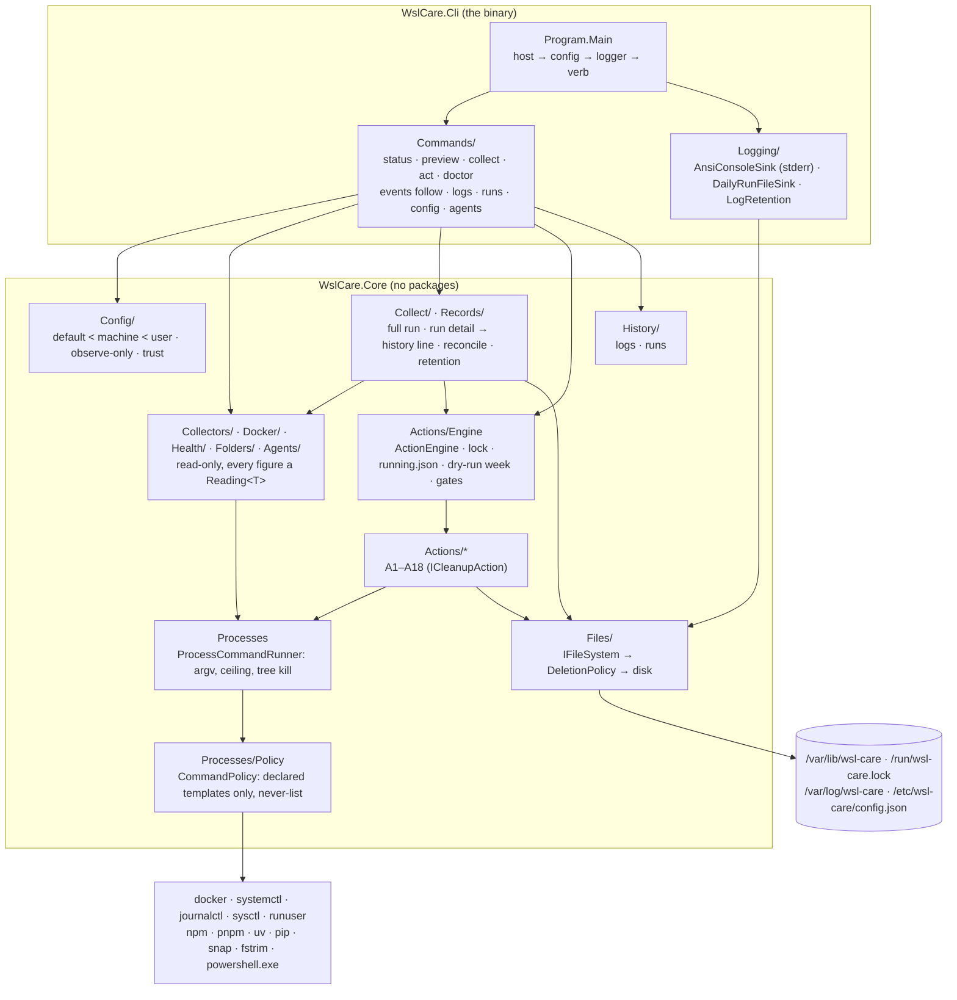
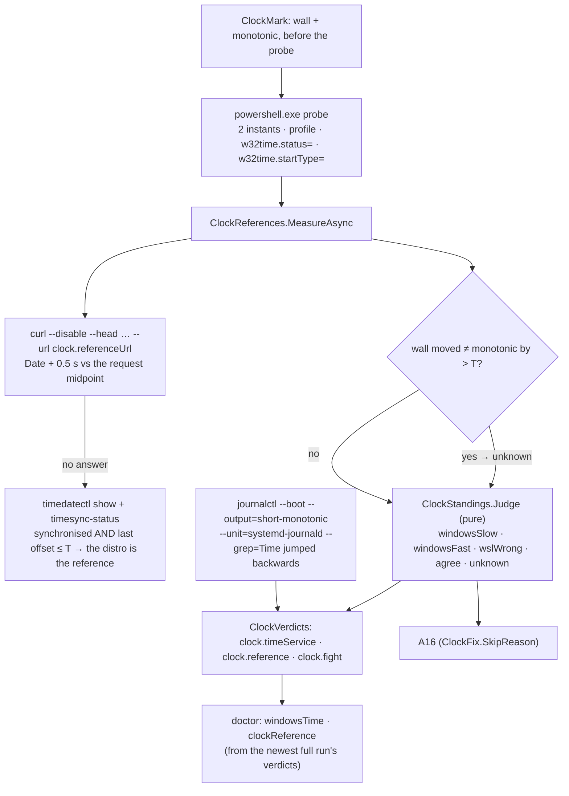

# module_daemon — the `wsl-care` daemon / CLI (`src_daemon/`)

> The module overview of the daemon. The deep detail stays where each epic wrote it, in
> [architecture.md](architecture.md) (the daemon half of E6 in [architecture-daemon-e6.md](architecture-daemon-e6.md)); the tests are in [module_tests.md](module_tests.md). This file is the map between
> them, in the same shape as [module_vs_code.md](module_vs_code.md). Added 2026-10-06 by the retro review of PR #7 (the
> review gate found no module document for the daemon, `common.knowledge-base`); the same finding on PR #5 was first
> rejected as a layout question and is answered by this file too.

## Purpose

Keep one developer workstation from degrading over the working day. A C# Native-AOT binary (`wsl-care`, `linux-x64`,
`linux-arm64`, `win-x64`) **measures** the machine — memory, processes, Docker, disk, health, AI-agent folders — and,
run by the root systemd timer inside WSL, **cleans** behind one switch per action: every cleanup has a preview, a
measured result, a run record and an `auto` switch; the never-lists are tested, not trusted. The VS Code extension is a
view over its CLI contract.

## Diagram

## Core entities

| Entity | Where | What it is |
|---|---|---|
| `EffectiveConfig` / `ConfigLoadResult` | `Core/Config` | the three layers merged with each value's layer; `ObserveOnly` when a layer is invalid; `UserLayerSkipped` when root has no single target user |
| `Reading<T>` | `Core/Collectors` | a figure or the reason it is unavailable — never a silent zero |
| `RunRecord` / run detail | `Core/Records`, `Core/Collect` | one `history.jsonl` line per run, written AFTER its `runs/{day}/{runId}.json` detail |
| `ActionId`, `ICleanupAction`, `ActionPreview`, `ActionRun` | `Core/Actions` | an action's id (= its `auto.*` key), its live preview and its measured result |
| `CommandTemplate`, `CommandPolicy` | `Core/Processes/Policy` | the only argv shapes that may run; everything else is refused |
| `DeletionPolicy`, `ProtectedRoots` | `Core/Files/Deletion` | the one judge of every delete and move: agent folders, `~/git`, Claude's temp folder, memory, and their ancestors |
| `RunningFile`, `FirstTimerRun` | `Core/Actions/Engine` | `running.json` (pid + start + heartbeat) and the start of the timer's 7-day dry run |
| `WindowsTimeService`, `ClockReference`, `ClockStanding` / `ClockJudgement` | `Core/Health` | the Windows Time guard (section below): the service the probe printed, the independent reference, which clock is wrong |

## Entry points

The CLI verbs, as `CommandLine.Commands` spells them — the derived verb register in [module_tests.md](module_tests.md)
§ *The derived verb register* fails on a verb missing there. The systemd units (`src_daemon/systemd/`) start
`collect --timer` (the timer), `events follow` (the follower) and the `wsl-care-act@` template (detached runs).

## External dependencies

Read: `/proc`, cgroup v2, `/etc/passwd`, `/etc/wsl.conf`, `docker` (read verbs, each with a ceiling), `systemctl show`,
`journalctl`, `timedatectl` (`show`, `timesync-status`), `powershell.exe` (the Windows clock and the Windows Time service,
one literal argv), `curl` (one HEAD for the clock reference's `Date`, a slotted template; since 2026-10-08). Act: `docker` prunes and removals,
`sysctl -w` (two literal keys), `runuser -u <user> --` for user-scoped tools, `npm` / `pnpm` / `uv` / `pip` / `dotnet
nuget`, `snap`, `fstrim`, `chronyc` / `hwclock`, pidfd signals (A11, A18). Packages: Serilog only (CLI); `WslCare.Core`
has none.

## Where the detail is

| Area | architecture.md section |
|---|---|
| seams: config layers, `ICommandRunner`, `IFileSystem` + `DeletionPolicy`, `IHostPaths`, logging | *The seams (E1.S2)*, *Fail-closed resolution and the atomic write*, *The seams inside the binary* |
| collectors and `status` | *The collectors and `status` (E2.S1)* |
| Docker and `preview` | *The Docker collectors and `preview` (E2.S2)* |
| the full run, `doctor`, `events follow` | *The full run, `doctor` and the events follower (E2.S3)* |
| the engine, the command policy, `act` | *The action engine, the command policy and `act` (E3.S1)* |
| the irreversible deletions | *The irreversible deletions (E3.S2)* |
| memory / build-server / trim / clock actions, the timer pass, `logs` / `runs` | *The memory, build-server, trim and clock actions, the timer pass, `logs` / `runs` (E3.S3)*, *E3 review fixes (2026-10-03)* |
| installer and units; release | *The installer and the units (E4.S1)*, *The release pipeline (E4.S2)* |
| the read contract, detached runs | *The verdicts in `status`, `productVersion` and the golden contracts (E5.S0)*; *The daemon read contract (E6.S0)* and *Detached runs, the request, the stop (E6.S1)* now in [architecture-daemon-e6.md](architecture-daemon-e6.md) |
| configuration trust, AI agents, A18, numbers | *The configuration trust (E7.S0, 2026-10-05, plan §15q R1)*, *The AI agents: catalogue, discovery, the walk (E7.S1, 2026-10-05, plan §15q D1–D3, R2)* with its *Manual agents and `agents probe` (E7.S2, 2026-10-05, plan §15q D4, R2)*, *A18 — orphaned AI-agent processes (E7.S2b, 2026-10-05, owner decision)*, *Numbers are configuration (standing convention, owner rule 2026-10-05)* |
| the MCP server instances of the AI agents (`Core/Mcp/`, `status --json` `mcpServers`) | [module_mcp_servers.md](module_mcp_servers.md) (E7.S2d, 2026-10-06/07); architecture.md *MCP server instances of the AI agents* points there |
| tests and the harness | [module_tests.md](module_tests.md), architecture.md *The scenario harness (E1.S3)* |
| the Windows Time guard (2026-10-08) | the section below; the plan [PLAN_windows_time_guard.md](../todo/PLAN_windows_time_guard.md), the incident [2026-10-08_windows_time_stopped.md](2026-10-08_windows_time_stopped.md) |

## The Windows Time guard (PLAN_windows_time_guard.md, 2026-10-08)

Built after the incident of 2026-10-08: the Windows Time service stopped, Windows 7 200 s slow, and inside WSL
Hyper-V's time sync (the host's clock) and systemd-timesyncd (NTP's) set the clock against each other every ≈ 33 s.

- **Detection.** The probe's two TAGGED lines carry the service state (read after both instants, so the launch latency is
  unchanged; parsed by tag, never by position). The reference is the HTTP `Date` of `clock.referenceUrl` (machine layer
  only; default `https://www.microsoft.com` — github.com's measured up to 6.5 s stale), else timesyncd when it is
  synchronised and its last NTP sample is within `clock.referenceToleranceSeconds` (30). The standing judges Windows
  FIRST, so a distro Hyper-V dragged to the wrong host time still names Windows (and says the distro is off too).
- **Verdicts.** `clock.timeService` is critical only while `clock.reference` names Windows — a stopped service is a
  warning while the clock agrees (Windows trigger-starts it on a workgroup PC); a Manual start warns while
  `clock.manualStartWarns`. `clock.reference` is critical for Windows, a warning for the distro. `clock.fight` counts
  journald's backward jumps in the last 4 h of THIS boot on the monotonic clock (the lines carry the wall time after the
  jump, which `--since` would miss) against `thresholds.timeJumpsBackWarnPer4h` (10). `doctor` reads two of them from the
  newest full run — no probe, so its worst case (the extension's `worstCases.ts`) does not move; only a wrong Windows
  clock makes it unhealthy.
- **A16 steps only with proof.** Skips, in order: timesyncd synchronised (and, when Windows is off, *"the Windows clock is
  wrong, not WSL's"*); the clock agrees; the reference names Windows; NO reference (*"no independent reference can say
  which is wrong"* — this gives up stepping a lagging distro on an offline machine, deliberately); a step that would not
  bring the distro closer to the reference. Then the old gates.
- **The live contract** fails a probe a minute off with `ClockStandings.Diagnosis`: which clock, the service as printed,
  and the fix.
- **The fix is the extension's** (*Start Windows Time*, [module_vs_code.md](module_vs_code.md)); the SYSTEM scheduled task
  that would restart the service by itself is the plan's story 2, not built.
