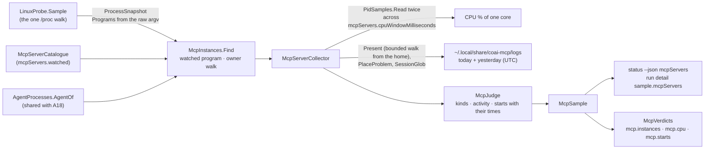

# module_mcp_servers — the MCP server instances of the AI agents (`src_daemon/src/WslCare.Core/Mcp/`)

> The module of plan §15q story **E7.S2d** (owner request 2026-10-06, built 2026-10-06/07): a READ-ONLY daemon collector and
> the `status --json` `mcpServers` block. The plan and its review rounds are in
> [PLAN_wsl_care_daemon.md](../todo/PLAN_wsl_care_daemon.md) § *E7.S2d*; the tests, their red-first record and their teeth
> in [module_tests.md](module_tests.md) § *MCP server instances of the AI agents*; the measurements that asked for it in
> [2026-10-06_live_measurements.md](2026-10-06_live_measurements.md) § 6b. [architecture.md](architecture.md) names the
> module in its map.

## Purpose

Show how many MCP server processes of the AI agents run, which are idle, which burn CPU with no log write, how much CPU and
memory they hold together, and **when** each server was started lately — so a restart storm is visible and attributable to
its own time. Measured 2026-10-06 in WSL: seven `coai-mcp` (one stdio MCP server per Claude Code session) at 27–54 % of a
core each with no log line for 10+ minutes; 34 starts in 16:50–17:00Z, which began **before** the 0.43.0 binary's mtime of
16:54Z (the owner, 2026-10-07: a count per window cannot say when churn began — the start times can). Nothing is stopped:
a stop action is owner question Q-M1.

## Diagram

## Entities

| Type | What it is |
|---|---|
| `McpServerCatalogue`, `McpServerEntry`, `McpLogLayout` (`None` \| `FamilyRunLogs`) | the servers the daemon recognises — `coai-mcp` today — by PROGRAM name (argv[0]), each with an optional log layout; a new layout is a new case, never an `if` on a name |
| `McpInstances` (`Find`, `ServerOf`, `OwnerOf`) | instances in the snapshot; owner = the first ancestor of the `ai-agents` family that `AgentProcesses.AgentOf` attributes to one catalogue agent, else `Orphaned` when re-parented; under a live non-agent host = not an instance (`notUnderAgent`) |
| `McpRunLogs`, `McpLogs`, `McpLogFile` | the run logs of today and yesterday (UTC), names and stat only; `Present` walks down from the home with the bounded listing so an unreadable or cut folder is "cannot tell", never "no logs" |
| `McpServerCollector`, `McpSampling` | the one road in (`status`, `collect`); the CPU window waited only when an instance runs; the Windows binary answers unavailable |
| `McpJudge` | the pure decisions: kind (`unknown` / `starting` / `idle` / `busy` / `busyWithoutActivity`), last log write, starts (a `00-00-00` continuation excepted), each start's `McpStart` (time, pid, last write, still running) |
| `McpSample`, `McpServerSummary`, `McpStarts` (`McpStartsBasis` `LogNames` \| `LiveYounger`) | the domain answer |
| `Status/McpServersReport` (+ `McpServerReport.StartTimes`, `McpInstanceReport`) | the wire shape |
| `Thresholds/McpVerdicts` | `mcp.instances`, `mcp.cpu`, `mcp.starts`, each saying when it covers only the listed instances |
| `Collectors/Procfs/PidSamples` | the per-pid sampler (start ticks, CPU ticks, terminal, owner) shared with A11 and A18; `StartTolerance` |

## Flows

1. **Instances:** one snapshot; the program from the RAW argv (`ProcessEntry.Programs`, consultation C-2); at most
   `mcpServers.maxInstances` listed and CPU-sampled — every count says so when it covers fewer.
2. **CPU:** `stat` read, the window waited (`mcpServers.cpuWindowMilliseconds`), read again: 100 × (Δticks ÷ ticks per
   second) ÷ the longer of the window and the elapsed time. A pid gone or reused = unavailable, never 0. The start used
   for the log rules is taken from the instant BEFORE the window (own review M1).
3. **Activity:** the newest last-write of that pid's run logs named after the process started. `busyWithoutActivity` =
   CPU at or above `mcpServers.idleCpuPercent` and that write older than `mcpServers.activityWindowMinutes`; no log = never
   "without activity" (an absent write does not prove absent work).
4. **Starts:** the run logs named within `mcpServers.startsWindowMinutes`, a midnight continuation excepted (a live process
   of THIS server started before that midnight, else a file of the same pid the day before); each listed with its time,
   pid, last write and whether it still runs, newest first, at most `mcpServers.maxStartsListed` — a dead start whose log
   lived ≈ 30 s is the shape of an agent's MCP connect timeout. No layout = the live instances younger than the window,
   marked a lower bound.
5. **Verdicts and wire:** the three verdicts judged now in `status` (basis `sample`) and in each full run's detail; the
   block in `status --json` and the run detail's `sample`; capability `status.mcpServers`; `limits` publishes the two waits.

## Entry points

`wsl-care status [--json]` (the block, the verdicts, one text line) and `wsl-care collect` (the run detail). No verb of its
own.

## Configuration (every number a key — the owner's rule of 2026-10-05)

`mcpServers.watched` (closed over the catalogue), `.cpuWindowMilliseconds` (200–5000, 1000, machine-only),
`.idleCpuPercent` (2), `.idleMinAgeMinutes` (10), `.activityWindowMinutes` (10), `.startsWindowMinutes` (10, at most a day),
`.warnInstances` (12), `.warnCpuPercent` (100 = one core), `.warnStarts` (10), `.maxInstances` (256, machine-only),
`.maxLogEntries` (20000, machine-only), `.logListMilliseconds` (1000, machine-only), `.maxStartsListed` (50). Ranges and
safe directions: `contracts/config-keys.json`.

## Dependencies

The process snapshot (`Collectors/ProcessCollector`), the agent catalogue and `AgentProcesses.AgentOf` (`Agents/`), the
bounded listing (`IFileSystem.ListEntries(path, ListingBounds)`) and `SessionGlob`, `AgentWalk.PlaceProblem`, the per-pid
sampler (`Collectors/Procfs/PidSamples`). No command runner, no signal sender: read-only by construction.

## Residuals and what it does not cover

- A link swapped in between the lstat checks and the listing (inherited from `SessionGlob`'s other users): names only,
  capped, nothing opened; the full fix is a descriptor-based listing for every user, a story of its own.
- A WSL session relay (`/init` with a pid other than 1) as a server's parent is a live non-agent parent: such a server is
  `notUnderAgent`, not an orphaned instance.
- `status` takes 2 s **plus** the CPU window when a server runs (owner question Q-M5).
- **Windows:** `coai-mcp.exe` (VS Code's `globalStorage`, `remsoftdev.connect-other-ais`) is not counted — the Windows binary
  has no process collector yet; the next step is E11 (the same catalogue, a Toolhelp snapshot for parents, `GetProcessTimes`
  twice).
- Servers not in the catalogue (`creds-mcp`, `playwright-mcp` are in the captured 2026-10-02 tree) are not counted —
  owner question Q-M2.
