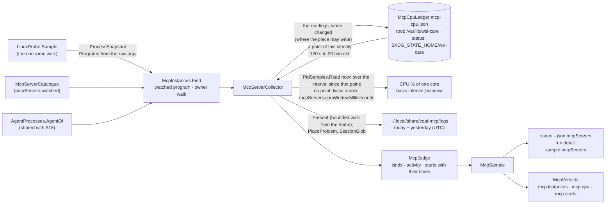

# module_mcp_servers — the MCP server instances of the AI agents (`src_daemon/src/WslCare.Core/Mcp/`)

> The module of plan §15q story **E7.S2d** (owner request 2026-10-06, built 2026-10-06/07): a READ-ONLY daemon collector and
> the `status --json` `mcpServers` block. The plan and its review rounds are in
> [PLAN_wsl_care_daemon.md](../todo/PLAN_wsl_care_daemon.md) § *E7.S2d*; the tests, their red-first record and their teeth
> in [module_tests.md](module_tests.md) § *MCP server instances of the AI agents*; the measurements that asked for it in
> [2026-10-06_live_measurements.md](2026-10-06_live_measurements.md) § 6b. [architecture.md](architecture.md) names the
> module in its map. **Since 2026-10-07 (plan E14 S1,
> [PLAN_twenty_sessions_all_day.md](../todo/PLAN_twenty_sessions_all_day.md))** an instance's CPU is measured over the
> interval since its previous sample, from a per-caller CPU ledger — the 1 s window could not see a server that bursts about
> once a minute and reported it idle ([2026-10-07_evening_overload.md](2026-10-07_evening_overload.md) M1–M3).

## Purpose

Show how many MCP server processes of the AI agents run, which are idle, which burn CPU with no log write, how much CPU and
memory they hold together, and **when** each server was started lately — so a restart storm is visible and attributable to
its own time. Measured 2026-10-06 in WSL: seven `coai-mcp` (one stdio MCP server per Claude Code session) at 27–54 % of a
core each with no log line for 10+ minutes; 34 starts in 16:50–17:00Z, which began **before** the 0.43.0 binary's mtime of
16:54Z (the owner, 2026-10-07: a count per window cannot say when churn began — the start times can). Nothing is stopped:
a stop action is owner question Q-M1, now plan E14 S2 (A19).

## Diagram

## Entities

| Type | What it is |
|---|---|
| `McpServerCatalogue`, `McpServerEntry`, `McpLogLayout` (`None` \| `FamilyRunLogs`) | the servers the daemon recognises — `coai-mcp` today — by PROGRAM name (argv[0]), each with an optional log layout; a new layout is a new case, never an `if` on a name |
| `McpInstances` (`Find`, `ServerOf`, `OwnerOf`) | instances in the snapshot; owner = the first ancestor of the `ai-agents` family that `AgentProcesses.AgentOf` attributes to one catalogue agent, else `Orphaned` when re-parented; under a live non-agent host = not an instance (`notUnderAgent`) |
| `McpRunLogs`, `McpLogs`, `McpLogFile` | the run logs of today and yesterday (UTC), names and stat only; `Present` walks down from the home with the bounded listing so an unreadable or cut folder is "cannot tell", never "no logs" |
| `McpServerCollector`, `McpSampling` | the one road in (`status`, `collect`), handed the caller's ledger place; the CPU window waited only when a listed instance has no baseline; the Windows binary answers unavailable |
| `McpCpuLedger`, `McpCpuFile` / `McpCpuEntry` / `McpCpuPoint`, `McpCpuLedgerPlace` (`RootState` \| `OwnState` \| `None`), `McpCpuBounds` (E14 S1) | the CPU ledger: per identity (boot id, pid, start ticks) at most two points (ticks, wall, monotonic ms); `Baseline` = the newest point 120 s–20 min old (monotonic age, ticks not above now's); `Next` = the two-point rule; `Record` writes only when changed, atomically and 0600, where the place may |
| `McpCpu`, `McpCpuBasis` (`None` \| `Window` \| `Interval`), `McpCpuBaseline` | an instance's CPU with what it was measured over and for how long; whether a sample's readings are recorded, and why not |
| `Collectors/Procfs/SampleTime`, `BootIdentity` | an instant on both clocks and the boot id — moved from A18's `AgentCpuHistory` so a collector does not depend on the Actions layer |
| `McpJudge` | the pure decisions: kind (`unknown` / `starting` / `idle` / `busy` / `busyWithoutActivity`), last log write, starts (a `00-00-00` continuation excepted), each start's `McpStart` (time, pid, last write, still running) |
| `McpSample`, `McpServerSummary`, `McpStarts` (`McpStartsBasis` `LogNames` \| `LiveYounger`) | the domain answer |
| `Status/McpServersReport` (+ `McpServerReport.StartTimes`, `McpInstanceReport`) | the wire shape |
| `Thresholds/McpVerdicts` | `mcp.instances`, `mcp.cpu`, `mcp.starts`, each saying when it covers only the listed instances |
| `Collectors/Procfs/PidSamples` | the per-pid sampler (start ticks, CPU ticks, terminal, owner) shared with A11 and A18; `StartTolerance` |

## Flows

1. **Instances:** one snapshot; the program from the RAW argv (`ProcessEntry.Programs`, consultation C-2); at most
   `mcpServers.maxInstances` listed and CPU-sampled — every count says so when it covers fewer.
2. **CPU (E14 S1):** each instance's `stat` read once; when the caller's ledger holds a point of the same identity (boot
   id, pid, start ticks) between `mcpServers.cpuIntervalMinSeconds` (120) and `mcpServers.cpuIntervalMaxMinutes` (20) old on
   the MONOTONIC clock, CPU = 100 × (Δticks ÷ ticks per second) ÷ (Δmonotonic in seconds), basis `interval`. Otherwise —
   a first sighting, another boot, a reused pid, a point older than the maximum, an unreadable or malformed ledger — the
   window fallback: the window waited (`mcpServers.cpuWindowMilliseconds`), read again, 100 × Δticks ÷ ticks per second ÷
   the longer of the window and the elapsed time, basis `window`. A pid gone or reused = unavailable, never 0. The start used
   for the log rules is taken from the instant BEFORE the window (own review M1). The maximum keeps the kind about NOW: an
   average over hours would call a now-quiet server busy without activity (plan review finding 3).
2b. **The ledger (E14 S1):** the readings are merged by the two-point rule (a new identity stores its point; the newest
   stored point at least the minimum old becomes the older and now the newer; otherwise both stay — two callers a second
   apart both measure over the interval) and written only when that changed. **Where:** the root timer's `collect` →
   `/var/lib/wsl-care/mcp-cpu.json` (root's state, `ReadStateFile`); an unprivileged `status` →
   `$XDG_STATE_HOME/wsl-care/mcp-cpu.json` (`ReadUserFile`: owner = this uid, no link); `status` as root reads root's and
   writes NOTHING (every root verb is re-homed to the target user; status never writes `/var/lib/wsl-care`); an unprivileged
   `collect` has no ledger. With the 4-hour timer, root's points are older than the maximum, so the run detail's CPU is the
   window's until a denser root sampler exists (plan E14 S2, Q1b).
3. **Activity:** the newest last-write of that pid's run logs named after the process started. `busyWithoutActivity` =
   CPU at or above `mcpServers.idleCpuPercent` and that write older than `mcpServers.activityWindowMinutes`; no log = never
   "without activity" (an absent write does not prove absent work).
4. **Starts:** the run logs named within `mcpServers.startsWindowMinutes`, a midnight continuation excepted (a live process
   of THIS server started before that midnight, else a file of the same pid the day before); each listed with its time,
   pid, last write and whether it still runs, newest first, at most `mcpServers.maxStartsListed` — a dead start whose log
   lived ≈ 30 s is the shape of an agent's MCP connect timeout. No layout = the live instances younger than the window,
   marked a lower bound.
5. **Verdicts and wire:** the three verdicts judged now in `status` (basis `sample`) and in each full run's detail; the
   block in `status --json` and the run detail's `sample`; capability `status.mcpServers`; `limits` publishes the two waits.

## Entry points

`wsl-care status [--json]` (the block, the verdicts, one text line) and `wsl-care collect` (the run detail). No verb of its
own.

## Configuration (every number a key — the owner's rule of 2026-10-05)

`mcpServers.watched` (closed over the catalogue), `.cpuWindowMilliseconds` (200–5000, 1000, machine-only),
`.idleCpuPercent` (2), `.idleMinAgeMinutes` (10), `.activityWindowMinutes` (10), `.startsWindowMinutes` (10, at most a day),
`.warnInstances` (12), `.warnCpuPercent` (100 = one core), `.warnStarts` (10), `.maxInstances` (256, machine-only),
`.maxLogEntries` (20000, machine-only), `.logListMilliseconds` (1000, machine-only), `.maxStartsListed` (50),
`.cpuIntervalMinSeconds` (10–600, 120) and `.cpuIntervalMaxMinutes` (10–1440, 20) — E14 S1, display while they steer only
this metric; the ledger's read cap is `records.maxStateFileBytes`. Ranges and safe directions: `contracts/config-keys.json`.
The wire (additive): per instance `cpuBasis` (`interval` \| `window` \| `none`) and `cpuIntervalSeconds`; the block's
`cpuBaseline` (`file`, `recorded`, `reason`).

## Dependencies

The process snapshot (`Collectors/ProcessCollector`), the agent catalogue and `AgentProcesses.AgentOf` (`Agents/`), the
bounded listing (`IFileSystem.ListEntries(path, ListingBounds)`) and `SessionGlob`, `AgentWalk.PlaceProblem`, the per-pid
sampler (`Collectors/Procfs/PidSamples`), the boot id and both clocks (`Collectors/Procfs/SampleTime`). No command runner, no
signal sender: read-only towards the servers by construction. Its one write is the CPU ledger (`IFileSystem.WritePrivateFileAtomically`).

## Residuals and what it does not cover

- A link swapped in between the lstat checks and the listing (inherited from `SessionGlob`'s other users): names only,
  capped, nothing opened; the full fix is a descriptor-based listing for every user, a story of its own.
- A WSL session relay (`/init` with a pid other than 1) as a server's parent is a live non-agent parent: such a server is
  `notUnderAgent`, not an orphaned instance.
- `status` takes 2 s **plus** the CPU window when a server has no baseline (owner question Q-M5); with every instance in
  the ledger it waits nothing.
- **The ledger (E14 S1):** an unprivileged `status` writes one file it did not write before (owner question Q9 of plan E14);
  a `status` killed between the atomic write's temp file and its rename (the extension's 20 s ceiling) leaves that temp file
  beside the ledger — written only when changed, so rarely; its sweep is S2's. Whether the guest's monotonic clock stops
  while the Windows host sleeps is not measured (S8): if it does not, a reading across a sleep is diluted, never inflated.
- **The run detail's CPU is the window's** until S2 gives root a sampler denser than the 4-hour timer.
- **Windows:** `coai-mcp.exe` (VS Code's `globalStorage`, `remsoftdev.connect-other-ais`) is not counted — the Windows binary
  has no process collector yet; the next step is E11 (the same catalogue, a Toolhelp snapshot for parents, `GetProcessTimes`
  twice).
- Servers not in the catalogue (`creds-mcp`, `playwright-mcp` are in the captured 2026-10-02 tree) are not counted —
  owner question Q-M2.
