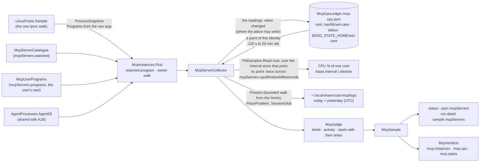
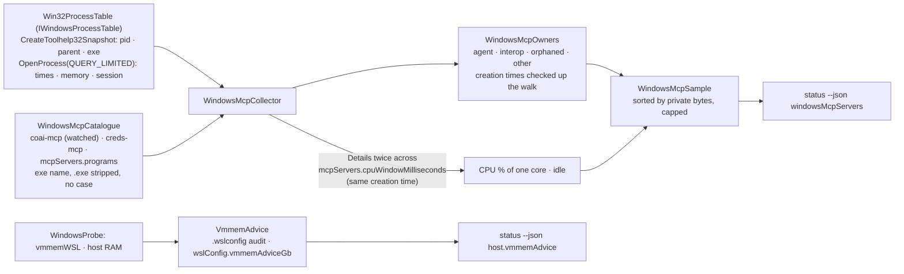

# module_mcp_servers — the MCP server instances of the AI agents (`src_daemon/src/WslCare.Core/Mcp/`)

> The module of plan §15q story **E7.S2d** (owner request 2026-10-06, built 2026-10-06/07): a READ-ONLY daemon collector and
> the `status --json` `mcpServers` block. The plan and its review rounds are in
> [PLAN_wsl_care_daemon.md](../todo/PLAN_wsl_care_daemon.md) § *E7.S2d*; the tests, their red-first record and their teeth
> in [module_tests.md](module_tests.md) § *MCP server instances of the AI agents*; the measurements that asked for it in
> [2026-10-06_live_measurements.md](2026-10-06_live_measurements.md) § 6b. [architecture.md](architecture.md) names the
> module in its map. **Since 2026-10-07 (plan E14 S1,
> [PLAN_twenty_sessions_all_day.md](../todo/PLAN_twenty_sessions_all_day.md))** an instance's CPU is measured over the
> interval since its previous sample, from a per-caller CPU ledger — the 1 s window could not see a server that bursts about
> once a minute and reported it idle ([2026-10-07_evening_overload.md](2026-10-07_evening_overload.md) M1–M3).

## Purpose

Show how many MCP server processes of the AI agents run, which are idle, which burn CPU with no log write, how much CPU and
memory they hold together, and **when** each server was started lately — so a restart storm is visible and attributable to
its own time. Measured 2026-10-06 in WSL: seven `coai-mcp` (one stdio MCP server per Claude Code session) at 27–54 % of a
core each with no log line for 10+ minutes; 34 starts in 16:50–17:00Z, which began **before** the 0.43.0 binary's mtime of
16:54Z (the owner, 2026-10-07: a count per window cannot say when churn began — the start times can). The metric stops nothing; the
stop action is A19 (E14 S2a, below).

## Diagram

## Entities

| Type | What it is |
|---|---|
| `McpServerCatalogue`, `McpServerEntry` (+ `RunAs`: `McpScriptMatch` — interpreters, script file names, the folder the script must be under; E14 S2d), `McpLogLayout` (`None` \| `FamilyRunLogs`) | the servers the daemon recognises — `coai-mcp` by its program and `playwright-mcp` (E14 S2d) as the SCRIPT `node`/`nodejs` runs from its bin link `/node_modules/.bin/` or its package `/node_modules/@playwright/mcp/` (never a same-named file of another package) (`npx @playwright/mcp`: `npm exec` → a shell → `node …/.bin/playwright-mcp`; the launchers are not the server; `ProcessEntry.Script` = the first word after the program that is no option) — by PROGRAM name (argv[0]), each with an optional log layout; a new layout is a new case, never an `if` on a name |
| `McpUserPrograms`, `McpServerOrigin` (`Catalogue` \| `UserProgram`), `TextRule.McpProgramName` (E14 S2c) | the user's own servers, `mcpServers.programs`: an OPEN list of program file names (`^[A-Za-z0-9][A-Za-z0-9._+-]{0,63}$`, at most 32), each refused when it names an AI agent's program, an interpreter, shell or launcher (a version suffix included: `python3.12`), `wsl-care`, a catalogue server, or ends in `.exe`; each becomes an `McpServerEntry` with no log layout and origin `UserProgram`; `McpSettings.Watched` = the watched catalogue servers + these |
| `McpInstances` (`Find`, `ServerOf`, `OwnerOf`) | instances in the snapshot; owner = the first ancestor of the `ai-agents` family that `AgentProcesses.AgentOf` attributes to one catalogue agent, else `Orphaned` when re-parented; under a live non-agent host = not an instance (`notUnderAgent`) |
| `McpRunLogs`, `McpLogs`, `McpLogFile` | the run logs of today and yesterday (UTC), names and stat only; `Present` walks down from the home with the bounded listing so an unreadable or cut folder is "cannot tell", never "no logs" |
| `McpServerCollector`, `McpSampling` | the one road in (`status`, `collect`), handed the caller's ledger place; the CPU window waited only when a listed instance has no baseline; the Windows binary answers unavailable |
| `McpCpuLedger`, `McpCpuFile` / `McpCpuEntry` / `McpCpuPoint`, `McpCpuLedgerPlace` (`RootState` \| `OwnState` \| `None`), `McpCpuBounds` (E14 S1) | the CPU ledger: per identity (boot id, pid, start ticks) at most two points (ticks, wall, monotonic ms); `Baseline` = the newest point 120 s–20 min old (monotonic age, ticks not above now's); `Next` = the two-point rule, at most `records.maxStateFileBytes` ÷ `BytesPerEntry` (320) entries, the newest processes kept; `Record` writes one compact JSON line only when changed, atomically and 0600, where the place may; a file that is not well formed (another schema, a null entry or point) is no baseline |
| `McpCpu`, `McpCpuBasis` (`None` \| `Window` \| `Interval`), `McpCpuBaseline` | an instance's CPU with what it was measured over and for how long; whether a sample's readings are recorded, and why not |
| `Collectors/Procfs/SampleTime`, `BootIdentity` | an instant on both clocks and the boot id — moved from A18's `AgentCpuHistory` so a collector does not depend on the Actions layer |
| `McpJudge` | the pure decisions: kind (`unknown` / `starting` / `idle` / `busy` / `busyWithoutActivity`), last log write, starts (a `00-00-00` continuation excepted), each start's `McpStart` (time, pid, last write, still running) |
| `McpSample`, `McpServerSummary`, `McpStarts` (`McpStartsBasis` `LogNames` \| `LiveYounger`) | the domain answer |
| `Status/McpServersReport` (+ `McpServerReport.StartTimes`, `McpInstanceReport`) | the wire shape |
| `Thresholds/McpVerdicts` | `mcp.instances`, `mcp.cpu`, `mcp.starts`, each saying when it covers only the listed instances |
| `Collectors/Procfs/PidSamples` | the per-pid sampler (start ticks, CPU ticks, terminal, owner) shared with A11 and A18; `StartTolerance` |

## Flows

1. **Instances:** one snapshot; the program from the RAW argv (`ProcessEntry.Programs`, consultation C-2); at most
   `mcpServers.maxInstances` listed and CPU-sampled — every count says so when it covers fewer.
2. **CPU (E14 S1):** each instance's `stat` read once; when the caller's ledger holds a point of the same identity (boot
   id, pid, start ticks) between `mcpServers.cpuIntervalMinSeconds` (120) and `mcpServers.cpuIntervalMaxMinutes` (20) old on
   the MONOTONIC clock, CPU = 100 × (Δticks ÷ ticks per second) ÷ (Δmonotonic in seconds), basis `interval`. Otherwise —
   a first sighting, another boot, a reused pid, a point older than the maximum, an unreadable or malformed ledger — the
   window fallback: the window waited (`mcpServers.cpuWindowMilliseconds`), read again, 100 × Δticks ÷ ticks per second ÷
   the longer of the window and the elapsed time, basis `window`. A pid gone or reused = unavailable, never 0. The start used
   for the log rules is taken from the instant BEFORE the window (own review M1). The maximum keeps the kind about NOW: an
   average over hours would call a now-quiet server busy without activity (plan review finding 3).
2b. **The ledger (E14 S1):** the readings are merged by the two-point rule (a new identity stores its point; the newest
   stored point at least the minimum old becomes the older and now the newer; otherwise both stay — two callers a second
   apart both measure over the interval) and written only when that changed. **Where:** the root timer's `collect` →
   `/var/lib/wsl-care/mcp-cpu.json` (root's state, `ReadStateFile`); an unprivileged `status` →
   `$XDG_STATE_HOME/wsl-care/mcp-cpu.json` (`ReadUserFile`: owner = this uid, no link); `status` as root reads root's and
   writes NOTHING (every root verb is re-homed to the target user; status never writes `/var/lib/wsl-care`); an unprivileged
   `collect` has no ledger. With the 4-hour timer, root's points are older than the maximum, so the run detail's CPU is the
   window's until a denser root sampler exists (plan E14 S2, Q1b).
3. **Activity:** the newest last-write of that pid's run logs named after the process started. `busyWithoutActivity` =
   CPU at or above `mcpServers.idleCpuPercent` and that write older than `mcpServers.activityWindowMinutes`; no log = never
   "without activity" (an absent write does not prove absent work).
4. **Starts:** the run logs named within `mcpServers.startsWindowMinutes`, a midnight continuation excepted (a live process
   of THIS server started before that midnight, else a file of the same pid the day before); each listed with its time,
   pid, last write and whether it still runs, newest first, at most `mcpServers.maxStartsListed` — a dead start whose log
   lived ≈ 30 s is the shape of an agent's MCP connect timeout. No layout = the live instances younger than the window,
   marked a lower bound.
5. **Verdicts and wire:** the three verdicts judged now in `status` (basis `sample`) and in each full run's detail; the
   block in `status --json` and the run detail's `sample`; capability `status.mcpServers`; `limits` publishes the two waits.

## A19 — stopping idle MCP servers (E14 S2a, 2026-10-08, the owner's decision)

`Actions/Suspects/McpServerStop.cs`. The metric above stays read-only; the action is separate and goes through the engine
like every action: a button (bound to the processes its preview showed, `--process <pid:start>`, as A18) AND the timer
(`auto.A19`, **on by default** — the owner; the daemon's dry-run rules still decide whether the timer stops anything).
A target is an instance found by `McpInstances.Find` (the same owner walk) that is the target user's, never root's, has no
terminal (the shared signal path keeps one with a terminal), has no child process (a server waiting on a child it started —
`coai-mcp`'s reviewers are child CLIs — spends no CPU of its own), is the process the snapshot saw (start ticks and account
re-read), and used **no CPU for `mcpWatchdog.idleMinutes`** (60) — or `mcpWatchdog.orphanIdleMinutes` (10) when it was
re-parented to INIT (a `systemd --user` child gets the ordinary window: its client may live). An orphan of a USER program
(`mcpServers.programs`, S2c) is never a target: a name the user chose may be another program once no agent holds it (coai
plan round 2026-10-08). Idleness is measured by
`AgentCpuHistory` — the timer's per-identity CPU history, which since S2a records the WATCHED MCP servers beside the AI
agents — so missing history is "not idle" and on the 4-hour timer the 60 minutes are a floor. Just before the signal the child check runs again on a fresh process table (a server that started
work since the preview is kept). Signals through
`SuspectSignals.EndAllAsync`: SIGTERM, SIGKILL after `processes.termGraceSeconds`, by pid AND start, each re-read (a server
that used CPU since the preview is kept). Every item says the agent's session may need `/mcp` to reconnect: what an agent
does with an ended stdio server is not measured yet (plan S2). The busy-without-activity half (interval evidence, a watch
timer) is S2b.

## Entry points

`wsl-care status [--json]` (the block, the verdicts, one text line) and `wsl-care collect` (the run detail). No verb of its
own.

## Configuration (every number a key — the owner's rule of 2026-10-05)

`mcpServers.watched` (closed over the catalogue), `.programs` (E14 S2c: open, rule-bound, at most 32, default empty — an
ordinary user key although root's A19 reads it: A19 stops only the target user's own processes with every guard, and no
orphan of a user program; so the contract says `rootEffective: false` although root reads it; a member a LATER build
refuses — a new agent, launcher or catalogue server — is left out of the layer with a notice, never an error that makes the
run observe-only; the contract publishes `memberPattern`, `maxMembers`, `refused`, `launchers`, `launcherVersionSuffix`),
`.cpuWindowMilliseconds` (200–5000, 1000, machine-only),
`.idleCpuPercent` (2), `.idleMinAgeMinutes` (10), `.activityWindowMinutes` (10), `.startsWindowMinutes` (10, at most a day),
`.warnInstances` (12), `.warnCpuPercent` (100 = one core), `.warnStarts` (10), `.maxInstances` (256, machine-only),
`.maxLogEntries` (20000, machine-only), `.logListMilliseconds` (1000, machine-only), `.maxStartsListed` (50),
`.cpuIntervalMinSeconds` (10–600, 120) and `.cpuIntervalMaxMinutes` (10–1440, 20) — E14 S1, display while they steer only
this metric; the ledger's read cap is `records.maxStateFileBytes`. Ranges and safe directions: `contracts/config-keys.json`.
The wire (additive): per instance `cpuBasis` (`interval` \| `window` \| `none`) and `cpuIntervalSeconds`; the block's
`cpuBaseline` (`file`, `recorded`, `reason`).

## Dependencies

The process snapshot (`Collectors/ProcessCollector`), the agent catalogue and `AgentProcesses.AgentOf` (`Agents/`), the
bounded listing (`IFileSystem.ListEntries(path, ListingBounds)`) and `SessionGlob`, `AgentWalk.PlaceProblem`, the per-pid
sampler (`Collectors/Procfs/PidSamples`), the boot id and both clocks (`Collectors/Procfs/SampleTime`). No command runner, no
signal sender: read-only towards the servers by construction. Its one write is the CPU ledger (`IFileSystem.WritePrivateFileAtomically`).

## The Windows side (E14 S7a, 2026-10-09) — READ-ONLY

Measured first (2026-10-09 ~12:20Z): 41 MCP processes on Windows — 3 `coai-mcp.exe` and 3 `creds-mcp.exe` under `claude.exe`,
35 `creds-mcp.exe` under ONE `wsl.exe` (VS Code's WSL connection; the Windows halves the distro's `creds-mcp` starts through
interop, alive while that connection lives). W9 (2026-10-07) had counted 85, 66 orphaned, 1.32 GB. The Windows binary's
`status --json` now carries a `windowsMcpServers` block; the distro's binary carries none, and the Windows binary's
`mcpServers` reason points at it. Nothing is stopped: a STOP on Windows is a separate story that waits for the owner.

- **`IWindowsProcessTable`** — the seam: `List()` (one snapshot of `WindowsProcessEntry{pid, parentPid, exeName}`) and
  `Details(pid)` (`WindowsProcessDetails`: created, CPU time, working set, private bytes, session id — each a `Reading`, a
  process that cannot be opened answers every figure unavailable with the reason). `Win32ProcessTable` is the real one
  (`[SupportedOSPlatform("windows")]`, `LibraryImport`s of `CreateToolhelp32Snapshot`, `Process32FirstW/NextW`,
  `OpenProcess(PROCESS_QUERY_LIMITED_INFORMATION)`, `GetProcessTimes`, `K32GetProcessMemoryInfo`, `ProcessIdToSessionId`,
  `CloseHandle` — no call that stops, suspends or writes a process). `UnreadWindowsProcessTable` reads nothing: a host
  built by a test and the distro's binary hold it; `CliHost.ForThisMachine` wires the real one on Windows (even under
  `WSL_CARE_ROOT`, as the host RAM is).
- **`WindowsMcpCatalogue`** — `coai-mcp` when `mcpServers.watched` holds it, `creds-mcp` (catalogued on Windows only: W9
  measured its leak there; on the distro it stays a user-program choice), then the user's `mcpServers.programs`; first match
  names the process. `playwright-mcp` (an interpreter-run server) is not matched on Windows: no command line is read.
- **`WindowsMcpOwners`** — PURE. The parent named by the snapshot is the parent only when it was created BEFORE the child
  (Windows keeps a dead parent's pid and reuses pids); a parent gone or newer = `orphaned`; a catalogue agent (`claude.exe` …)
  = `agent`; `wsl.exe` = `interop`; otherwise the walk goes up looking for an agent, stopping at a gone ancestor, at one
  created after the process below it (a reused pid owns nothing) and at a loop; none = `other`. An unreadable creation time
  cannot prove a reuse and is not taken as one. `Groups` counts instances per owner, largest first.
- **`WindowsMcpCollector`** — a pid the snapshot names twice is one instance (coai code round, finding 9); one `Details` per pid in the sample (cached for the walk), the wait paid only when an instance
  can be measured, the second read compared only when its creation time equals the first's (a recreated pid is "taken by
  another process during the window"), CPU % = 100 × ΔCPU ÷ max(window, elapsed). Idle = under `mcpServers.idleCpuPercent`
  and at least `mcpServers.idleMinAgeMinutes` old. Instances sorted by private bytes (unread last), then pid; `Listed` = the
  first `mcpServers.maxInstances`.
- **`WindowsMcpServersReport`** — `available`/`reason`, `windowMilliseconds`, `count`, `listed`, `idleCount`,
  `orphanedCount`, `memoryRead`, `held` (Σ private bytes) and `workingSet` over the instances read — unavailable when instances exist and none was read, never a 0 (coai code round, findings 2/3/6) — `cpuCores`, `servers[]`, `owners[]`, `instances[]`
  (`pid`, `server`, `owner{kind, parentPid, parentName, detail}` — the kind a typed `WindowsMcpOwnerKind` inside, words only on the wire, `created`, `cpuPercent`, `workingSet`, `privateBytes`,
  `sessionId`, `idle`). No verdict reads it yet. The text form prints one `windows mcp servers:` line and, with advice, a `vmmem advice:` line.
- **`VmmemAdvice`** — PURE text when `vmmemWSL` holds more than `wslConfig.vmmemAdviceGb` (24): the GiB held of the host's,
  `[experimental] autoMemoryReclaim=dropcache` advised only when `.wslconfig` was read without it ("already set" when it is,
  "not known" when the file could not be read), and `wsl --shutdown` named as the last resort that ends every WSL session.
  `.wslconfig` is read through `HealthCollector.AuditWslConfig(files, file)` — the same audit `collect` uses, no command runner.
## Residuals and what it does not cover

- A link swapped in between the lstat checks and the listing (inherited from `SessionGlob`'s other users): names only,
  capped, nothing opened; the full fix is a descriptor-based listing for every user, a story of its own.
- A WSL session relay (`/init` with a pid other than 1) as a server's parent is a live non-agent parent: such a server is
  `notUnderAgent`, not an orphaned instance.
- `status` takes 2 s **plus** the CPU window when a server has no baseline (owner question Q-M5); with every instance in
  the ledger it waits nothing.
- **The ledger (E14 S1):** an unprivileged `status` writes one file it did not write before (owner question Q9 of plan E14);
  a `status` killed between the atomic write's temp file and its rename (the extension's 20 s ceiling) leaves that temp file
  beside the ledger; the next write sweeps the ledger's own temp files (`mcp-cpu.json.<32 hex>.tmp`) older than the minimum interval (coai plan round, 2026-10-08). Whether the guest's monotonic clock stops
  while the Windows host sleeps is not measured (S8): if it does not, a reading across a sleep is diluted, never inflated.
- **The run detail's CPU is the window's** until S2 gives root a sampler denser than the 4-hour timer.
- **Windows (E14 S7a):** counted in `status` only (`collect`'s run detail keeps the unavailable `mcpServers`); CPU across
  the window only (a Windows ledger is a follow-up — the owner's Q-M5 keeps the window wait); an `interop` instance's caller
  in the distro is not visible from Windows, so a persistent WSL connection's children are never `orphaned` however long
  ago their caller ended — the W9 accumulation shows as `owners[]` (N under one `wsl.exe`), not as orphans; no Windows
  verdict and no stop yet (the owner's decision).
- Servers not in the catalogue (`creds-mcp` is in the captured 2026-10-02 tree) are counted only when the user lists their
  program in `mcpServers.programs` (E14 S2c). An interpreter-run server cannot be listed that way — argv[0] is the
  interpreter — and needs a catalogue entry naming its script, as `playwright-mcp` has since E14 S2d. A `node` started with an
  option that takes a separate value before the script (`node -r mod …/playwright-mcp`) yields the value as its script and is
  missed (never mistaken), as are a global install (`~/.nvm/…/bin/playwright-mcp`), a relative script path and `node …/@playwright/mcp/cli.js` run by another name. A leaked tree — the agent gone, `npm exec` and the shell re-parented to init, `node` still alive — has a live non-agent parent, so it counts as not under an agent and is never an orphan target (the owner walk stops at the first live parent; whether `playwright-mcp` outlives its closed stdin is not measured).
  A Windows server reached through interop (`/init …/creds-mcp.exe`) has argv[0] `init` and is not matched.
