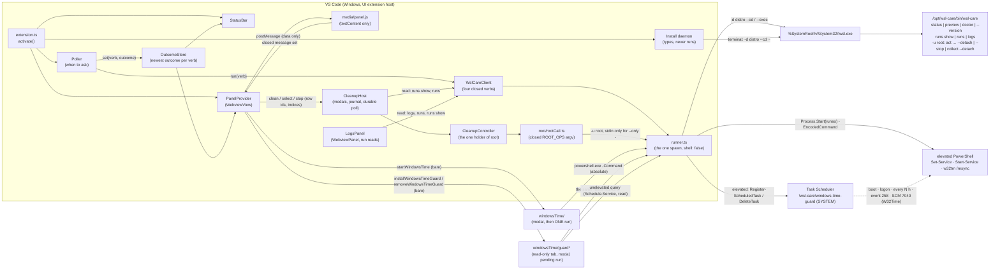

# module_vs_code — the VS Code extension (`src_vs_code/`)

> The module overview of the extension **AI OS Care** (Marketplace id `remsoftdev.ai-os-care`; its setting and command
> keys stay `wslCare.*`). The deep detail stays where it was written, in [architecture.md](architecture.md) — the
> sections *The extension: client, runner and fake (E5.S1)*, *The extension: status bar, read-only panel and polling
> (E5.S2)* (with the generated field-map table between its markers) and *The extension: Install daemon, packaging and
> its release (E5.S3)*; the root boundary, the cleanup buttons and the Logs page of E6.S2–E6.S4 are in
> [architecture-extension-e6.md](architecture-extension-e6.md) — and its tests in [module_tests.md](module_tests.md) §
> *The extension* and the E6 sections. This file is the map
> between them. Added 2026-10-06 by the retro review of PR #9 (the review gate found no module document for the
> extension, `common.knowledge-base`).

## Purpose

Show the `wsl-care` daemon's state inside VS Code — memory, swap, containers, the threshold verdicts, the cleanup
preview and the health checks — and, since E6.S2–E6.S4, run a cleanup **only after the person confirms it**, follow it
to its result across a reload, and show the run history on the *Logs* page. It reads through four closed daemon verbs
and three unprivileged run reads (`runs show`, `runs`, `logs`) via `wsl.exe` without a shell; it changes the machine
only through ONE module, `root/rootCall.ts` — a closed union of five root calls (`ROOT_OPS`: preview, confirm,
stop, full check, root check), built from validated ids only and held by one host-side controller. It never starts a
stopped WSL distribution unless the person presses *Start WSL and check*, never starts one for a root call, and
*Install daemon* only TYPES the pinned install command into a terminal (the person presses Enter). Since
2026-10-08 (PLAN_windows_time_guard.md D7) it changes ONE thing on Windows itself, and only after a modal that shows the
exact commands: *Start Windows Time* runs one elevated Windows PowerShell (`Process.Start` with the `runas` verb) that sets the
Windows Time service to start Automatic (while `wslCare.windowsTime.setAutomaticStart` is on), starts it and resyncs.
And since 2026-10-08 (PLAN_windows_time_task.md) it can install, through the same launcher, ONE scheduled task that does
that by itself — *the Windows Time guard*, `\wsl-care\windows-time-guard`, run as SYSTEM at startup, at logon, every N
hours, on the Time-Service's stop event 258 and on the Service Control Manager's start-type change 7040 for `W32Time` (which, while
`wslCare.windowsTime.setAutomaticStart` is on, undoes a *disabled*), with a rate limit on starts — after showing the exact elevated script in
a read-only tab; it removes it the same way, and shows on the *Health* section what Task Scheduler holds.
It runs on the Windows side (`extensionKind: ["ui"]`), on VS Code 1.85.0 or newer.

## Diagram

## Core entities

| Entity | File | What it is |
|---|---|---|
| `WslCareClient` | `src/client/WslCareClient.ts` | Builds every `wsl.exe` argv: the three WSL questions (`--list --quiet`, `-l -v`, `--list --running --quiet`) and `-d <distro> --cd / --exec /opt/wsl-care/bin/wsl-care <verb>` for the four verbs of `client/verbs.ts`. Validates the `wslCare.distro` setting before any spawn, makes no `-d` call into a stopped distribution, shares a call in flight per (setting, verb), checks the schema per verb (`client/handshake.ts`), maps exit codes (`client/exitCodes.ts`). |
| `Runner` | `src/process/runner.ts` | The only module that starts a process: `{file, args}`, `shell: false`, a ceiling per call, bounded output, bytes back. `runnerSelection.ts` picks the real runner, the strict fake (Test mode) or the closed runner (Test mode without a fake — starts nothing). |
| `Poller` | `src/poll/poller.ts` | Decides WHEN: only a focused window polls, only `status`; `preview` and `doctor` on panel open and Refresh. Stamps each round with its target (the distro setting); a round for a new target clears the store and makes older rounds obsolete. |
| `OutcomeStore` | `src/state/outcomeStore.ts` | The newest outcome of `status`, `preview` and `doctor` plus the "checking" flag — the one source the bar and the panel read. Read-only verbs, so nothing is persisted. |
| `StatusBar` | `src/statusBar/` | `WSL RAM <used>% · swap <x>G · <n> containers`, coloured by the worst `memory.*` / `kernel.*` verdict. |
| `PanelProvider` + field map | `src/panel/` | The `WebviewView`: a static shell with a per-render nonce and a strict CSP (`panelHtml.ts`), rows from ONE table (`fieldMap.ts`, rendered by `viewModel.ts`), a closed page→host message set validated exactly (`messages.ts`). |
| *Install daemon* | `src/install/` | The pinned command in one module (`installCommand.ts`), the flow (`installDaemon.ts`), a modal and a terminal — recorders in Test mode (`installUi.ts`). It installs `INSTALL_DAEMON` (0.1.2), a value of its own since 2026-10-06 — never below `MIN_DAEMON_FOR_RENDER` (0.1.0, the oldest daemon the extension renders) nor `MIN_DAEMON_FOR_ACTIONS` (0.1.0, the daemon the cleanups need; before the rebase onto #37 *Install daemon* typed this one): 0.1.0's act unit carries the CollectMode defect, so a new install gets the fixed release while an installed 0.1.0 still renders. All three are in `min-daemon.json`; the release guard requires every one published and the stamp at or above the install pin. |
| Root boundary | `src/root/` | `rootCall.ts` — the closed `ROOT_OPS` union and the only argv with `-u root`; `cleanupController.ts` — the one holder: ids = the compiled registry ∩ `status.actions`, acting only on advertised `status.capabilities`, A4's volume names only from a held, frozen preview, one root call in flight per distribution, an unknown detach followed through `status.running`; `rootIds.ts` validates action ids, run ids and 64-hex names. The bundle scan keeps every root word inside this region (E6.S2). |
| Cleanup buttons | `src/cleanup/` | `cleanupHost.ts` — the host transaction behind *Clean*, *Clean selected*, *Run full check now* and *Stop*: sanitised modals, the `globalState` journal of run ids until a terminal answer, the durable poll through `runs show` (E6.S3); `cleanupView.ts` derives the controls; *Last cleanup* from `status.lastCleanup`. |
| Logs page | `src/logsPage/` | A `WebviewPanel` under the panel's shell and CSP: periods (This run, Today, Yesterday, a day, a range) become argv in `period.ts` alone, over the UTC instants of local midnights; a closed message set (`logsMessages.ts`); the selection persisted in `globalState`; nothing computed in the page (E6.S4). |
| *Start Windows Time* | `src/windowsTime/` | PLAN_windows_time_guard.md D7: `windowsTimeFix.ts` — the elevated script as module constants (modules from `$PSHOME`, `w32tm.exe` by absolute path, one exit code per failure because an elevated child's streams cannot be read), the outer launcher that catches the UAC refusal as 1223, the request, the closed outcome, the flow (modal → one run → *Run full check now* on success); `windowsTimeNeed.ts` — the panel offers it only on the daemon's verdicts (`clock.timeService` warn/critical, `clock.reference` critical); `windowsTimeUi.ts` — the real modal, a progress notification while it runs, or a recorder in Test mode. |
| *The Windows Time guard* | `src/windowsTime/guard*.ts` | PLAN_windows_time_task.md: `guardTask.ts` — the task as pure functions of the settings (the ONE-line action reusing story 1's start-type, start and resync lines with a rate limit on starts before them; the XML with its SYSTEM principal, five triggers (the fifth, SCM 7040 for `W32Time`, since the later 2026-10-08 change — the start-type line then runs only when the type is not already Automatic, so the guard's own change cannot re-fire it), read ACE for Authenticated Users and plain `-Command` action; the canonical summary and the PowerShell that prints it); `guardScripts.ts` — the elevated install (folder through `Schedule.Service`, `Register-ScheduledTask -Xml -Force`) and removal ("if present" at every step), the unelevated read-only query, the length bound; `guardState.ts` — the query's answer as one closed state and the panel's line and buttons; `guardPending.ts` — the elevated run persisted in `globalState` before it starts (checked again after the modal), held past a timeout until its deadline or until Task Scheduler shows its end, swept at activation; `guardFlow.ts` — the order (tab → modal → pending → one run → re-read) and the closed outcomes; `guardHost.ts` — one query and one flow at a time; `guardUi.ts` / `guardRecorder.ts` — the read-only tab, the modal, the progress, or a recorder in Test mode. |
| Number settings | `src/settings/numbers.ts` | Every E6 number — the host ceilings (each above the daemon's own worst case for its call), the cleanup and Logs limits — as an `application`-scope setting, held equal to `package.json`. |

## Entry points

- **Activation** — `onStartupFinished`; `activate()` in `src/extension.ts` wires the client, the poller, the store, the
  bar, the panel and the commands, and asks `status` once if the window is focused.
- **Commands** — `wslCare.openPanel`, `wslCare.refresh`, `wslCare.startWsl`, `wslCare.installDaemon`, and since E6.S4
  `wslCare.openLogs` (also in the panel's title bar), and since 2026-10-08 `wslCare.startWindowsTime` (also a panel
  button while the daemon's verdicts ask for it), `wslCare.installWindowsTimeGuard` and `wslCare.removeWindowsTimeGuard`
  (also the *Health* section's buttons beside the guard's line). No cleanup is a command: cleanups start only from the panel's
  buttons, through the host's modals.
- **Webview panel** — `wslCare.logs` (the Logs page), restored after a reload by its serializer
  (`onWebviewPanel:wslCare.logs`).
- **View** — the activity-bar container `wslCare` with the webview view `wslCare.panel`.
- **Settings** — `wslCare.distro` (empty = WSL's default distribution), `wslCare.refreshSeconds` (30 to 86 400,
  default 120) and, since E6, the number table of `settings/numbers.ts` (`wslCare.timeouts.*`, `wslCare.cleanup.*`,
  `wslCare.logs.*`) — every one `application` scope, so a workspace cannot steer them; since 2026-10-08
  `wslCare.windowsTime.setAutomaticStart` (default on) and `wslCare.timeouts.windowsTimeFixSeconds` (default 180); for the
  guard `wslCare.windowsTime.guard.everyHours` (4), `….minMinutesBetweenStarts` (10), `….delaySeconds` (60),
  `….timeLimitMinutes` (5) — baked into the task at install — and `wslCare.timeouts.windowsTimeGuardSeconds` (180),
  `wslCare.timeouts.windowsTimeGuardQuerySeconds` (30).
- **Test mode** — `activate()` returns a test API only in `ExtensionMode.Test`; the extension-host tier drives it.

## External dependencies

| Dependency | Why |
|---|---|
| VS Code API `^1.85.0` (`@types/vscode` pinned to it) | the host; the Node of VS Code 1.85 is 18, so the bundle targets node18 |
| `wsl.exe` (absolute, System32) | the only way the extension reaches the distribution — facts measured in [2026-10-03_wsl_exe_facts.md](2026-10-03_wsl_exe_facts.md) |
| Windows PowerShell 5.1 (absolute, `System32\WindowsPowerShell\v1.0`) and UAC | *Start Windows Time* only; the UAC prompt is Windows' own and its policy is the machine's (`ConsentPromptBehaviorAdmin`) — the extension's modal is the confirmation it controls ([2026-10-08_windows_time_stopped.md](2026-10-08_windows_time_stopped.md) §4) |
| Task Scheduler (`Schedule.Service`, `Register-ScheduledTask` from `$PSHOME\Modules`), the Time-Service's Operational channel and the System log | the Windows Time guard only: registered and deleted elevated, read unelevated; its stop-event trigger needs the Operational channel enabled (measured enabled; the panel says when it is not), its start-type trigger reads the System log, which is always on — [2026-10-08_windows_time_guard_trigger.md](2026-10-08_windows_time_guard_trigger.md) §2, §6 |
| the `wsl-care` daemon ≥ `minDaemonForRender` of `src_vs_code/min-daemon.json` (*Install daemon* installs its `installDaemon`) | `status --json`, `preview --all --json`, `doctor --json`, `--version`, the run reads, and the root calls of `ROOT_OPS`; their shapes are the golden contracts in `contracts/golden/` and `contracts/*.json` (actions, exit codes, status limits). Acting needs `minDaemonForActions` and, as the authority, the capabilities `status` advertises |
| esbuild (`scripts/bundle.mjs`), `@vscode/vsce`, `@vscode/test-electron`, TypeScript, typescript-eslint | build, package, extension-host tests, lint — dev only; the `.vsix` ships no runtime dependency |
| `release-extension.yml` + `.github/scripts/release-extension-guard.sh` | the release pipeline: guard → build → attest → github-draft → publish-marketplace → github-public; the guard and `check-vsix --root-allowed` keep a root-capable bundle out of `extension-v0.1.0` and earlier (plan §15j B3, §15k #7) |

## Known limits (owner decisions and live-gate observations)

- The polling cadence's run-log churn is the owner's open decision M1
  ([2026-10-04_extension_poll_churn.md](2026-10-04_extension_poll_churn.md)); the daemon prunes its run logs after
  `logging.retentionDays` (default 14).
- Where *Install daemon*'s terminal opens in a Remote – WSL window, and which settings file a UI extension reads there,
  are E5 live-gate observations (`POST_DEPLOY.md` item 3).
