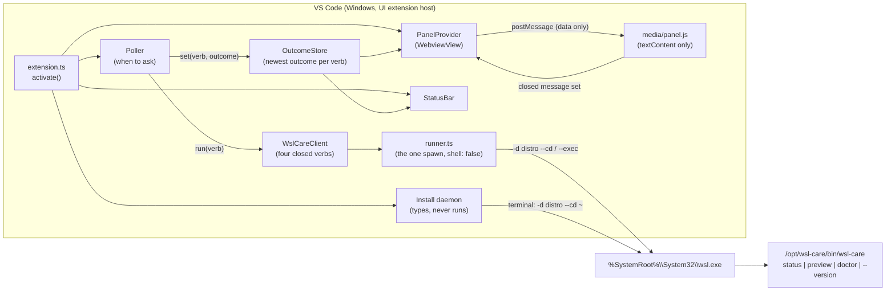

# module_vs_code — the VS Code extension (`src_vs_code/`)

> The module overview of the extension **AI OS Care** (Marketplace id `remsoftdev.ai-os-care`; its setting and command
> keys stay `wslCare.*`). The deep detail stays where it was written, in [architecture.md](architecture.md) — the
> sections *The extension: client, runner and fake (E5.S1)*, *The extension: status bar, read-only panel and polling
> (E5.S2)* (with the generated field-map table between its markers) and *The extension: Install daemon, packaging and
> its release (E5.S3)* — and its tests in [module_tests.md](module_tests.md) § *The extension*. This file is the map
> between them. Added 2026-10-06 by the retro review of PR #9 (the review gate found no module document for the
> extension, `common.knowledge-base`).

## Purpose

Show the `wsl-care` daemon's state inside VS Code — memory, swap, containers, the threshold verdicts, the cleanup
preview and the health checks — **read-only**. The extension never changes the machine: it runs four closed daemon
verbs through `wsl.exe` without a shell, it never starts a stopped WSL distribution unless the person presses *Start
WSL and check*, and *Install daemon* only TYPES the pinned install command into a terminal (the person presses Enter).
It runs on the Windows side (`extensionKind: ["ui"]`), on VS Code 1.85.0 or newer.

## Diagram

## Core entities

| Entity | File | What it is |
|---|---|---|
| `WslCareClient` | `src/client/WslCareClient.ts` | Builds every `wsl.exe` argv: the three WSL questions (`--list --quiet`, `-l -v`, `--list --running --quiet`) and `-d <distro> --cd / --exec /opt/wsl-care/bin/wsl-care <verb>` for the four verbs of `client/verbs.ts`. Validates the `wslCare.distro` setting before any spawn, makes no `-d` call into a stopped distribution, shares a call in flight per (setting, verb), checks the schema per verb (`client/handshake.ts`), maps exit codes (`client/exitCodes.ts`). |
| `Runner` | `src/process/runner.ts` | The only module that starts a process: `{file, args}`, `shell: false`, a ceiling per call, bounded output, bytes back. `runnerSelection.ts` picks the real runner, the strict fake (Test mode) or the closed runner (Test mode without a fake — starts nothing). |
| `Poller` | `src/poll/poller.ts` | Decides WHEN: only a focused window polls, only `status`; `preview` and `doctor` on panel open and Refresh. Stamps each round with its target (the distro setting); a round for a new target clears the store and makes older rounds obsolete. |
| `OutcomeStore` | `src/state/outcomeStore.ts` | The newest outcome of `status`, `preview` and `doctor` plus the "checking" flag — the one source the bar and the panel read. Read-only verbs, so nothing is persisted. |
| `StatusBar` | `src/statusBar/` | `WSL RAM <used>% · swap <x>G · <n> containers`, coloured by the worst `memory.*` / `kernel.*` verdict. |
| `PanelProvider` + field map | `src/panel/` | The `WebviewView`: a static shell with a per-render nonce and a strict CSP (`panelHtml.ts`), rows from ONE table (`fieldMap.ts`, rendered by `viewModel.ts`), a closed page→host message set validated exactly (`messages.ts`). |
| *Install daemon* | `src/install/` | The pinned command in one module (`installCommand.ts`), the flow (`installDaemon.ts`), a modal and a terminal — recorders in Test mode (`installUi.ts`). |

## Entry points

- **Activation** — `onStartupFinished`; `activate()` in `src/extension.ts` wires the client, the poller, the store, the
  bar, the panel and the commands, and asks `status` once if the window is focused.
- **Commands** — `wslCare.openPanel`, `wslCare.refresh`, `wslCare.startWsl`, `wslCare.installDaemon`.
- **View** — the activity-bar container `wslCare` with the webview view `wslCare.panel`.
- **Settings** — `wslCare.distro` (empty = WSL's default distribution) and `wslCare.refreshSeconds` (30 to 86 400,
  default 120), both `application` scope.
- **Test mode** — `activate()` returns a test API only in `ExtensionMode.Test`; the extension-host tier drives it.

## External dependencies

| Dependency | Why |
|---|---|
| VS Code API `^1.85.0` (`@types/vscode` pinned to it) | the host; the Node of VS Code 1.85 is 18, so the bundle targets node18 |
| `wsl.exe` (absolute, System32) | the only way the extension reaches the distribution — facts measured in [2026-10-03_wsl_exe_facts.md](2026-10-03_wsl_exe_facts.md) |
| the `wsl-care` daemon ≥ `src_vs_code/min-daemon.json` | `status --json`, `preview --all --json`, `doctor --json`, `--version`; their shapes are the golden contracts in `contracts/golden/` |
| esbuild (`scripts/bundle.mjs`), `@vscode/vsce`, `@vscode/test-electron`, TypeScript, typescript-eslint | build, package, extension-host tests, lint — dev only; the `.vsix` ships no runtime dependency |
| `release-extension.yml` + `.github/scripts/release-extension-guard.sh` | the release pipeline: guard → build → attest → github-draft → publish-marketplace → github-public |

## Known limits (owner decisions and live-gate observations)

- The polling cadence's run-log churn is the owner's open decision M1
  ([2026-10-04_extension_poll_churn.md](2026-10-04_extension_poll_churn.md)); the daemon prunes its run logs after
  `logging.retentionDays` (default 14).
- Where *Install daemon*'s terminal opens in a Remote – WSL window, and which settings file a UI extension reads there,
  are E5 live-gate observations (`POST_DEPLOY.md` item 3).
